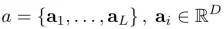
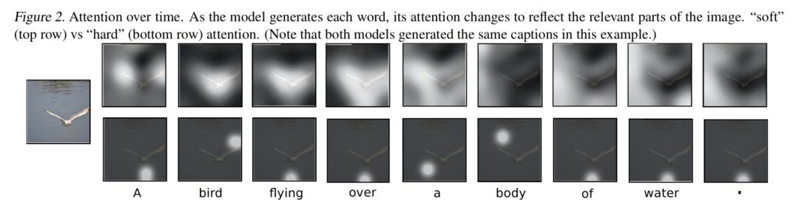
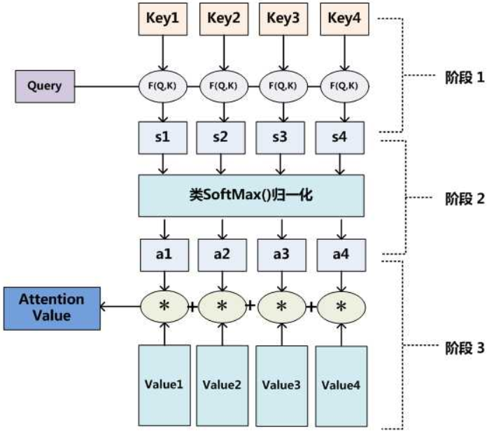
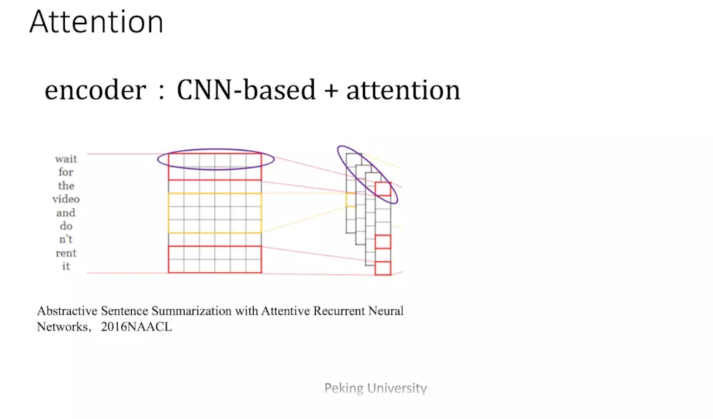
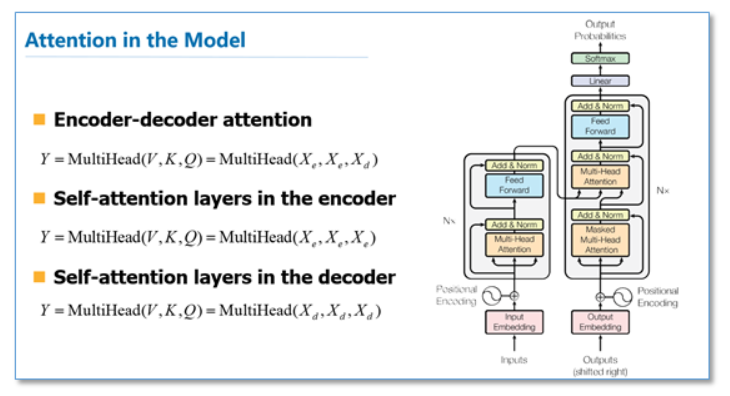

## 背景知识

Attention是一种用于提升基于RNN（LSTM或GRU）的Encoder + Decoder模型的效果的的机制（Mechanism），一般称为Attention Mechanism。Attention Mechanism目前非常流行，广泛应用于机器翻译、语音识别、图像标注（Image Caption）等很多领域，之所以它这么受欢迎，是因为Attention给模型赋予了区分辨别的能力，例如，在机器翻译、语音识别应用中，为句子中的每个词赋予不同的权重，使神经网络模型的学习变得更加灵活（soft），同时Attention本身可以做为一种对齐关系，解释翻译输入/输出句子之间的对齐关系，解释模型到底学到了什么知识，为我们打开深度学习的黑箱，提供了一个窗口。

Attention Mechanism与人类对外界事物的观察机制很类似，当人类观察外界事物的时候，一般不会把事物当成一个整体去看，往往倾向于根据需要选择性的去获取被观察事物的某些重要部分，比如我们看到一个人时，往往先Attention到这个人的脸，然后再把不同区域的信息组合起来，形成一个对被观察事物的整体印象。因此，Attention Mechanism可以帮助模型对输入的X每个部分赋予不同的权重，抽取出更加关键及重要的信息，使模型做出更加准确的判断，同时不会对模型的计算和存储带来更大的开销，这也是Attention Mechanism应用如此广泛的原因。

## Attention简介

### 很久以前

-   要么是直接使用最后一个`time_step`的输出
-   要么是把所有`time_step`的输出`max/average`

### 受到束缚的Attention

#### 重点论文

##### NEURAL MACHINE TRANSLATION BY JOINTLY LEARNING TO ALIGN AND TRANSLATE

基于attention的NMT在传统的基础上，它把源语言端的每个词学到的表达（传统的只有最后一个词后学到的表达）和当前要预测翻译的词联系了起来，这样的联系就是通过他们设计的attention进行的，在模型训练好后，根据attention矩阵，我们就可以得到源语言和目标语言的对齐矩阵了。

可以看到他们是使用一个感知机公式来将目标语言和源语言的每个词联系了起来，然后通过soft函数将其归一化得到一个概率分布，就是attention矩阵。

##### SHOW, ATTEND AND TELL: NEURAL IMAGE CAPTION GENERATION WITH VISUAL ATTENTION

>   随机性与确定性 Stochastic "Hard" Attention和Deterministic "Soft" Attention

传统的Attention Mechanism就是Soft Attention。Soft Attention是参数化的（Parameterization），因此可导，可以被嵌入到模型中去，直接训练。梯度可以经过Attention Mechanism模块，反向传播到模型其他部分。

相反，Hard Attention是一个随机的过程。Hard Attention不会选择整个encoder的输出做为其输入，Hard Attention会依概率Si来采样输入端的隐状态一部分来进行计算，而不是整个encoder的隐状态。为了实现梯度的反向传播，需要采用蒙特卡洛采样的方法来估计模块的梯度。

两种Attention Mechanism都有各自的优势，但目前更多的研究和应用还是更倾向于使用Soft Attention，因为其可以直接求导，进行梯度反向传播。

Image caption (图像理解)是计算机视觉的最初始任务，不仅要获得图片里的物体，还要表达他们之间的关系。目前现存的方法大都是encoder — decoder架构，利用CNN、RNN、LSTM等神经网络完成caption工作，比如说只使用CNN对图像进行特征提取，然后利用提取的特征生成caption，还有结合CNN和RNN的，使用CNN提取图像特征，将Softmax层之前的那一层vector作为encoder端的输出并送入decoder中，使用LSTM对其解码并生成句子，这种方法也是本文所采取的方法，只是在此基础上嵌入了soft和hard attention机制。

模型的总体架构如上图所示，也是由encoder和decoder组成。

-   Encoder: 模型使用CNN来提取 L 个 D 维的特征vector作为注释向量，每一个都对应图像的一个区域，如下式。

-   与此前的工作使用Softmax层之前的全连接层提取图像特征不同，本文所提取的这些vector来自于 low-level 的卷积层，这使得decoder可以通过选择所有特征向量的子集来选择性地聚焦于图像的某些部分，也就是将attention机制嵌入。
-   Decoder: 解码阶段用LSTM网络生成caption，集合为下式，其中C是句子长度，K是词表大小，y是各个词的one-hot编码所构成的集合。

-   可以看到，hard attention 会专注于很小的区域，而 soft attention 的注意力相对发散
-   $z_t$由$a_i$和权重$a_{ti}$通过加权得到对于每个时间的每个区域都定义一个权重值$a_{ti}$。为了满足权重的归一化，我们通过softmax函数实现，如下式，Softmax的输入需要包含位置信息和前一时刻隐层值，本文中的$f_{att}$是一个多层感知机

###### Stochastic Hard Attention

记$s_t$为 decoder 第 t 个时刻的 attention 所关注的位置编号，$S_ti$表示第 t 时刻 attention 是否关注位置 i ，服从多元伯努利分布，$∀t,S_{ti},i=1,2,...,L$ 中有且只有取 1，其余全部为 0，所以是 one-hot 形式。这种 attention 每次只 focus 一个位置的做法，就是“hard”称谓的来源。 $z_t$也就被视为一个变量，计算如下：

问题是 αti 怎么算呢？把 αti 视为隐变量，研究模型的目标函数，进而研究目标函数对参数的梯度。直观理解，模型要根据 a=(a1,...,aL) 来生成序列 y=(y1,...,yC) ，所以目标可以是最大化 log p(y|a) ，但这里没有显式的包含 s ，所以作者利用著名的 Jensen 不等式（Jensen's inequality）对目标函数做了转化，得到了目标函数的一个 lower bound，如下：

###### Deterministic Soft Attention

soft attention 每次会照顾到全部的位置，只是不同位置的权重不同罢了。这时 Zt 即为 ai 的加权求和

##### EFFECTIVE APPROACHES TO ATTENTION-BASED NEURAL MACHINE TRANSLATION

这篇论文是继上一篇论文后，一篇很具代表性的论文，他们的工作告诉了大家attention在RNN中可以如何进行扩展，这篇论文对后续各种基于attention的模型在NLP应用起到了很大的促进作用。在论文中他们提出了两种attention机制，一种是全局（global）机制，一种是局部（local）机制。

###### Global Attention

所有的`hidden state`都被用于计算`Context vector` 的权重，即变长的对齐向量at，其长度等于encoder端输入句子的长度。在t时刻，首先基于decoder的隐状态htht和源端的隐状态hs，计算一个变长的隐对齐权值向量at，之后通过加权平均的方式，得到上下文向量ct。

###### Local Attention

Global Attention有一个明显的缺点就是，每一次，encoder端的所有hidden state都要参与计算，这样做计算开销会比较大，特别是当encoder的句子偏长，比如，一段话或者一篇文章，效率偏低。因此，为了提高效率，Local Attention应运而生。

Local Attention是一种介于Kelvin Xu所提出的Soft Attention和Hard Attention之间的一种Attention方式，即把两种方式结合起来。因为它的计算复杂度要低于 global attention、soft attention，而且与 hard attention 不同的是，local attention 几乎处处可微，易与训练。 根据一个预测函数，先预测当前解码时要对齐的源语言端的位置Pt，然后通过上下文窗口，仅考虑窗口内的词。

其中 pt 是一个 source position index，可以理解为 attention 的“焦点”，作为模型的参数，D根据经验来选择（文章选用 10）。 关于 pt 的计算，文章给出了两种计算方案：

-   local-p

-   local-m 乘了一个pt位置相关的高斯分布

其中 WpWp和vpvp 是模型的参数， S 是 source sentence 的长度，易知 pt∈[0,S] 。权重 αt(s) 的计算如下：

可以看出，距离中心 pt 越远的位置，其位置上的 source hidden state 对应的权重就会被压缩地越厉害。

###### 总结

总之，Global Attention和Local Attention各有优劣，在实际应用中，Global Attention应用更普遍，因为local Attention需要预测一个位置向量p，这就带来两个问题：1、当encoder句子不是很长时，相对Global Attention，计算量并没有明显减小。2、位置向量pt的预测并不非常准确，这就直接计算的到的local Attention的准确率。

##### A STRUCTURED SELF-ATTENTIVE SENTENCE EMBEDDING

不再使用一维的权重值转换为权重矩阵，并且为此对损失函数加以改进

#### 简而言之

输入q、k、v，分别代表query、key-value pair。这里的 key,value, 和 query需要解释一下，这里把attention抽象为对 value() 的每个 token进行加权，而加权的weight就是 attentionweight，而 attention weight 就是根据 query和 key 计算得到，其意义为：为了用 value求出 query的结果, 根据 query和 key 来决定注意力应该放在value的哪部分。

在机器翻译中，key和value都指向单词的embedding。Decoder生成的query和encoder生成的key运算得到attentionweight 再和value加权求和 。

#### 本质理解

我们可以这样来看待Attention机制：将Source中的构成元素想象成是由一系列的数据对构成，此时给定Target中的某个元素Query，通过计算Query和各个Key的相似性或者相关性，得到每个Key对应Value的权重系数，然后对Value进行加权求和，即得到了最终的Attention数值。所以本质上Attention机制是对Source中元素的Value值进行加权求和，而Query和Key用来计算对应Value的权重系数。即可以将其本质思想改写为如下公式：

其中，$Lx=|Source|$代表Source的长度，公式含义即如上所述。上文所举的机器翻译的例子里，因为在计算Attention的过程中，Source中的Key和Value合二为一，指向的是同一个东西，也即输入句子中每个单词对应的语义编码，所以可能不容易看出这种能够体现本质思想的结构。

当然，从概念上理解，把Attention仍然理解为从大量信息中有选择地筛选出少量重要信息并聚焦到这些重要信息上，忽略大多不重要的信息，这种思路仍然成立。聚焦的过程体现在权重系数的计算上，权重越大越聚焦于其对应的Value值上，即权重代表了信息的重要性，而Value是其对应的信息。

从上图可以引出另外一种理解，也可以将Attention机制看作一种软寻址（Soft Addressing）:Source可以看作存储器内存储的内容，元素由地址Key和值Value组成，当前有个Key=Query的查询，目的是取出存储器中对应的Value值，即Attention数值。通过Query和存储器内元素Key的地址进行相似性比较来寻址，之所以说是软寻址，指的不像一般寻址只从存储内容里面找出一条内容，而是可能从每个Key地址都会取出内容，取出内容的重要性根据Query和Key的相似性来决定，之后对Value进行加权求和，这样就可以取出最终的Value值，也即Attention值。所以不少研究人员将Attention机制看作软寻址的一种特例，这也是非常有道理的。

至于Attention机制的具体计算过程，如果对目前大多数方法进行抽象的话，可以将其归纳为两个过程：第一个过程是根据Query和Key计算权重系数，第二个过程根据权重系数对Value进行加权求和。而第一个过程又可以细分为两个阶段：第一个阶段根据Query和Key计算两者的相似性或者相关性；第二个阶段对第一阶段的原始分值进行归一化处理；这样，可以将Attention的计算过程抽象为如图展示的三个阶段。

在第一个阶段，可以引入不同的函数和计算机制，根据Query和某个Key_i，计算两者的相似性或者相关性，最常见的方法包括：求两者的向量点积、求两者的向量Cosine相似性或者通过再引入额外的神经网络来求值，即如下方式：

第一阶段产生的分值根据具体产生的方法不同其数值取值范围也不一样，第二阶段引入类似SoftMax的计算方式对第一阶段的得分进行数值转换，一方面可以进行归一化，将原始计算分值整理成所有元素权重之和为1的概率分布；另一方面也可以通过SoftMax的内在机制更加突出重要元素的权重。即一般采用如下公式计算：

第二阶段的计算结果aiai即为valueivaluei对应的权重系数，然后进行加权求和即可得到Attention数值：

通过如上三个阶段的计算，即可求出针对Query的Attention数值，目前绝大多数具体的注意力机制计算方法都符合上述的三阶段抽象计算过程。

#### 其他

基于CNN的Seq2Seq+attention的优点：基于CNN的Seq2Seq模型具有基于RNN的Seq2Seq模型捕捉长距离依赖的能力，此外，最大的优点是可以并行化实现，效率比基于RNN的Seq2Seq模型高。缺点：计算量与观测序列X和输出序列Y的长度成正比。

### Transformer: Attention is all your need

#### 简介

Self Attention也经常被称为intra Attention。与传统的Attention机制非常的不同：传统的Attention是基于source端和target端的hidden state计算Attention的，得到的结果是源端的每个词与目标端每个词之间的依赖关系。**但Self Attention不同，它分别在source端和target端进行，仅与source input或者target input自身相关的Self Attention，捕捉source端或target端自身的词与词之间的依赖关系；然后再把source端的得到的self Attention加入到target端得到的Attention中，捕捉source端和target端词与词之间的依赖关系。** 因此，self Attention Attention比传统的Attention mechanism效果要好，主要原因之一是，传统的Attention机制忽略了**源端或目标端句子中词与词之间的依赖关系**，相对比，self Attention可以不仅可以得到源端与目标端词与词之间的依赖关系，同时还可以有效获取源端或目标端自身词与词之间的依赖关系。

在一般任务的Encoder-Decoder框架中，输入Source和输出Target内容是不一样的，比如对于英-中机器翻译来说，Source是英文句子，Target是对应的翻译出的中文句子，Attention机制发生在Target的元素Query和Source中的所有元素之间。而Self Attention顾名思义，指的不是Target和Source之间的Attention机制，而是Source内部元素之间或者Target内部元素之间发生的Attention机制，也可以理解为Target=Source这种特殊情况下的注意力计算机制。其具体计算过程是一样的，只是计算对象发生了变化而已，所以此处不再赘述其计算过程细节。

如果是常规的Target不等于Source情形下的注意力计算，其物理含义正如上文所讲，比如对于机器翻译来说，本质上是目标语单词和源语单词之间的一种单词对齐机制。那么如果是Self Attention机制，一个很自然的问题是：通过Self Attention到底学到了哪些规律或者抽取出了哪些特征呢？或者说引入Self Attention有什么增益或者好处呢？我们仍然以机器翻译中的Self Attention来说明，下图可视化地表示Self Attention在同一个英语句子内单词间产生的联系。

从两张图可以看出，Self Attention可以捕获同一个句子中单词之间的一些句法特征（比如展示的有一定距离的短语结构）或者语义特征（比如展示的its的指代对象Law）。很明显，引入Self Attention后会更容易捕获句子中长距离的相互依赖的特征，因为如果是RNN或者LSTM，需要依次序序列计算，对于远距离的相互依赖的特征，要经过若干时间步步骤的信息累积才能将两者联系起来，而距离越远，有效捕获的可能性越小。

但是Self Attention在计算过程中会直接将句子中任意两个单词的联系通过一个计算步骤直接联系起来，所以远距离依赖特征之间的距离被极大缩短，有利于有效地利用这些特征。除此外，Self Attention对于增加计算的并行性也有直接帮助作用。这是为何Self Attention逐渐被广泛使用的主要原因。

##### 序列编码

深度学习做NLP的方法，基本上都是先将句子分词，然后每个词转化为对应的词向量序列。这样一来，每个句子都对应的是一个矩阵X=(x1,x2,…,xt)，其中xi都代表着第i个词的词向量（行向量），维度为d维，故X∈Rn×d。这样的话，问题就变成了编码这些序列了。

###### RNN

$$
y_t=f(y_{t−1},x_t)
$$

不管是已经被广泛使用的LSTM、GRU还是最近的SRU，都并未脱离这个递归框架。RNN结构本身比较简单，也很适合序列建模，但RNN的明显缺点之一就是无法并行，因此速度较慢，这是递归的天然缺陷。另外苏剑林博士认为RNN无法很好地学习到全局的结构信息，因为它本质是一个马尔科夫决策过程。

不管是已经被广泛使用的LSTM、GRU还是最近的SRU，都并未脱离这个递归框架。RNN结构本身比较简单，也很适合序列建模，但RNN的明显缺点之一就是无法并行，因此速度较慢，这是递归的天然缺陷。另外苏剑林博士认为RNN无法很好地学习到全局的结构信息，因为它本质是一个马尔科夫决策过程。

###### CNN

$$
\boldsymbol{y}_{t}=f\left(\boldsymbol{x}_{t-1}, \boldsymbol{x}_{t}, \boldsymbol{x}_{t+1}\right)
$$

在FaceBook的论文中，纯粹使用卷积也完成了Seq2Seq的学习，是卷积的一个精致且极致的使用案例，热衷卷积的读者必须得好好读读这篇文论。CNN方便并行，而且容易捕捉到一些全局的结构信息。

###### Attention

Google的大作提供了第三个思路：纯Attention，单靠注意力就可以RNN要逐步递归才能获得全局信息，因此一般要双向RNN才比较好；CNN事实上只能获取局部信息，是通过层叠来增大感受野；Attention的思路最为粗暴，它一步到位获取了全局信息！它的解决方案是：

$$
\boldsymbol{y}_{t}=f\left(\boldsymbol{x}_{t}, \boldsymbol{A}, \boldsymbol{B}\right)
$$

其中A,BA,B是另外一个序列（矩阵）。如果都取A=B=X，那么就称为Self Attention，它的意思是直接将xt与原来的每个词进行比较，最后算出yt！

#### 整体架构

**Encoder**: 六个相同层的堆叠，每一层都有两个子层构成。第一个子层是 multi-head self-attention mechanism，然后是position- wise fully connected feed-forward network。并且在两个子层之间使用了残差连接并后接Layer Normalization，所以每个子层的输出为 $LayerNorm(x+Sublayer(x))$ 。网络输入是三个相同的向量q, k和v，是word embedding和position embedding相加得到的结果。为了方便进行残差连接，我们需要子层的输出和输入都是相同的维度，所有子层以及嵌入层的输出都为dmodel=512dmodel=512。

**Decoder**: 同样是六个相同层的堆叠，decoder中的Layer由encoder的Layer中插入一个Multi-Head Attention + Add&Norm组成，该子层对Encoder Stack的输出执行多头注意。同样使用残差连接和Layer Normalization，并且还修改了Decoder Stack中的self-attention子层，以防止位置注意到后续位置。{>>We also modify the self-attention sub-layer in the decoder stack to prevent positions from attending to subsequent positions<<}对于decoder中的第一个多头注意力子层，需要添加masking，确保预测位置i的时候仅仅依赖于位置小于i的输出。

**简单概括**

Self Attention也是在Scaled Dot-Product Attention单元里面实现的，如上图左图所示，首先把输入Input经过线性变换分别得到Q、K、V，注意，Q、K、V都来自于Input，只不过是线性变换的矩阵的权值不同而已。然后把Q和K做dot Product相乘，得到输入Input词与词之间的依赖关系，然后经过尺度变换（scale）、掩码（mask）和softmax操作，得到最终的Self Attention矩阵。尺度变换是为了防止输入值过大导致训练不稳定，mask则是为了保证时间的先后关系。

最后，把encoder端self Attention计算的结果加入到decoder做为k和V，结合decoder自身的输出做为q，得到encoder端的attention与decoder端attention之间的依赖关系。

#### 关键技术

##### SCALED DOT-PRODUCT ATTENTION

Google的一般化Attention思路也是一个编码序列的方案，因此我们也可以认为它跟RNN、CNN一样，都是一个序列编码的层。

前面给出的是一般化的框架形式的描述，事实上Google给出的方案是很具体的。首先，它先把Attention的定义给了出来：

$$
(\boldsymbol{Q}, \boldsymbol{K}, \boldsymbol{V})=\operatorname{softmax}\left(\frac{\boldsymbol{Q} \boldsymbol{K}^{\top}}{\sqrt{d_{k}}}\right) \boldsymbol{V}
$$
其中，$\boldsymbol{Q} \in \mathbb{R}^{n \times d_{k}}, \boldsymbol{K} \in \mathbb{R}^{m \times d_{k}}, \boldsymbol{V} \in \mathbb{R}^{m \times d}$ 。如果忽略激活函数softmax的话，那么是事实上就是三个$n \times d_{k}, d_{k} \times m, m \times d_{v}$矩阵相乘，最后的结果是一个$n \times d_{v}$的矩阵。可以认为是一个将$n \times d_{k}$的序列Q编码成了一个新的$n \times d_{v}$的序列的Attention层。

$$
Attention\left(\boldsymbol{q}_{t}, \boldsymbol{K}, \boldsymbol{V}\right)=\sum_{s=1}^{m} \frac{1}{Z} \exp \left(\frac{\left\langle\boldsymbol{q}_{t}, \boldsymbol{k}_{s}\right\rangle}{\sqrt{d_{k}}}\right) \boldsymbol{v}_{s}
$$

其中Z是归一化因子。事实上q,k,v分别是query,key,value的简写，K,V是一一对应的，他们就像是key-value的关系，那么上式的意思就是通过$q_t$这个query，以和各个$k_s$做内积后softmax的方式，来得到$q_t$和各个$v_s$的相似度，然后加权求和，得到一个$d_v$维的向量。$\sqrt{d_k}$起到调节作用，使得内积不至于太大。（太大的话softmax后就非0即1了，不够“soft”了，梯度过小，不利于反向传播）。

事实上这种Attention的定义并不新鲜，但由于Google的影响力，我们可以认为现在是更加正式地提出了这个定义，并将其视为一个层地看待；此外这个定义只是注意力的一种形式，还有一些其他选择，比如query跟key的运算方式不一定是点乘（还可以是拼接后再内积一个参数向量），甚至权重都不一定要归一化，等等。

##### MULTI-HEAD ATTENTION

这个是Google提出的新概念，是Attention机制的完善。不过从形式上看，它其实就再简单不过了，就是把$Q,K,V$通过参数矩阵映射一下，然后再做Attention，把这个过程重复做$h$次，结果拼接起来就行了，可谓“大道至简”了。

这里$\boldsymbol{W}_{i}^{Q} \in \mathbb{R}^{d_{k} \times \overline{d}}, \boldsymbol{W}_{i}^{K} \in \mathbb{R}^{d_{k} \times \overline{d}} k, \boldsymbol{W}_{i}^{V} \in \mathbb{R}^{d_{v} \times \overline{d} v}$ , 然后

$$
\begin{array}{c}{\text {MultiHead}(\boldsymbol{Q}, \boldsymbol{K}, \boldsymbol{V})=\text { Concat (head, }, \ldots, \text { head }_{h} )} \\ {\text {where head}_{i}=\text {Attention}\left(Q W_{i}^{Q}, K W_{i}^{K}, V W_{i}^{V}\right)}\end{array}
$$

最后得到一个$n \times\left(h \tilde{d}_{v}\right)$ 的序列，**所谓“多头”（Multi-Head），就是只多做几次同样的事情（参数不共享），然后把结果拼接**。可以允许模型在不同的表示子空间里学习到相关的信息

简而言之，将$Q,K,V$做h次不同的投影，重复做h次Attention层运算，每个Attention层的参数之间不共享，最后将结果拼接在一起，通过一个线性映射输出。

这里的思想很像CNN中的多个卷积核的操作，上文说到的[A Structured Self-attentive Sentence Embedding](https://arxiv.org/pdf/1703.03130)也使用了类似的思想。

###### 具体化

我们记 word embedding 的 dimension 为 dmodel ，所以 Q 的 shape 就是 n*dmodel， K、V 也是一样，第 i 个 word 的 embedding 为 vi，所以该 word 的 attention 应为：

我们记 word embedding 的 dimension 为 dmodel ，所以 Q 的 shape 就是 n*dmodel， K、V 也是一样，第 i 个 word 的 embedding 为 vi，所以该 word 的 attention 应为：

那同时做全部 word 的 attention，则是一下子把序列的全部内容输进去：

###### Mask

decoder 中的 self-attention 也一样的道理，只是要注意一点，decoder 中你在用 vi 对 vj 做 attention 时，有一些 pair 是不合法的。原因在于，虽然 encoder 阶段你可以把序列的全部 word 一次全输入进去，但是 decoder 阶段却并不总是可以，想象一下你在做 inference，decoder 的产出还是按从左至右的顺序，所以你的 vi 是没机会和 vj ( j>i ) 做 attention 的。那怎么将这一点体现在 attention 的计算中呢？文中说只需要令$\operatorname{score}\left(v_{i}, v_{j}\right)=-\infty$即可。为何？因为这样的话：

所以在计算 vi 的 self-attention 的时候，就能够把 vj 屏蔽掉。所以这个问题也就解决了。

###### 理解

到目前为止，对Attention层的描述都是一般化的，我们可以落实一些应用。比如，如果做阅读理解的话，$Q$可以是篇章的向量序列，取$K=V$为问题的向量序列，那么输出就是所谓的Aligned Question Embedding。

而在Google的论文中，大部分的Attention都是Self Attention，即“自注意力”，或者叫内部注意力。

所谓Self Attention，其实就是$Attention(X,X,X)$，$X$就是前面说的输入序列。也就是说，在序列内部做Attention，寻找序列内部的联系。Google论文的主要贡献之一是它表明了内部注意力在机器翻译（甚至是一般的Seq2Seq任务）的序列编码上是相当重要的，而之前关于Seq2Seq的研究基本都只是把注意力机制用在解码端。类似的事情是，目前SQUAD阅读理解的榜首模型R-Net也加入了自注意力机制，这也使得它的模型有所提升。

当然，更准确来说，Google所用的是Self Multi-Head Attention：
$$
Y=M u l t i H e a d(X, X, X)
$$

###### **Attention在模型中的应用**

Self-attention即K=V=Q，例如输入一个句子，那么里面的每个词都要和该句子中的所有词进行attention计算。目的是学习句子内部的词依赖关系，捕获句子的内部结构。

`Transformer`会在三个不同的方面使用`self multi-head attention`：

1.  在`encoder-decoder attention`层中，key和value是encoder的输出，query是前一层Decoder的输出。这使得Decoder中的每个位置都可以参与输入序列的所有位置。这里模仿了典型的seq2seq中注意力机制的使用。
2.  在`encoder self-attention`层中，某一层中所有的keys、values和queries都来自同一个位置，在本例中，是Encoder中上一层的输出。Encoder中的每个位置都可以处理Encoder上一层中的所有位置。
3.  在`decoder self-attention`层中类似地，decoder中的self-attention层允许decoder中的每个位置关注decoder中的所有位置，直到该位置并包括该位置。为了保持decoder的自回归特性，需要防止decoder中的左向信息流。我们通过屏蔽(设置为负无穷)softmax输入中对应于非法连接的所有值，实现了在缩放的点积注意范围内的这种方法。

##### POSITION-WISE FEED-FOWARD NETWORKS

$$
\mathrm{FFN}(x)=\max \left(0, x W_{1}+b_{1}\right) W_{2}+b_{2}
$$

除了 attention sub-layers，encoder和decoder中的每一层都包含一个完全连接的前馈网络，它分别应用于每个位置，并且是相同的。它由两个线性变换组成，中间有一个ReLU激活。

虽然不同位置上的线性变换是相同的，但是它们在不同的层之间使用不同的参数。另一种描述方法是用内核大小为1的两个卷积。其实就是一个MLP 网络,hidden_size变化为：512->2048->512。每个 $d_model $ 维向量 x 在此先由 $xW_1+b_1$ 变为 $d_f $ 维的$ x′ $ ，再经过  $max(0,x′)W_2+b_2$ 回归 $ d_model $ 维。之后再是一个residual connection。输出 size 仍是  $[sequence_{length},d_{model}]$ 

##### POSITIONAL ENCODING

由于我们的模型不包含递归和卷积，为了使模型利用序列的顺序，我们必须注入一些关于序列中token的相对或绝对位置的信息。为此，我们将“位置编码”添加到encoder和decoder stacks底部的输入embeddings中。位置编码的维数dmodeldmodel与嵌入的维数相同，因此可以将二者相加。有许多位置编码的选择，学习的和固定的都可以。

其中pos为位置，ii为维度。也就是说，位置编码的每个维度对应于一个正弦曲线。波长组成几何级数从2π到10000·2π。选择这个函数是因为我们假设它可以让模型很容易地学习到相对位置的参与，因为对于任何固定偏移量$k, PE_{pos+k}$都可以表示为的线性函数$PE_{pos}$。我们还使用了learning position embeddings进行了实验，发现这两个版本的结果几乎相同。我们选择正弦版本，因为它可能允许模型推断出比训练中遇到的序列长度更长的序列长度。

这样做的目的是因为正弦和余弦函数具有周期性，对于固定长度偏差k（类似于周期），post +k位置的PE可以表示成关于pos位置PE的一个线性变化（存在线性关系），这样可以方便模型学习词与词之间的一个相对位置关系

>   只要稍微思考一下就会发现，这样的模型**并不能捕捉序列的顺序**！换句话说，如果将K,VK,V按行打乱顺序（相当于句子中的词序打乱），那么Attention的结果还是一样的。这就表明了，到目前为止，Attention模型顶多是一个非常精妙的“词袋模型”而已。这问题就比较严重了，大家知道，对于时间序列来说，尤其是对于NLP中的任务来说，顺序是很重要的信息，它代表着局部甚至是全局的结构，学习不到顺序信息，那么效果将会大打折扣（比如机器翻译中，有可能只把每个词都翻译出来了，但是不能组织成合理的句子）。
>
>   于是Google再祭出了一招——**Position Embedding**，也就是“位置向量”，将每个位置编号，然后每个编号对应一个向量，通过结合位置向量和词向量，就给每个词都引入了一定的位置信息，这样Attention就可以分辨出不同位置的词了。
>
>   Position Embedding并不算新鲜的玩意，在FaceBook的《Convolutional Sequence to Sequence Learning》也用到了这个东西。但在Google的这个作品中，它的Position Embedding有几点区别： 
>
>   1. 以前在RNN、CNN模型中其实都出现过Position Embedding，但在那些模型中，Position Embedding是锦上添花的辅助手段，也就是“有它会更好、没它也就差一点点”的情况，因为RNN、CNN本身就能捕捉到位置信息。但是在这个纯Attention模型中，Position Embedding是位置信息的唯一来源，因此它是模型的核心成分之一，并非仅仅是简单的辅助手段。 
>   2. 在以往的Position Embedding中，基本都是根据任务训练出来的向量。而Google直接给出了一个构造Position Embedding的公式：
>       -   这里的意思是将id为pp的位置映射为一个dposdpos维的位置向量，这个向量的第ii个元素的数值就是$PE_i(p)$。Google在论文中说到他们比较过直接训练出来的位置向量和上述公式计算出来的位置向量，效果是接近的。因此显然我们更乐意使用公式构造的Position Embedding了。
>   3. Position Embedding本身是一个绝对位置的信息，但在语言中，相对位置也很重要，Google选择前述的位置向量公式的一个重要原因是：由于我们有$sin⁡(α+β)=sin⁡αcos⁡β+cos⁡αsin⁡β$以及$cos⁡(α+β)=cos⁡αcos⁡β−sin⁡αsin⁡β$。这表明位置$p+k$的向量可以表示成位置$p$的向量的线性变换，这提供了表达相对位置信息的可能性。

结合位置向量和词向量有几个可选方案，可以把它们拼接起来作为一个新向量，也可以把位置向量定义为跟词向量一样大小，然后两者加起来。FaceBook的论文和Google论文中用的都是后者。直觉上相加会导致信息损失，似乎不可取，但Google的成果说明相加也是很好的方案。

#### Why self attention

对于使用自注意力机制的原因，论文中提到主要从三个方面考虑

-   每一层的总计算复杂度
-   可并行化的计算量，由所需的最小顺序操作数来衡量。
-   长距离依赖学习，即网络中远程依赖项之间的路径长度。
    -   在许多序列转换任务中，学习长期依赖关系是一个关键的挑战。影响学习这种依赖关系能力的一个关键因素是在网络中前进和后退信号必须经过的路径的长度。输入和输出序列中任意位置组合之间的这些路径越短，就越容易学习长期依赖关系。因此，我们还比较了由不同层类型组成的网络中任意两个输入和输出位置之间的最大路径长度。

可以看到，如果输入序列n小于表示维度d的话，每一层的时间复杂度self-attention是比较有优势的。当n比较大时，作者也给出了一种解决方案self-attention（restricted）即每个词不是和所有词计算attention，而是只与限制的r个词去计算attention。在并行方面，多头attention和CNN一样不依赖于前一时刻的计算，可以很好的并行，优于RNN。在长距离依赖上，由于self-attention是每个词和所有词都要计算attention，所以不管他们中间有多长距离，最大的路径长度也都只是1。可以捕获长距离依赖关系。

此外，自我关注还可以产生更多可解释的模型。我们从模型中检查注意分布，并在附录中给出和讨论示例。个体的注意力头不仅清楚地学会了执行不同的任务，许多注意力头还表现出与句子的句法和语义结构相关的行为。

## Review

-   关于传统attention和self-attention的问题，他们在计算上的差别在于传统的Attention只是在不同的层次上（字符级、词级、句子级、篇章级）对source端和target端的hidden state进行各种形式的计算，得到的是源端与目标端之间词与词（或其他层次）的依赖关系，而Self-Attention则不同，它分别在source端和target端进行，捕捉source端或target端自身的词与词之间的依赖关系；然后再把source端的得到的self Attention加入到target端得到的Attention中，捕捉source端和target端词与词之间的依赖关系（分别对应三个Multi-Head Attention），其底层的计算实质上是一样的。并行化的Self-Attention并不包含递归和卷积，所以丢失了序列的顺序信息，为此，使用Positional Encoding机制，将位置编码信息加入到每个词的词嵌入中。
-   关于self-attention的并行化、计算复杂度小和长距离依赖学习的优点，原文中给出了十分详细的解释，主要在于其摆脱了传统Attention依赖的RNN技术（当然，也有部分使用CNN技术从而降低了计算复杂度并且拥有了并行化的优点），通过Multi-Head Attention技术（非常类似于CNN中的多个卷积核的操作），直接计算整个序列全部内容的Attention，可并行化矩阵运算，并且降低了计算复杂度-> RNN、CNN和原始Self-Attention每层的计算复杂度分别为n*d2、k*n*d2、n^2*d（k、n、d分别代表卷积核大小、序列长度、词嵌入维数），如果n小于d的话，Self-Attention是比较有优势的。当n比较大时，作者也给出了一种解决方案self-attention（restricted），即每个词不是和所有词计算attention，而是只与限制的r个词去计算attention，计算复杂度降为r*n*d。而长距离依赖问题是NLP领域的关键问题之一，影响学习这种依赖关系能力的一个关键因素是在网络中前进和后退信号必须经过的路径的长度，以传统RNN为例，其依赖项之间的路径长度为两项间的距离，而self-attenion是直接对QKV进行矩阵运算，每个词和所有词都要计算attention，所以不管两项间有多长距离，最大的路径长度也都只是1，模型可以更加容易学习到这样长距离的依赖。
-   self-attention的明显缺点在于，无法对位置信息进行很好地建模，这是其Pure Attention带来的硬伤。尽管可以引入Position Embedding，但这只是一个缓解方案，并没有根本解决问题。这一机制在文本分类或者是机器翻译这样对语序要求并不是特别严格的领域，都取得了令人满意的效果，但是用来在序列标注，如分词、实体识别等，效果就有些不令人满意。self-attention在机器翻译任务取得成功的原因是机器翻译任务并不特别强调语序，Position Embedding所带来的位置信息足够模型学习使用，并且翻译任务的主流评测指标BLEU也并不特别强调语序，只是通过ngram的统计量来保证ngram的相对语序，并不是严格的整句翻译的语序，所以机器翻译的任务本身和评价标准都促成了其在这一任务上的成功。
-   restrict的self-attention正是为了解决原机制的O(n^2)的复杂度而提出的，一方面是为了降低复杂度，一方面是因为不是所有任务都需要长程的、全局的依赖关系，有的任务只依赖于局部的依赖关系，所以采用了类似卷积窗口的方式处理。
-   attention机制的提出是为了快准狠地用light的权重参数帮助任务过滤掉无关信息从而增强效果，尽管如今取得了不错的效果，但是其不具备较好的可控制性与可解释性，self-attention也是和普通attention机制一样使用BP算法更新参数，依靠全局的Loss函数进行优化，这样的监督学习是不够准确有效的，无法将attention机制在模型中的贡献度提升至最高，需要引入更多的信息或是更加有效的优化目标。这就像是RL中feedback的概念，attenion机制需要更合适的feedback，帮助其在模型中的贡献度得到提升。所以下一步的研究，在于通过引入除了目前框架内的QKV以外的更多信息，并设计更加有效的优化目标，为attention机制提供更加有效的feedback，提升其模型贡献度，获得可控制与可解释的attention“层”。原文中的restrict的self-attention已经给出了一个结合cnn的处理优化方向，引导未来的研究更多的结合RNN、CNN中的机制。
-   在self-attention中，如果取出Positional Encoding的部分，pure attenion是不能捕捉到序列之间的顺序的，输入语句的词序打乱并不会改变输出结果，这样的机制只是一个精妙的词袋模型。而transformer通过正弦/余弦公式生成的Postional Embedding，与词向量相加（两者维度一致），将语序信息加入到模型之中，是位置信息的唯一来源，模型的核心成分。语序调整在机器翻译中是尤为重要的，学生认为这样的处理方式是不够充分的，Positional Embedding本身只是绝对位置信息，但由于正余弦公式的特点，sin(α+β)=sinαcosβ+cosαsinβ 以及cos(α+β)=cosαcosβ−sinαsinβ，使得位置p+k的向量可以表示成位置p的向量的线性变换，这提供了表达相对位置信息的可能性，学生以为在机器翻译中，相对位置信息比绝对位置信息的信息价值更大更浓缩，其对翻译质量的影响也更大，现有的处理方式学生认为并不能很好地使模型学习到这样的信息(把词向量与位置向量拼接起来作为一个新向量，也可以把位置向量定义为跟词向量一样大小，然后两者加起来。FaceBook的论文和Google论文中用的都是后者。但直觉上相加会导致信息损失，似乎不可取，可是其成果说明相加是很好的方案，直观上并不能够理解可行性来源)。学生认为机器翻译相对于分词和序列标注这样的序列标注任务而言，后者的语序要求更加严格。
-   而对于feedback问题，学生认为一方面可以从网络结构或优化目标入手，如[Modeling Localness for Self-Attention Networks](https://arxiv.org/pdf/1810.10182.pdf)一文中提出的在低层网络中使用增加可学习的高斯偏差，增强网络对局部上下文的捕获能力；一方面可以增加其他外部数据或标记，学生认为这是一种类似于引入知识的思想，将更丰富的知识引入到机器翻译之中，并且建立起有效的利用机制，例如将统计机器翻译中的特征引入神经机器翻译，这与self-attenion机制本身并没有太大关系，这一思想用在RNN或CNN上也会有所改进，只是这些引入知识所需要的表示与利用的方式，对于不同的机制需要分别设计。
-   关于restrict的问题，如果减小了attention的范围，的确会失去全局依赖建模这一优势，但是并非所有问题都需要长程的、全局的依赖，也有很多问题只依赖于局部结构，那么通过设定一个合适的窗口进行建模，捕捉到序列的局部结构，同样能够满足模型学习的需要。此时的主要优势在于保持并行化的同时复杂度的降低，并且通过窗口的设定，可以对模型的学习范围进行控制，这样可控制的模型可以更好地应对task-specific的情况，其性能相较于普通attention的RNN之类的模型，除了原本的并行化和计算复杂度小的优势以外，在长距离依赖上，restrict的最大路径长度为O(n/r)，n为序列长度。如果restrict的窗口为1，其最大路径长度与普通attention的RNN模型一致，均为O(n)。这一证明出自self-attention的原文，并且原文并未对restrict的版本进行实验论证，学生也并未看过相关的论文证明restrict版本的性能。

## Reference

### Paper

[Neural Machine Translation by Jointly Learning to Align and Translate](https://arxiv.org/abs/1409.0473v7)

[Show, Attend and Tell: Neural Image Caption Generation with Visual Attention](https://arxiv.org/abs/1502.03044v3)

[Effective Approaches to Attention-based Neural Machine Translation](https://arxiv.org/abs/1508.04025v5)

[A Structured Self-Attentive Sentence Embedding](https://arxiv.org/pdf/1703.03130)

[Attention is All You Need](https://arxiv.org/pdf/1706.03762)

### Blog

[注意力机制（Attention Mechanism）在自然语言处理中的应用](https://www.cnblogs.com/robert-dlut/p/5952032.html)

[模型汇总24 - 深度学习中Attention Mechanism详细介绍：原理、分类及应用](https://zhuanlan.zhihu.com/p/31547842)

[论文学习5“Show, Attend and Tell: Neural Image Caption Generation with Visual Attention”文章学习](https://www.jianshu.com/p/7582df96b081)

[真正的完全图解Seq2Seq Attention模型](https://zhuanlan.zhihu.com/p/40920384)

[基于多篇经典论文综述Attention模型方法（附源码）](https://blog.csdn.net/tMb8Z9Vdm66wH68VX1/article/details/80731293)

[极大似然估计理解与应用](https://www.cnblogs.com/lliuye/p/9139032.html)

[论文笔记：A Structured Self-Attentive Sentence Embedding](https://www.cnblogs.com/wangxiaocvpr/p/9501442.html)

[Attention的理解](https://www.zhihu.com/question/68482809/answer/264632289?utm_source=qq&utm_medium=social&utm_oi=766807295492390912)

[论文笔记：Attention is all you need](https://www.jianshu.com/p/3f2d4bc126e6)

[《Attention is All You Need》浅读（简介+代码）](https://kexue.fm/archives/4765)

[自然语言处理中的自注意力机制（Self-attention Mechanism）](https://www.cnblogs.com/robert-dlut/p/8638283.html)

[深度长文：NLP的巨人肩膀（上）](https://mp.weixin.qq.com/s/Rd3-ypRYiJObi-e2JDeOjQ)

[NLP 的巨人肩膀（下）：从 CoVe 到 BERT](https://mp.weixin.qq.com/s/7imMQ3GkD52xP7N4fqNPog)

[万字长文概述NLP中的深度学习技术](https://mp.weixin.qq.com/s?__biz=MzA3MzI4MjgzMw==&mid=2650757835&idx=2&sn=716ddb08d3abf2103da61799f9f11b73&chksm=871a9eb5b06d17a321b4bac6de292ce20355c04f12a26cd870553732bc5cf235ef09dd761f20&mpshare=1&scene=23&srcid=#rd)