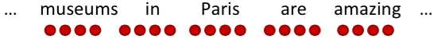

# CS224n-2019 学习笔记

-   结合每课时的课件、笔记与推荐读物等整理而成

-   作业部分将单独整理

## Lecture 02 Word Vectors and Word Senses

??? abstract "Lecture Plan"

    -   Finish looking at word vectors and word2vec
    -   Optimization basics
    -   Can we capture this essence more effectively by counting?
    -   The GloVe model of word vectors
    -   Evaluating word vectors 
    -   Word senses
    -   The course

!!! info "Goal"

    be able to read word embeddings papers by the end of class

### Review: Main idea of word2vec

$$
P(o | c)=\frac{\exp \left(u_{o}^{T} v_{c}\right)}{\sum_{w \in V} \exp \left(u_{w}^{T} v_{c}\right)}
$$

-   遍历整个语料库中的每个单词
-   使用单词向量预测周围的单词
-   更新向量以便更好地预测

**Word2vec parameters and computations**

>   $n \times d \cdot d \to 1 \rightarrow n \times 1 \overset{softmax} \to n \times 1$ 

-   每行代表一个单词的词向量，点乘后得到的分数通过softmax映射为概率分布，并且我们得到的概率分布是对于该中心词而言的上下文中单词的概率分布，该分布于上下文所在的具体位置无关，所以在每个位置的预测都是一样的
-   我们希望模型对上下文中(相当频繁)出现的所有单词给出一个合理的高概率估计
-   the, and, that, of 这样的停用词，是每个单词点乘后得到的较大概率的单词
    -   去掉这一部分可以使词向量效果更好

### Optimization: Gradient Descent

Gradient Descent 每次使用全部样本进行更新

Stochastic Gradient Descent 每次只是用单个样本进行更新

Mini-batch具有以下优点

-   通过平均值，减少梯度估计的噪音
-   在GPU上并行化运算，加快运算速度

**Stochastic gradients with word vectors**

$\nabla_{\theta} J_{t}(\theta)$ 将会非常稀疏，所以我们可能只更新实际出现的向量

解决方案

-   需要稀疏矩阵更新操作来只更新矩阵U和V中的特定行
-   需要保留单词向量的散列

如果有数百万个单词向量，并且进行分布式计算，那么重要的是不必到处发送巨大的更新

**Word2vec: More details**

为什么两个向量？

-   更容易优化，最后都取平均值
-   可以每个单词只用一个向量

两个模型变体

-   Skip-grams (SG)
    -   输入中心词并预测上下文中的单词
-   Continuous Bag of Words (CBOW)
    -   输入上下文中的单词并预测中心词

之前一直使用naive的softmax(简单但代价很高的训练方法)，接下来使用负采样方法加快训练速率

**The skip-gram model with negative sampling (HW2)**

softmax中用于归一化的分母的计算代价太高
$$
P(o | c)=\frac{\exp \left(u_{o}^{T} v_{c}\right)}{\sum_{w \in V} \exp \left(u_{w}^{T} v_{c}\right)}
$$
我们将在作业2中实现使用 **negative sampling** 负采样方法的 `skip-gram` 模型

-   使用一个 true pair (中心词及其上下文窗口中的词)与几个 noise pair (中心词与随机词搭配) 形成的样本，训练二元逻辑回归

原文中的(最大化)目标函数是

$$
J(\theta)=\frac{1}{T} \sum_{t=1}^{T} J_{t}(\theta)
$$

$$
J_{t}(\theta)=\log \sigma\left(u_{o}^{T} v_{c}\right)+\sum_{i=1}^{k} \mathbb{E}_{j \sim P(w)}\left[\log \sigma\left(-u_{j}^{T} v_{c}\right)\right]
$$

本课以及作业中的目标函数是

$$
J_{\text {neg-sample}}\left(\boldsymbol{o}, \boldsymbol{v}_{c}, \boldsymbol{U}\right)=-\log \left(\sigma\left(\boldsymbol{u}_{o}^{\top} \boldsymbol{v}_{c}\right)\right)-\sum_{k=1}^{K} \log \left(\sigma\left(-\boldsymbol{u}_{k}^{\top} \boldsymbol{v}_{c}\right)\right)
$$

-   我们希望中心词与真实上下文单词的向量点积更大，中心词与随机单词的点积更小
-   k是我们负采样的样本数目

$$
P(w)=U(w)^{3 / 4} / Z
$$

使用上式作为抽样的分布，$U(w)$ 是 unigram 分布，通过 $\frac{3}{4}$ 次方，相对减少常见单词的频率，增大稀有词的概率。 $Z$ 用于生成概率分布。

### But why not capture co-occurrence counts directly?

共现矩阵 X 

-   两个选项：windows vs. full document
-   Window ：与word2vec类似，在每个单词周围都使用Window，包括语法(POS)和语义信息
-   Word-document 共现矩阵的基本假设是在同一篇文章中出现的单词更有可能相互关联。假设单词 $i$ 出现在文章 $j$ 中，则矩阵元素 $X_{ij}$ 加一，当我们处理完数据库中的所有文章后，就得到了矩阵 X ，其大小为 $|V|\times M$ ，其中 $|V|$ 为词汇量，而 $M$ 为文章数。这一构建单词文章co-occurrence matrix的方法也是经典的Latent Semantic Analysis所采用的。{>>潜在语义分析<<}

利用某个定长窗口中单词与单词同时出现的次数来产生window-based (word-word) co-occurrence matrix。下面以窗口长度为1来举例，假设我们的数据包含以下几个句子：

-   I like deep learning.
-   I like NLP.
-   I enjoy flying.

则我们可以得到如下的word-word co-occurrence matrix:

使用共现次数衡量单词的相似性，但是会随着词汇量的增加而增大矩阵的大小，并且需要很多空间来存储这一高维矩阵，后续的分类模型也会由于矩阵的稀疏性而存在稀疏性问题，使得效果不佳。我们需要对这一矩阵进行降维，获得低维(25-1000)的稠密向量。

**Method 1: Dimensionality Reduction on X (HW1)**

使用SVD方法将共现矩阵 X 分解为 $U \Sigma V^{\top}$ ，$\sum$ 是对角线矩阵，对角线上的值是矩阵的奇异值。 $U,V$ 是对应于行和列的正交基。

为了减少尺度同时尽量保存有效信息，可保留对角矩阵的最大的k个值，并将矩阵 $U,V$ 的相应的行列保留。这是经典的线性代数算法，对于大型矩阵而言，计算代价昂贵。

**Hacks to X (several used in Rohde et al. 2005)**

按比例调整 counts 会很有效

-   对高频词进行缩放(语法有太多的影响)
    -   使用log进行缩放
    -   $min(X, t), t \approx 100$
    -   直接全部忽视
-   在基于window的计数中，提高更加接近的单词的计数
-   使用Person相关系数

>   Conclusion：对计数进行处理是可以得到有效的词向量的

$drive \to driver , swim \to swimmer, teach \to teacher$

在向量中出现的有趣的句法模式：语义向量基本上是线性组件，虽然有一些摆动，但是基本是存在动词和动词实施者的方向。

基于计数：使用整个矩阵的全局统计数据来直接估计

-   优点
    -   训练快速
    -   统计数据高效利用
-   缺点
    -   主要用于捕捉单词相似性
    -   对大量数据给予比例失调的重视

转换计数：定义概率分布并试图预测单词

-   优点
    -   提高其他任务的性能
    -   能捕获除了单词相似性以外的复杂的模式
-   缺点
    -   与语料库大小有关的量表
    -   统计数据的低效使用（**采样是对统计数据的低效使用**）

### Encoding meaning in vector differences

将两个流派的想法结合起来，在神经网络中使用计数矩阵

!!! tip ""

    关于Glove的理论分析需要阅读原文，也可以阅读[CS224N笔记(二)：GloVe](<https://zhuanlan.zhihu.com/p/60208480>) 

**关键思想**：共现概率的比值可以对meaning component进行编码

重点不是单一的概率大小，重点是他们之间的比值，其中蕴含着meaning component。

>   例如我们想区分热力学上两种不同状态ice冰与蒸汽steam，它们之间的关系可通过与不同的单词 x 的co-occurrence probability 的比值来描述。
>
>   例如对于solid固态，虽然 $P(solid|ice)$ 与 $P(solid|steam)$ 本身很小，不能透露有效的信息，但是它们的比值 $\frac{P(solid|ice)}{P(solid|steam)}$ 却较大，因为solid更常用来描述ice的状态而不是steam的状态，所以在ice的上下文中出现几率较大
>
>   对于gas则恰恰相反，而对于water这种描述ice与steam均可或者fashion这种与两者都没什么联系的单词，则比值接近于1。所以相较于单纯的co-occurrence probability，实际上co-occurrence probability的相对比值更有意义

我们如何在词向量空间中以线性meaning component的形式捕获共现概率的比值？

log-bilinear 模型 : $w_{i} \cdot w_{j}=\log P(i | j)$

向量差异 : $w_{x} \cdot\left(w_{a}-w_{b}\right)=\log \frac{P(x | a)}{P(x | b)}$

-   如果使向量点积等于共现概率的对数，那么向量差异变成了共现概率的比率

$$
J=\sum_{i, j=1}^{V} f\left(X_{i j}\right)\left(w_{i}^{T} \tilde{w}_{j}+b_{i}+\tilde{b}_{j}-\log X_{i j}\right)^{2}
$$

-   使用平方误差促使点积尽可能得接近共现概率的对数
-   使用 $f(x)$ 对常见单词进行限制

-   优点
    -   训练快速
    -   可以扩展到大型语料库
    -   即使是小语料库和小向量，性能也很好

### How to evaluate word vectors?

与NLP的一般评估相关：内在与外在

-   内在
    -   对特定/中间子任务进行评估
    -   计算速度快
    -   有助于理解这个系统
    -   不清楚是否真的有用，除非与实际任务建立了相关性
-   外在
    -   对真实任务的评估
    -   计算精确度可能需要很长时间
    -   不清楚子系统是问题所在，是交互问题，还是其他子系统
    -   如果用另一个子系统替换一个子系统可以提高精确度

**Intrinsic word vector evaluation**

词向量类比 `a:b :: c:?`

$$
d=\arg \max _{i} \frac{\left(x_{b}-x_{a}+x_{c}\right)^{T} x_{i}}{\left\|x_{b}-x_{a}+x_{c}\right\|}
$$

-   通过加法后的余弦距离是否能很好地捕捉到直观的语义和句法类比问题来评估单词向量
-   从搜索中丢弃输入的单词
-   问题:如果有信息但不是线性的怎么办？

Glove可视化效果

>   可以使用数据集评估语法和语义上的效果

**Analogy evaluation and hyperparameters**

-   300是一个很好的词向量维度
-   不对称上下文(只使用单侧的单词)不是很好，但是这在下游任务重可能不同
-   window size 设为 8 对 Glove向量来说比较好

-   分析
    -   window size设为2的时候实际上有效的，并且对于句法分析是更好的，因为句法效果非常局部

**On the Dimensionality of Word Embedding**

利用矩阵摄动理论，揭示了词嵌入维数选择的基本的偏差与方法的权衡

当持续增大词向量维度的时候，词向量的效果不会一直变差并且会保持平稳

**Analogy evaluation and hyperparameters**

-   训练时间越长越好

-   数据集越大越好，并且维基百科数据集比新闻文本数据集要好
    -   因为维基百科就是在解释概念以及他们之间的相互关联，更多的说明性文本显示了事物之间的所有联系
    -   而新闻并不去解释，而只是去阐述一些事件

**Another intrinsic word vector evaluation**

使用 cosine similarity 衡量词向量之间的相似程度

### Word senses and word sense ambiguity

大多数单词都是多义的

-   特别是常见单词
-   特别是存在已久的单词

**Improving Word Representations Via Global Context**
**And Multiple Word Prototypes (Huang et al. 2012)**

将常用词的所有上下文进行聚类，通过该词得到一些清晰的簇，从而将这个常用词分解为多个单词，例如`bank_1, bank_2, bank_3`

虽然这很粗糙，并且有时sensors之间的划分也不是很明确甚至相互重叠

**Linear Algebraic Structure of Word Senses, with**
**Applications to Polysemy、**

-   单词在标准单词嵌入(如word2vec)中的不同含义以线性叠加(加权和)的形式存在，$f$ 指频率

$$
v_{\text { pike }}=\alpha_{1} v_{\text { pike }_{1}}+\alpha_{2} v_{\text { pike }_{2}}+\alpha_{3} v_{\text { pike }_{3}} \\ \alpha_{1}=\frac{f_{1}}{f_{1}+f_{2}+f_{3}}
$$

令人惊讶的结果，只是加权平均值就已经可以获得很好的效果

-   由于从稀疏编码中得到的概念，你实际上可以将感官分离出来(前提是它们相对比较常见)
-   可以理解为由于单词存在于高维的向量空间之中，不同的纬度所包含的含义是不同的，所以加权平均值并不会损害单词在不同含义所属的纬度上存储的信息

**Extrinsic word vector evaluation**

单词向量的外部评估：词向量可以应用于NLP的很多任务

## Notes 02  GloVe, Evaluation and Training

??? abstract "Keyphrases"

    Global Vectors for Word Representation (GloVe). Intrinsic
    and extrinsic evaluations. Effect of hyperparameters on analogy
    evaluation tasks. Correlation of human judgment with word
    vector distances. Dealing with ambiguity in word using contexts.
    Window classification.

>   这组笔记首先介绍了训练词向量的Glove模型。然后，它扩展了我们对词向量(或称词嵌入)的讨论，看看它们是如何通过内部和外部来评估的。我们讨论了以词类比作为一种内在评价技术的例子，以及它如何被用来调整词嵌入技术。然后我们讨论了训练模型的权重/参数和词向量的外部任务。最后，我们将人工神经网络作为一种自然语言处理任务的模型。

### 1 Global Vectors for Word Representation (GloVe)

#### 1.1 Comparison with Previous Methods

到目前为止，我们已经研究了两类主要的词嵌入方法。第一类是基于统计并且依赖矩阵分解（例如LSA，HAL）。虽然这类方法有效地利用了**全局的信息**，它们主要用于捕获单词的**相似性**，但是对例如单词类比的任务上表现不好。另外一类方法是基于浅层窗口（例如，Skip-Gram 和 CBOW 模型），这类模型通过在局部上下文窗口通过预测来学习词向量。这些模型除了在单词相似性任务上表现良好外，还展示了捕获**复杂语言模式**能力，但未能利用到全局共现统计数据。

相比之下，GloVe 由一个加权最小二乘模型组成，基于全局word-word共现计数进行训练，从而有效地利用全局统计数据。模型生成了包含有意义的子结构的单词向量空间，在词类比任务上表现非常出色。

>   Glove 利用全局统计量，以最小二乘为目标，预测单词 $j$ 出现在单词 $i$ 上下文中的概率。

#### 1.2 Co-occurrence Matrix

$X$ 表示 word-word 共现矩阵，其中 $X_{ij}$ 表示词 $j$ 出现在词 $i$ 的上下文的次数。令 $X_{i}=\sum_{k}X_{ik}$ 为任意词 $k$ 出现在词 $i$ 的上下文的次数。最后，令 $P_{ij}=P(w_{j}\mid w_{i})=\frac{X_{ij}}{X_{i}}$ 是词 $j$ 出现在词 $i$ 的上下文的概率。 

计算这个矩阵需要遍历一次整个语料库获得统计信息。对庞大的语料库，这样的遍历会产生非常大的计算量，但是这只是一次性的前期投入成本。

#### 1.3 Least Squares Objective

回想一下 Skip-Gram 模型，我们使用 softmax 来计算词 $j$ 出现在词 $i$ 的上下文的概率。

$$
Q_{ij}=\frac{exp(u_{j}^{T}v_{i})}{\sum_{w=1}^{W}exp(u_{w}^{T}v_{i})}
$$

训练时以在线随机的方式进行，但是隐含的全局交叉熵损失可以如下计算：

$$
J=-\sum_{i\in corpus} \sum_{j\in context(i)}log\;Q_{ij}
$$

同样的单词 $i$ 和 $j$ 可能在语料库中出现多次，因此首先将 $i$ 和 $j$ 相同的值组合起来更有效：

$$
J=-\sum_{i=1}^{W}\sum_{j=1}^{W}X_{ij}log\;Q_{ij}
$$

其中，共现频率的值是通过共现矩阵 $X$ 给定。

交叉熵损失的一个显着缺点是要求分布 $Q$ 被正确归一化，因为对整个词汇的求和的计算量是非常大的。因此，我们使用一个最小二乘的目标函数，其中 $P$ 和 $Q$ 的归一化因子被丢弃了：

$$
\widehat{J}=\sum_{i=1}^{W}\sum_{j=1}^{W}X_{i}(\widehat{P}_{ij}-\widehat{Q}_{ij})^{2}
$$

其中 $\hat{P}_{i j}=X_{i j} \text { and } \hat{Q}_{i j}=\exp \left(\vec{u}_{j}^{T} \vec{v}_{i}\right)$ 是未归一化分布。这个公式带来了一个新的问题， $X_{ij}$ 经常会是很大的值，从而难以优化。一个有效的改变是最小化 $\widehat{P}$ 和 $\widehat{Q}$ 对数的平方误差：

$$
\begin{eqnarray}  \widehat{J} &=&\sum_{i=1}^{W}\sum_{j=1}^{W}X_{i}(log(\widehat{P}_{ij})-log(\widehat{Q}_{ij}))^{2} \nonumber \\ &=& \sum_{i=1}^{W}\sum_{j=1}^{W}X_{i}(u_{j}^{T}v_{i}-log\; X_{ij})^{2} \nonumber \end{eqnarray}   
$$

另外一个问题是权值因子 $X_{i}$ 不能保证是最优的。因此，我们引入更一般化的权值函数，我们可以自由地依赖于上下文单词：

$$
\widehat{J}=\sum_{i=1}^{W}\sum_{j=1}^{W}f(X_{ij})(u_{j}^{T}v_{i}-log\; X_{ij})^{2}
$$

#### 1.4 Conclusion

总而言之，GloVe 模型仅对单词共现矩阵中的非零元素训练，从而有效地利用全局统计信息，并生成具有有意义的子结构向量空间。给出相同的语料库，词汇，窗口大小和训练时间，它的表现都优于 word2vec，它可以更快地实现更好的效果，并且无论速度如何，都能获得最佳效果。

### 2 Evaluation of Word Vectors

到目前为止，我们已经讨论了诸如 Word2Vec 和 GloVe 来训练和发现语义空间中的自然语言词语的潜在向量表示。在这部分，我们讨论如何量化评估词向量的质量。

#### 2.1 Intrinsic Evaluation

词向量的内部评估是对一组由如 Word2Vec 或 GloVe 生成的词向量在特定的中间子任务（如词类比）上的评估。这些子任务通常简单而且计算速度快，从而能够帮助我们理解生成的的词向量。内部评估通常应该返回给我们一个数值，来表示这些词向量在评估子任务上的表现。

-   对特定的中间任务进行评估
-   可以很快的计算性能
-   帮助理解子系统
-   需要和真实的任务正相关来确定有用性

在下图中，左子系统（红色）训练的计算量大，因此更改为一个简单的子系统（绿色）作内部评估。

**动机：**我们考虑创建一个问答系统，其中使用词向量作为输入的例子。一个方法是训练一个机器学习系统：

1.  输入词语
2.  将输入词语转换为词向量
3.  对一个复杂的机器学习系统，使用词向量作为输入
4.  将输出的词向量通过系统映射到自然语言词语上。
5.  生成词语作为答案

当然，在训练这样的一个问答系统的过程中，因为它们被用在下游子系统（例如深度神经网络），我们需要创建最优的词向量表示。在实际操作中，我们需要对 Word2Vec 子系统中的许多超参数进行调整（例如词向量的维度）。

虽然最理想的方法是在 Word2Vec 子系统中的任何参数改变后都重新训练，但从工程角度来看是不实际的，因为机器学习系统（在第3步）通常是一个深层神经网络，网络中的数百万个参数需要很长的时间训练。

在这样的情况下，我们希望能有一个简单的内部评估技术来度量词向量子系统的好坏。显然的要求是内部评价与最终任务的表现有正相关关系。

#### 2.2 Extrinsic Evaluation

词向量的外部评估是对一组在实际任务中生成的词向量的评估。这些任务通常复杂而且计算速度慢。对我们上面的例子，允许对问题答案进行评估的系统是外部评估系统。通常，优化表现不佳的外部评估系统我们难以确定哪个特定子系统存在错误，这就需要进一步的内部评估。	

-   对真实任务的评估
-   计算性能可能很慢
-   不清楚是子系统出了问题，还是其他子系统出了问题，还是内部交互出了问题
-   如果替换子系统提高了性能，那么更改可能是好的

#### 2.3 Intrinsic Evaluation Example: Word Vector Analogies

一个比较常用的内部评估的方法是词向量的类比。在词向量类比中，给定以下形式的不完整类比：

$$
a:b::c:?
$$

然后内部评估系统计算词向量的最大余弦相似度：

$$
d=arg\max_{i}\frac{(x_{b}-x_{a}+x_{c})^{T}x_{i}}{|x_{b}-x_{a}+x_{c}|}
$$

这个指标有直观的解释。理想的情况下，我们希望 $x_{b}-x_{a}=x_{d}-x_{c}$ （例如，queen-king=actress-actor）。这就暗含着我们希望 $x_{b}-x_{a}+x_{c}=x_{d}$ 。因此，我们确定可以最大化两个词向量之间的归一化点积的向量 $x_{d}$ 即可（即余弦相似度）。使用诸如词向量类比的内部评估技术应该小心处理（要考虑到预训练的语料库的各个方面）。例如，考虑以下的类比形式：

$City\;1:State\;containing\;City\;1:\;:City\;2:State\;containing\;City\;2$ 

上图是可能受到具有相同名称的不同城市的语义词向量类比（内在评估）。在上面很多的例子，美国有很多同名的城市／城镇／村庄。因此，很多州都符合正确的答案。例如，在美国至少有 10 个地方的名称是 Phoenix，所以 Arizona 不是唯一的正确答案。在考虑以下的类比形式：

$Capital\;City\;1:\;Country\;1:\;:Capital\;City\;2:\;Country\;2$

上图是可能在不同时间点有不同首都的国家的**语义**词向量类比（内在评估）。上面很多的例子，这个任务中生成的城市仅仅是近期的国家首都，可能会受到不同国家在不同时间点拥有不同首都的影响。例如，1997 年之前 Kazakhstan 的首都是 Almaty。因此，如果我们的语料库过时就会出现问题。

之前的两个例子说明如何使用词向量进行语义测试。我们也可以使用词向量类似进行**语法**测试。下面是测试形容词最高级概念的句法词向量类比(内在评价)，如下图所示：

类似地，下图的内部评估展示了测试词向量捕获过去时态概念的能力

#### 2.4 Intrinsic Evaluation Tuning Example: Analogy Evaluations

我们现在探讨使用内在评估系统（如类比系统）来调整的词向量嵌入技术（如 Word2Vec 和 GloVe）中的超参数。我们首先来看看在类比评估任务中，在相同的超参数下，由不同方法创建的词向量表现效果：

根据上表，我们可以看到 3 点：

-   **模型的表现高度依赖模型所使用的词向量的模型：**
    -   这点是可以预料到的，因为不同的生成词向量方法是基于不同的**特性**的（例如共现计数，奇异向量等等）。

-   **语料库更大模型的表现更好：**
    -   这是因为模型训练的语料越大，模型的表现就会更好。例如，如果训练的时候没有包含测试的词语，那么词类比会产生错误的结果。

-   **对于极高或者极低维度的词向量，模型的表现较差：**
    -   低维度的词向量不能捕获在语料库中不同词语的意义。这可以被看作是我们的模型复杂度太低的高偏差问题。例如，我们考虑单词“king”、“queen”、“man”、“woman”。直观上，我们需要使用例如“性别”和“领导”两个维度来将它们编码成 2 字节的词向量。维度较低的词向量不会捕获四个单词之间的语义差异，而过高的维度的可能捕获语料库中无助于泛化的噪声-即所谓的高方差问题。

!!! tip "Tip"

    GloVe 中使用中心词左右的窗口大小为 8 时模型表现较好。

下图可以看到训练时间对模型表现的影响

下图可以看到增加语料库规模对模型准确度的影响

下图可以看到不同超参数对 GloVe 模型准确度的影响

>   超高维向量：
>
>   直观地说，这些向量似乎会在语料库中捕获不允许泛化的噪声，即导致高方差。
>
>   但是Yin等人在On the Dimensionality
>   of Word Embedding上表明，skip-gram 和 Glove 对这种过拟合具有鲁棒性。

#### 2.5 Intrinsic Evaluation Example: Correlation Evaluation

另外一个评估词向量质量的简单方法是，让人去给两个词的相似度在一个固定的范围内（例如 0-10）评分，然后将其与对应词向量的余弦相似度进行对比。这已经在包含人为评估的各种数据集上尝试过。

下图是使用不同的词嵌入技术与不同的人类判断数据集的词向量相似性之间的相关性

#### 2.6 Further Reading: Dealing With Ambiguity

我们想知道如何处理在不同的自然语言处理使用场景下，用不同的的词向量来捕获同一个单词在不同场景下的不同用法。例如，“run”是一个名词也是一个动词，在不同的语境中它的词性也会不同。论文 ***Improving Word Representations Via Global Context And Multiple Word Prototypes*** 提出上述问题的的解决方法。该方法的本质如下：

1.  收集所有出现的单词的固定大小的上下文窗口(例如前 5 个和后 5 个)。
2.  每个上下文使用上下文词向量的加权平均值来表示(使用idf加权)。
3.  用 `spherical k-means` 对这些上下文表示进行聚类。
4.  最后，每个单词的出现都重新标签为其相关联的类，同时对这个类，来训练对应的词向量。

要对这个问题进行更严谨的处理，可以参考原文。

### 3 Training for Extrinsic Tasks

到目前为止，我们一直都关注于内在任务，并强调其在开发良好的词向量技术中的重要性。但是大多数实际问题的最终目标是将词向量结果用于其他的外部任务。接下来会讨论处理外部任务的方法。

#### 3.1 Problem Formulation

很多 NLP 的外部任务都可以表述为分类任务。例如，给定一个句子，我们可以对这个句子做情感分类，判断其情感类别为正面，负面还是中性。相似地，在命名实体识别(NER)，给定一个上下文和一个中心词，我们想将中心词分类为许多类别之一。对输入，“Jim bought 300 shares of Acme Corp. in 2006”，我们希望有这样的一个分类结果：$[Jim]_{Person} \ bought \ 300 \ shares \ of [Acme\;Corp.]_{Organization} \ in \ [2006]_{Time}$ .

对这类问题，我们一般有以下形式的训练集：

$$
\{x^{(i)},y^{(i)}\}_{1}^{N}
$$

其中 $x^{(i)}$ 是一个 d 维的词向量， $y^{(i)}$ 是一个 C 维的 one-hot 向量，表示我们希望最终预测的标签（情感，其他词，专有名词，买／卖决策等）。

我们可以使用诸如逻辑回归和 SVM 之类的算法对 2-D 词向量来进行分类，如下图所示

在一般的机器学习任务中，我们通常固定输入数据和目标标签，然后使用优化算法来训练权重（例如梯度下降，L-BFGS，牛顿法等等）。然而在 NLP 应用中，我们引入一个新的思想：在训练外部任务时对输入字向量进行再训练。下面我们讨论何时使用以及为什么要这样做。

!!! tip "Tip"

    对于大型训练数据集，应考虑字向量再训练。对于小数据集，重新训练单词向量可能会降低性能。

#### 3.2 Retraining Word Vectors

正如我们迄今所讨论的那样，我们用于外部评估的词向量是通过一个简单的内部评估来进行优化并初始化。在许多情况下，这些预训练的词向量在外部评估中表现良好。但是，这些预训练的词向量在外部评估中的表现仍然有提高的可能。然而，重新训练存在着一定的风险。

如果我们在外部评估中重新训练词向量，这就需要保证训练集足够大并能覆盖词汇表中大部分的单词。这是因为Word2Vec或GloVe会生成语义相关的单词，这些单词位于单词空间的同一部分。

假设预训练向量位于二维空间中，如下图所示。在这里，我们看到在一些外部分类任务中，单词向量被正确分类。

现在，如果我们因为有限的训练集大小而只对其中两个向量进行再训练，那么我们在下图中可以看到，其中一个单词被错误分类了，因为单词向量更新导致边界移动。

因此，如果训练数据集很小，就不应该对单词向量进行再训练。如果培训集很大，再培训可以提高性能。

#### 3.3 Softmax Classification and Regularization

我们考虑使用 Softmax 分类函数，函数形式如下所示：

$$
p(y_{j}=1\mid x)=\frac{exp(W_{j.}x)}{\sum_{c=1}^{C}exp(W_{c.}x)}
$$

这里我们计算词向量 $x$ 是类别 $j$ 的概率。使用交叉熵损失函数计算一个样本的损失如下所示：

$$
-\sum_{j=1}^{C}y_{j}\,log(p(y_{j}=1\mid x))=-\sum_{j=1}^{C}y_{j}\,log\bigg(\frac{exp(W_{j.}x)}{\sum_{c=1}^{C}exp(W_{c.}x)}\bigg)
$$

当然，上述求和是对 $(C-1)$ 个零值求和，因为 $y_{j}$ 仅在单个索引为 1，这意味着 $x$ 仅属于 1 个正确的类别。现在我们定义 $k$ 为正确类别的索引。因此，我们现在可以简化损失函数：

$$
-log\bigg(\frac{exp(W_{k.}x)}{\sum_{c=1}^{C}exp(W_{c.}x)}\bigg)     
$$

然后我们可以扩展为有 $N$ 个单词的损失函数：

$$
-\sum_{i=1}^{N}log\bigg(\frac{exp(W_{k(i).}x^{(i)})}{\sum_{c=1}^{C}exp(W_{c.}x^{i})}\bigg)
$$

上面公式的唯一不同是 $k(i)$ 现在一个函数，返回 $x^{(i)}$ 对应的每正确的类的索引。

现在我们来估计一下同时训练模型的权值 $(W)$ 和词向量 $(x)$ 时需要更新的参数的数量。我们知道一个简单的线性决策模型至少需要一个 $d$ 维的词向量输入和生成一个 $C$ 个类别的分布。因此更新模型的权值，我们需要 $C \cdot d$ 个参数。如果我们也对词汇表 $V$ 中的每个单词都更新词向量，那么就要更新  $|V|$ 个词向量，每一个的维度是 $d$ 维。因此对一个简单的线性分类模型，总共的参数数目是 $C \cdot d + |V|$ ：

$$
\begin{eqnarray}          \nabla_{\theta}J(\theta) =         \begin{bmatrix}         \nabla_{W_{.1}} \\ \vdots \\ \nabla_{W_{.d}} \\ \nabla_{aardvark} \\ \vdots \\ \nabla_{zebra}         \end{bmatrix} \nonumber \end{eqnarray}     \\
$$

对于一个简单的模型来说，这是相当大的参数量——这样的参数量很可能会出现过拟合的问题。

为了降低过拟合的风险，我们引入一个正则项，从贝叶斯派的思想看，这个正则项是对模型的参数加上一个先验分布，让参数变小（即接近于 0）：

$$
-\sum_{i=1}^{N}log\bigg(\frac{exp(W_{k(i).}x^{(i)})}{\sum_{c=1}^{C}exp(W_{c.}x^{i})}\bigg)+\lambda\sum_{k=1}^{C \cdot d + |V|\cdot d} \theta_{k}^{2}
$$

如果调整好目标权重 $\lambda$ 的值，最小化上面的函数将会降低出现很大的参数值的可能性，同时也提高模型的泛化能力。在我们使用更多参数更复杂的模型（例如神经网络）时，就更加需要正则化的思想。

#### 3.4 Window Classification

下图是我们有一个中心词和一个长度为 2 的对称窗口。这样的上下文可以帮助分辨 Paris 是一个地点还是一个名字。

目前为止，我们主要探讨了使用单个单词向量 $x$ 预测的外部评估任务。在现实中，因为自然语言处理的性质，这几乎不会有这样的任务。在自然语言处理中，常常存在着一词多义的情况，我们一般要利用词的上下文来判断其不同的意义。例如，如果你要某人解释“to sanction”是什么意思，你会马上意识到根据“to sanction”的上下文其意思可能是“to permit”或者“to punish”。在更多的情况下，我们使用一个单词序列作为模型的输入。这个序列是由中心词向量和上下文词向量组成。上下文中的单词数量也被称为上下文窗口大小，并根据解决的问题而变化。**一般来说,较窄的窗口大小会导致在句法测试中更好的性能,而更宽的窗口会导致在语义测试中更好的性能**。

为了将之前讨论的 Softmax 模型修改为使用单词的窗口来进行分类，我们只需要按照下面形式将 $x^{(i)}$ 替换为 $x_{window}^{(i)}$ ：

$$
\begin{eqnarray}          x_{window}^{(i)} =         \begin{bmatrix}         x^{(i-2)} \\ x^{(i-1)} \\ x^{(i)} \\ x^{(i+1)} \\ x^{(i+2)}          \end{bmatrix} \nonumber \end{eqnarray}
$$

因此，当我们计算单词的损失梯度如下所示，当然需要分配梯度来更新相应的词向量：

$$
\begin{eqnarray}          x_{window}^{(i)} =         \begin{bmatrix}         \nabla_{x^{(i-2)}} \\ \nabla_{x^{(i-1)}} \\ \nabla_{x^{(i)}} \\ \nabla_{x^{(i+1)}} \\ \nabla_{x^{(i+2)}}          \end{bmatrix} \nonumber \end{eqnarray}
$$

当然，梯度将需要分发来更新相应的词向量。

#### 3.5 Non-linear Classifiers

我们现在介绍非线性分类模型，如神经网络。我们看到即使是最优的线性分类平面，也有许多样例都被错误的分类。这是因为线性模型在这个数据集上的分类能力有限。

在下图中，我们看到非线性分类模型可以对上面的数据集的样例有着更好的分类结果，这个简答的例子可以初步的说明我们为什么需要非线性模型。

## Reference

以下是学习本课程时的可用参考书籍：

[《神经网络与深度学习》](<https://nndl.github.io/>)

以下是整理笔记的过程中参考的博客：

[斯坦福CS224N深度学习自然语言处理2019冬学习笔记目录](<https://zhuanlan.zhihu.com/p/59011576>) (课件核心内容的提炼，并包含作者的见解与建议)

[斯坦福大学 CS224n自然语言处理与深度学习笔记汇总](<https://zhuanlan.zhihu.com/p/31977759>) {>>这是针对note部分的翻译<<}

