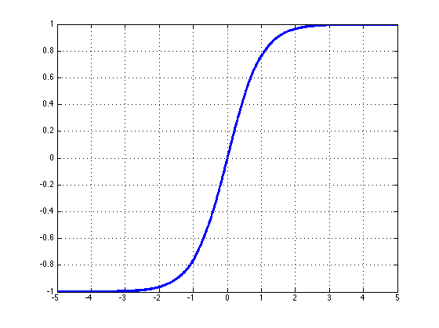

# CS224n-2019 学习笔记

-   结合每课时的课件、笔记与推荐读物等整理而成

-   作业部分将单独整理

## Lecture 03 Word Window Classification,Neural Networks, and Matrix Calculus

??? abstract "Lecture Plan"

      -   Classification review/introduction
      -   Neural networks introduction
      -   Named Entity Recognition
      -   Binary true vs. corrupted word window classification
      -   Matrix calculus introduction

!!! info "提示"

    这对一些人而言将是困难的一周，课后需要阅读提供的资料。

### Classification setup and notation

通常我们有由样本组成的训练数据集

$$
\left\{x_{i}, y_{i}\right\}_{i=1}^{N}
$$

 $x_i$ 是输入，例如单词（索引或是向量），句子，文档等等，维度为 $d$

 $y_i$ 是我们尝试预测的标签（ $C$ 个类别中的一个），例如：

-   类别：感情，命名实体，购买/售出的决定
-   其他单词
-   之后：多词序列的

**Classification intuition**


训练数据： $\left\{x_{i}, y_{i}\right\}_{i=1}^{N}$

简单的说明情况

-   固定的二维单词向量分类
-   使用softmax/logistic回归
-   线性决策边界

**传统的机器学习/统计学方法**：假设 $x_i$ 是固定的，训练 softmax/logistic 回归的权重 $W \in \mathbb{R}^{C \times d}$ 来决定决定边界(超平面)

**方法**：对每个 $x$ ，预测
$$
p(y | x)=\frac{\exp \left(W_{y} . x\right)}{\sum_{c=1}^{C} \exp \left(W_{c} \cdot x\right)}
$$
我们可以将预测函数分为两个步骤：

1.  将 $W$ 的 $y^{th}$ 行和 $x$ 中的对应行相乘得到分数
    $$
    W_{y} \cdot x=\sum_{i=1}^{d} W_{y i} x_{i}=f_{y}
    $$
    
    计算所有的 $f_c, for \ c=1,\dots,C$

2.  使用softmax函数获得归一化的概率

$$
p(y | x)=\frac{\exp \left(f_{y}\right)}{\sum_{c=1}^{C} \exp \left(f_{c}\right)}=\operatorname{softmax}\left(f_{y}\right)
$$

**Training with softmax and cross-entropy loss**

对于每个训练样本 $(x,y)$ ，我们的目标是最大化正确类 $y$ 的概率，或者我们可以最小化该类的负对数概率
$$
-\log p(y | x)=-\log \left(\frac{\exp \left(f_{y}\right)}{\sum_{c=1}^{C} \exp \left(f_{c}\right)}\right)
$$
**Background: What is “cross entropy” loss/error?**

-   交叉熵”的概念来源于信息论，衡量两个分布之间的差异
-   令真实概率分布为 $p$
-   令我们计算的模型概率为 $q$
-   交叉熵为

$$
H(p, q)=-\sum_{c=1}^{C} p(c) \log q(c)
$$

-   假设 groud truth (or true or gold or target)的概率分布在正确的类上为1，在其他任何地方为0：$p = [0,…,0,1,0,…0]$ 
-   因为 $p$ 是独热向量，所以唯一剩下的项是真实类的负对数概率

**Classification over a full dataset**

在整个数据集 $\left\{x_{i}, y_{i}\right\}_{i=1}^{N}$ 上的交叉熵损失函数，是所有样本的交叉熵的均值

$$
J(\theta)=\frac{1}{N} \sum_{i=1}^{N}-\log \left(\frac{e^{f_{y_{i}}}}{\sum_{c=1}^{C} e^{f_{c}}}\right)
$$

我们不使用

$$
f_{y}=f_{y}(x)=W_{y} \cdot x=\sum_{j=1}^{d} W_{y j} x_{j}
$$

我们使用矩阵来表示 $f$

$$
f = Wx
$$

**Traditional ML optimization**

-   一般机器学习的参数 $\theta$ 通常只由W的列组成

$$
\theta=\left[\begin{array}{c}{W_{\cdot 1}} \\ {\vdots} \\ {W_{\cdot d}}\end{array}\right]=W( :) \in \mathbb{R}^{C d}
$$

-   因此，我们只通过以下方式更新决策边界

$$
\nabla_{\theta} J(\theta)=\left[\begin{array}{c}{\nabla_{W_{1}}} \\ {\vdots} \\ {\nabla_{W_{d}}}\end{array}\right] \in \mathbb{R}^{C d}
$$

### Neural Network Classifiers


-   单独使用Softmax(≈logistic回归)并不十分强大
-   Softmax只给出线性决策边界
    -   这可能是相当有限的，当问题很复杂时是无用的
    -   纠正这些错误不是很酷吗?

**Neural Nets for the Win!**

神经网络可以学习更复杂的函数和非线性决策边界


??? tip "更高级的分类需要"

    -   词向量
    -   更深层次的深层神经网络

**Classification difference with word vectors**

一般在NLP深度学习中

-   我们学习了矩阵 $W$ 和词向量 $x$
-   我们学习传统参数和表示
-   词向量是对独热向量的重新表示——在中间层向量空间中移动它们——以便使用(线性)softmax分类器通过 x = Le 层进行分类
    -   即将词向量理解为一层神经网络，输入单词的独热向量并获得单词的词向量表示，并且我们需要对其进行更新。其中，$Vd$ 是数量很大的参数

$$
\nabla_{\theta} J(\theta)=\left[\begin{array}{c}{\nabla_{W_{1}}} \\ {\vdots} \\ {\nabla_{W_{d a r d v a r k}}} \\ {\vdots} \\ {\nabla_{x_{z e b r a}}}\end{array}\right] \in \mathbb{R}^{C d + V d}
$$

**Neural computation**


**An artificial neuron**

-   神经网络有自己的术语包
-   但如果你了解 softmax 模型是如何工作的，那么你就可以很容易地理解神经元的操作


**A neuron can be a binary logistic regression unit**

$f = nonlinear activation fct. (e.g. sigmoid), w = weights, b = bias, h = hidden, x = inputs$
$$
\begin{array}{l}{h_{w, b}(x)=f\left(w^{\top} x+b\right)} \\ {f(z)=\frac{1}{1+e^{-z}}}\end{array}
$$
$b$ : 我们可以有一个“总是打开”的特性，它给出一个先验类，或者将它作为一个偏向项分离出来

$w,b$ 是神经元的参数

**A neural network**
**= running several logistic regressions at the same time**


如果我们输入一个向量通过一系列逻辑回归函数，那么我们得到一个输出向量，但是我们不需要提前决定这些逻辑回归试图预测的变量是什么。


我们可以输入另一个logistic回归函数。损失函数将指导中间隐藏变量应该是什么，以便更好地预测下一层的目标。我们当然可以使用更多层的神经网络。

**Matrix notation for a layer**


$$
\begin{array}{l}{a_{1}=f\left(W_{11} x_{1}+W_{12} x_{2}+W_{13} x_{3}+b_{1}\right)} \\ {a_{2}=f\left(W_{21} x_{1}+W_{22} x_{2}+W_{23} x_{3}+b_{2}\right)}\\ {z=W x+b} \\ {a=f(z)} \\ f\left(\left[z_{1}, z_{2}, z_{3}\right]\right)=\left[f\left(z_{1}\right), f\left(z_{2}\right), f\left(z_{3}\right)\right] \end{array}
$$

-   $f(x)$ 在运算时是 element-wise 逐元素的

**Non-linearities (aka “f ”): Why they’re needed**

例如：函数近似，如回归或分类

-   没有非线性，深度神经网络只能做线性变换
-   多个线性变换可以组成一个的线性变换 $W_1 W_2 x = Wx$ 
    -   因为线性变换是以某种方式旋转和拉伸空间，多次的旋转和拉伸可以融合为一次线性变换
-   对于非线性函数而言，使用更多的层，他们可以近似更复杂的函数

### Named Entity Recognition (NER)

-   任务：例如，查找和分类文本中的名称


-   可能的用途
    -   跟踪文档中提到的特定实体（组织、个人、地点、歌曲名、电影名等）
    -   对于问题回答，答案通常是命名实体
    -   许多需要的信息实际上是命名实体之间的关联
    -   同样的技术可以扩展到其他 slot-filling 槽填充 分类
-   通常后面是命名实体链接/规范化到知识库

**Named Entity Recognition on word sequences**


我们通过在上下文中对单词进行分类，然后将实体提取为单词子序列来预测实体

**Why might NER be hard?**

-   很难计算出实体的边界
    -   
    -   第一个实体是 “First National Bank” 还是 “National Bank”
-   很难知道某物是否是一个实体
    -   是一所名为“Future School” 的学校，还是这是一所未来的学校？
-   很难知道未知/新奇实体的类别
    -   
    -   “Zig Ziglar” ?  一个人
-   实体类是模糊的，依赖于上下文
    -   
    -   这里的“Charles Schwab”  是 PER
        不是 ORG

### Binary word window classification

为在上下文中的语言构建分类器

-   一般来说，很少对单个单词进行分类
-   有趣的问题，如上下文歧义出现
-   例子：auto-antonyms
    -   "To sanction" can mean "to permit" or "to punish”
    -   "To seed" can mean "to place seeds" or "to remove seeds"
-   例子：解决模糊命名实体的链接
    -   Paris → Paris, France vs. Paris Hilton vs. Paris, Texas
    -   Hathaway → Berkshire Hathaway vs. Anne Hathaway

**Window classification**

-   思想：在**相邻词的上下文窗口**中对一个词进行分类
-   例如，上下文中一个单词的命名实体分类
    -   人、地点、组织、没有
-   在上下文中对单词进行分类的一个简单方法可能是对窗口中的单词向量进行**平均**，并对平均向量进行分类
    -   问题：**这会丢失位置信息**

**Window classification: Softmax**

-   训练softmax分类器对中心词进行分类，方法是在一个窗口内**将中心词周围的词向量串联起来**
-   例子：在这句话的上下文中对“Paris”进行分类，窗口长度为2


-   结果向量 $x_{window} = x \in R^{5d}$  是一个列向量

**Simplest window classifier: Softmax**

对于 $x = x_{window}$ ，我们可以使用与之前相同的softmax分类器


-   如何更新向量？
-   简而言之：就像上周那样，求导和优化

**Binary classification with unnormalized scores**

-   之前的例子：$X_{\text { window }}=[\begin{array}{ccc}{\mathrm{X}_{\text { museums }}} & {\mathrm{X}_{\text { in }}} & {\mathrm{X}_{\text { paris }} \quad \mathrm{X}_{\text { are }} \quad \mathrm{X}_{\text { amazing }} ]}\end{array}$

-   假设我们要对中心词是否为一个地点，进行分类
-   与word2vec类似，我们将遍历语料库中的所有位置。但这一次，它将受到监督，只有一些位置能够得到高分。
-   例如，在他们的中心有一个实际的NER Location的位置是“真实的”位置会获得高分

**Binary classification for NER Location**

-   例子：Not all museums in Paris are amazing

-   这里：一个真正的窗口，以Paris为中心的窗口和所有其他窗口都“损坏”了，因为它们的中心没有指定的实体位置。
    -   museums in Paris are amazing

-   “损坏”窗口很容易找到，而且有很多：任何中心词没有在我们的语料库中明确标记为NER位置的窗口
    -   Not all museums in Paris

**Neural Network Feed-forward Computation**

使用神经激活 $a$ 简单地给出一个非标准化的分数
$$
score(x)=U^{T} a \in \mathbb{R}
$$
我们用一个三层神经网络计算一个窗口的得分

-   $s = score("museums  \ in \ Paris \ are \ amazing”)$

$$
\begin{array}{l}{s=U^{T} f(W x+b)} \\ {x \in \mathbb{R}^{20 \times 1}, W \in \mathbb{R}^{8 \times 20}, U \in \mathbb{R}^{8 \times 1}}\end{array}
$$


**Main intuition for extra layer**

中间层学习输入词向量之间的**非线性交互**

例如：只有当“museum”是第一个向量时，“in”放在第二个位置才重要

**The max-margin loss**


-   关于训练目标的想法：让真实窗口的得分更高，而破坏窗口的得分更低(直到足够好为止)
-   $s = score("museums  \ in \ Paris \ are \ amazing”)$
-   $s_c = score("Not \ all \ museums  \ in \ Paris)$
-   最小化 $J=\max \left(0,1-s+s_{c}\right)$
-   这是不可微的，但它是连续的→我们可以用SGD。

-   每个选项都是连续的

-   单窗口的目标函数为

$$
J=\max \left(0,1-s+s_{c}\right)
$$

-   每个中心有NER位置的窗口的得分应该比中心没有位置的窗口高1分


-   要获得完整的目标函数：为每个真窗口采样几个损坏的窗口。对所有培训窗口求和
-   类似于word2vec中的负抽样

-   使用SGD更新参数
    -   $\theta^{n e w}=\theta^{o l d} - \alpha \nabla_{\theta} J(\theta)$
    -   $a$ 是 步长或是学习率
-   如何计算 $\nabla_{\theta} J(\theta)$ ？
    -   手工计算（本课）
    -   算法：反向传播（下一课）

**Computing Gradients by Hand**

-   回顾多元导数
-   矩阵微积分：完全矢量化的梯度
    -   比非矢量梯度快得多，也更有用
    -   但做一个非矢量梯度可以是一个很好的实践；以上周的讲座为例
    -   **notes** 更详细地涵盖了这些材料

### Gradients

-   给定一个函数，有1个输出和1个输入

$$
f(x) = x^3
$$

-   斜率是它的导数

$$
\frac{d f}{d x}=3 x^{2}
$$

-   给定一个函数，有1个输出和 n 个输入

$$
f(\boldsymbol{x})=f\left(x_{1}, x_{2}, \ldots, x_{n}\right)
$$

-   梯度是关于每个输入的偏导数的向量

$$
\frac{\partial f}{\partial \boldsymbol{x}}=\left[\frac{\partial f}{\partial x_{1}}, \frac{\partial f}{\partial x_{2}}, \ldots, \frac{\partial f}{\partial x_{n}}\right]
$$

**Jacobian Matrix: Generalization of the Gradient**

-   给定一个函数，有 m 个输出和 n 个输入

$$
\boldsymbol{f}(\boldsymbol{x})=\left[f_{1}\left(x_{1}, x_{2}, \ldots, x_{n}\right), \ldots, f_{m}\left(x_{1}, x_{2}, \ldots, x_{n}\right)\right]
$$

-   其雅可比矩阵是一个$m \times n$的偏导矩阵

$$
\frac{\partial \boldsymbol{f}}{\partial \boldsymbol{x}}=\left[\begin{array}{ccc}{\frac{\partial f_{1}}{\partial x_{1}}} & {\cdots} & {\frac{\partial f_{1}}{\partial x_{n}}} \\ {\vdots} & {\ddots} & {\vdots} \\ {\frac{\partial f_{m}}{\partial x_{1}}} & {\cdots} & {\frac{\partial f_{m}}{\partial x_{n}}}\end{array}\right]
$$

$$
\left(\frac{\partial f}{\partial x}\right)_{i j}=\frac{\partial f_{i}}{\partial x_{j}}
$$

**Chain Rule**

对于单变量函数：乘以导数
$$
\begin{array}{l}{z=3 y} \\ {y=x^{2}} \\ {\frac{d z}{d x}=\frac{d z}{d y} \frac{d y}{d x}=(3)(2 x)=6 x}\end{array}
$$
对于一次处理多个变量：乘以雅可比矩阵
$$
\begin{array}{l}{\textbf{h}=f(\textbf{z})} \\ {\textbf{z}=\textbf{W} \textbf{x}+\textbf{b}} \\ {\frac{\partial \textbf{h}}{\partial \textbf{x}}=\frac{\partial \textbf{h}}{\partial \textbf{z}} \frac{\partial \textbf{z}}{\partial \textbf{x}}=\dots}\end{array}
$$
**Example Jacobian: Elementwise activation Function**

$h=f(z)$ , $\frac{\partial \textbf{h}}{\partial \textbf{z}} = ?, \textbf{h},\textbf{z} \in \mathbb{R}^{n}$  

由于使用的是 element-wise，所以 $h_{i}=f\left(z_{i}\right)$

函数有n个输出和n个输入 → n×n 的雅可比矩阵

$$
\begin{aligned}\left(\frac{\partial h}{\partial z}\right)_{i j} &=\frac{\partial h_{i}}{\partial z_{j}}=\frac{\partial}{\partial z_{j}} f\left(z_{i}\right), \text{definition of Jacobian} \\ &=\left\{\begin{array}{ll}{f^{\prime}\left(z_{i}\right)} & {\text { if } i=j} \\ {0} & {\text { if otherwise }} , \text{regular 1-variable derivative} \end{array}\right.\end{aligned}
$$

$$
\frac{\partial \boldsymbol{h}}{\partial \boldsymbol{z}}= \left(\begin{array}{ccc}{f^{\prime}\left(z_{1}\right)} & { } & {0} \\ {} & {\ddots} & { } \\ {0} & { } & {f^{\prime}\left(z_{n}\right)}\end{array}\right)=\operatorname{diag}\left(\boldsymbol{f}^{\prime}(\boldsymbol{z})\right)
$$

**Other Jacobians**
$$
\begin{array}{l}{\frac{\partial}{\partial \boldsymbol{x}}(\boldsymbol{W} \boldsymbol{x}+\boldsymbol{b})=\boldsymbol{W}} \\ {\frac{\partial}{\partial \boldsymbol{b}}(\boldsymbol{W} \boldsymbol{x}+\boldsymbol{b})=\boldsymbol{I} \text { (Identity matrix) }} \\ \frac{\partial}{\partial \boldsymbol{u}}\left(\boldsymbol{u}^{T} \boldsymbol{h}\right)=\boldsymbol{h}^{\boldsymbol{T}} \end{array}
$$
这是正确的雅可比矩阵。稍后我们将讨论“形状约定”；用它则答案是 $h$ 。

**Back to our Neural Net!**


如何计算 $\frac{\partial s}{\partial b}$ ？

实际上，我们关心的是损失的梯度，但是为了简单起见，我们将计算分数的梯度

**Break up equations into simple pieces**


**Apply the chain rule**
$$
\begin{array}{l}{s=\boldsymbol{u}^{T} \boldsymbol{h}} \\ {\boldsymbol{h}=f(\boldsymbol{z})} \\ {\boldsymbol{z}=\boldsymbol{W} \boldsymbol{x}+\boldsymbol{b}} \\ {\boldsymbol{x}} \text{ (input) }\end{array}
$$

$$
\frac{\partial s}{\partial \boldsymbol{b}}=\frac{\partial s}{\partial \boldsymbol{h}} \frac{\partial \boldsymbol{h}}{\partial \boldsymbol{z}} \frac{\partial \boldsymbol{z}}{\partial \boldsymbol{b}}
$$


如何计算 $\frac{\partial s}{\partial \textbf{W}}$ ？
$$
\begin{aligned} \frac{\partial s}{\partial \boldsymbol{W}} &=\frac{\partial s}{\partial \boldsymbol{h}} \frac{\partial \boldsymbol{h}}{\partial \boldsymbol{z}} \frac{\partial \boldsymbol{z}}{\partial \boldsymbol{W}} \\ \frac{\partial s}{\partial \boldsymbol{b}} &=\frac{\partial s}{\partial \boldsymbol{h}} \frac{\partial \boldsymbol{h}}{\partial \boldsymbol{z}} \frac{\partial \boldsymbol{z}}{\partial \boldsymbol{b}} \end{aligned}
$$
前两项是重复的，无须重复计算
$$
\begin{aligned} \frac{\partial s}{\partial \boldsymbol{W}} &=\boldsymbol{\delta} \frac{\partial \boldsymbol{z}}{\partial \boldsymbol{W}} \\ \frac{\partial s}{\partial \boldsymbol{b}} &=\boldsymbol{\delta} \frac{\partial \boldsymbol{z}}{\partial \boldsymbol{b}}=\boldsymbol{\delta} \\ \boldsymbol{\delta} &=\frac{\partial s}{\partial \boldsymbol{h}} \frac{\partial \boldsymbol{h}}{\partial \boldsymbol{z}}=\boldsymbol{u}^{T} \circ f^{\prime}(\boldsymbol{z}) \end{aligned}
$$
其中，$\delta$ 是局部误差符号

**Derivative with respect to Matrix: Output shape**

-   $\boldsymbol{W} \in \mathbb{R}^{n \times m}$ ，$\frac{\partial s}{\partial \boldsymbol{W}}$ 的形状是
-   1个输出，$n \times m$ 个输入：1 × nm 的雅可比矩阵？
    -   不方便更新参数 $\theta^{n e w}=\theta^{o l d}-\alpha \nabla_{\theta} J(\theta)$
-   而是遵循惯例：导数的形状是参数的形状 （形状约定）
    -   $\frac{\partial s}{\partial \boldsymbol{W}}$ 的形状是 $n \times m$ 

$$
\left[\begin{array}{ccc}{\frac{\partial s}{\partial W_{11}}} & {\cdots} & {\frac{\partial s}{\partial W_{1 m}}} \\ {\vdots} & {\ddots} & {\vdots} \\ {\frac{\partial s}{\partial W_{n 1}}} & {\cdots} & {\frac{\partial s}{\partial W_{n m}}}\end{array}\right]
$$

**Derivative with respect to Matrix**

-   $\frac{\partial s}{\partial \boldsymbol{W}}=\boldsymbol{\delta} \frac{\partial \boldsymbol{z}}{\partial \boldsymbol{W}}$
    -   $\delta$ 将出现在我们的答案中
    -   另一项应该是 $x$ ，因为 $\boldsymbol{z}=\boldsymbol{W} \boldsymbol{x}+\boldsymbol{b}$ 
-   这表明 $\frac{\partial s}{\partial \boldsymbol{W}}=\boldsymbol{\delta}^{T} \boldsymbol{x}^{T}$


**Why the Transposes?**
$$
\begin{array}{l}{\frac{\partial s}{\partial \boldsymbol{W}}=\boldsymbol{\delta}^{T} \quad \boldsymbol{x}^{T}} \\ {[n \times m]} {[n \times 1]} {[1 \times m]}\end{array}
$$

-   粗糙的回答是：这样就可以解决尺寸问题了
    -   检查工作的有用技巧
-   课堂讲稿中有完整的解释
    -   每个输入到每个输出——你得到的是外部积

$$
\frac{\partial s}{\partial \boldsymbol{W}}=\boldsymbol{\delta}^{T} \boldsymbol{x}^{T}=\left[\begin{array}{c}{\delta_{1}} \\ {\vdots} \\ {\delta_{n}}\end{array}\right]\left[x_{1}, \ldots, x_{m}\right]=\left[\begin{array}{ccc}{\delta_{1} x_{1}} & {\dots} & {\delta_{1} x_{m}} \\ {\vdots} & {\ddots} & {\vdots} \\ {\delta_{n} x_{1}} & {\dots} & {\delta_{n} x_{m}}\end{array}\right]
$$

**What shape should derivatives be?**

-   $\frac{\partial s}{\partial \boldsymbol{b}}=\boldsymbol{h}^{T} \circ f^{\prime}(\boldsymbol{z})$ 是行向量
    -   但是习惯上说梯度应该是一个列向量因为 $b$ 是一个列向量
-   雅可比矩阵形式(这使得链式法则很容易)和形状约定(这使得SGD很容易实现)之间的分歧
    -   我们希望答案遵循形状约定
    -   但是雅可比矩阵形式对于计算答案很有用

-   两个选择
    -   尽量使用雅可比矩阵形式，最后按照约定进行整形
        -   我们刚刚做的。但最后转置 $\frac{\partial s}{\partial \boldsymbol{b}}$ 使导数成为列向量，得到 $\delta ^ T$
    -   始终遵循惯例
        -   查看维度，找出何时转置 和/或 重新排序项。

反向传播

-   算法高效地计算梯度
-   将我们刚刚手工完成的转换成算法
-   用于深度学习软件框架(TensorFlow, PyTorch, Chainer, etc.)

## Notes 03 Neural Networks, Backpropagation

??? abstract "Keyphrases"

    Neural networks.Forward computation.Backward.propagation.Neuron Units.Max-margin Loss.Gradient checks.Xavier parameter initialization.Learning rates.Adagrad.

!!! info "概述"

    这组笔记介绍了单层和多层神经网络，以及如何将它们用于分类目的。然后我们讨论如何使用一种称为反向传播的分布式梯度下降技术来训练它们。我们将看到如何使用链式法则按顺序进行参数更新。在对神经网络进行严格的数学讨论之后，我们将讨论一些训练神经网络的实用技巧和技巧，包括:神经元单元(非线性)、梯度检查、Xavier参数初始化、学习率、Adagrad等。最后,我们将鼓励使用递归神经网络作为语言模型。

### 1 Neural Networks: Foundations

在前面的讨论中认为，因为大部分数据是线性不可分的所以需要非线性分类器，不然的话线性分类器在这些数据上的表现是有限的。神经网络就是如下图所示的一类具有非线性决策分界的分类器。现在我们知道神经网络创建的决策边界，让我们看看这是如何创建的。

神经网络是受生物学启发的分类器，这就是为什么它们经常被称为“人工神经网络”，以区别于有机类。然而，在现实中，人类神经网络比人工神经网络更有能力、更复杂，因此通常最好不要在两者之间画太多的相似点。


#### 1.1 A Neuron

神经元是一个通用的计算单元，它接受 $n$ 个输入并产生一个输出。不同的神经元根据它们不同的参数（一般认为是神经元的权值）会有不同的输出。对神经元来说一个常见的选择是 $sigmoid$ ，或者称为“二元逻辑回归”单元。这种神经元以 $n$ 维的向量作为输入，然后计算出一个激活标量（输出） $a$ 。该神经元还与一个 $n$ 维的权重向量 $w$ 和一个偏置标量 $b$ 相关联。这个神经元的输出是

$$
a=\frac{1}{1+exp(-(w^{T}x+b))}
$$

我们也可以把上面公式中的权值和偏置项结合在一起：

$$
a=\frac{1}{1+exp(-[w^{T}\;\;x]\cdot [x\;\;1])}
$$

这个公式可以以下图的形式可视化


神经元是神经网络的基本组成部分。我们将看到神经元可以是许多允许非线性在网络中积累的函数之一。

#### 1.2 A Single Layer of Neurons

我们将上述思想扩展到多个神经元，考虑输入 $x$ 作为多个这样的神经元的输入，如下图所示。


如果我们定义不同的神经元的权值为 $\{w^{(1)},...,w^{(m)}\}$ 、偏置为 $\{b_{1},...,b_{m}\}$ 和相对应的激活输出为 $\{a_{1},...,a_{m}\}$ ：

$$
         \begin{matrix}         a_{1} =\frac{1}{1+exp(-(w^{(1)T}x+b))} \\ \vdots \\ a_{m} =\frac{1}{1+exp(-(w^{(m)T}x+b))}          \end{matrix}    \\
$$

让我们定义简化公式以便于更好地表达复杂的网络：

$$
         \sigma(z) =         \begin{bmatrix}         \frac{1}{1+exp(z_{1})} \\ \vdots \\ \frac{1}{1+exp(z_{m})}         \end{bmatrix} \\         b =         \begin{bmatrix}         b_{1} \\ \vdots \\ b_{m}         \end{bmatrix} \in \mathbb{R}^{m} \\         W =         \begin{bmatrix}         -\;\;w^{(1)T}\;\;- \\ \cdots \\ -\;\;w^{(m)T}\;\;-         \end{bmatrix} \in \mathbb{R}^{m\times n}  \\
$$

我们现在可以将缩放和偏差的输出写成：

$$
\mathbf{z}=\mathbf{W}\mathbf{x}+\mathbf{b}  \\
$$

激活函数 sigmoid 可以变为如下形式：

$$
         \begin{bmatrix}         a_{1} \\ \vdots \\ a_{m}         \end{bmatrix} = \sigma(\mathbf{z}) = \sigma(\mathbf{W}\mathbf{x}+\mathbf{b})  \\
$$

那么这些激活的作用是什么呢？我们可以把这些激活看作是一些加权特征组合存在的指标。然后，我们可以使用这些激活的组合来执行分类任务。

#### 1.3 Feed-forward Computation

到目前为止我们知道一个输入向量 $x\in \mathbb{R}^{n}$ 可以经过一层 $sigmoid$ 单元的变换得到激活输出 $a\in \mathbb{R}^{m}$ 。但是这么做的直觉是什么呢？让我们考虑一个 NLP 中的命名实体识别问题作为例子：

$$
Museums\;in\;Paris \;are\;amazing  \\
$$

这里我们想判断中心词  $Paris$ 是不是以命名实体。在这种情况下，我们很可能不仅想要捕捉窗口中单词的单词向量，还想要捕捉单词之间的一些其他交互，以便进行分类。例如，可能只有 $Museums$ 是第一个单词和 $in$ 是第二个单词的时候， $Paris$ 才是命名实体。这样的非线性决策通常不能被直接提供给Softmax函数的输入捕获，而是需要第1.2节中讨论的中间层进行评分。因此，我们可以使用另一个矩阵 $\mathbf{U} \in \mathbb{R}^{m \times 1}$ 与激活输出计算得到未归一化的得分用于分类任务：

$$
s=\mathbf{U}^{T}a=\mathbf{U}^{T}f(Wx+b)
$$

其中 $f$ 是激活函数（例如 sigmoid 函数）。

**维度分析**：如果我们使用 4 维的词向量来表示每个单词并使用 5 个词的窗口，则输入是 $x\in \mathbb{R}^{20}$ 。如果我们在隐藏层使用 8 个 sigmoid 单元和从激活函数中生成一个分数输出，其中 $W\in \mathbb{R}^{8\times 20}$ ， $b\in \mathbb{R}^{8}$ ， $U\in \mathbb{R}^{8\times 1}$， $s\in \mathbb{R}$ 。


#### 1.4 Maximum Margin Objective Function

类似很多的机器学习模型，神经网络需要一个优化目标函数，一个我们想要最小化或最大化的误差。这里我们讨论一个常用的误差度量方法：**maximum margin objective** 最大间隔目标函数。使用这个目标函数的背后的思想是保证对“真”标签数据的计算得分要比“假”标签数据的计算得分要高。

回到前面的例子，如果我们令“真”标签窗口 $\text{Museums in Paris are amazing}$ 的计算得分为 s ，令“假”标签窗口 $\text{Not all museums in Paris}$ 的计算得分为 $s_{c}$ （下标 $c$ 表示这个这个窗口 corrupt ）

然后，我们对目标函数最大化 $(s-s_{c})$ 或者最小化 $(s_{c}-s)$ 。然而，我们修改目标函数来保证误差仅在 $s_{c} > s \Rightarrow  (s_{c}-s) > 0$ 才进行计算。这样做的直觉是，我们只关心“正确”数据点的得分高于“错误”数据点，其余的都不重要。因此，当 $s_{c} > s$ 则误差为 $(s_{c}-s)$ ，否则为 0 。因此，我们的优化的目标函数现在为：

$$
minimize\;J=max\,(s_{c}-s,0)
$$

然而，上面的优化目标函数是有风险的，因为它不能创造一个安全的间隔。我们希望“真”数据要比“假”数据的得分大于某个正的间隔 $\Delta$ 。换而言之，我们想要误差在 $(s-s_{c} < \Delta)$ 就开始计算，而不是当 $(s-s_{c} < 0)$ 时就计算。因此，我们修改优化目标函数为：

$$
minimize\;J=max\,(\Delta+s_{c}-s,0)
$$

我们可以把这个间隔缩放使得 $\Delta=1$ ，让其他参数在优化过程中自动进行调整，并且不会影响模型的表现。如果想更多地了解这方面，可以去读一下 $SVM$ 中的函数间隔和几何间隔中的相关内容。最后，我们定义在所有训练窗口上的优化目标函数为：

$$
minimize\;J=max\,(1+s_{c}-s,0)
$$

按照上面的公式有，$s_{c}=\mathbf{U}^{T}f(Wx_{c}+b)$ 和 $s=\mathbf{U}^{T}f(Wx+b)$。

!!! note "Note"

    最大边际目标函数通常与支持向量机一起使用

#### 1.5 Training with Backpropagation – Elemental

在这部分我们讨论当1.4节中讨论的损失函数 $J$ 为正时，模型中不同参数时是如何训练的。如果损失为 0 时，那么不需要再更新参数。我们一般使用梯度下降（或者像 SGD 这样的变体）来更新参数，所以要知道在更新公式中需要的任意参数的梯度信息：

$$
\theta^{(t+1)}=\theta^{(t)}-\alpha\nabla_{\theta^{(t)}}J 
$$

反向传播是一种利用微分链式法则来计算模型上任意参数的损失梯度的方法。为了更进一步理解反向传播，我们先看下图中的一个简单的网络	


这里我们使用只有单个隐藏层和单个输出单元的神经网络。现在让我们先建立一些符号定义：

-    $x_{i}$ 是神经网络的输入
-    $s$ 是神经网络的输出
-   每层（包括输入和输出层）的神经元都接收一个输入和生成一个输出。第 $k$ 层的第 $j$ 个神经元接收标量输入 $z_{j}^{(k)}$ 和生成一个标量激活输出 $a_{j}^{(k)}$ 
-   我们把 $z_{j}^{(k)}$ 计算出的反向传播误差定义为 $\delta_{j}^{(k)}$ 
-   第 $1$ 层是输入层，而不是第 $1$ 个隐藏层。对输入层而言， $x_{j}^{(k)}=z_{j}^{(k)}=a_{j}^{(k)}$ 
-   $W^{(k)}$ 是将第 k 层的输出映射到第 $k+1$ 层的输入的转移矩阵，因此将这个新的符号用在 $Section\;1.3$ 中的例子 $W^{(1)}=W$ 和 $W^{(2)}=U$ 。

**现在开始反向传播**：假设损失函数 $J=(1+s_{c}-s)$ 为正值，我们想更新参数 $W_{14}^{(1)}$ ，我们看到 $W_{14}^{(1)}$ 只参与了 $z_{1}^{(2)}$ 和 $a_{1}^{(2)}$ 的计算。这点对于理解反向传播是非常重要的——**反向传播的梯度只受它们所贡献的值的影响**。 $a_{1}^{(2)}$ 在随后的前向计算中和 $W_{1}^{(2)}$ 相乘计算得分。我们可以从最大间隔损失看到：
$$
\frac{\partial J}{\partial s}=-\frac{\partial J}{\partial s_{c}}=-1 \\
$$

为了简化我们只分析 $\frac{\partial s}{\partial W_{ij}^{(1)}}$ 。所以，

$$
\begin{eqnarray}  \frac{\partial s}{\partial W_{ij}^{(1)}} &=& \frac{\partial W^{(2)}a^{(2)}}{\partial W_{ij}^{(1)}}=\frac{\partial W_{i}^{(2)}a_{i}^{(2)}}{\partial W_{ij}^{(1)}}=W_{i}^{(2)}\frac{\partial a_{i}^{(2)}}{\partial W_{ij}^{(1)}} \nonumber \\ \Rightarrow W_{i}^{(2)}\frac{\partial a_{i}^{(2)}}{\partial W_{ij}^{(1)}}&=& W_{i}^{(2)}\frac{\partial a_{i}^{(2)}}{\partial z_{i}^{(2)}}\frac{\partial z_{i}^{(2)}}{\partial W_{ij}^{(1)}} \nonumber \\ &=& W_{i}^{(2)}\frac{f(z_{i}^{(2)})}{\partial z_{i}^{(2)}}\frac{\partial z_{i}^{(2)}}{\partial W_{ij}^{(1)}} \nonumber \\ &=& W_{i}^{(2)}f'(z_{i}^{(2)})\frac{\partial z_{i}^{(2)}}{\partial W_{ij}^{(1)}} \nonumber \\ &=& W_{i}^{(2)}f'(z_{i}^{(2)})\frac{\partial}{\partial W_{ij}^{(1)}}(b_{i}^{(1)}+a_{1}^{(1)}W_{i1}^{(1)}+a_{2}^{(1)}W_{i2}^{(1)}+a_{3}^{(1)}W_{i3}^{(1)}+a_{4}^{(1)}W_{i4}^{(1)}) \nonumber \\ &=& W_{i}^{(2)}f'(z_{i}^{(2)})\frac{\partial}{\partial W_{ij}^{(1)}}(b_{i}^{(1)}+\sum_{k}a_{k}^{(1)}W_{ik}^{(1)}) \nonumber \\ &=& W_{i}^{(2)}f'(z_{i}^{(2)})a_{j}^{(1)} \nonumber \\ &=& \delta_{i}^{(2)}\cdot a_{j}^{(1)} \nonumber \end{eqnarray}    \\
$$

其中， $a^{(1)}$ 指输入层的输入。我们可以看到梯度计算最后可以简化为 $\delta_{i}^{(2)}\cdot a_{j}^{(1)}$ ，其中 $\delta_{i}^{(2)}$ 本质上是第 $2$ 层中第 $i$ 个神经元反向传播的误差。 $a_{j}^{(1)}$ 与 $W_{ij}$ 相乘的结果，输入第 $2$ 层中第 $i$ 个神经元中。

我们以下图为例，让我们从“误差共享/分配”的来阐释一下反向传播，现在我们要更新 $W_{14}^{(1)}$ ：


1.  我们从 $a_{1}^{(3)}$ 的 1 的误差信号开始反向传播。
2.  然后我们把误差与将 $z_{1}^{(3)}$ 映射到 $a_{1}^{(3)}$ 的神经元的局部梯度相乘。在这个例子中梯度正好等于  1 ，则误差仍然为 1 。所以有 $\delta_{1}^{(3)}=1$ 。
3.  这里误差信号 1 已经到达 $z_{1}^{(3)}$ 。我们现在需要分配误差信号使得误差的“公平共享”到达 $a_{1}^{(2)}$ 。
4.  现在在 $a_{1}^{(2)}$ 的误差为 $\delta_{1}^{(3)}\times W_{1}^{(2)}=W_{1}^{(2)}$ （在 $z_{1}^{(3)}$ 的误差信号为 $\delta_{1}^{(3)}$ ）。因此在 $a_{1}^{(2)}$ 的误差为 $W_{1}^{(2)}$ 。
5.  与第 2 步的做法相同，我们在将 $z_{1}^{(2)}$ 映射到 $a_{1}^{(2)}$ 的神经元上移动误差，将 $a_{1}^{(2)}$ 与局部梯度相乘，这里的局部梯度为  $f'(z_{1}^{(2)})$  。
6.  因此在 $z_{1}^{(2)}$ 的误差是 $f'(z_{1}^{(2)})W_{1}^{(2)}$ ，我们将其定义为 $\delta_{1}^{(2)}$ 。
    
7.  最后，我们通过将上面的误差与参与前向计算的 $a_{4}^{(1)}$ 相乘，把误差的“误差共享”分配到 $W_{14}^{(1)}$ 。
    
8.  所以，对于 $W_{14}^{(1)}$ 的梯度损失可以计算为 $a_{4}^{(1)}f'(z_{1}^{(2)})W_{1}^{(2)}$ 。

注意我们使用这个方法得到的结果是和之前微分的方法的结果是完全一样的。因此，计算网络中的相应参数的梯度误差既可以使用链式法则也可以使用误差共享和分配的方法——这两个方法能得到相同结果，但是多种方式考虑它们可能是有帮助的。

**偏置更新**：偏置项（例如 $b_{1}^{(1)}$ ）和其他权值在数学形式是等价的，只是在计算下一层神经 $z_{1}^{(2)}$ 元输入时相乘的值是常量 1 。因此在第 k 层的第 i 个神经元的偏置的梯度时 $\delta_{i}^{(k)}$ 。例如在上面的例子中，我们更新的是 $b_{1}^{(1)}$ 而不是  $W_{14}^{(1)}$ ，那么这个梯度为 $f'(z_{1}^{(2)})W_{1}^{(2)}$ 。

从 $\delta^{(k)}$ 到 $\delta^{(k-1)}$ 反向传播的一般步骤：

-   我们有从 $z_{i}^{(k)}$ 向后传播的误差 $\delta_{i}^{(k)}$ ，如下图所示


-   我们通过把 $\delta_{i}^{(k)}$ 与路径上的权值 $W_{ij}^{(k-1)}$ 相乘，将这个误差反向传播到 $a_{j}^{(k-1)}$ 。
-   因此在 $a_{j}^{(k-1)}$ 接收的误差是 $\delta_{i}^{(k)}W_{ij}^{(k-1)}$ 。
-   然而， $a_{j}^{(k-1)}$ 在前向计算可能出下图的情况，会参与下一层中的多个神经元的计算。那么第 k 层的第 $m$ 个神经元的误差也要使用上一步方法将误差反向传播到 $a_{j}^{(k-1)}$ 上。


-   因此现在在 $a_{j}^{(k-1)}$ 接收的误差是 $\delta_{i}^{(k)}W_{ij}^{(k-1)}+\delta_{m}^{(k)}W_{mj}^{(k-1)}$ 。
-   实际上，我们可以把上面误差和简化为 $\sum_{i}\delta_{i}^{(k)}W_{ij}^{(k-1)}$ 。
-   现在我们有在 $a_{j}^{(k-1)}$ 正确的误差，然后将其与局部梯度  $f'(z_{j}^{(k-1)})$ 相乘，把误差信息反向传到第 $k-1$ 层的第 $j$ 个神经元上。
-   因此到达 $z_{j}^{(k-1)}$ 的误差为 $f'(z_{j}^{(k-1)})\sum_{i}\delta_{i}^{(k)}W_{ij}^{(k-1)}$ 。

#### 1.6 Training with Backpropagation – Vectorized

到目前为止，我们讨论了对模型中的给定参数计算梯度的方法。这里会一般泛化上面的方法，让我们可以直接一次过更新权值矩阵和偏置向量。注意这只是对上面模型的简单地扩展，这将有助于更好理解在矩阵-向量级别上进行误差反向传播的方法。

对更定的参数 $W_{ij}^{(k)}$ ，我们知道它的误差梯度是 $\delta_{j}^{(k+1)}\cdot a_{j}^{(k)}$ 。其中 $W^{(k)}$ 是将 $a^{(k)}$ 映射到 $z^{(k+1)}$ 的矩阵。因此我们可以确定整个矩阵 $W^{(k)}$ 的梯度误差为：

$$
\nabla_{W^{(k)}} =         \begin{bmatrix}         \delta_{1}^{(k+1)}a_{1}^{(k)} & \delta_{1}^{(k+1)}a_{2}^{(k)} & \cdots \\         \delta_{2}^{(k+1)}a_{1}^{(k)} & \delta_{2}^{(k+1)}a_{2}^{(k)} & \cdots \\         \vdots & \vdots  & \ddots \\         \end{bmatrix} = \delta^{(k+1)}a^{(k)T}  \\
$$

因此我们可以将整个矩阵形式的梯度写为在矩阵中的反向传播的误差向量和前向激活输出的**外积**。

现在我们来看看如何能够计算误差向量 $\delta^{(k+1)}$ 。我们从上面的例子中有， $\delta_{i}^{(k)}=f'(z_{j}^{(k)})\sum_{i}\delta_{i}^{(k+1)}W_{ij}^{(k)}$ 。这可以简单地改写为矩阵的形式：

$$
\delta_{i}^{(k)}=f'(z^{(k)})\circ (W^{(k)T}\delta^{(k+1)}) \\
$$

在上面的公式中 $\circ$ 运算符是表示向量之间对应元素的相乘（ $\mathbb{R}^{N}\times \mathbb{R}^{N}\rightarrow \mathbb{R}^{N}$ ）。

**计算效率**：在探索了 **element-wise** 的更新和 **vector-wise** 的更新之后，必须认识到在科学计算环境中，如 MATLAB 或 Python（使用 Numpy / Scipy 库），向量化运算的计算效率是非常高的。因此在实际中应该使用向量化运算。此外，我们也要减少反向传播中的多余的计算——例如，注意到 $\delta^{(k)}$ 是直接依赖在 $\delta^{(k+1)}$ 上。所以我们要保证使用 $\delta^{(k+1)}$ 更新 $W^{(k)}$ 时，要保存 $\delta^{(k+1)}$ 用于后面 $\delta^{(k)}$ 的计算-然后计算 $(k-1)...(1)$ 层的时候重复上述的步骤。这样的递归过程是使得反向传播成为计算上可负担的过程。

### 2 Neural Networks: Tips and Tricks

#### 2.1 Gradient Check

在上一部分中，我们详细地讨论了如何用基于微积分的方法计算神经网络中的参数的误差梯度／更新。这里我们介绍一种用数值近似这些梯度的方法——虽然在计算上的低效不能直接用于训练神经网络，这种方法可以非常准确地估计任何参数的导数；因此，它可以作为对导数的正确性的有用的检查。给定一个模型的参数向量 $\theta$ 和损失函数 $J$ ，围绕 $\theta_{i}$ 的数值梯度由 **central difference formula** 得出：

$$
f'(\theta)\approx \frac{J(\theta^{(i+)})-\theta^{(i-)})}{2\epsilon}  \\
$$

其中 $\epsilon$ 是一个很小的值（一般约为 $1e^{-5}$ ）。当我们使用  $+\epsilon$ 扰动参数 $\theta$ 的第 $i$ 个元素时，就可以在前向传播上计算误差 $J(\theta^{(i+)})$ 。相似地，当我们使用  $-\epsilon$ 扰动参数 $\theta$ 的第 $i$ 个元素时，就可以在前向传播上计算误差 $J(\theta^{(i-)})$ 。因此，计算两次前向传播，我们可以估计在模型中任意给定参数的梯度。我们注意到数值梯度的定义和导数的定义很相似，其中，在标量的情况下：

$$
f'(\theta)\approx \frac{f(x+\epsilon)-f(x)}{\epsilon}   \\
$$

当然，还是有一点不同——上面的定义仅仅在正向扰动 $x$ 计算梯度。虽然是可以用这种方式定义数值梯度，但在实际中使用 **central difference formula** 常常可以更准确和更稳定，因为我们在两个方向都对参数扰动。为了更好地逼近一个点附近的导数/斜率，我们需要在该点的左边和右边检查函数 $f'$ 的行为。也可以使用泰勒定理来表示 **central difference formula** 有 $\epsilon^{2}$ 比例误差，这相当小，而导数定义更容易出错。

现在你可能会产生疑问，如果这个方法这么准确，为什么我们不用它而不是用反向传播来计算神经网络的梯度？这是因为效率的问题——每当我们想计算一个元素的梯度，需要在网络中做两次前向传播，这样是很耗费计算资源的。再者，很多大规模的神经网络含有几百万的参数，对每个参数都计算两次明显不是一个好的选择。同时在例如 **SGD** 这样的优化技术中，我们需要通过数千次的迭代来计算梯度，使用这样的方法很快会变得难以应付。这种低效性是我们只使用梯度检验来验证我们的分析梯度的正确性的原因。梯度检验的实现如下所示：

```python
def eval_numerical_gradient(f, x):
    """
    a naive implementation of numerical gradient of f at x
    - f should be a function that takes a single argument
    - x is the point (numpy array) to evaluate the gradient  
    at
    """
    
    f(x) = f(x) # evaluate function value at original point
    grad = np.zeros(x.shape)
    h = 0.00001
    
    # iterate over all indexes in x
    it = np.nditer(x, flags=['multi_index',
                     op_flags=['readwrite'])
                     
    while not it.finished:
    
        # evaluate function at x+h
        ix = it.multi_index
        old_value = x[ix]
        x[ix] = old_value + h # increment by h
        fxh_left = f(x) # evaluate f(x + h)
        x[ix] = old_value - h # decrement by h
        fxh_right = f(x) # evaluate f(x - h)
        # restore to previous value (very important!)
        x[ix] = old_value 
        
        # compute the partial derivative
        # the slope
        grad[ix] = (fxh_left - fxh_right) / (2 * h)
        it.iternext() # step to next dimension
    return grad
```

#### 2.2 Regularization

和很多机器学习的模型一样，神经网络很容易过拟合，这令到模型在训练集上能获得近乎完美的表现，但是却不能泛化到测试集上。一个常见的用于解决过拟合（“高方差问题”）的方法是使用 $L2$ 正则化。我们只需要在损失函数 $J$ 上增加一个正则项，现在的损失函数如下：

$$
J_{R}=J+\lambda\sum_{i=1}^{L}\big|\big|W^{(i)}\big|\big|_{F}   \\
$$

在上面的公式中， $\big|\big|W^{(i)}\big|\big|_{F}$ 是矩阵 $W^{(i)}$ （在神经网络中的第 $i$ 个权值矩阵）的 $Frobenius$ 范数, $\lambda$ 是超参数控制损失函数中的权值的大小。

!!! info "矩阵 $U$ 的 $Frobenius$ 范数的定义"
    
    $\|U\|_{F}=\sqrt{\sum_{i} \sum_{l} U_{i l}^{2}}$

当我们尝试去最小化 $J_{R}$ ，正则化本质上就是当优化损失函数的时候，惩罚数值太大的权值（让权值的数值分配更加均衡，防止出现部分权值特别大的情况）。由于 $Frobenius$ 范数的二次的性质（计算矩阵的元素的平方和）， $L2$ 正则项有效地降低了模型的灵活性和因此减少出现过拟合的可能性。增加这样一个约束可以**使用贝叶斯派的思想解释**，这个正则项是对模型的参数加上一个**先验分布**，优化权值使其接近于 0——有多接近是取决于 $\lambda$ 的值。选择一个合适的 $\lambda$ 值是很重要的，并且需要通过超参数调整来选择。 $\lambda$ 的值太大会令很多权值都接近于  0 ，则模型就不能在训练集上学习到有意义的东西，经常在训练、验证和测试集上的表现都非常差。 $\lambda$ 的值太小，会让模型仍旧出现过拟合的现象。需要注意的是，偏置项不会被正则化，不会计算入损失项中——尝试去思考一下为什么

??? cite "为何在损失项中不计算偏置项"

    偏置项在模型中仅仅是偏移的关系，使用少量的数据就能拟合到这项，而且从经验上来说，偏置值的大小对模型表现没有很显著的影响，因此不需要正则化偏置项
    [深度学习里面的偏置为什么不加正则？](https://www.zhihu.com/question/66894061)
    下面摘录已有的三条回答
    首先正则化主要是为了防止过拟合，而过拟合一般表现为模型对于输入的微小改变产生了输出的较大差异，这主要是由于有些参数w过大的关系，通过对||w||进行惩罚，可以缓解这种问题。而如果对||b||进行惩罚，其实是没有作用的，因为在对输出结果的贡献中，参数b对于输入的改变是不敏感的，不管输入改变是大还是小，参数b的贡献就只是加个偏置而已。
    举个例子，如果你在训练集中，w和b都表现得很好，但是在测试集上发生了过拟合，b是不背这个锅的，因为它对于所有的数据都是一视同仁的（都只是给它们加个偏置），要背锅的是w，因为它会对不同的数据产生不一样的加权。或者说，模型对于输入的微小改变产生了输出的较大差异，这是因为模型的“曲率”太大，而模型的曲率是由w决定的，b不贡献曲率（对输入进行求导，b是直接约掉的）。
    
    从贝叶斯的角度来讲，正则化项通常都包含一定的先验信息，神经网络倾向于较小的权重以便更好地泛化，但是对偏置就没有这样一致的先验知识。另外，很多神经网络更倾向于区分方向信息（对应于权重），而不是位置信息（对应于偏置），所以对偏置加正则化项对控制过拟合的作用是有限的，相反很可能会因为不恰当的正则强度影响神经网络找到最优点。
    
    过拟合会使得模型对异常点很敏感，即准确插入异常点，导致拟合函数中的曲率很大（即函数曲线的切线斜率非常高），而偏置对模型的曲率没有贡献（对多项式模型进行求导，为W的线性加和），所以正则化他们也没有什么意义。


有时候我们会用到其他类型的正则项，例如 $L1$ 正则项，它将参数元素的绝对值全部加起来-然而，在实际中很少会用 $L1$ 正则项，因为会令权值参数变得稀疏。在下一部分，我们讨论 dropout ，这是另外一种有效的正则化方法，通过在前向传播过程随机将神经元设为 0

>   Dropout 实际上是通过在每次迭代中忽略它们的权值来实现“冻结”部分 unit 。这些“冻结”的 unit 不是把它们设为 0 ，而是对于该迭代，网络假定它们为 0 。“冻结”的 unit 不会为此次迭代更新

#### 2.3 Dropout

**Dropout** 是一个非常强大的正则化技术，是 Srivastava 在论文 《Dropout: A Simple Way to Prevent Neural Networks from Overfitting》中首次提出，下图展示了 dropout 如何应用在神经网络上。


这个想法是简单而有效的——训练过程中，在每次的前向／反向传播中我们按照一定概率 $(1-p)$ 随机地“ drop ”一些神经元子集（或者等价的，我们保持一定概率 $p$ 的神经元是激活的）。然后，在测试阶段，我们将使用全部的神经元来进行预测。使用 Dropout 神经网络一般能从数据中学到更多有意义的信息，更少出现过拟合和通常在现今的任务上获得更高的整体表现。这种技术应该如此有效的一个直观原因是， dropout 本质上作的是一次以指数形式训练许多较小的网络，并对其预测进行平均。

实际上，我们使用 dropout 的方式是我们取每个神经元层的输出 $h$ ，并保持概率  $p$ 的神经元是激活的，否则将神经元设置为 0 。然后，在反向传播中我们仅对在前向传播中激活的神经元回传梯度。最后，在测试过程，我们使用神经网络中全部的神经元进行前向传播计算。然而，有一个关键的微妙之处，为了使 dropout 有效地工作，测试阶段的神经元的预期输出应与训练阶段大致相同——否则输出的大小可能会有很大的不同，网络的表现已经不再明确了。因此，我们通常必须在测试阶段将每个神经元的输出除以某个值——这留给读者作为练习来确定这个值应该是多少，以便在训练和测试期间的预期输出相等（该值为 $p$ ） 。

以下源于 [《神经网络与深度学习》](https://nndl.github.io/) `P190`

-   目的：缓解过拟合问题，一定程度上达到正则化的效果

-   效果：减少下层节点对其的依赖，迫使网络去学习更加**鲁棒**的特征

-   **集成学习的解释** 👍

    -   每做一次丢弃，相当于从原始的网络中采样得到一个子网络。
        如果一个神经网络有$n$个神经元，那么总共可以采样出$2^n$个子网络。每次迭代都相当于训练一个不同的子网络，这些子网络都共享原始网络的参数。那么，最终的网络可以近似看作是集成了指数级个不同网络的组合模型。

-   **贝叶斯学习的解释**  👍 

    -   丢弃法也可以解释为一种贝叶斯学习的近似。用$y=f(\mathbf{x}, \theta)$来表示要学习的神经网络，贝叶斯学习是假设参数$\theta$为随机向量，并且先验分布为$q(\theta)$，贝叶斯方法的预测为

    $$
    \begin{aligned} \mathbb{E}_{q(\theta)}[y] &=\int_{q} f(\mathbf{x}, \theta) q(\theta) d \theta \\ & \approx \frac{1}{M} \sum_{m=1}^{M} f\left(\mathbf{x}, \theta_{m}\right) \end{aligned}
    $$

    -   其中$f(\mathbf{x}, \theta_m)$为第m次应用丢弃方法后的网络，其参数$\theta_m$为对全部参数$\theta$的一次采样。

-   RNN中的变分Dropout [Variational Dropout](<https://arxiv.org/abs/1512.05287>)

    -   Dropout一般是针对神经元进行随机丢弃，但是也可以扩展到对神经元之间
        的连接进行随机丢弃，或每一层进行随机丢弃。

    -   在RNN中，不能直接对每个时刻的隐状态进行随机
        丢弃，这样会损害循环网络在时间维度上记忆能力。

    -   一种简单的方法是对非时间维度的连接（即非循环连接）进行随机丢失。如图所示，虚线边表示进行随机丢弃，不同的颜色表示不同的丢弃掩码。

		

    -   然而根据贝叶斯学习的解释，丢弃法是一种对参数$θ$的采样。每次采样的参数需要在每个时刻保持不变。因此，在对循环神经网络上使用丢弃法时，需要对参数矩阵的每个元素进行随机丢弃，并在所有时刻都使用相同的丢弃掩码。这种方法称为变分丢弃法（Variational Dropout）。
        图7.12给出了变分丢弃法的示例，**相同颜色表示使用相同的丢弃掩码**。


#### 2.4 Neuron Units

到目前为止，我们讨论了含有 sigmoidal neurons 的非线性分类的神经网络。但是在很多应用中，使用其他激活函数可以设计更好的神经网络。下面列出一些常见的激活函数和激活函数的梯度定义，它们可以和前面讨论过的 sigmoidal 函数互相替换。

**Sigmoid**：这是我们讨论过的常用选择，激活函数 $\sigma$ 为：
$$
\sigma(z)=\frac{1}{1+exp(-z)}
$$

其中  $\sigma(z)\in (0,1)$ 。


$\sigma(z)$ 的梯度为

$$
\sigma'(z)=\frac{-exp(-z)}{1+exp(-z)}=\sigma(z)(1-\sigma(z))  \\
$$

**Tanh**： $tanh$ 函数是 $sigmoid$ 函数之外的另一个选择，在实际中它能更快地收敛。 $tanh$ 和 $sigmoid$ 的主要不同在于 $tanh$ 的输出范围在  -1 到 1 ，而 $sigmoid$ 的输出范围在 0 到 1 。
$$
tanh(z)=\frac{exp(z)-exp(-z)}{exp(z)+exp(-z)}=2\sigma(2z)-1   \\
$$

其中 $tanh(z)\in (-1, 1)$ 。



$tanh(z)$ 的梯度为：

$$
tanh'(z)=\bigg(\frac{exp(z)-exp(-z)}{exp(z)+exp(-z)}\bigg)^{2}=1-tanh^{2}(z)   \\
$$

**Hard tanh**：有时候 $hard\;tanh$ 函数有时比 $tanh$ 函数的选择更为优先，因为它的计算量更小。然而当 $z$ 的值大于 $1$ 时，函数的数值会饱和（如下图所示会恒等于 1）。$hard\;tanh$ 激活函数为：

$$
\begin{eqnarray}  hardtanh(z) &=& \begin{cases} -1& \text{:$z<1$}\\ z & \text{:$-1\le z \le 1$} \\ 1 & \text{:$z>1$} \end{cases} \nonumber  \end{eqnarray}  \\
$$


$hard\;tanh$ 这个函数的微分也可以用分段函数的形式表示：

$$
\begin{eqnarray}  hardtanh(z) &=& \begin{cases} 1 & \text{:$-1\le z \le 1$} \\ 0 & \text{:$otherwise$} \end{cases} \nonumber  \end{eqnarray}   \\
$$

**Soft sign**： $soft\;sign$ 函数是另外一种非线性激活函数，它可以是 $tanh$ 的另外一种选择，因为它和 $hard\;clipped\;functions$ 一样不会过早地饱和：
$$
softsign(z)=\frac{z}{1+|z|}  
$$


$soft\;sign$ 函数的微分表达式为：

$$
softsign'(z)=\frac{sgn(z)}{(1+z)^{2}}   \\
$$

其中 $sgn$ 是符号函数，根据 $z$ 的符号返回 1 或者 -1 。

**ReLU**： $ReLU$ （ $Rectified\;Linear\;Unit$ ）函数是激活函数中的一个常见的选择，当 z 的值特别大的时候它也不会饱和。在计算机视觉应用中取得了很大的成功：
$$
rect(z)=max(z,0)
$$


$ReLU$ 函数的微分是一个分段函数：

$$
\begin{eqnarray}  rect'(z) &=& \begin{cases} 1 & \text{$z > 0$} \\ 0 & \text{:$otherwise$} \end{cases} \nonumber  \end{eqnarray}    \\
$$

**Leaky ReLU**：传统的 $ReLU$ 单元当 z 的值小于 0 时，是不会反向传播误差 $leaky\;ReLU$ 改善了这一点，当 $z$ 的值小于 0 时，仍然会有一个很小的误差反向传播回去。
$$
leaky(z)=max(z, k\cdot z)  \\
$$

其中 $0<k<1$ 。

$leaky\;ReLU$ 函数的微分是一个分段函数：

$$
\begin{eqnarray}  leaky'(z) &=& \begin{cases} 1 & \text{$z > 0$} \\ k & \text{:$otherwise$} \end{cases} \nonumber  \end{eqnarray}
$$


#### 2.5 Data Preprocessing

与机器学习模型的一般情况一样，确保模型在当前任务上获得合理性能的一个关键步骤是对数据执行基本的预处理。下面概述了一些常见的技术。

**Mean Subtraction**

给定一组输入数据 $X$ ，一般把 $X$ 中的值减去 $X$ 的平均特征向量来使数据**零中心化**。在实践中很重要的一点是，**只计算训练集的平均值**，而且在**训练集，验证集和测试集**都是**减去同一平均值**。

**Normalization**

另外一个常见的技术（虽然没有 $mean\;Subtraction$ 常用）是将每个输入特征维度缩小，让每个输入特征维度具有相似的幅度范围。这是很有用的，因此不同的输入特征是用不同“单位”度量，但是最初的时候我们经常认为所有的特征同样重要。实现方法是将特征除以它们各自在训练集中计算的标准差。

**Whitening**

相比上述的两个方法， **whitening** 没有那么常用，它本质上是数据经过转换后，特征之间相关性较低，所有特征具有相同的方差（协方差阵为 1 ）。首先对数据进行 **Mean Subtraction** 处理，得到 $X'$ 。然后我们对 $X'$ 进行奇异值分解得到矩阵 $U$ , $S$ , $V$ ，计算 $UX'$ 将 $X'$ 投影到由 $U$ 的列定义的基上。我们最后将结果的每个维度除以 $S$ 中的相应奇异值，从而适当地缩放我们的数据（如果其中有奇异值为 0 ，我们就除以一个很小的值代替）。

#### 2.6 Parameter Initialization

让神经网络实现最佳性能的关键一步是以合理的方式初始化参数。一个好的起始方法是将权值初始化为通常分布在 0 附近的很小的随机数-在实践中效果还不错。在论文***Understanding the difficulty***
***of training deep feedforward neural networks***
***(2010)***, Xavier 研究不同权值和偏置初始化方案对训练动力（ **training dynamics**​ ）的影响。实验结果表明，对于 sigmoid 和 tanh 激活单元，当一个权值矩阵 $W\in \mathbb{R}^{n^{(l+1)}\times n^{(l)}}$ 以如下的均匀分布的方式随机初始化，能够实现更快的收敛和得到更低的误差：

$$
W\sim U\bigg[-\sqrt{\frac{6}{n^{(l)}+n^{(l+1)}}},\sqrt{\frac{6}{n^{(l)}+n^{(l+1)}}}\;\bigg]   \\
$$

其中 $n^{(l)}$ 是 W $(fan\text{-}in)$ 的输入单元数， $n^{(l+1)}$ 是 W $(fan\text{-}out)$ 的输出单元数。在这个参数初始化方案中，偏置单元是初始化为 0 。这种方法是尝试保持跨层之间的激活方差以及反向传播梯度方差。如果没有这样的初始化，梯度方差（当中含有纠正信息）通常随着跨层的反向传播而衰减。

#### 2.7 Learning Strategies

训练期间模型参数更新的速率/幅度可以使用学习率进行控制。在最简单的梯度下降公式中， $\alpha$ 是学习率：

$$
\theta^{new}=\theta^{old}-\alpha\nabla_{\theta}J_{t}(\theta)   \\
$$

你可能会认为如果要更快地收敛，我们应该对 $\alpha$ 取一个较大的值——然而，在更快的收敛速度下并不能保证更快的收敛。实际上，如果学习率非常高，我们可能会遇到损失函数难以收敛的情况，因为参数更新幅度过大，会导致模型越过凸优化的极小值点，如下图所示。在非凸模型中（我们很多时候遇到的模型都是非凸），高学习率的结果是难以预测的，但是损失函数难以收敛的可能性是非常高的。


避免损失函数难以收敛的一个简答的解决方法是使用一个很小的学习率，让模型谨慎地在参数空间中迭代——当然，如果我们使用了一个太小的学习率，损失函数可能不会在合理的时间内收敛，或者会困在局部最优点。因此，与任何其他超参数一样，学习率必须有效地调整。

深度学习系统中最消耗计算资源的是训练阶段，一些研究已在尝试提升设置学习率的新方法。例如， **Ronan Collobert** 通过取 $fan\text{-}in$ 的神经元 $(n^{(l)})$ 的平方根的倒数来缩放权值 $W_{ij}$ ( $W\in \mathbb{R}^{n^{(l+1)}\times n^{(l)}}$) 的学习率。

还有其他已经被证明有效的技术-这个方法叫 **annealing** **退火**，在多次迭代之后，学习率以以下方式降低：保证以一个高的的学习率开始训练和快速逼近最小值；当越来越接近最小值时，开始降低学习率，让我们可以在更细微的范围内找到最优值。一个常见的实现 **annealing** 的方法是在每 $n$ 次的迭代学习后，通过一个因子 $x$ 来降低学习率 $\alpha$ 。

指数衰减也是很常见的方法，在 $t$ 次迭代后学习率变为 $\alpha(t)=\alpha_{0}e^{-kt}$ ，其中 $\alpha_{0}$ 是初始的学习率和 $k$ 是超参数。

还有另外一种方法是允许学习率随着时间减少：

$$
\alpha(t)=\frac{\alpha_{0}\tau}{max(t,\tau)}
$$

在上述的方案中， $\alpha_{0}$ 是一个可调的参数，代表起始的学习率。 $\tau$ 也是一个可调参数，表示学习率应该在该时间点开始减少。在实际中，这个方法是很有效的。在下一部分我们讨论另外一种不需要手动设定学习率的自适应梯度下降的方法。

#### 2.8 Momentum Updates

动量方法，灵感来自于物理学中的对动力学的研究，是梯度下降方法的一种变体，尝试使用更新的“速度”的一种更有效的更新方案。动量更新的伪代码如下所示：

```python
# Computes a standard momentum update
# on parameters x
v = mu * v - alpha * grad_x
x += v
```

#### 2.9 Adaptive Optimization Methods

**AdaGrad** 是标准的随机梯度下降( **SGD** )的一种实现，但是有一点关键的不同：对每个参数学习率是不同的。每个参数的学习率取决于每个参数梯度更新的历史,参数的历史更新越小，就使用更大的学习率加快更新。换句话说，过去没有更新太大的参数现在更有可能有更高的学习率。

$$
\theta_{t,i}=\theta_{t-1,i}-\frac{\alpha}{\sqrt{\sum_{\tau=1}^{t}g_{\tau,i}^{2}}} g_{t,i} \ where \ g_{t,i}=\frac{\partial}{\partial\theta_{i}^{t}}J_{t}(\theta)
$$

在这个技术中，我们看到如果梯度的历史 **RMS** 很低，那么学习率会非常高。这个技术的一个简单的实现如下所示：

```python
# Assume the gradient dx and parameter vector x
cache += dx ** 2
x += -learning_rate * dx / np.sqrt(cache + 1e-8)
```


其他常见的自适应方法有 **RMSProp** 和 **Adam** ，其更新规则如下所示：

```python
# Update rule for RMS prop
cache = decay_rate * cache + (1 - decay_rate) * dx ** 2
x += -learning_rate * dx / (np.sqrt(cache) + eps)

# Update rule for Adam
m = beta * m + (1 - beta1) * dx
v = beta * v + (1 - beta2) * (dx ** 2)
x += -learning_rate * m / (np.sqrt(v) + eps)
```

-   **RMSProp** 是利用平方梯度的移动平局值，是 **AdaGrad** 的一个变体——实际上，和 **AdaGrad** 不一样，**它的更新不会单调变小**。

-   **Adam** 更新规则又是 **RMSProp** 的一个变体，但是加上了动量更新。

#### 2.10 More reference

如果希望了解以上的梯度优化算法的具体细节，可以阅读这篇文章： [An overview of gradient descent optimization algorithms](<http://ruder.io/optimizing-gradient-descent/>)) 。

## Computing Neural Network Gradients

### 1 Introduction

这些笔记的目的是演示如何以完全矢量化的方式快速计算神经网络梯度。这是对CS224n 2019第三讲的最后一部分的补充，是同样的材料

### 2 Vectorized Gradients


## Reference

以下是学习本课程时的可用参考书籍：

[《基于深度学习的自然语言处理》](<https://item.jd.com/12355569.html>) （车万翔老师等翻译）

[《神经网络与深度学习》](<https://nndl.github.io/>)

以下是整理笔记的过程中参考的博客：

[斯坦福CS224N深度学习自然语言处理2019冬学习笔记目录](<https://zhuanlan.zhihu.com/p/59011576>) (课件核心内容的提炼，并包含作者的见解与建议)

[斯坦福大学 CS224n自然语言处理与深度学习笔记汇总](<https://zhuanlan.zhihu.com/p/31977759>) {>>这是针对note部分的翻译<<}