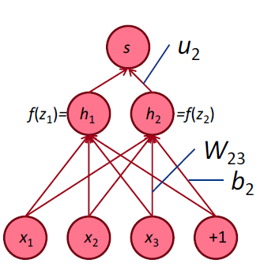
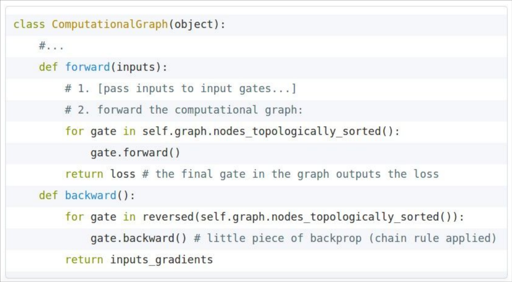
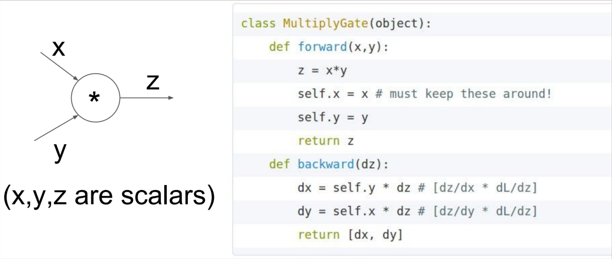

# CS224n-2019 学习笔记

-   结合每课时的课件、笔记与推荐读物等整理而成
-   作业部分将单独整理

## Lecture 04 Backpropagation and Computation Graphs 

??? abstract "Lecture Plan"

    1. Matrix gradients for our simple neural net and some tips
    2. Computation graphs and backpropagation
    3. Stuff you should know
    
      1. Regularization to prevent overfitting
      2. Vectorization
      3. Nonlinearities
      4. Initialization
      5. Optimizers
      6. Learning rates

### 1. Derivative wrt a weight matrix

-   让我们仔细看看计算 $\frac{\partial s}{\partial \textbf{W}}$
    -   再次使用链式法则

$$
\frac{\partial s}{\partial \boldsymbol{W}}=\frac{\partial s}{\partial \boldsymbol{h}} \frac{\partial \boldsymbol{h}}{\partial \boldsymbol{z}} \frac{\partial \boldsymbol{z}}{\partial \boldsymbol{W}}
$$

**Deriving gradients for backprop**

-   这个函数(从上次开始)
    -   $\frac{\partial s}{\partial W}=\delta \frac{\partial \mathbf{z}}{\partial W}=\boldsymbol{\delta} \frac{\partial}{\partial \boldsymbol{W}} \boldsymbol{W} \boldsymbol{x}+\boldsymbol{b}$
-   考虑单个权重 $W_{ij}$ 的导数
-    $W_{ij}$ 只对 $z_i$ 有贡献
    -   例如 $W_{23}$ 只对 $z_2$ 有贡献，对没有 $z_1$ 贡献

$$
\begin{aligned} \frac{\partial z_{i}}{\partial W_{i j}} &=\frac{\partial}{\partial W_{i j}} W_{i \cdot} x+b_{i} \\ &=\frac{\partial}{\partial W_{i j}} \sum_{k=1}^{d} W_{i k} x_{k}=x_{j} \end{aligned}
$$

-   对于单个 $W_{ij}$ 的导数

-   我们想要整个 **W** 的梯度，但是每种情况都是一样的
-   总体答案：外积

$$
\begin{array}{l}{\frac{\partial s}{\partial \boldsymbol{W}}=\boldsymbol{\delta}^{T} \quad \boldsymbol{x}^{T}} \\ {[n \times m] \quad[n \times 1][1 \times m]}\end{array}
$$

**Deriving gradients: Tips**

-   技巧1：仔细定义变量并跟踪它们的维度！
-   技巧2：链式法则！如果 $y = f(u)$ , $u = g(x)$，即 $y = f(g(x))$ 则
    -   $\frac{\partial \boldsymbol{y}}{\partial \boldsymbol{x}}=\frac{\partial \boldsymbol{y}}{\partial \boldsymbol{u}} \frac{\partial \boldsymbol{u}}{\partial \boldsymbol{x}}$
    -   要清楚哪些变量用于哪些计算
-   提示3：模型的最上面的softmax部分：首先考虑当 $c = y$ (正确的类)的导数 $f_c$ ，然后再考虑当 $c \neq y$ (所有不正确的类)的导数 $f_c$ 
-   技巧4：如果你被矩阵微积分搞糊涂了，请计算逐个元素的偏导数！
-   技巧5：使用形状约定。注意：到达隐藏层的错误消息 $\delta$ 具有与该隐藏层相同的维度

**Deriving gradients wrt words for window model**

-   到达并更新单词向量的梯度可以简单地分解为每个单词向量的梯度
-   令 $\nabla_{x} J=W^{T} \delta=\delta_{x_{w i n d o w}}$ ，当 $X_{\text { window }}=\left[\begin{array}{llll}{\mathrm{X}_{\text { museums }}} & {\mathrm{X}_{\text { in }}} & {\mathrm{X}_{\text { Paris }}} & {\mathrm{X}_{\text { are }}} & {\mathrm{X}_{\text { amazing }}}\end{array}\right]$ 
-   则得到

$$
\begin{align}
\delta_{\text {window}}=\left[\begin{array}{c}{\nabla_{x_{\text {museums}}}} \\ {\nabla_{x_{i n}}} \\ {\nabla_{x_{\text {Pare}}}} \\ {\nabla_{x_{\text {are}}}} \\ {\nabla_{x_{\text {amazing}}}}\end{array}\right] \in \mathbb{R}^{5 d}
\end{align}
$$

>   我们将根据梯度逐个更新对应的词向量矩阵中的词向量，所以实际上是对词向量矩阵的更新是非常稀疏的

**Updating word gradients in window model**

-   当我们将梯度更新到词向量中时，这将推动单词向量，使它们(在原则上)在确定命名实体时更有帮助。
-   例如，模型可以了解到，当看到 $x_{in}$ 是中心词之前的单词时，指示中心词是一个 **Location**

**A pitfall when retraining word vectors**

-   背景：我们正在训练一个单词电影评论情绪的逻辑回归分类模型。
-   在**训练数据**中，我们有“TV”和“telly”
-   在**测试数据**中我们有“television””
-   预先训练的单词向量有三个相似之处：

-   问题：当我们更新向量时会发生什么
-   回答：
    -   那些在**训练数据**中出现的单词会四处移动
        -   “TV”和“telly”
    -   **没有包含在训练数据**中的词汇保持原样
        -   “television”

**So what should I do?**

-   问题：应该使用可用的“预训练”字向量吗？
-   回答：
    -   几乎总应该是用
    -   他们接受了大量的数据训练，所以他们会知道训练数据中没有的单词，也会知道更多关于训练数据中的单词
    -   拥有上亿字的数据吗？好的，随机开始
-   问题：我应该更新(“fine tune”)我自己的单词向量吗？
-   回答：
    -   如果你只有一个小的训练数据集，不要训练词向量
    -   如果您有一个大型数据集，那么 **train = update = fine-tune** 词向量到任务可能会更好

**Backpropagation**

我们几乎已经向你们展示了反向传播

-   求导并使用(广义)链式法则

另一个技巧：在计算较低层的导数时，我们**重用**对较高层计算的导数，以使计算最小化

### 2. Computation Graphs and Backpropagation

我们把神经网络方程表示成一个图

$$
s = \textbf{u}^T\textbf{h} \\
\textbf{h} = f(\textbf{z}) \\
\textbf{z} = \textbf{W}\textbf{x}+\textbf{b} \\
\textbf{x} \quad \quad (\text{input})
$$
**Forward Propagation**

-   源节点：输入
-   内部节点：操作
-   边传递操作的结果

**Back Propagation**

-   沿着边回传**梯度**

**Backpropagation: Single Node**

$$
\textbf{h} = f(\textbf{z})
$$

-   节点接收“上游梯度”
-   目标是传递正确的“下游梯度”
-   每个节点都有**局部梯度** **local gradient**
    -   它输出的梯度是与它的输入有关
-   [downstream gradient] = [upstream gradient] x [local gradient]

**有多个输入的节点呢？**

$$
\textbf{z} = \textbf{W}\textbf{x}
$$

-   多个输入 $\to$ 多个局部梯度

**An Example**

**Forward**

**Backward**

$$
\begin{aligned}
\frac{\partial f}{\partial x} = 2 \\
\frac{\partial f}{\partial y} = 3 + 2 = 5 \\
\frac{\partial f}{\partial z} = 0
\end{aligned}
$$
**Gradients sum at outward branches**

上图中的 $\frac{\partial f}{\partial y}$ 的梯度的计算

$$
a = x + y \\
b = max(y,z) \\
f = ab \\
\frac{\partial f}{\partial y} = \frac{\partial f}{\partial a}\frac{\partial a}{\partial y} + \frac{\partial f}{\partial b}\frac{\partial b}{\partial y}
$$
**Node Intuitions**

-   $+$ “分发” 上游梯度给每个 $summand$
-   $max$ “路由” 上游梯度，将梯度发送到最大的方向
-   $*$ “切换”上游梯度

**Efficiency: compute all gradients at once**

-   不重复计算梯度

**Back-Prop in General Computation Graph**

1.  Fprop：按拓扑排序顺序访问节点
    -   计算给定父节点的节点的值
2.  Bprop：
    -   初始化输出梯度为 1
    -   以相反的顺序方位节点，使用节点的后继的梯度来计算每个节点的梯度
    -   $\{y_1,y_2,\dots,y_n\}$  是 $x$ 的后继
    -   $\frac{\partial z}{\partial x} = \sum_{i=1}^n \frac{\partial z}{\partial y_i}\frac{\partial y_i}{\partial x}$ 
    -   正确地说，Fprop 和 Bprop 的计算复杂度是一样的
    -   一般来说，我们的网络有固定的层结构，所以我们可以使用矩阵和雅可比矩阵

**Automatic Differentiation**

-   梯度计算可以从 Fprop 的符号表达式中自动推断
-   每个节点类型需要知道如何计算其输出，以及如何在给定其输出的梯度后计算其输入的梯度
-   现代DL框架(Tensorflow, Pytoch)为您做反向传播，但主要是令作者手工计算层/节点的局部导数

**Backprop Implementations**

为了计算反向传播，我们需要在前向传播时存储一些变量的值

**Gradient checking: Numeric Gradient**

-   对于 $h \approx 1e^{-4}$ ,  $f^{\prime}(x) \approx \frac{f(x+h)-f(x-h)}{2 h}$
-   易于正确实现
-   但近似且非常缓慢
    -   必须对模型的每个参数重新计算 $f$
-   用于检查您的实现
    -   在过去我们手写所有东西的时候，在任何地方都这样做是关键。
    -   现在，当把图层放在一起时，就不需要那么多了

**Summary**

-   我们已经掌握了神经网络的核心技术
-   反向传播：沿计算图递归应用链式法则
    -   [downstream gradient] = [upstream gradient] x [local gradient]
-   前向传递：计算操作结果并保存中间值
-   反向传递：应用链式法则计算梯度

**Why learn all these details about gradients?**

-   现代深度学习框架为您计算梯度
-   但是，当编译器或系统为您实现时，为什么要学习它们呢？
    -   了解引擎盖下发生了什么是有用的
-   反向传播并不总是完美地工作
    -   理解为什么对调试和改进模型至关重要
    -   参见[Karpathy文章](https://medium.com/@karpathy/yes-you-should-understandbackprop-
        e2f06eab496b) （在教学大纲中）
-   未来课程的例子:爆炸和消失的梯度

### 3. We have models with many params! Regularization!

-   实际上一个完整的损失函数包含了所有参数 $\theta$ 的正则化（下式中最后一项），例如L2正则化：

$$
J(\theta)=\frac{1}{N} \sum_{i=1}^{N}-\log \left(\frac{e^{f_{y_{i}}}}{\sum_{c=1}^{C} e^{f_{c}}}\right)+\lambda \sum_{k} \theta_{k}^{2}
$$

-   正则化(在很大程度上)可以防止在我们有很多特征时过拟合(或者是一个非常强大/深层的模型等等)

**“Vectorization”**

-   例如，对单词向量进行循环，而不是将它们全部连接到一个大矩阵中，然后将softmax权值与该矩阵相乘

-   1000 loops, best of 3: **639 μs** per loop
-   10000 loops, best of 3: **53.8 μs** per loop

-   (10x)更快的方法是使用 $C \times N$ 矩阵
-   总是尝试使用向量和矩阵，而不是循环
-   你也应该快速测试你的代码
-   简单来说：矩阵太棒了

**Non-linearities: The starting points**

tanh 只是一个重新放缩和移动的 sigmoid (两倍陡峭，[-1,1])
$$
\tanh (z)=2 \operatorname{logistic}(2 z)-1
$$
logistic 和 tanh 仍然被用于特定的用途，但不再是构建深度网络的默认值。

!!! tip "logistic和tanh"

    设计复杂的数学运算，指数计算会减慢速度。所以人们提出了 hard tanh，并且效果很不错。于是才有了 ReLU

**Non-linearities: The new world order**

-   为了建立一个前馈深度网络，你应该做的第一件事是ReLU——由于良好的**梯度回流**，训练速度快，性能好

!!! tip "ReLU"

    -   每个单元要么已经死了，要么在传递信息。
    -   非零范围内只有一个斜率，这一位置梯度十分有效的传递给了输入，所以模型非常有效的训练

**Parameter Initialization**

-   通常 **必须将权重初始化为小的随机值** （这样才能在激活函数的有效范围内， 即存在梯度可以使其更新）
    -   避免对称性妨碍学习/特殊化的
-   初始化隐含层偏差为0，如果权重为0，则输出(或重构)偏差为最优值(例如，均值目标或均值目标的反s形)
-   初始化 **所有其他权重** 为Uniform(–r, r)，选择使数字既不会太大也不会太小的 r
-   Xavier初始化中，方差与 fan-in $n_{in}$ (前一层尺寸)和 fan-out $n_{out}$(下一层尺寸)成反比

$$
\operatorname{Var}\left(W_{i}\right)=\frac{2}{n_{\mathrm{in}}+n_{\mathrm{out}}}
$$

**Optimizers**

-   通常，简单的SGD就可以了
    -   然而，要得到好的结果通常需要手动调整学习速度(下一张幻灯片)
-   对于更复杂的网络和情况，或者只是为了避免担心，更有经验的复杂的
    “自适应”优化器通常会令你做得更好，通过累积梯度缩放参数调整。
    -   这些模型给出了每个参数的学习速度
        -   Adagrad
        -   RMSprop
        -   Adam $\leftarrow$ 相当好,在许多情况下是安全的选择
        -   SparseAdam
        -   …

**Learning Rates**

-   你可以用一个固定的学习速度。从lr = 0.001开始？
    -   它必须是数量级的——尝试10的幂
    -   太大：模型可能会发散或不收敛
    -   太小：你的模型可能训练不出很好的效果
-   如果你在训练时降低学习速度，通常可以获得更好的效果
    -   手工：每隔 $k$ 个阶段(epoch)将学习速度减半
        -   epoch = 遍历一次数据 (打乱或采样的)
    -   通过一个公式： $l r=l r_{0} e^{-k t}, \text{for  epoch }t$ 
    -   还有更新奇的方法，比如循环学习率(q.v.)
-   更高级的优化器仍然使用学习率，但它可能是优化器缩小的初始速度——因此可能可以从较高的速度开始

## Reference

以下是学习本课程时的可用参考书籍：

[《基于深度学习的自然语言处理》](<https://item.jd.com/12355569.html>) （车万翔老师等翻译）

[《神经网络与深度学习》](<https://nndl.github.io/>)

以下是整理笔记的过程中参考的博客：

[斯坦福CS224N深度学习自然语言处理2019冬学习笔记目录](<https://zhuanlan.zhihu.com/p/59011576>) (课件核心内容的提炼，并包含作者的见解与建议)

[斯坦福大学 CS224n自然语言处理与深度学习笔记汇总](<https://zhuanlan.zhihu.com/p/31977759>) {>>这是针对note部分的翻译<<}