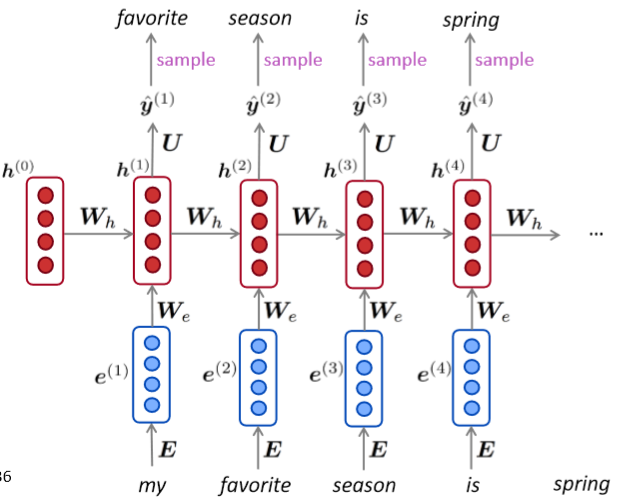

# CS224n-2019 学习笔记

-   结合每课时的课件、笔记与推荐读物等整理而成
-   作业部分将单独整理

## Lecture 06 The probability of a sentence Recurrent Neural Networks and Language Models

??? abstract "Overview"

    -   介绍一个新的NLP任务
        -   Language Modeling (motivate RNNs)
    -   介绍一个新的神经网络家族
        -   **Recurrent Neural Networks (RNNs)**

**Language Modeling**

-   语言建模的任务是预测下一个单词是什么。


-   更正式的说法是：给定一个单词序列 $\boldsymbol{x}^{(1)}, \boldsymbol{x}^{(2)}, \ldots, \boldsymbol{x}^{(t)}$ ，计算下一个单词 $x^{(t+1)}$ 的概率分布

$$
P\left(\boldsymbol{x}^{(t+1)} | \boldsymbol{x}^{(t)}, \ldots, \boldsymbol{x}^{(1)}\right)
$$


-   其中，$x^{(t+1)}$ 可以是词表中的任意单词 $V=\left\{\boldsymbol{w}_{1}, \ldots, \boldsymbol{w}_{|V|}\right\}$
-   这样做的系统称为 **Language Model** 语言模型
-   还可以将语言模型看作是一个将概率分配给一段文本的系统
-   例如，如果我们有一段文本 $x^{(1)},\dots,x^{(T)}$  则这段文本的概率(根据语言模型)为

$$
\begin{aligned} P\left(\boldsymbol{x}^{(1)}, \ldots, \boldsymbol{x}^{(T)}\right) &=P\left(\boldsymbol{x}^{(1)}\right) \times P\left(\boldsymbol{x}^{(2)} | \boldsymbol{x}^{(1)}\right) \times \cdots \times P\left(\boldsymbol{x}^{(T)} | \boldsymbol{x}^{(T-1)}, \ldots, \boldsymbol{x}^{(1)}\right) \\ &=\prod_{t=1}^{T} P\left(\boldsymbol{x}^{(t)} | \boldsymbol{x}^{(t-1)}, \ldots, \boldsymbol{x}^{(1)}\right) \end{aligned}
$$

-   语言模型提供的是 $\prod_{t=1}^{T} P\left(\boldsymbol{x}^{(t)} | \boldsymbol{x}^{(t-1)}, \ldots, \boldsymbol{x}^{(1)}\right)$

**n-gram Language Models**

$$
\text{the students opened their  ______}
$$

-   **<u>问题</u>** ：如何学习一个语言模型？
-   **<u>回答</u>** (pre-DeepLearning)：学习一个 n-gram 语言模型
-   <u>定义</u> ：n-gram 是 一个由n个连续单词组成的块
    -   **uni**grams: “the”, “students”, “opened”, ”their”
    -   **bi**grams: “the students”, “students opened”, “opened their”
    -   **tri**grams: “the students opened”, “students opened their” 
    -   **4-**grams: “the students opened their”
-   **想法** ：收集关于不同n-gram出现频率的统计数据，并使用这些数据预测下一个单词。

-   首先，我们做一个**简化假设**：$x^{(t+1)}$ 只依赖于前面的n-1个单词

$$
\begin{aligned}
P\left(\boldsymbol{x}^{(t+1)} | \boldsymbol{x}^{(t)}, \ldots, \boldsymbol{x}^{(1)}\right)
& =P\left(\boldsymbol{x}^{(t+1)} | \boldsymbol{x}^{(t)}, \ldots, \boldsymbol{x}^{(t-n+2)}\right)
\\ &=\frac{P\left(\boldsymbol{x}^{(t+1)}, \boldsymbol{x}^{(t)}, \ldots, \boldsymbol{x}^{(t-n+2)}\right)}{P\left(\boldsymbol{x}^{(t)}, \ldots, \boldsymbol{x}^{(t-n+2)}\right)}
\end{aligned}
$$

具体含义如下图所示


-   **<u>问题</u>** ：如何得到n-gram和(n-1)-gram的概率？
-   **<u>回答</u>** ：通过在一些大型文本语料库中计算它们(统计近似)

$$
\approx \frac{\operatorname{count}\left(\boldsymbol{x}^{(t+1)}, \boldsymbol{x}^{(t)}, \ldots, \boldsymbol{x}^{(t-n+2)}\right)}{\operatorname{count}\left(\boldsymbol{x}^{(t)}, \ldots, \boldsymbol{x}^{(t-n+2)}\right)}
$$

假设我们正在学习一个 **4-gram** 的语言模型


例如，假设在语料库中：

-   “students opened their” 出现了1000次
-   “students opened their books” 出现了400次
    -   $P(\text { books } | \text { students opened their })=0.4$
-    “students opened their exams” 出现了100次
    -   $P(\text { exams } | \text { students opened their })=0.1$
-   我们应该忽视上下文中的“proctor”吗？
    -   在本例中，上下文里出现了“proctor”，所以exams在这里的上下文中应该是比books概率更大的。

**Sparsity Problems with n-gram Language Models**


-   **<u>问题</u>** ：如果“students open their $w$” 从未出现在数据中，那么概率值为 0
-   **<u>(Partial)解决方案</u>** ：为每个 $w\in V$ 添加极小数 $\delta$ 。这叫做平滑。这使得词表中的每个单词都至少有很小的概率。
-   **<u>问题</u>** ：如果“students open their” 从未出现在数据中，那么我们将无法计算任何单词 $w$ 的概率值
-   **<u>(Partial)解决方案</u>** ：将条件改为“open their”。这叫做后退。

!!! note “Note”

    n 的增加使稀疏性问题变得更糟。一般情况下 n 不能大于5。

**Storage Problems with n-gram Language Models**


增加 n 或增加语料库都会增加模型大小

**n-gram Language Models in practice**

-   你可以在你的笔记本电脑上，在几秒钟内建立一个超过170万个单词库(Reuters)的简单的三元组语言模型
-   Reuters 是 商业和金融新闻的数据集


**<u>稀疏性问题</u>** ：概率分布的粒度不大。“today the company” 和 “today the bank”都是$\frac{4}{26}$ ，都只出现过四次

**Generating text with a n-gram Language Model**

-   还可以使用语言模型来生成文本


使用trigram运行以上生成过程时，会得到如下文本

```
today the price of gold per ton , while production of shoe lasts and shoe industry , the bank intervened just after it considered and rejected an imf demand to rebuild depleted european stocks , sept 30 end primary 76 cts a share .
```

**令人惊讶的是其具有语法但是是不连贯的。如果我们想要很好地模拟语言，我们需要同时考虑三个以上的单词。但增加 n 使模型的稀疏性问题恶化，模型尺寸增大。**

**How to build a neural Language Model?**

-   回忆一下语言模型任务
    -   输入：单词序列 $\boldsymbol{x}^{(1)}, \boldsymbol{x}^{(2)}, \ldots, \boldsymbol{x}^{(t)}$
    -   输出：下一个单词的概率分布 $P\left(\boldsymbol{x}^{(t+1)} | \boldsymbol{x}^{(t)}, \ldots, \boldsymbol{x}^{(1)}\right)$

window-based neural model 在第三讲中被用于NER问题


**A fixed-window neural Language Model**


使用和NER问题中同样网络结构


超越 n-gram 语言模型的**改进**

-   没有稀疏性问题
-   不需要观察到所有的n-grams

存在的问题

-   固定窗口太小
-   扩大窗口就需要扩大权重矩阵 $W$
-   窗口再大也不够用
-   $x^{(1)}$ 和 $x^{(2)}$ 乘以完全不同的权重。输入的处理**不对称**。

我们需要一个神经结构，可以处理任何长度的输入

**Recurrent Neural Networks (RNN)**

<u>核心想法</u>：重复使用**相同**的权重矩阵 $W$


RNN的**优点**

-   可以处理**任意长度**的输入
-   步骤 t 的计算(理论上)可以使用**许多步骤前**的信息
-   **模型大小不会**随着输入的增加而**增加**
-   在每个时间步上应用相同的权重，因此在处理输入时具有**对称性**

RNN的**缺点**

-   递归计算速度**慢**
-   在实践中，很难从**许多步骤前**返回信息
-   后面的课程中会详细介绍

**Training a RNN Language Model**

-   获取一个较大的文本语料库，该语料库是一个单词序列
-   输入RNN-LM；计算每个步骤 t 的输出分布
    -   即预测到目前为止给定的每个单词的概率分布
-   步骤 t 上的损失函数为预测概率分布 $\hat{\boldsymbol{y}}^{(t)}$ 与真实下一个单词 ${\boldsymbol{y}}^{(t)}$ ($x^{(t+1)}$ 的独热向量)之间的交叉熵

$$
J^{(t)}(\theta)=C E\left(\boldsymbol{y}^{(t)}, \hat{\boldsymbol{y}}^{(t)}\right)=-\sum_{w \in V} \boldsymbol{y}_{w}^{(t)} \log \hat{\boldsymbol{y}}_{w}^{(t)}=-\log \hat{\boldsymbol{y}}_{\boldsymbol{x}_{t+1}}^{(t)}
$$

-   将其平均，得到整个培训集的**总体损失**

$$
J(\theta)=\frac{1}{T} \sum_{t=1}^{T} J^{(t)}(\theta)=\frac{1}{T} \sum_{t=1}^{T}-\log \hat{\boldsymbol{y}}_{\boldsymbol{x}_{t+1}}^{(t)}
$$


$$
J^{(1)}(\theta)+J^{(2)}(\theta)+J^{(3)}(\theta)+J^{(4)}(\theta)+\ldots=J(\theta)=\frac{1}{T} \sum_{t=1}^{T} J^{(t)}(\theta)
$$

-   然而：计算**整个语料库** $\boldsymbol{x}^{(1)}, \ldots, \boldsymbol{x}^{(T)}$的损失和梯度太昂贵了

$$
J(\theta)=\frac{1}{T} \sum_{t=1}^{T} J^{(t)}(\theta)
$$

-   在实践中，我们通常将 $\boldsymbol{x}^{(1)}, \ldots, \boldsymbol{x}^{(T)}$ 看做一个**句子**或是**文档**
-   <u>回忆</u> ：随机梯度下降允许我们计算小块数据的损失和梯度，并进行更新。
-   计算一个句子的损失$J(\theta)$(实际上是一批句子)，计算梯度和更新权重。重复上述操作。

**Backpropagation for RNNs**


**<u>问题</u>** ：关于**重复的**权重矩阵 $W_h$ 的偏导数 $J^{(t)}(\theta)$ 

**<u>回答</u>** ：重复权重的梯度是每次其出现时的梯度的总和

$$
\frac{\partial J^{(t)}}{\partial \boldsymbol{W}_{\boldsymbol{h}}}=\sum_{i=1}^{t}\left.\frac{\partial J^{(t)}}{\partial \boldsymbol{W}_{\boldsymbol{h}}}\right|_{(i)}
$$

**Multivariable Chain Rule**


对于一个多变量函数 $f(x,y)$ 和两个单变量函数 $x(t)$ 和 $y(t)$ ，其链式法则如下：

$$
\frac{d}{d t} f(x(t), y(t))=\frac{\partial f}{\partial x} \frac{d x}{d t}+\frac{\partial f}{\partial y} \frac{d y}{d t}
$$

**Backpropagation for RNNs: Proof sketch**


**Backpropagation for RNNs**


-   **<u>问题</u>** ： 如何计算？
-   **<u>回答</u>** ：反向传播的时间步长 $i=t,\dots,0$ 。累加梯度。这个算法叫做“**backpropagation through time**”

**Generating text with a RNN Language Model**

就像n-gram语言模型一样，您可以使用RNN语言模型通过**重复采样**来**生成文本**。采样输出是下一步的输入。



-   相比n-gram更流畅，语法正确，但总体上仍然很不连贯
-   食谱的例子中，生成的文本并没有记住文本的主题是什么
-   哈利波特的例子中，甚至有体现出了人物的特点，并且引号的开闭也没有出现问题
    -   也许某些神经元或者隐藏状态在跟踪模型的输出是否在引号中

-   RNN是否可以和手工规则结合？
    -   例如Beam Serach，但是可能很难做到

**Evaluating Language Models**

-   标准语言模型评估指标是 **perplexity** 困惑度


-   这等于交叉熵损失 $J(\theta)$ 的指数

$$
=\prod_{t=1}^{T}\left(\frac{1}{\hat{y}_{x_{t+1}}^{(t)}}\right)^{1 / T}=\exp \left(\frac{1}{T} \sum_{t=1}^{T}-\log \hat{\boldsymbol{y}}_{\boldsymbol{x}_{t+1}}^{(t)}\right)=\exp (J(\theta))
$$

-   低困惑度是更好的

**RNNs have greatly improved perplexity**


**Why should we care about Language Modeling?**

-   语言模型是一项**基准测试**任务，它帮助我们**衡量**我们在理解语言方面的**进展**
    -   生成下一个单词，需要语法，句法，逻辑，推理，现实世界的知识等
-   语言建模是许多NLP任务的**子组件**，尤其是那些涉及**生成文本**或**估计文本概率**的任务
    -   预测性打字
    -   语音识别
    -   手写识别
    -   拼写/语法纠正
    -   作者识别
    -   机器翻译
    -   摘要
    -   对话
    -   等等

**Recap**

-   语言模型：**预测下一个单词**的系统
-   递归神经网络：一系列神经网络
    -   采用任意长度的顺序输入
    -   在每一步上应用相同的权重
    -   可以选择在每一步上生成输出
-   递归神经网络$\neq$语言模型
-   我们已经证明，RNNs是构建LM的一个很好的方法。
-   但RNNs的用处要大得多!

**RNNs can be used for tagging** 

e.g. <u>part-of-speech tagging</u>, named entity recognition


**RNNs can be used for sentence classification**

e.g. <u>sentiment classification</u>


如何计算句子编码

-   使用最终隐层状态
-   使用所有隐层状态的逐元素最值或均值

**RNNs can be used as an encoder module** 

e.g. <u>question answering</u>, machine translation, many other tasks!


Encoder的结构在NLP中非常常见

**RNN-LMs can be used to generate text** 

e.g. <u>speech recognition</u>, machine translation, summarization


这是一个条件语言模型的示例。我们使用语言模型组件，并且最关键的是，我们根据条件来调整它

稍后我们会更详细地看到机器翻译。

**A note on terminology**

本课提到的RNN是 ““vanilla RNN”

下节课将会学习GRU和LSTM以及多层RNN

本课程结束时，你会理解类似“stacked bidirectional LSTM with residual connections and self-attention”的短语


## Notes 05 Language Models, RNN, GRU and LSTM 

??? abstract "Keyphrases"

    Language Models. RNN. Bi-directional RNN. Deep RNN. GRU. LSTM.


## Reference

以下是学习本课程时的可用参考书籍：

[《基于深度学习的自然语言处理》](<https://item.jd.com/12355569.html>) （车万翔老师等翻译）

[《神经网络与深度学习》](<https://nndl.github.io/>)

以下是整理笔记的过程中参考的博客：

[斯坦福CS224N深度学习自然语言处理2019冬学习笔记目录](<https://zhuanlan.zhihu.com/p/59011576>) (课件核心内容的提炼，并包含作者的见解与建议)

[斯坦福大学 CS224n自然语言处理与深度学习笔记汇总](<https://zhuanlan.zhihu.com/p/31977759>) {>>这是针对note部分的翻译<<}