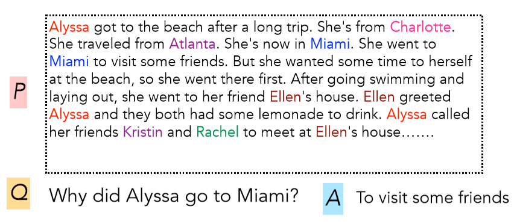

# CS224n-2019 学习笔记

-   结合每课时的课件、笔记与推荐读物等整理而成
-   作业部分将单独整理

## Lecture 10 Question Answering and the Default Final Project

??? abstract "Lecture Plan"

    1.  Final final project notes, etc. 
    2.  Motivation/History 
    3.  The SQuADdataset 
    4.  The Stanford Attentive Reader model 
    5.  BiDAF 
    6.  Recent, more advanced architectures 
    7.  ELMoa nd BERT preview

**Project writeup** 

-   Abstract Introduction
-   Prior related work 
-   Model
-   Data
-   Experiments
-   Results
-   Analysis & Conclusion

在谷歌中检索谁是澳大利亚第三任总理，可以获得答案。

技术说明：这是从web页面中提取的“特性片段”回答，而不是使用(结构化的)谷歌知识图(以前称为Freebase)回答的问题。

我们今天要谈论的就是这样的问题，而不是基于结构化数据存储的问答。

### 2. Motivation: Question answering 

-   拥有大量的全文文档集合，例如网络，简单地返回相关文档的作用是有限的
-   相反，我们经常想要得到问题的答案
-   尤其是在移动设备上
-   或是使用像Alexa、Google assistant这样的数字助理设备。
-   我们可以把它分解成两部分
    -   查找(可能)包含答案的文档
        -   可以通过传统的信息检索/web搜索处理
        -   (下个季度我将讲授cs276，它将处理这个问题
    -   在一段或一份文件中找到答案
        -   这个问题通常被称为阅读理解
        -   这就是我们今天要关注的

**A Brief History of Reading Comprehension** 

-   许多早期的NLP工作尝试阅读理解
    -    Schank, Abelson, Lehnert et al. c. 1977 –“Yale A.I. Project” 
-   由Lynette Hirschman在1999年复活
    -   NLP系统能回答三至六年级学生的人类阅读理解问题吗?简单的方法尝试
-    Chris Burges于2013年通过 MCTest 又重新复活 RC
    -   再次通过简单的故事文本回答问题
-   2015/16年，随着大型数据集的产生，闸门开启，可以建立监督神经系统
    -   Hermann et al. (NIPS 2015) DeepMind CNN/DM dataset
    -   Rajpurkaret al. (EMNLP 2016) **SQuAD**
    -   MS MARCO, TriviaQA, RACE, NewsQA, NarrativeQA, …

**Machine Comprehension (Burges 2013)** 

“一台机器能够理解文本的段落，对于大多数母语使用者能够正确回答的关于文本的任何问题，该机器都能提供一个字符串，这些说话者既能回答该问题，又不会包含与该问题无关的信息。”

**MCTestReading Comprehension**

**A Brief History of Open-domain Question Answering** 

-   Simmons et al. (1964) 首先探索了如何基于匹配问题和答案的依赖关系解析，从说明性文本中回答问题
-   Murax(Kupiec1993) 旨在使用IR和浅层语言处理在在线百科全书上回答问题
-   NIST TREC QA track 始于1999年，首次严格调查了对大量文档的事实问题的回答
-   IBM的冒险！System (DeepQA, 2011)提出了一个版本的问题;它使用了许多方法的集合
-   DrQA(Chen et al. 2016)采用IR结合神经阅读理解，将深度学习引入开放领域的QA

**Turn-of-the Millennium Full NLP QA**

[architecture of LCC (Harabagiu/Moldovan) QA system, circa 2003] 复杂的系统，但他们在“事实”问题上做得相当好

-   非常复杂的多模块多组件的系统
    -   首先对问题进行解析，使用手写的语义规范化规则，将其转化为更好的语义形式
    -   在通过问题类型分类器，找出问题在寻找的语义类型
    -   信息检索系统找到可能包含答案的段落，排序后进行选择
    -   NER识别候选实体再进行判断
-   这样的QA系统在特定领域很有效：Factoid Question Answering 针对实体的问答

### 3. Stanford Question Answering Dataset (SQuAD)

-   Passage 是来自维基百科的一段文本，系统需要回答问题，在文章中找出答案

-   答案必须是文章中的一系列单词序列，也就是提取式问答
-   100k examples

**SQuAD evaluation, v1.1** 

-   作者收集了3个黄金答案

-   系统在两个指标上计算得分

    -   精确匹配：1/0的准确度，您是否匹配三个答案中的一个
    -   F1：将系统和每个答案都视为词袋，并评估

    $$
    \text{Precision} =\frac{T P}{T P+F P}, \text { Recall }=\frac{T P}{T P+F N}, \text { harmonic mean } \mathrm{F} 1=\frac{2 P R}{P+R}
    $$

    -   分数是(宏观)平均每题F1分数

-   F1测量被视为更可靠的指标，作为主要指标使用

    -   它不是基于选择是否和人类选择的跨度完全相同，人类选择的跨度容易受到各种影响，包括换行

-   这两个指标忽视标点符号和冠词(a, an, the only)

## Reference

以下是学习本课程时的可用参考书籍：

[《基于深度学习的自然语言处理》](<https://item.jd.com/12355569.html>) （车万翔老师等翻译）

[《神经网络与深度学习》](<https://nndl.github.io/>)

以下是整理笔记的过程中参考的博客：

[斯坦福CS224N深度学习自然语言处理2019冬学习笔记目录](<https://zhuanlan.zhihu.com/p/59011576>) (课件核心内容的提炼，并包含作者的见解与建议)

[斯坦福大学 CS224n自然语言处理与深度学习笔记汇总](<https://zhuanlan.zhihu.com/p/31977759>) {>>这是针对note部分的翻译<<}