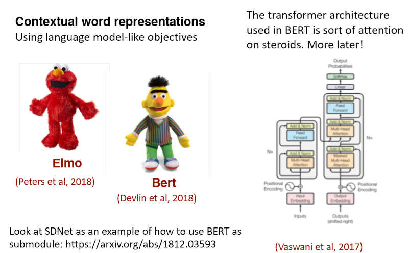

# CS224n-2019 学习笔记

-   结合每课时的课件、笔记与推荐读物等整理而成
-   作业部分将单独整理

## Lecture 10 Question Answering and the Default Final Project

??? abstract "Lecture Plan"

    1.  Final final project notes, etc. 
    2.  Motivation/History 
    3.  The SQuADdataset 
    4.  The Stanford Attentive Reader model 
    5.  BiDAF 
    6.  Recent, more advanced architectures 
    7.  ELMo and BERT preview

**Project writeup** 

-   Abstract Introduction
-   Prior related work 
-   Model
-   Data
-   Experiments
-   Results
-   Analysis & Conclusion

在谷歌中检索谁是澳大利亚第三任总理，可以获得答案。

技术说明：这是从web页面中提取的“特性片段”回答，而不是使用(结构化的)谷歌知识图(以前称为Freebase)回答的问题。

我们今天要谈论的就是这样的问题，而不是基于结构化数据存储的问答。

### 2. Motivation: Question answering 

-   拥有大量的全文文档集合，例如网络，简单地返回相关文档的作用是有限的
-   相反，我们经常想要得到问题的答案
-   尤其是在移动设备上
-   或是使用像Alexa、Google assistant这样的数字助理设备。
-   我们可以把它分解成两部分
    -   查找(可能)包含答案的文档
        -   可以通过传统的信息检索/web搜索处理
        -   (下个季度我将讲授cs276，它将处理这个问题
    -   在一段或一份文件中找到答案
        -   这个问题通常被称为阅读理解
        -   这就是我们今天要关注的

**A Brief History of Reading Comprehension** 

-   许多早期的NLP工作尝试阅读理解
    -    Schank, Abelson, Lehnert et al. c. 1977 –“Yale A.I. Project” 
-   由Lynette Hirschman在1999年复活
    -   NLP系统能回答三至六年级学生的人类阅读理解问题吗?简单的方法尝试
-    Chris Burges于2013年通过 MCTest 又重新复活 RC
    -   再次通过简单的故事文本回答问题
-   2015/16年，随着大型数据集的产生，闸门开启，可以建立监督神经系统
    -   Hermann et al. (NIPS 2015) DeepMind CNN/DM dataset
    -   Rajpurkaret al. (EMNLP 2016) **SQuAD**
    -   MS MARCO, TriviaQA, RACE, NewsQA, NarrativeQA, …

**Machine Comprehension (Burges 2013)** 

“一台机器能够理解文本的段落，对于大多数母语使用者能够正确回答的关于文本的任何问题，该机器都能提供一个字符串，这些说话者既能回答该问题，又不会包含与该问题无关的信息。”

**MCTestReading Comprehension**

**A Brief History of Open-domain Question Answering** 

-   Simmons et al. (1964) 首先探索了如何基于匹配问题和答案的依赖关系解析，从说明性文本中回答问题
-   Murax(Kupiec1993) 旨在使用IR和浅层语言处理在在线百科全书上回答问题
-   NIST TREC QA track 始于1999年，首次严格调查了对大量文档的事实问题的回答
-   IBM的冒险！System (DeepQA, 2011)提出了一个版本的问题;它使用了许多方法的集合
-   DrQA(Chen et al. 2016)采用IR结合神经阅读理解，将深度学习引入开放领域的QA

**Turn-of-the Millennium Full NLP QA**

[architecture of LCC (Harabagiu/Moldovan) QA system, circa 2003] 复杂的系统，但他们在“事实”问题上做得相当好

-   非常复杂的多模块多组件的系统
    -   首先对问题进行解析，使用手写的语义规范化规则，将其转化为更好的语义形式
    -   在通过问题类型分类器，找出问题在寻找的语义类型
    -   信息检索系统找到可能包含答案的段落，排序后进行选择
    -   NER识别候选实体再进行判断
-   这样的QA系统在特定领域很有效：Factoid Question Answering 针对实体的问答

### 3. Stanford Question Answering Dataset (SQuAD)

-   Passage 是来自维基百科的一段文本，系统需要回答问题，在文章中找出答案

-   答案必须是文章中的一系列单词序列，也就是提取式问答
-   100k examples

**SQuAD evaluation, v1.1** 

-   作者收集了3个黄金答案

-   系统在两个指标上计算得分

    -   精确匹配：1/0的准确度，您是否匹配三个答案中的一个
    -   F1：将系统和每个答案都视为词袋，并评估

    $$
    \text{Precision} =\frac{T P}{T P+F P}, \text { Recall }=\frac{T P}{T P+F N}, \text { harmonic mean } \mathrm{F} 1=\frac{2 P R}{P+R}
    $$

    -   Precision 和 Recall 的调和平均值
    -   分数是(宏观)平均每题F1分数

-   F1测量被视为更可靠的指标，作为主要指标使用

    -   它不是基于选择是否和人类选择的跨度完全相同，人类选择的跨度容易受到各种影响，包括换行
    -   在单次级别匹配不同的答案

-   这两个指标忽视标点符号和冠词(a, an, the only)

**SQuAD2.0** 

-   SQuAD1.0的一个缺陷是，所有问题都有答案的段落
-   系统(隐式地)排名候选答案并选择最好的一个，这就变成了一种排名任务
-   你不必判断一个span是否回答了这个问题
-   SQuAD2.0中 1/3 的训练问题没有回答，大约 1/2 的开发/测试问题没有回答
    -   对于No Answer examples, no answer 获得的得分为1，对于精确匹配和F1，任何其他响应的得分都为0
-   SQuAD2.0最简单的系统方法
    -   对于一个 span 是否回答了一个问题有一个阈值评分
-   或者您可以有第二个确认回答的组件
    -   类似 自然语言推理 或者 答案验证

Example

得分高的系统并不能真正理解人类语言！

**Good systems are great, but still basic NLU errors**

系统没有真正了解一切，仍然在做一种匹配问题

**SQuAD limitations**

-   SQuAD 也有其他一些关键限制
    -   只有 span-based 答案(没有 yes/no，计数，隐式的为什么)
    -   问题是看着段落构造的
        -   通常不是真正的信息需求
        -   一般来说，问题和答案之间的词汇和句法匹配比IRL更大
        -   问题与文章高度重叠，无论是单词还是句法结构
    -   除了共同参照，几乎没有任何多事实/句子推理
-   不过这是一个目标明确，结构良好的干净的数据集
    -   它一直是QA dataset上最常用和最具竞争力的数据集
    -   它也是构建行业系统的一个有用的起点（尽管域内数据总是很有帮助！）
    -   并且我们正在使用它

### 4. Stanford Attentive Reader

[Chen, Bolton, & Manning 2016] [Chen, Fisch, Weston & Bordes2017] DrQA [Chen 2018]

-   展示了一个最小的，非常成功的阅读理解和问题回答架构
-   后来被称为 the Stanford Attentive Reader

首先将问题用向量表示

-   对问题中的每个单词，查找其词嵌入
-   输入到双向LSTM中并将最终的 hidden state 拼接

再处理文章

-   查找每个单词的词嵌入并输入到双向LSTM中
-   使用双线性注意力，将每个LSTM的表示(LSTM的两个隐藏状态的连接)与问题表示做运算，获得了不同位置的注意力，从而获得答案的开始位置，再以同样方式获得答案的结束位置
    -   为了在文章中找到答案，使用问题的向量表示，来解决答案在什么位置使用注意力

**Stanford Attentive Reader++**

整个模型的所有参数都是端到端训练的，训练的目标是开始位置与结束为止的准确度，优化有两种方式

问题部分

-   不止是利用最终的隐藏层状态，而是使用所有隐层状态的加权和
    -   使用一个可学习的向量 $\boldsymbol{w}$ 与 每个时间步的隐层状态相乘
-   深层LSTM

文章部分

文章中每个token的向量表示由一下部分连接而成

-   词嵌入(GloVe300d)
-   词的语言特点:POS &NER 标签，one-hot 向量
-   词频率(unigram概率)
-   精确匹配:这个词是否出现在问题
    -   三个二进制的特征： exact, uncased, lemma
-   对齐问题嵌入(“车”与“汽车”)

$$
f_{\text {align}}\left(p_{i}\right)=\sum_{j} a_{i, j} \mathbf{E}\left(q_{j}\right) \quad q_{i, j}=\frac{\exp \left(\alpha\left(\mathbf{E}\left(p_{i}\right)\right) \cdot \alpha\left(\mathbf{E}\left(q_{j}\right)\right)\right)}{\sum_{j^{\prime}} \exp \left(\alpha\left(\mathbf{E}\left(p_{i}\right)\right) \cdot \alpha\left(\mathbf{E}\left(q_{j}^{\prime}\right)\right)\right)}
$$

-   单词相似度的语义匹做得更好

### 5. BiDAF: Bi-Directional Attention Flow for Machine Comprehension 

(Seo, Kembhavi, Farhadi, Hajishirzi, ICLR 2017)

-   多年来，BiDAF architecture有许多变体和改进，但其核心思想是 **the Attention Flow layer**

-   **Idea** ：attention 应该双向流动——从上下文到问题，从问题到上下文
-   令相似矩阵( $\boldsymbol{w}$ 的维数为6d)

$$
\boldsymbol{S}_{i j}=\boldsymbol{w}_{\mathrm{sim}}^{T}\left[\boldsymbol{c}_{i} ; \boldsymbol{q}_{i} ; \boldsymbol{c}_{i} \circ \boldsymbol{q}_{j}\right] \in \mathbb{R}
$$

-   Context-to-Question (C2Q) 注意力 (哪些查询词与每个上下文词最相关)

$$
\begin{aligned} \alpha^{i} &=\operatorname{softmax}\left(\boldsymbol{S}_{i, :}\right) \in \mathbb{R}^{M} \quad \forall i \in\{1, \ldots, N\} \\ \boldsymbol{a}_{i} &=\sum_{j=1}^{M} \alpha_{j}^{i} \boldsymbol{q}_{j} \in \mathbb{R}^{2 h} \quad \forall i \in\{1, \ldots, N\} \end{aligned}
$$

-   Question-to-Context (Q2C) 注意力 (上下文中最重要的单词相对于查询的加权和——通过max略有不对称)
    -   通过max取得上下文中的每个单词对于问题的相关度

$$
\begin{aligned} \boldsymbol{m}_{i} &=\max _{j} \boldsymbol{S}_{i j} \in \mathbb{R} \quad \forall i \in\{1, \ldots, N\} \\ \beta &=\operatorname{softmax}(\boldsymbol{m}) \in \mathbb{R}^{N} \\ \boldsymbol{c}^{\prime} &=\sum_{i=1}^{N} \beta_{i} \boldsymbol{c}_{i} \in \mathbb{R}^{2 h} \end{aligned}
$$

-   对于文章中的每个位置，BiDAF layer的输出为

$$
\boldsymbol{b}_{i}=\left[\boldsymbol{c}_{i} ; \boldsymbol{a}_{i} ; \boldsymbol{c}_{i} \circ \boldsymbol{a}_{i} ; \boldsymbol{c}_{i} \circ \boldsymbol{c}^{\prime}\right] \in \mathbb{R}^{8 h} \quad \forall i \in\{1, \ldots, N\}
$$

-   然后有“modelling”层
    -   文章通过另一个深(双层)BiLSTM
-   然后回答跨度选择更为复杂
    -   Start：通过BiDAF 和 modelling 的输出层连接到一个密集的全连接层然后softmax
    -   End：把 modelling 的输出 $M$ 通过另一个BiLSTM得到 $M_2$ ，然后再与BiDAF layer连接，并通过密集的全连接层和softmax

### 6. Recent, more advanced architectures 

2016年、2017年和2018年的大部分工作都采用了越来越复杂的架构，其中包含了多种注意力变体——通常可以获得很好的任务收益

人们一直在尝试不同的 Attention 

**Dynamic CoattentionNetworks for Question Answering**

(CaimingXiong, Victor Zhong, Richard Socher ICLR 2017) 

-   缺陷：问题具有独立于输入的表示形式
-   一个全面的QA模型需要相互依赖

**Coattention Encoder**

-   Coattention layer 再次提供了一个上下文之间的双向关注问题
-   然而，coattention包括两级注意力计算
    -   关注那些本身就是注意力输出的表象
-   我们使用C2Q注意力分布 $\alpha _i$ ，求得Q2C注意力输出 $\boldsymbol{b}_j$ 的加权和。这给了我们第二级注意力输出 $\boldsymbol{s}_{i}$

$$
\boldsymbol{s}_{i}=\sum_{j=1}^{M+1} \alpha_{j}^{i} \boldsymbol{b}_{j} \in \mathbb{R}^{l} \quad \forall i \in\{1, \ldots, N\}
$$

**FusionNet(Huang, Zhu, Shen, Chen 2017)**

Attention functions 

MLP(Additive)形式

$$
S_{i j}=s^{T} \tanh \left(W_{1} c_{i}+W_{2} q_{j}\right)
$$

-   Space: O(mnk), W is kxd

Bilinear (Product) form

$$
\begin{array}{c}{S_{i j}=c_{i}^{T} W q_{j}} \\ {S_{i j}=c_{i}^{T} U^{T} V q_{j}} \\ {S_{i j}=c_{i}^{T} W^{T} D W q_{j}} \\ 
S_{i j}=\operatorname{Relu}\left(c_{i}^{T} W^{T}\right) \operatorname{DRelu}\left(W q_{j}\right) \end{array}
$$

-   Smaller space, Non-linearity
-   Space: O((m+n)k)

**Multi-level inter-attention**

经过多层次的inter-attention，使用RNN、self-attention 和另一个RNN得到上下文的最终表示 $\left\{\boldsymbol{u}_{i}^{C}\right\}$

### 7. ELMo and BERT preview

## Note 07 Question Answering

### 1 Dynamic Memory Networks for Question Answering over Text and Images

QA 系统的概念是直接从文档、对话、在线搜索等中提取信息(有时是段落，或是单词的范围)，以满足用户的信息需求。QA系统不需要用户通读整个文档，而是倾向于给出一个简短的答案。现在，QA系统可以很容易地与其他NLP系统(如聊天机器人)结合起来，有些QA系统甚至超越了文本文档的搜索，可以从一组图片中提取信息。

有很多类型的问题，其中最简单的是 Factoid Question Answering 事实类问题回答。它包含的问题看起来像““The symbol for mercuric oxide is?” “Which NFL team represented the AFC at Super Bowl 50?”。当然还有其他类型的问题，如数学问题(“2+3=?”)、逻辑问题，这些问题需要广泛的推理(而且没有背景信息)。然而，我们可以说在人们的日常生活中，寻求信息的事实类问题回答是最常见的问题。

事实上，大多数NLP问题都可以看作是一个问答问题，其范式很简单：我们发出一个查询，然后机器提供一个响应。通过阅读文档或一组指令，智能系统应该能够回答各种各样的问题。我们可以要求句子的POS标签，我们可以要求系统用不同的语言来响应。因此，很自然地，我们想设计一个可以用于一般QA的模型。

为了实现这一目标，我们面临两大障碍。许多NLP任务使用不同的架构，如TreeLSTM (Tai et al., 2015)用于情绪分析，Memory Network (Weston et al., 2015) 用于回答问题，以及双向LSTM-CRF  (Huang et al., 2015) 用于词性标注。第二个问题是全面的多任务学习往往非常困难，迁移学习仍然是当前人工智能领域(计算机视觉、强化学习等)神经网络架构的主要障碍。

我们可以使用NLP的共享体系结构来解决第一个问题：动态内存网络(DMN)，这是一种为一般QA任务设计的体系结构。QA很难，部分原因是阅读一段很长的文字很难。即使对于人类，我们也不能在你的工作记忆中存储一个很长的文档。

#### 1.1 Input Module

将DMN分为多个模块。首先我们来看输入模块。输入模块以单词序列 $T_I$ 作为输入，输出事实表示序列 $T_C$ 。如果输出是一个单词列表，我们有 $T_C = T_I$ 。如果输出是一个句子列表，我们有 $T_C$ 作为句子的数量， $T_I$ 作为句子中的单词数量。我们使用一个简单的GRU来读取其中的句子，即隐藏状态 $h_{t}=\operatorname{GRU}\left(x_{t}, h_{t-1}\right)$ ，其中$x_{t}=L\left[w_{t}\right]$ ， $L$ 为嵌入矩阵，$w_t$ 为 $t$ 时刻的单词，我们使用Bi-GRU进一步改进，如下图所示。

#### 1.2 Question Module 

我们也使用标准的GRU来读取问题(使用嵌入矩阵$L : q_{t}=\operatorname{GRU}\left(L\left[w_{t}^{Q}\right], q_{t-1}\right)$)，但是问题模块的输出是问题的编码表示。

#### 1.3 Episodic Memory Module 

动态记忆网络的一个显著特征是情景记忆模块，它在输入序列上运行多次，每次关注输入的不同事实子集。

它使用Bi-GRU实现这一点，Bi-GRU接收输入模块传入的句子级别表示的输入，并生成情景记忆表示。

我们将情景记忆表征表示为 $m^i$ ，情景表征(由注意机制输出)表示为 $e^i$ 。情景记忆表示使用 $m^0 = q$ 初始化，然后继续使用 $\mathrm{GRU} : m^{i}=\mathrm{GRU}\left(e^{i}, m^{i-1}\right)$ 。使用来自输入模块的隐藏状态输出更新情景表征，如下所示，其中 $g$ 是注意机制
$$
\begin{aligned} h_{t}^{i} &=g_{t}^{i} \operatorname{GRU}\left(c_{t}, h_{t-1}^{i}\right)+\left(1-g_{t}^{i}\right) h_{t-1}^{i} \\ e_{i} &=h_{T_{\mathrm{C}}}^{i} \end{aligned}
$$
注意向量 $g$ 的计算方法有很多，但是在原始的DMN论文(Kumar et al. 2016)中，我们发现以下公式是最有效的
$$
\begin{array}{l}
g_{t}^{i}=G\left(c_{t}, m^{i-1}, q\right) \\
{G(c, m, q)=\sigma\left(W^{(2)} \tanh \left(W^{(1)} z(c, m, q)+b^{(1)}\right)+b^{(2)}\right)} \\ 
{z(c, m, q)=\left[c, m, q, c \circ q, c \circ m,|c-q|,|c-m|, c^{T} W^{(b)} q_{,} c^{T} W^{(b)} m\right]}\end{array}
$$
这样，如果句子与问题或记忆有关，这个模块中的门就会被激活。在第 $i$ 遍中，如果总结不足以回答问题，我们可以在第 $i +1$ 遍中重复输入序列。例如，考虑这样一个问题“Where is the football?”以及输入序列“John kicked the football”和“John was in the field”。在这个例子中，John和football可以在一个pass中连接，然后John和field可以在第二个pass中连接，这样网络就可以根据这两个信息进行传递推断。

#### 1.4 Answer Module 

答案模块是一个简单的GRU解码器，它接收问题模块、情景记忆模块的输出，并输出一个单词(或者通常是一个计算结果)。其工作原理如下:
$$
\begin{aligned} y_{t} &=\operatorname{softmax}\left(W^{(a)} a_{t}\right) \\ a_{t} &=\operatorname{GRU}\left(\left[y_{t-1}, q\right], a_{t-1}\right) \end{aligned}
$$

#### 1.5 Experiments

通过实验可以看出，DMN在babl问答任务中的表现优于MemNN，在情绪分析和词性标注方面也优于其他体系结构。情景记忆需要多少个情景？答案是，任务越难，通过的次数就越多。多次传递还可以让网络真正理解句子，只关注最后一项任务的相关部分，而不是只对单词嵌入的信息做出反应。

关键思想是模块化系统，您可以通过更改输入模块来允许不同类型的输入。例如，如果我们用一个基于卷积神经网络的模块替换输入模块，那么这个架构就可以处理一个称为可视化问题回答(VQA)的任务。它也能够在这项任务中胜过其他模型。

#### 1.6 Summary 

自2015年以来，寻找能够解决所有问题的通用体系结构的热情略有减退，但在一个领域进行训练并推广到其他领域的愿望有所增强。要理解更高级的问答模块，读者可以参考动态注意力网络(DCN)。

## Reference

以下是学习本课程时的可用参考书籍：

[《基于深度学习的自然语言处理》](<https://item.jd.com/12355569.html>) （车万翔老师等翻译）

[《神经网络与深度学习》](<https://nndl.github.io/>)

以下是整理笔记的过程中参考的博客：

[斯坦福CS224N深度学习自然语言处理2019冬学习笔记目录](<https://zhuanlan.zhihu.com/p/59011576>) (课件核心内容的提炼，并包含作者的见解与建议)

[斯坦福大学 CS224n自然语言处理与深度学习笔记汇总](<https://zhuanlan.zhihu.com/p/31977759>) {>>这是针对note部分的翻译<<}