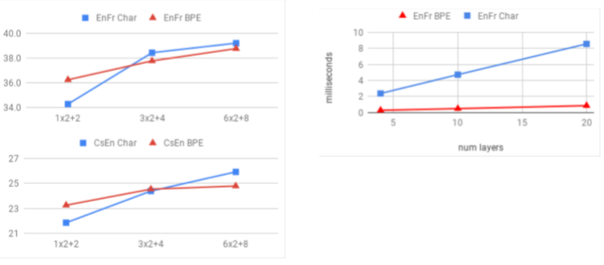
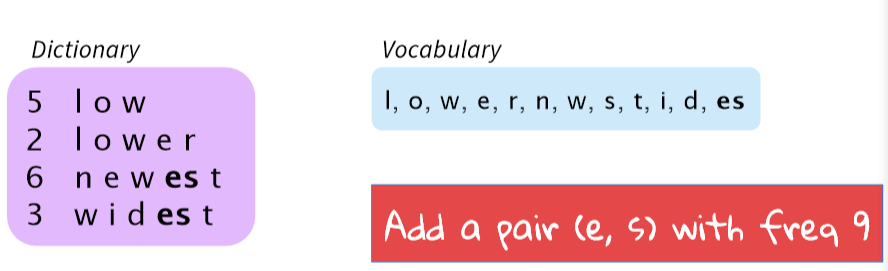
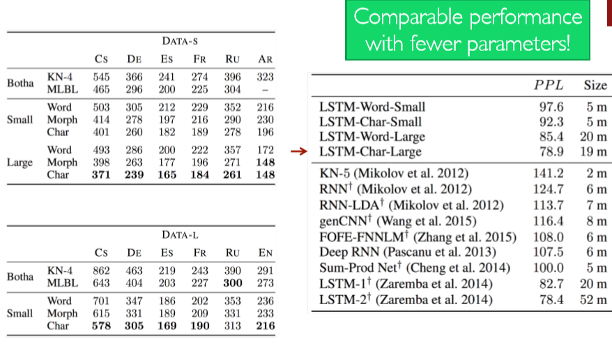
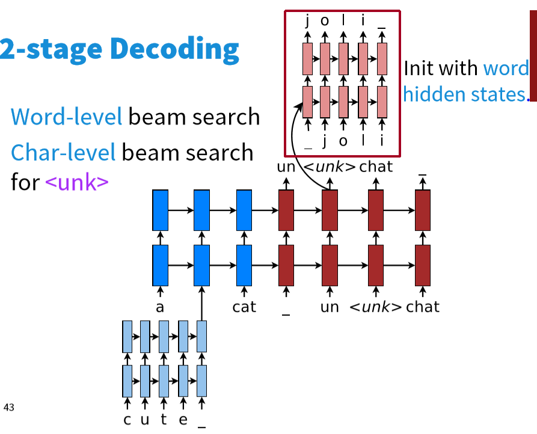
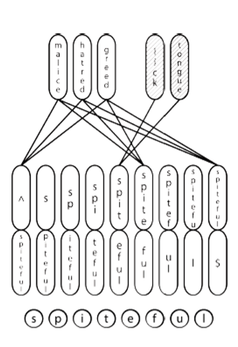

# CS224n-2019 学习笔记

-   结合每课时的课件、笔记与推荐读物等整理而成
-   作业部分将单独整理

## Lecture 12 Information from parts of words: Subword Models

??? abstract "Lecture Plan"

    1.  A tiny bit of linguistics
    2.  Purely character-level models
    3.  Subword-models: Byte Pair Encoding and friends
    4.  Hybrid character and word level models
    5.  fastText

### 1. Human language sounds: Phonetics and phonology 

-   Phonetics 语音学是一种音流——毫无争议的“物理学”
-   Phonology 语音体系假定了一组或多组独特的、分类的单元：音位或独特的特征
    -   这也许是一种普遍的类型学，但却是一种特殊的语言实现
    -   分类感知的最佳例子就是语音体系
        -   音位差异缩小；音素之间的放大

**Morphology: Parts of words**

-   parts of words 是音素的下一级的形态学，是具有意义的最低级别

-   传统上，**morphemes** 语素是最小的语义单位 **semantic unit** 
    -   $\left[\left[\text {un}\left[[\text { fortun }(\mathrm{e})]_{\text { Root }} \text { ate }\right]_{\text { STEM }}\right]_{\text { STEM }} \text {ly}\right]_{\text { WORD }}$
-   深度学习:形态学研究较少;递归神经网络的一种尝试是 (Luong, Socher, & Manning 2013)
    -   处理更大词汇量的一种可能方法——大多数看不见的单词是新的形态(或数字)

**Morphology**

-   一个简单的替代方法是使用字符 n-grams
    -    Wickelphones (Rumelhart& McClelland 1986) 
    -    Microsoft’s DSSM (Huang, He, Gao, Deng, Acero, & Hect2013) 
-   使用卷积层的相关想法
-   能更容易地发挥语素的许多优点吗？

**Words in writing systems**

书写系统在表达单词的方式上各不相同，也不相同

-   没有分词 美国关岛国际机场及其办公室均接获
-   大部分的单词都是分开的：由单词组成了句子
    -   附着词 clitics
        -   分开的
        -   连续的
    -   复合名词
        -   分开的
        -   连续的

**Models below the word level**

-   需要处理数量很大的开放词汇
    -   丰富的形态
    -   音译
    -   非正式的拼写

**Character-Level Models**

-   词嵌入可以由字符嵌入组成
    -   为未知单词生成嵌入
    -   相似的拼写共享相似的嵌入
    -   解决OOV问题
-   连接语言可以作为字符处理，这两种方法都被证明是非常成功的！
    -   有点令人惊讶的是——传统上，音素/字母不是一个语义单元——但DL模型组成了组
    -   深度学习模型可以存储和构建来自于多个字母组的含义表示，从而模拟语素和更大单位的意义，从而汇总形成语义

**Below the word: Writing systems**

大多数深度学习NLP的工作都是从语言的书面形式开始的——这是一种容易处理的、现成的数据

但是人类语言书写系统不是一回事！各种语言的字符是不同的！

### 2. Purely character-level models

-   上节课我们看到了一个很好的纯字符级模型的例子用于句子分类
    -   非常深的卷积网络用于文本分类
    -   •Conneau, Schwenk, Lecun, Barrault.EACL 2017
-   强大的结果通过深度卷积堆叠

**Purely character-level NMT models**

-   最初，效果不令人满意
    -   (Vilaret al., 2007; Neubiget al., 2013) 
-   只有decoder
    -    (JunyoungChung, KyunghyunCho, YoshuaBengio. arXiv 2016). 
-   然后有前景的结果
    -    (Wang Ling, Isabel Trancoso, Chris Dyer, Alan Black, arXiv 2015)
    -    (Thang Luong, Christopher Manning, ACL 2016)
    -    (Marta R. Costa-Jussà, José A. R. Fonollosa, ACL 2016)

**English-Czech WMT 2015 Results**

-   Luong和Manning测试了一个纯字符级seq2seq (LSTM) NMT系统作为基线
-   它在单词级基线上运行得很好
-   但是太慢了
    -   但是在运行时需要3周的时间来训练，运行时没那么快

**Fully Character-Level Neural Machine Translation without Explicit Segmentation**

Jason Lee, KyunghyunCho, Thomas Hoffmann. 2017.

编码器如下；解码器是一个字符级的GRU

**Stronger character results with depth in LSTM seq2seq model** 

Revisiting Character-Based Neural Machine Translation with Capacity and Compression. 2018. Cherry, Foster, Bapna, Firat, Macherey, Google AI

### 3. Sub-word models: two trends

-   与word级模型相同的架构
    -   但是使用更小的单元:“word pieces”
    -   [Sennrich, Haddow, Birch, ACL’16a], [Chung, Cho, Bengio, ACL’16]. 
-   混合架构
    -   主模型使用单词，其他使用字符级
    -   [Costa-Jussà& Fonollosa, ACL’16], [Luong & Manning, ACL’16].

**Byte Pair Encoding**

-   最初的压缩算法
    -   最频繁的字节 $\to$ 一个新的字节。
    -   用字符ngram替换字节(实际上，有些人已经用字节做了一些有趣的事情)
    -   Rico Sennrich, Barry Haddow, and Alexandra Birch. Neural Machine Translation of Rare Words with SubwordUnits. ACL 2016.
    -   https://arxiv.org/abs/1508.07909 
    -   https://github.com/rsennrich/subword-nmt
    -   https://github.com/EdinburghNLP/nematus
-   分词算法
    -   虽然做得很简单
    -   将数据中的所有的Unicode字符组成一个unigram的词典
    -   最常见的ngram对是一个新的ngram

-   有一个目标词汇量，当你达到它的时候就停止
-   做确定性的最长分词分割
-   分割只在某些先前标记器(通常MT使用的 Moses tokenizer )标识的单词中进行
-   自动为系统添加词汇
    -   不再是基于传统方式的 strongly “word”
-   2016年WMT排名第一！仍然广泛应用于2018年WMT
-   https://github.com/rsennrich/nematus

**Wordpiece/Sentencepiece model**

-   谷歌NMT (GNMT) 使用了它的一个变体
    -   V1: wordpiecemodel 
    -   V2: sentencepiecemodel 
-   不使用字符的 n-gram count，而是使用贪心近似来最大化语言模型的对数似然函数值，选择对应的pieces
    -   添加最大限度地减少困惑的n-gram

-    Wordpiece模型标记内部单词
-   Sentencepiece模型使用原始文本
    -   空格被保留为特殊标记(_)，并正常分组
    -   您可以通过将片段连接起来并将它们重新编码到空格中，从而在末尾将内容反转
    -   https://github.com/google/sentencepiece
    -   https://arxiv.org/pdf/1804.10959.pdf

-   BERT 使用了 wordpiece 模型的一个变体
    -   (相对)在词汇表中的常用词
        -   at, fairfax, 1910s 
    -   其他单词由wordpieces组成
        -   hypatia =  h   ##yp ##ati ##a
-   如果你在一个基于单词的模型中使用BERT，你必须处理这个

### 4. Character-level to build word-level 

Learning Character-level Representations for Part-ofSpeech Tagging (Dos Santos and Zadrozny2014) 

-   对字符进行卷积以生成单词嵌入
-   为PoS标签使用固定窗口的词嵌入

**Character-based LSTM to build word rep’ns**

*   Bi-LSTM构建单词表示

**Character-based LSTM**

**Character-Aware Neural Language Models** 

Yoon Kim, Yacine Jernite, David Sontag,  Alexander M. Rush. 2015

-   一个更复杂/复杂的方法
-   动机
    -   派生一个强大的、健壮的语言模型，该模型在多种语言中都有效
    -   编码子单词关联性s: eventful, eventfully, uneventful… 
    -   解决现有模型的罕见字问题
    -   用更少的参数获得可比较的表达性

**Highway Network (Srivastavaet al. 2015)**

-   语法交互模型
-   在传递原始信息的同时应用转换
-   功能类似于LSTM内存单元

**Long Short-Term Memory Network**

-   分级Softmaxto处理大的输出词汇表
-   使用 truncated backpropthrough time 进行训练

**Quantitative Results**

**Take-aways**

-   本文对使用词嵌入作为神经语言建模输入的必要性提出了质疑
-   字符级的 CNNs +  Highway Network 可以提取丰富的语义和结构信息
-   关键思想：您可以构建“building blocks”来获得细致入微且功能强大的模型！

**Hybrid NMT**

-   Abest-of-both-worldsarchitecture
    -   翻译大部分是单词级别的
    -   只在需要的时候进入字符级别
-   使用一个复制机制，试图填充罕见的单词，产生了超过 2 BLEU的改进

**2-stage Decoding**

-   单词级别的束搜索

-   字符级别的束搜索（遇到 $\text{<UNK>}$ ）时

**English-Czech Results**

**Sample English-Czech translations**

### 5. Chars for word embeddings

一种用于单词嵌入和单词形态学的联合模型(Cao and Rei 2016)

-   与w2v目标相同，但使用字符
-   双向LSTM计算嵌入
-   模型试图捕获形态学
-   模型可以推断单词的词根

**FastText embeddings**

用子单词信息丰富单词向量

Bojanowski, Grave, Joulinand Mikolov. FAIR. 2016. https://arxiv.org/pdf/1607.04606.pdf• https://fasttext.cc

-   目标：下一代高效的类似于word2vecd的单词表示库，但更适合于具有大量形态学的罕见单词和语言
-   带有字符n-grams的 w2v 的 skip-gram模型的扩展

-   将单词表示为用边界符号和整词扩充的字符n-grams
-   $where =<wh,whe,her,ere,re>,<where>$
    -   注意 $<her> , <her $ 是不同于 $her$ 的
        -   前缀、后缀和整个单词都是特殊的
-   将word表示为这些表示的和。上下文单词得分为
    -   $S(w, c)=\sum g \in G(w) \mathbf{Z}_{g}^{\mathrm{T}} \mathbf{V}_{C}$
        -   细节：与其共享所有n-grams的表示，不如使用“hashing trick”来拥有固定数量的向量

-   罕见单词的差异收益

## Reference

以下是学习本课程时的可用参考书籍：

[《基于深度学习的自然语言处理》](<https://item.jd.com/12355569.html>) （车万翔老师等翻译）

[《神经网络与深度学习》](<https://nndl.github.io/>)

以下是整理笔记的过程中参考的博客：

[斯坦福CS224N深度学习自然语言处理2019冬学习笔记目录](<https://zhuanlan.zhihu.com/p/59011576>) (课件核心内容的提炼，并包含作者的见解与建议)

[斯坦福大学 CS224n自然语言处理与深度学习笔记汇总](<https://zhuanlan.zhihu.com/p/31977759>) {>>这是针对note部分的翻译<<}