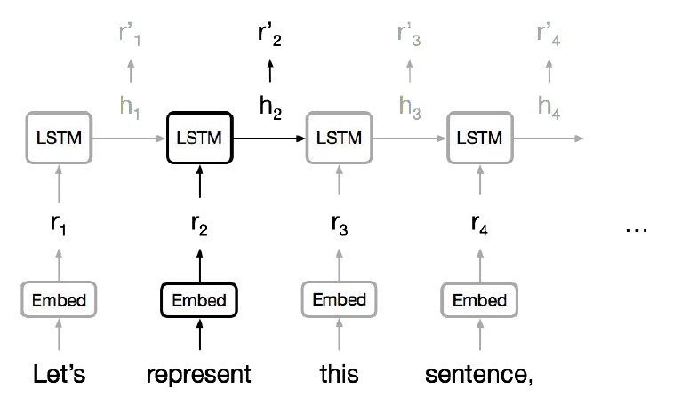
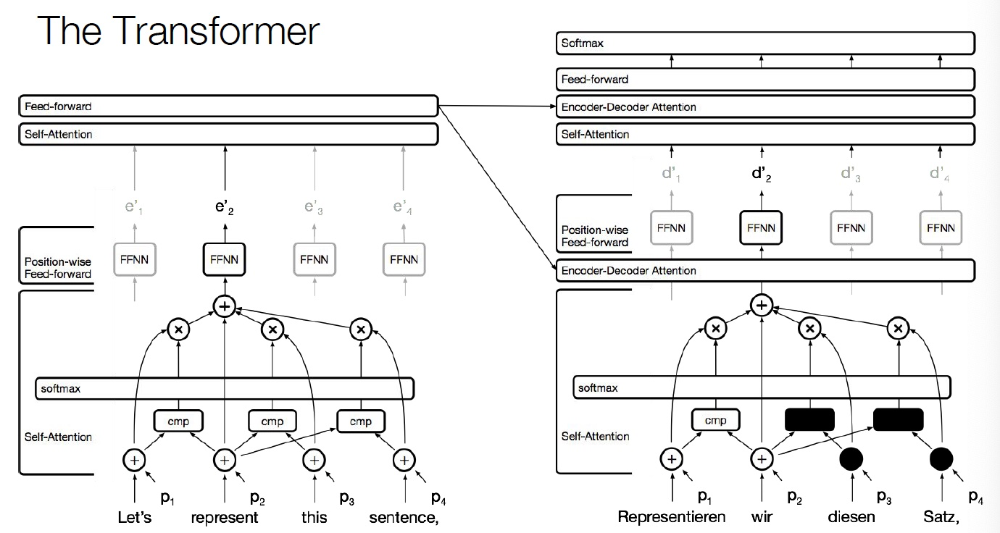
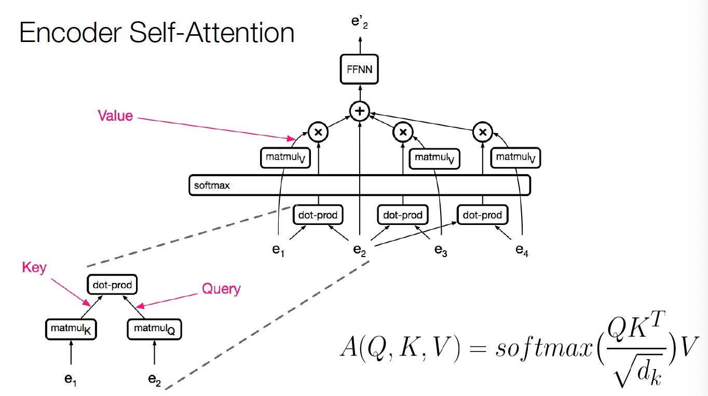
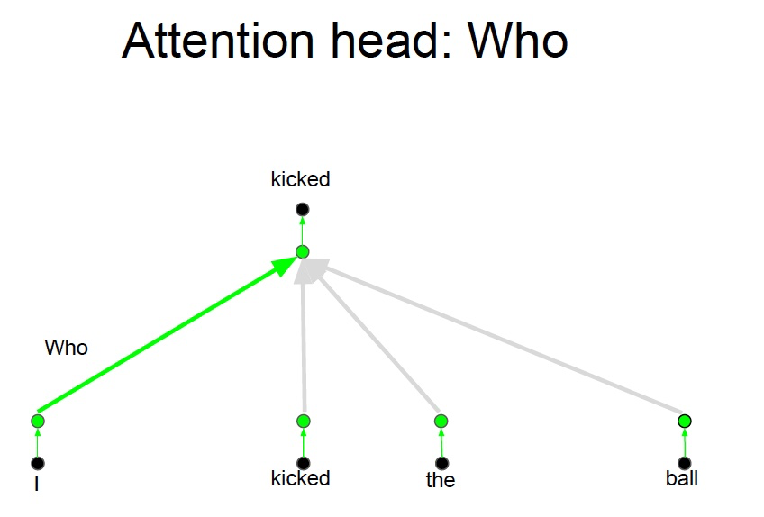
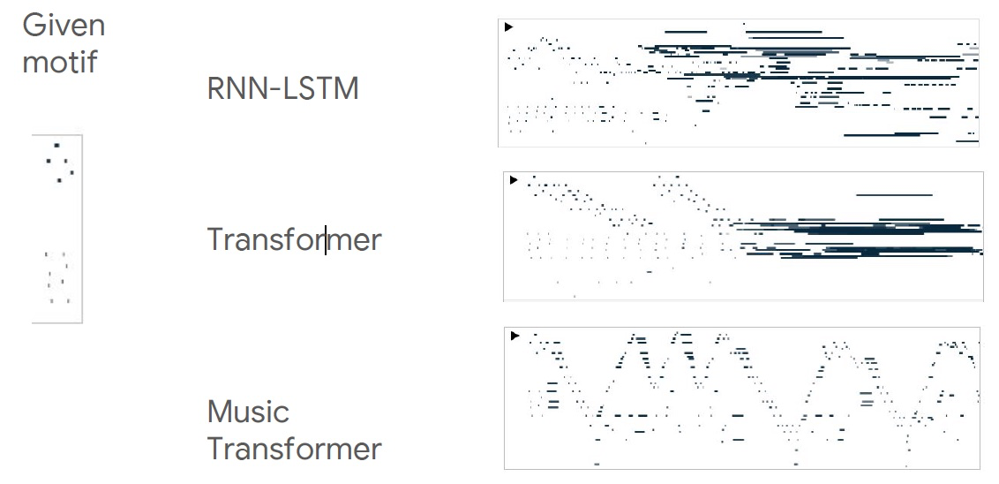

# CS224n-2019 学习笔记

-   结合每课时的课件、笔记与推荐读物等整理而成
-   作业部分将单独整理

## Lecture 14 Transformers and Self-Attention For Generative Models 

>   **Ashish Vaswani and Anna Huang**

学习变长数据的表示，这是序列学习的基本组件（序列学习包括 NMT, text summarization, QA）

通常使用 RNN 学习变长的表示：RNN 本身适合句子和像素序列

-   LSTMs, GRUs 和其变体在循环模型中占主导地位。

-   但是序列计算抑制了并行化。

-   没有对长期和短期依赖关系进行显式建模。

-   我们想要对层次结构建模。
-   RNNs(顺序对齐的状态)看起来很浪费！

**卷积神经网络**

-   并行化(每层)很简单
-   利用局部依赖
-   不同位置的交互距离是线性或是对数的
-   远程依赖需要多层

**注意力**

NMT 中，编码器和解码器之间的 Attention 是至关重要的

==为什么不把注意力用于表示呢？==

**Self-Attention**

-   任何两个位置之间的路径长度都是常数级别的

-   门控 / 乘法 的交互

-   可以并行化（每层）

-   可以完全替代序列计算吗？

### Text generation

#### Previous work

**Classification & regression with self-attention:**

Parikh et al. (2016), Lin et al. (2016)

**Self-attention with RNNs:**

Long et al. (2016), Shao, Gows et al. (2017)

**Recurrent attention:**

Sukhbaatar et al. (2015)

#### The Transformer

**Encoder Self-Attention**

**Decoder Self-Attention**

**复杂度**

由于计算只涉及到两个矩阵乘法，所以是序列长度的平方

当维度比长度大得多的时候，非常有效

#### Problem

上例中，我们想要知道谁对谁做了什么，通过卷积中的多个卷积核的**不同的**线性操作，我们可以分别获取到 who, did what, to whom 的信息。

但是对于 Attention 而言，如果只有一个Attention layer，那么对于一句话里的每个词都是同样的线性变换，不能够做到在**不同的位置提取不同的信息**

{>>这就是多头注意力的来源，灵感来源于 CNN 中的多个卷积核的设计<<}

#### Solution

**Who, Did What, To Whom 分别拥有注意力头**

-   将注意力层视为特征探测器
-   可以并行完成
-   为了效率，减少注意力头的维度，并行操作这些注意力层，弥补了计算 差距

#### Results

-   但我们并不一定比 LSTM 取得了更好的表示，只是我们更适合 SGD，可以更好的训练
-   我们可以对任意两个词之间构建连接

### Importance of residuals

位置信息最初添加在了模型的输入处，通过残差连接将位置信息传递到每一层，可以不需要再每一层都添加位置信息

**Training Details**

-   ADAM optimizer with a learning rate warmup (warmup + exponential decay)
-   Dropout during training at every layer just before adding residual
-   Layer-norm
-   Attention dropout (for some experiments)
-   Checkpoint-averaging
-   Label smoothing
-   Auto-regressive decoding with beam search and length biasing
-   ……

### Self-Similarity, Image and Music Generation

#### Probabilistic Image Generation

-   模拟像素的联合分布
-   把它变成一个序列建模问题
-   **分配概率允许度量泛化**

-   RNNs和CNNs是最先进的(PixelRNN, PixelCNN)
-   **incorporating gating CNNs 现在在效果上与 RNNs 相近**
-   **由于并行化，CNN 要快得多**
-   图像的长期依赖关系很重要(例如对称性)
-   可能随着图像大小的增加而变得越来越重要
-   使用CNNs建模长期依赖关系需要两者之一
    -   **多层**可能使训练更加困难
    -   **大卷积核** 参数/计算成本相应变大

**Texture Synthesis with Self-Similarity**

自相似性的研究案例

A Non-local Algorithm for Image Denoising (Buades, Coll, and Morel. CVPR 2005)

Non-local Neural Networks (Wang et al., 2018)

#### Previous work

**Self-attention:**

Parikh et al. (2016), Lin et al. (2016), Vaswani et al. (2017)

**Autoregressive Image Generation:**

A Oord et al. (2016), Salimans et al. (2017)

#### The Image Transformer

#### Combining Locality with Self-Attention

-   将注意力窗口限制为本地范围
-   由于空间局部性，这在图像中是很好的假设

### Music generation using relative self-attention

**Raw representations in music and language**

传统的 RNN 模型需要将长序列嵌入到固定长度的向量中

#### Continuations to given initial motif

给定一段音乐并生成后续音乐

-   不能直接去重复过去的片段
-   难以处理长距离

-   移动的固定过滤器捕获相对距离
-   Music Transformer 使用平移不变性来携带超过其训练长度的关系信息，进行传递

-   位置之间的相关性

-   但是音乐中的序列长度通常非常长

-   将相对距离转化为绝对距离

### Self-Attention

任意两个位置之间的路径长度是常数级的

没有边界的内存

并行化

对自相似性进行建模

相对注意力提供了表达时间、equivariance，可以自然延伸至图表

## Reference

以下是学习本课程时的可用参考书籍：

[《基于深度学习的自然语言处理》](<https://item.jd.com/12355569.html>) （车万翔老师等翻译）

[《神经网络与深度学习》](<https://nndl.github.io/>)

以下是整理笔记的过程中参考的博客：

[斯坦福CS224N深度学习自然语言处理2019冬学习笔记目录](<https://zhuanlan.zhihu.com/p/59011576>) (课件核心内容的提炼，并包含作者的见解与建议)

[斯坦福大学 CS224n自然语言处理与深度学习笔记汇总](<https://zhuanlan.zhihu.com/p/31977759>) {>>这是针对note部分的翻译<<}