# CS224n-2019 学习笔记

-   结合每课时的课件、笔记与推荐读物等整理而成
-   作业部分将单独整理

## Lecture 16 Coreference Resolution 

??? abstract "Lecture Plan"

    1.  What is Coreference Resolution? (15 mins)
    2.  Applications of coreference resolution (5 mins)
    3.  Mention Detection (5 mins)
    4.  Some Linguistics: Types of Reference (5 mins) Four Kinds of Coreference Resolution Models
    5.  Rule-based (Hobbs Algorithm) (10 mins)
    6.  Mention-pair models (10 mins)
    7.  Mention ranking models (15 mins)
        -   Including the current state-of-the-art coreference system!
    
    8.  Mention clustering model (5 mins – only partial coverage)
    
    9.  Evaluation and current results (10 mins)

### 1. What is Coreference Resolution?

-   识别所有涉及到相同现实世界实体的 **提及**
-   He, her 都是实体的提及  mentions of entities 

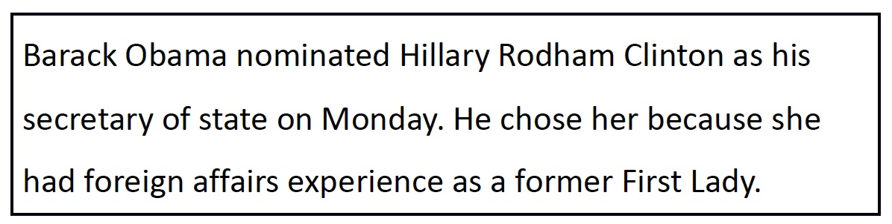

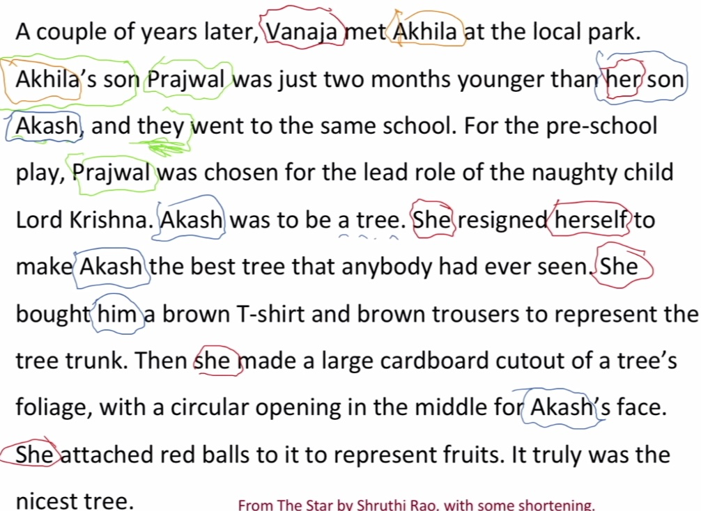

**Applications**

-   全文理解
    -   信息提取, 回答问题, 总结, …
    -   “他生于1961年”(谁?)
-   机器翻译
    -   语言对性别，数量等有不同的特征

-   对话系统

**Coreference Resolution in Two Steps**

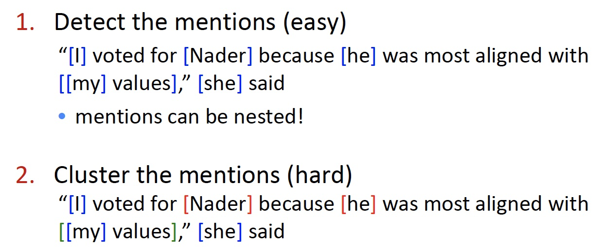

### 3. Mention Detection

-   Mention : 指向某个实体的一段文本
-   三种 mention

1.  Pronouns 代词
    -   I, your, it, she, him, etc.
    -   因为代词是 POS 检测结果的一种，所以只要使用 POS 检测器即可
2.  Named entities 命名实体
    -   People, places, etc.
    -   Use a NER system (like hw3)
3.  Noun phrases 名词短语
    -   “a dog,” “the big fluffy cat stuck in the tree”
    -   Use a parser (especially a  依存解析器 constituency parser – next week!) 

-   Marking all pronouns, named entities, and NPs as mentions over-generates mentions
-   Are these mentions?
    -   It is sunny
    -   Every student
    -   No student
    -   The best donut in the world
    -   100 miles

**How to deal with these bad mentions?**

-   可以训练一个分类器过滤掉 spurious mentions
-   更为常见的：保持所有 mentions 作为 “candidate mentions”
    -   在你的共指系统运行完成后，丢弃所有的单例引用(即没有被标记为与其他任何东西共同引用的)

**Can we avoid a pipelined system?**

-   我们可以训练一个专门用于 mention 检测的分类器，而不是使用POS标记器、NER系统和解析器。
-   甚至端到端共同完成 mention 检测和共指解析，而不是两步

### 4. On to Coreference! First, some linguistics

-   **Coreference** is when two mentions refer to the same entity in the world 当两个  mention 指向世界上的同一个实体时，被称为共指
    -   Barack Obama 和 Obama
-   相关的语言概念是 anaphora 复指：when a term (anaphor) refers to another term (antecedent)
    -   anaphor 的解释在某种程度上取决于 antecedent 先行词的解释
    -   

**Anaphora vs Coreference**

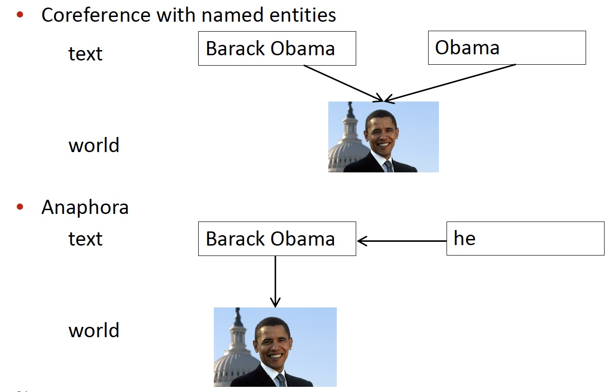
**Not all anaphoric relations are coreferential**

-   Not all noun phrases have reference 不是所有的名词短语都有指代

    -   Every dancer twisted her knee 
    -   No dancer twisted her knee
    -   每一个句子有三个NPs；因为第一个是非指示性的，另外两个也不是

-   Not all anaphoric relations are coreferential 

    -   We went to see a concert last night. The tickets were really expensive.
    -   这被称为桥接回指 bridging anaphora

    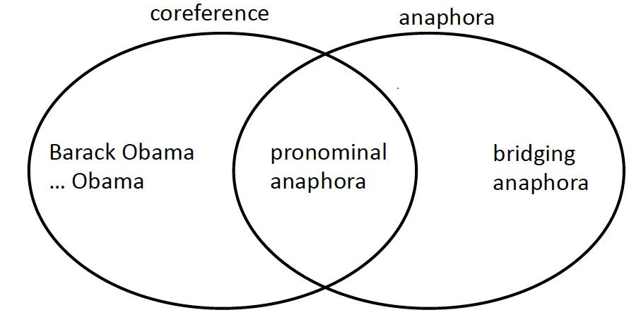

-   通常先行词在复指（例如代词）之前，但并不总是

**Cataphora**

**Four Kinds of Coreference Models**

-   Rule-based (pronominal anaphora resolution)
-   Mention Pair
-   Mention Ranking
-   Clustering

### 5. Traditional pronominal anaphora resolution:Hobbs’ naive algorithm

1.  Begin at the NP immediately dominating the pronoun
2.  Go up tree to first NP or S. Call this X, and the path p.
3.  Traverse all branches below X to the left of p, left-to-right,breadth-first. Propose as antecedent any NP that has a NP or Sbetween it and X
4.  If X is the highest S in the sentence, traverse the parse trees ofthe previous sentences in the order of recency. Traverse eachtree left-to-right, breadth first. When an NP is encountered,propose as antecedent. If X not the highest node, go to step 5.
5.  From node X, go up the tree to the first NP or S. Call it X, andthe path p.
6.  If X is an NP and the path p to X came from a non-head phraseof X (a specifier or adjunct, such as a possessive, PP, apposition, orrelative clause), propose X as antecedent(The original said “did not pass through the N’ that X immediatelydominates”, but the Penn Treebank grammar lacks N’ nodes….)
7.  Traverse all branches below X to the left of the path, in a leftto-right, breadth first manner. Propose any NP encountered asthe antecedent
8.  If X is an S node, traverse all branches of X to the right of thepath but do not go below any NP or S encountered. Proposeany NP as the antecedent.9. Go to step 4

**Hobbs Algorithm Example**

**Knowledge-based Pronominal Coreference**

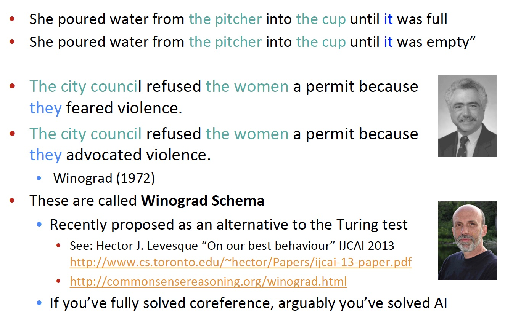

**Hobbs’ algorithm: commentary**

### 6. Coreference Models: Mention Pair

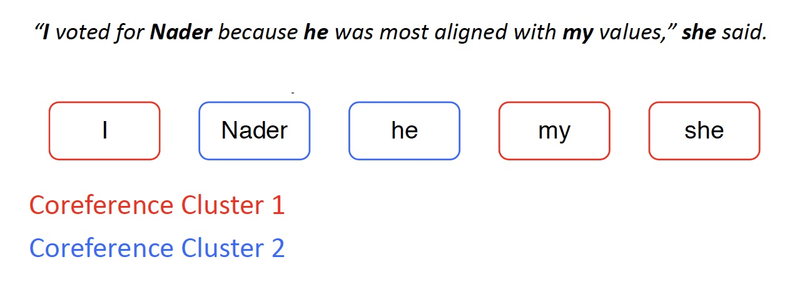

-   训练一个二元分类器，为每一对 mention 的分配共参的概率 $p(m_i,m_j)$
    -   例如，为了寻找 “she” 的共指，查看所有候选先行词(以前出现的 mention )，并确定哪些与之相关

-   文章的 N 个 mention
-   如果 $m_i$ 和 $m_j$ 是共指的，则 $y_{ij} = 1$ ，否则 $y_{ij} = -1$
-   只是训练正常的交叉熵损失(看起来有点不同，因为它是二元分类)

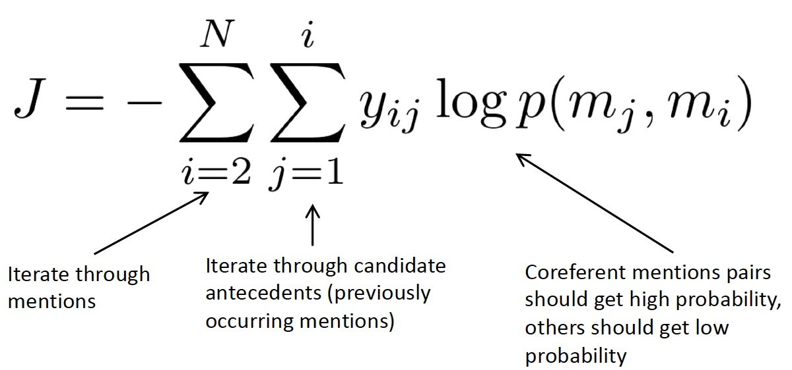

-   遍历 mentions
-   遍历候选先行词(前面出现的 mention)
-   共指 mention 对应该得到高概率，其他应该得到低概率

**Mention Pair Test Time**

-   共指解析是一项聚类任务，但是我们只是对 mentions 对进行了评分……该怎么办？
-   选择一些阈值(例如0.5)，并将 $p(m_i,m_j)$ 在阈值以上的 mentions 对之间添加共指链接
-   利用传递闭包得到聚类

**Mention Pair Models: Disadvantage**

-   假设我们的长文档里有如下的 mentions

-   许多 mentions 只有一个清晰的先行词
    -   但我们要求模型来预测它们
-   解决方案：相反，训练模型只预测每次 mention 的前提
    -   在语言上更合理

### 7. Coreference Models: Mention Ranking

-   根据模型把其得分最高的先行词分配给每个 mention 
-   Dummy NA mention 允许模型拒绝将当前 mention 与任何内容联系起来(“singleton” or “first” mention)

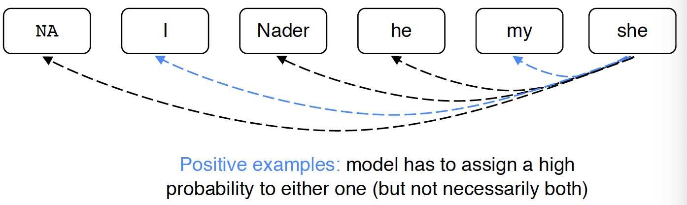

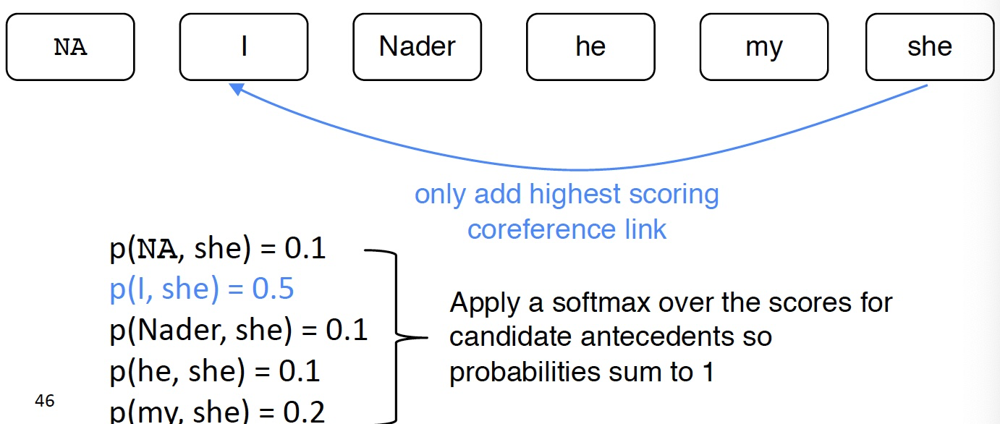

**Coreference Models: Training**

-   我们希望当前 mention $m_j$ 与它所关联的任何一个候选先行词相关联。
-   在数学上，我们可能想要最大化这个概率

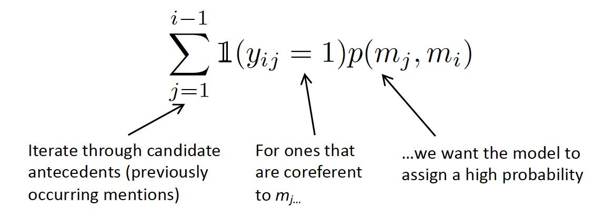

-   该模型可以为一个正确的先行词产生概率 0.9 ，而对其他所有产生较低的概率，并且总和仍然很大
-   Turning this into a loss function

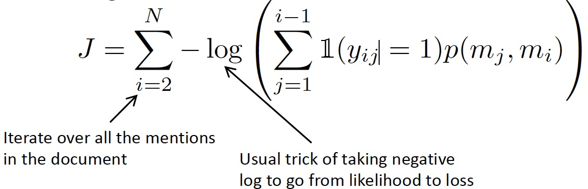

**Mention Ranking Models: Test Time**

和 mention-pair 模型几乎一样，除了每个 mention 只分配一个先行词

**How do we compute the probabilities?**

A. Non-neural statistical classifier

B. Simple neural network

C. More advanced model using LSTMs, attention

**A. Non-Neural Coref Model: Features**

**B. Neural Coref Model**

-   标准的前馈神经网络
    -   输入层：词嵌入和一些类别特征

**Neural Coref Model: Inputs**

-   嵌入
    -   每个 mention 的前两个单词，第一个单词，最后一个单词，头单词，… 
        -   头单词是 mention 中“最重要”的单词—可以使用解析器找到它
        -   例如：*The fluffy* **cat** stuck in the tree
-   仍然需要一些其他特征
    -   距离
    -   文档体裁
    -   说话者的信息

### C. End-to-end Model

-   当前最先进的模型算法(Kenton Lee et al. from UW, EMNLP 2017)
-   Mention 排名模型
-   改进了简单的前馈神经网络
    -   使用LSTM
    -   使用注意力
    -   端到端的完成 mention 检测和共指
        -   没有 mention 检测步骤！
        -   而是考虑每段文本(一定长度)作为候选 mention
            -   a **span** 是一个连续的序列

**End-to-end Model**

-   首先将文档里的单词使用词嵌入矩阵和 charCNN embed 为词嵌入

-   接着在文档上运行双向 LSTM

-   接着将每段文本 $i$ 从 $\text{START}(i)$ 到 $\text{END}(i)$ 表示为一个向量

    -   General, General Electric, General Electric said, … Electric, Electric said, …都会得到它自己的向量表示
    -   span representation

    $$
    \boldsymbol{g}_{i}=\left[\boldsymbol{x}_{\operatorname{START}(i)}^{*}, \boldsymbol{x}_{\mathrm{END}(i)}^{*}, \hat{\boldsymbol{x}}_{i}, \phi(i)\right]
    $$

    -   例如 “the postal service”

-   $\hat{\boldsymbol{x}}_{i}$ 是 span 的注意力加权平均的词向量

-   为什么要在 span 中引入所有的这些不同的项

-   最后，为每个 span 对打分来决定他们是不是共指 mentions

-   打分函数以 span representations 作为输入

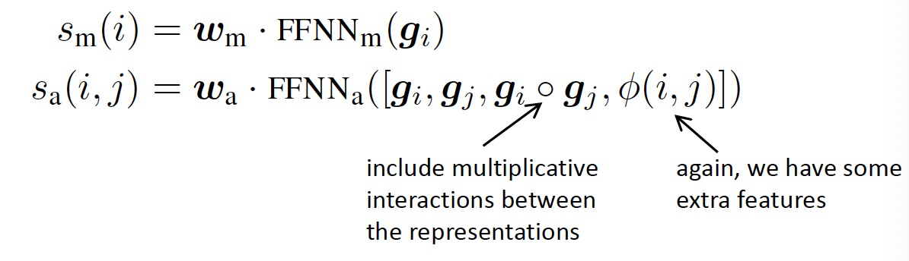

-   为每对 span 打分是棘手的
    -   一个文档中有 $O(T^2)$ spans，T 是词的个数
    -   $O(T^4)$ 的运行时间
    -   所以必须做大量的修剪工作(只考虑一些可能是 mention 的span)
-   关注学习哪些单词是重要的在提到(有点像头单词)

### 8. Last Coreference Approach: Clustering-Bas

-   共指是个聚类任务，让我们使用一个聚类算法吧
    -   特别是我们将使用 agglomerative 聚类
-   开始时，每个 mention 在它自己的单独集群中
-   每一步合并两个集群
    -   使用模型来打分那些聚类合并是好的

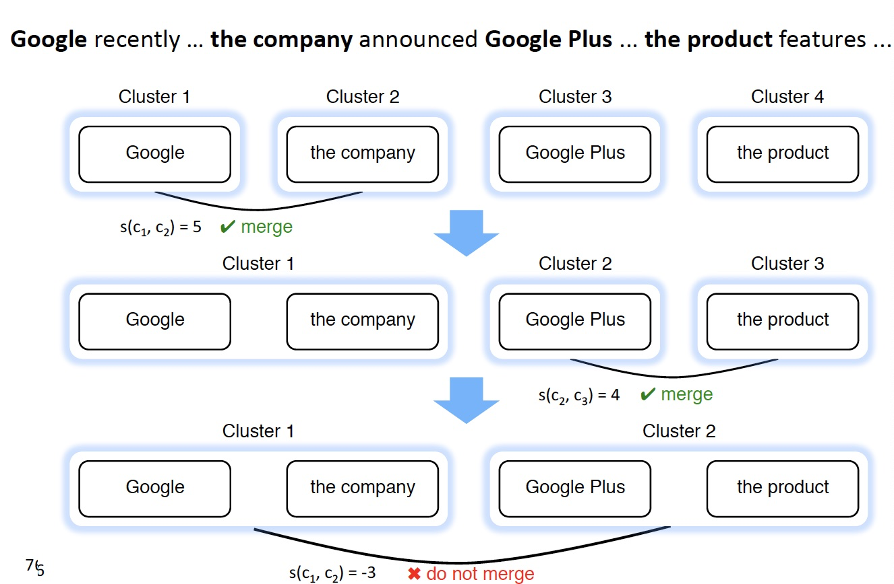

**Clustering Model Architecture**

From Clark & Manning, 2016

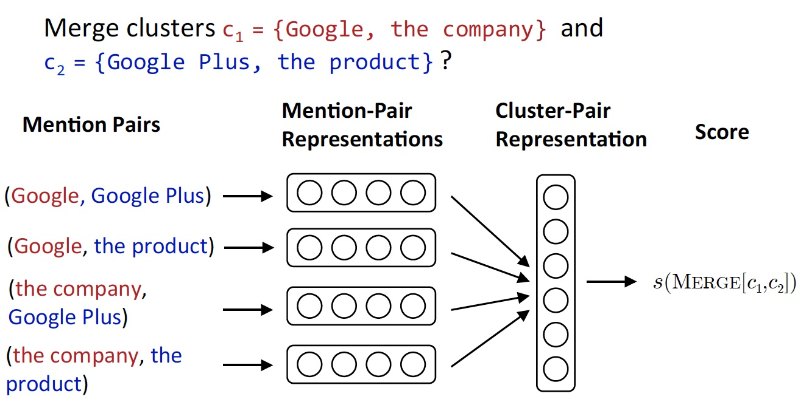

-   首先为每个 mention 对生成一个向量
    -   例如，前馈神经网络模型中的隐藏层的输出

-   接着将池化操作应用于 mentino-pair 表示的矩阵上，得到一个 cluster-pair 聚类对的表示

-   通过用权重向量与表示向量的点积，对 candidate cluster merge 进行评分
    -   $s\left(\operatorname{MERGE}\left[c_{1}, c_{2}\right]\right)=u^{T} r_{c}\left(c_{1}, c_{2}\right)$
-   当前候选簇的合并，取决于之前的合并
    -   所以不能用常规的监督学习
    -   使用类似强化学习训练模型
        -   为每个合并分配奖励：共指评价指标的变化

### 9. Coreference Evaluation

-   许多不同的评价指标：MUC, CEAF, LEA, B-CUBED, BLANC
    -   经常使用一些不同评价指标的均值
-   例如 B-cubed
    -   对于每个 mention ，计算其准确率和召回率
    -   然后平均每个个体的准确率和召回率

**System Performance**

-   OntoNotes数据集:~ 3000人类标注的文档
    -   英语和中文
-   Report an F1 score averaged over 3 coreference metrics

**Where do neural scoring models help?**

-   特别是对于没有字符串匹配的NPs和命名实体。神经与非神经评分:

**Conclusion**

-   共指是一个有用的、具有挑战性和有趣的语言任务
    -   许多不同种类的算法系统
-   系统迅速好转，很大程度上是由于更好的神经模型
    -   但总的来说,还没有惊人的结果
-   Try out a coreference system yourself
    -   http://corenlp.run/ (ask for coref in Annotations)
    -   https://huggingface.co/coref/

## Reference

以下是学习本课程时的可用参考书籍：

[《基于深度学习的自然语言处理》](<https://item.jd.com/12355569.html>) （车万翔老师等翻译）

[《神经网络与深度学习》](<https://nndl.github.io/>)

以下是整理笔记的过程中参考的博客：

[斯坦福CS224N深度学习自然语言处理2019冬学习笔记目录](<https://zhuanlan.zhihu.com/p/59011576>) (课件核心内容的提炼，并包含作者的见解与建议)

[斯坦福大学 CS224n自然语言处理与深度学习笔记汇总](<https://zhuanlan.zhihu.com/p/31977759>) {>>这是针对note部分的翻译<<}