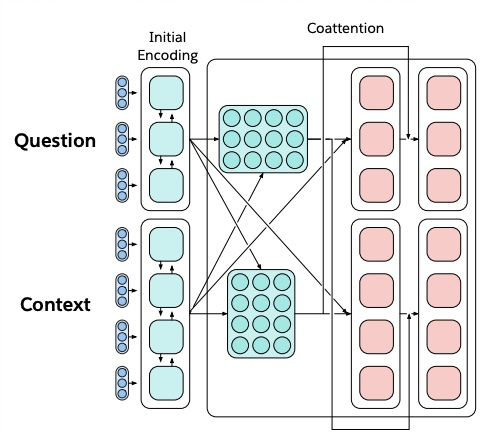
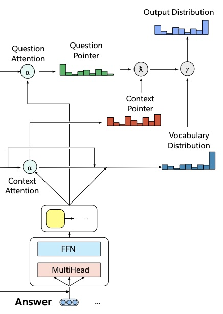
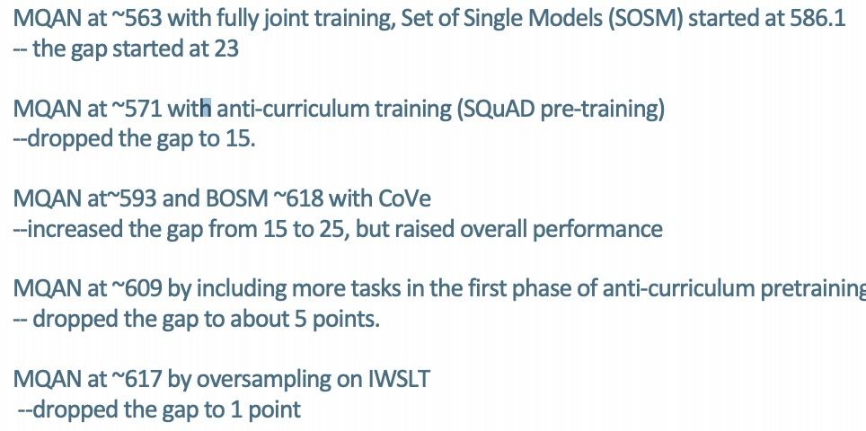
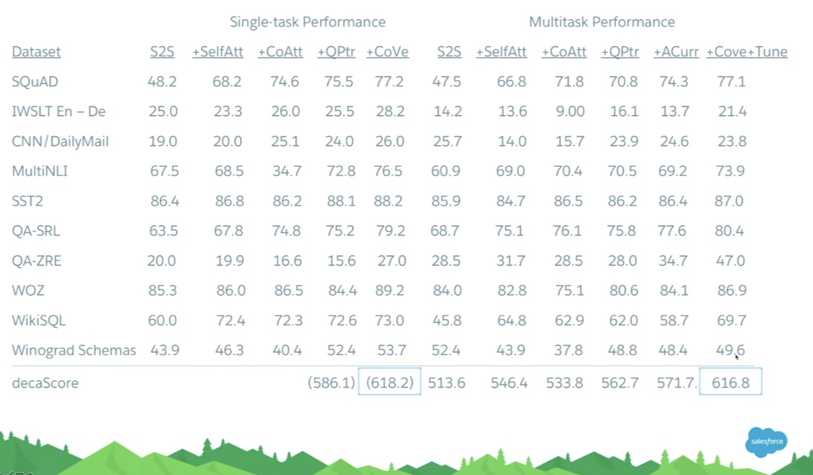
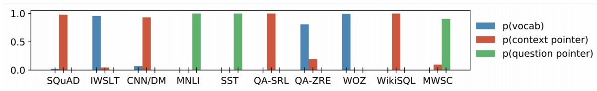

# CS224n-2019 学习笔记

-   结合每课时的课件、笔记与推荐读物等整理而成
-   作业部分将单独整理

## Lecture 17 Multitask Learning

**The Natural Language Decathlon: Multitask Learning as Question Answering**

**The Limits of Single-task Learning**

-   鉴于{dataset，task，model，metric}，近年来性能得到了很大改善
-   只要 $|\text{dataset}| > 1000 \times C$ ，我们就可以得到当前的最优结果 (C是输出类别的个数)
-   对于更一般的 Al，我们需要在单个模型中继续学习
-   模型通常从随机开始，仅部分预训练 :disappointed:

**Pre-training and sharing knowledge is great!**

**Why has weight & model sharing not happened as much in NLP?**

-   NLP需要多种推理：逻辑，语言，情感，视觉，++
-   需要短期和长期记忆
-   NLP被分为中间任务和单独任务以取得进展
    -   在每个社区中追逐基准
-   一个无人监督的任务可以解决所有问题吗？不可以
-   语言显然需要监督

**Why a unified multi-task model for NLP?**

-   多任务学习是一般NLP系统的<u>阻碍</u>
-   统一模型可以决定如何转移知识（领域适应，权重分享，转移和零射击学习）
-   统一的多任务模型可以
    -   更容易适应新任务
    -   简化部署到生产的时间
    -   降低标准，让更多人解决新任务
    -   潜在地转向持续学习

**How to express many NLP tasks in the same framework?**

-   序列标记
    -   命名实体识别，aspect specific sentiment 
-   文字分类
    -   对话状态跟踪，情绪分类
-   Seq2seq
    -   机器翻译，总结，问答

**The Natural Language Decathlon (decaNLP)**

-   把 10 项不同的任务都写成了 QA 的形式，进行训练与测试

**Multitask Learning as Question Answering**

-   Meta-Supervised learning 元监督学习 ：$\text { From }\{x, y\} \text { to }\{x, t, y\}(t \text { is the task })$
-   使用问题 q 作为任务 t 的自然描述，以使模型使用语言信息来连接任务
-   y 是 q 的答案，x 是回答 q 所必需的上下文

**Designing a model for decaNLP**

需求：

-   没有任务特定的模块或参数，因为我们假设任务ID是未提供的
-   必须能够在内部进行调整以执行不同的任务
-   应该为看不见的任务留下零射击推断的可能性

**A Multitask Question Answering Network for decaNLP**

-   以一段上下文开始
-   问一个问题
-   一次生成答案的一个单词，通过
    -   指向上下文
    -   指向问题
    -   或者从额外的词汇表中选择一个单词
-   每个输出单词的指针切换都在这三个选项中切换

**Multitask Question Answering Network (MQAN)**

-   For code and leaderboard see www.decaNLP.com
-   固定的 GloVe 词嵌入 + 字符级的 n-gram 嵌入 $\to$ Linear $\to$ Shared BiLSTM with skip connection
    -   
-   从一个序列到另一个序列的注意力总结，并通过跳过连接再次返回
    -   
-   分离BiLSTM以减少维数，两个变压器层，另一个BiLSTM
    -   
-   自回归解码器使用固定的 GloVe 和字符 n-gram 嵌入，两个变压器层和一个LSTM层来参加编码器最后三层的输出
    -   
-   LSTM解码器状态用于计算上下文与问题中的被用作指针注意力分布问题
    -   
-   对上下文和问题的关注会影响两个**开关**：
    -   gamma决定是复制还是从外部词汇表中选择
    -   lambda决定是从上下文还是在问题中复制
    -   
-   

-   S2S 是 seq2seq
-   +SelfAtt = plus self attention
-   +CoAtt = plus coattention
-   +QPtr = plus question pointer == MQAN
-   Transformer 层在单任务和多任务设置中有 收益
-   多任务训练一开始会获得很差的效果（干扰和遗忘），但是如果顺序训练这些任务，将很快就会好起来
-   QA和SRL有很强的关联性
-   指向问题至关重要
-   多任务处理有助于实现零射击
-   组合的单任务模型和单个多任务模型之间存在差距

**Training Strategies: Fully Joint**

简单的全联合训练策略

**Training Strategies: Anti-Curriculum Pre-training**

-   困难：在单任务设置中收敛多少次迭代
-   带红色的任务：预训练阶段包含的任务

-   QA 的 Anti-curriculum 反课程预训练改进了完全联合培训
-   但MT仍然很糟糕

**Closing the Gap: Some Recent Experiments**

**Where MQAN Points**

-   答案从上下文或问题中正确的复制
-   没有混淆模型应该执行哪个任务或使用哪个输出空间

**Pretraining on decaNLP improves final performance**

-   例如额外的 IWSLT language pairs 
-   或者是新的类似 NER 的任务

**Zero-Shot Domain Adaptation of pretrained MQAN:**

-   在 Amazon and Yelp reviews 上获得了 80% 的 精确率
-   在 SNLI 上获得了 62% （参数微调的版本获得了 87% 的精确率，比使用随机初始化的高 2%）

**Zero-Shot Classification**

-   问题指针使得我们可以处理问题的改变（例如，将标签转换为满意/支持和消极/悲伤/不支持）而无需任何额外的微调
-   使模型无需训练即可响应新任务

**decaNLP: A Benchmark for Generalized NLP**

-   为多个NLP任务训练单问题回答模型
-   解决方案
    -   更一般的语言理解
    -   多任务学习
    -   领域适应
    -   迁移学习
    -   权重分享，预训练，微调（对于NLP的ImageNet-CNN？）
    -   零射击学习

https://einstein.ai

## Reference

以下是学习本课程时的可用参考书籍：

[《基于深度学习的自然语言处理》](<https://item.jd.com/12355569.html>) （车万翔老师等翻译）

[《神经网络与深度学习》](<https://nndl.github.io/>)

以下是整理笔记的过程中参考的博客：

[斯坦福CS224N深度学习自然语言处理2019冬学习笔记目录](<https://zhuanlan.zhihu.com/p/59011576>) (课件核心内容的提炼，并包含作者的见解与建议)

[斯坦福大学 CS224n自然语言处理与深度学习笔记汇总](<https://zhuanlan.zhihu.com/p/31977759>) {>>这是针对note部分的翻译<<}