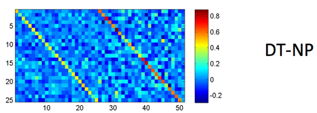
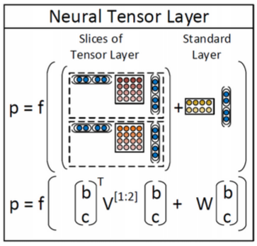
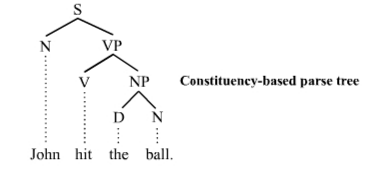

# CS224n-2019 学习笔记

-   结合每课时的课件、笔记与推荐读物等整理而成
-   作业部分将单独整理

## Lecture 18 Tree Recursive Neural Networks, Constituency Parsing, and Sentiment

??? abstract "Lecture Plan"

    1.  Motivation: Compositionality and Recursion
    2.  Structure prediction with simple Tree RNN: Parsing
    3.  Backpropagation through Structure
    4.  More complex TreeRNN units (35 mins)
    5.  Other uses of tree-recursive neural nets (5 mins)
    6.  Institute for Human-Centered Artificial Intelligence

### 1. The spectrum of language in CS

-   词袋模型 和 复杂形式的语言表达结构

**Semantic interpretation of language – Not just word vectors**

我们怎样才能弄清楚更大的短语的含义？

-   The **snowboarder** is leaping over a mogul
-   A **person on a snowboard** jumps into the air

The **snowboarder** 在语义上相当于 A **person on a snowboard**，但它们的字长不一样

-   人们之所以可以理解  A **person on a snowboard** ，是因为 **the principle of compositionality** 组合原则
-   人们知道每个单词的意思，从而知道了 on a snowboard 的意思
-   知道组件的含义并将他们组合成为更大的组件

人们通过较小元素的**语义成分**来解释较大文本单元的意义 - 实体，描述性术语，事实，论点，故事

-   语言理解 - 和人工智能 - 需要能够通过了解较小的部分来理解更大的事物

-   我们拥有将较小的部分组合起来制作出更大东西的能力

**Are languages recursive?**

-   认知上有点争议（需要前往无限）
-   但是：递归对于描述语言是很自然的
    -   [The person standing next to [the man from [the company that purchased [the firm that you used to work at]]]]
    -   包含名词短语的名词短语，包含名词短语
-   它是语言结构的一个非常强大的先验

**2. Building on Word Vector Space Models**

-   the country of my birth
-   the place where I was born
-   我们怎样表示更长短语的意思呢？
-   通过将他们映射到相同的向量空间！

**How should we map phrases into a vector space?**

-   基于组合原则，使用单词的含义和组合他们的规则，得到一个句子的含义向量
-   同时学习解析树以及组合向量表示

**Constituency Sentence Parsing: What we want**

**Learn Structure and Representation**

-   我们需要能够学习如何解析出正确的语法结构，并学习如何基于语法结构，来构建句子的向量表示

**Recursive vs. recurrent neural networks**

-   递归神经网络需要一个树结构
-   循环神经网络不能在没有前缀上下文的情况下捕捉短语，并且经常在最终的向量中过度捕捉最后一个单词

**Recursive Neural Networks for Structure Prediction**

如果我们自上而下的工作，那么我们在底层有单词向量，所以我们想要递归地计算更大成分的含义

输入：两个候选的子节点的表示

输出：

-   两个节点被合并后的语义表示
-   新节点的合理程度

**Recursive Neural Network Definition**

**Parsing a sentence with an RNN (greedily)**

**Parsing a sentence**

-   自左向右重复遍历，每次将得分最高的两者组合在一起

**Max-Margin Framework - Details**

-   树的得分是通过每个节点的解析决策得分的总和来计算的：

$$
s(x, y)=\sum_{n \in n o d e (y)} s_{n}
$$

-   x 是句子，y 是解析树

-   类似于最大边距解析（Taskar et al.2004），一个受监督的最大边际目标

$$
J=\sum_{i} s\left(x_{i}, y_{i}\right)-\max _{y \in A\left(x_{i}\right)}\left(s\left(x_{i}, y\right)+\Delta\left(y, y_{i}\right)\right)
$$

-   损失 $\Delta\left(y, y_{i}\right)$ 惩罚所有不正确的决策
-   结构搜索 $A(x)$ 是贪婪的（每次加入最佳节点）
    -   相反：使用 Beam search 搜索图

**Scene Parsing**

和组合类似的准则

-   场景图像的含义也是较小区域的函数
-   它们如何组合成部分以形成更大的对象
-   以及对象如何相互作用

**Algorithm for Parsing Images**

Same Recursive Neural Network as for natural language parsing! (Socher et al. ICML 2011)

**Multi-class segmentation**

### 3. Backpropagation Through Structure

Introduced by Goller & Küchler (1996)

和通用的反向传播的规则相同
$$
\delta^{(l)}=\left(\left(W^{(l)}\right)^{T} \delta^{(l+1)}\right) \circ f^{\prime}\left(z^{(l)}\right), \quad \quad \quad \frac{\partial}{\partial W^{(l)}} E_{R}=\delta^{(l+1)}\left(a^{(l)}\right)^{T}+\lambda W^{(l)}
$$
递归和树结构导致的计算：

1.  从所有节点（如RNN）求和W的导数
2.  在每个节点处拆分导数（对于树）
3.  从父节点和节点本身添加错误消息

**Discussion: Simple TreeRNN**

-   使用单矩阵TreeRNN的结果
-   单个权重矩阵TreeRNN可以捕获一些现象但不适合更复杂的现象以及更高阶的构成和解析长句
-   输入词之间没有真正的交互
-   组合函数对于所有句法类别，标点符号等都是相同的

### 4. Version 2: Syntactically-Untied RNN

[Socher, Bauer, Manning, Ng 2013]

-   符号的上下文无关的语法（Context Free Grammar CFG）主干是足以满足基本的句法结构
-   我们使用子元素的离散句法类别来选择组合矩阵
-   对于不同的语法环境，TreeRNN可以针对不同的组合矩阵做得更好
-   结果为我们提供了更好的语义

-   左边 RNN 是使用概率的上下文无关的语法解析，为句子生成可能的树结构
-   右边 SU-RNN 是语法解开的递归神经网络，此时每个节点和序列都有一个类别，我们可以使用对应不同类别的矩阵组合起来，例如将类别 B 和类别 C 的矩阵组合起来作为本次计算的权重矩阵，所以这个权重矩阵是更符合句子结构的

**Compositional Vector Grammars**

-   问题：速度。Beam search 中的每个候选分数都需要一次矩阵向量乘法
-   解决方案：仅针对来自更简单，更快速模型(Probabilistic Context Free Grammar (PCFG))的树的子集计算得分
-   -   修剪非常不可能的速度候选人
    -   为每个 beam 候选者提供子句的粗略语法类别
-   组合矢量语法= PCFG + TreeRNN

**Related Work for parsing**

-   产生的 CVG Parser 与以前扩展PCFG解析器的工作有关
-   Klein and Manning (2003a)：手工特征工程
-   Petrov et al. (2006)：分解和合并句法类别的学习算法
-   词汇化解析器(Collins, 2003; Charniak, 2000)：用词汇项描述每个类别
-   Hall and Klein (2012) 在一个因式解析器中结合了几个这样的注释方案
-   CVGs 将这些想法从离散表示扩展到更丰富的连续表达

**SU-RNN / CVG [Socher, Bauer, Manning, Ng 2013]**

Learns soft notion of head words

初始化：$W^{(\cdot)}=0.5\left[I_{n \times n} I_{n \times n} 0_{n \times 1}\right]+\epsilon$

-   初始化为一对对角矩阵
-   学习的是一个短语中哪个子节点是重要的

**Analysis of resulting vector representations**

所有数据均根据季节变化进行调整

1.  所有数字都根据季节性波动进行调整
2.  调整所有数字以消除通常的季节性模式

Knight-Ridder不会评论这个提议

1.  Harsco declined to say what country placed the order

2.  Coastal wouldn’t disclose the terms

Sales grew almost 7% to $\text{\$UNK m.}$ from $\text{\$UNK m.}$

1. Sales rose more than 7% to $94.9 m. from $88.3 m.
2. Sales surged 40% to UNK b. yen from UNK b.

**Version 3: Compositionality Through Recursive Matrix-Vector Spaces**

[Socher, Huval, Bhat, Manning, & Ng, 2012]

-   之前：$p=\tanh \left(W\left[\begin{array}{l}{c_{1}} \\ {c_{2}}\end{array}\right]+b\right)$ ，$c_1$ 和 $c_2$ 之间并没有相互影响
-   使组合函数更强大的一种方法是解开权重 W
-   但是，如果单词主要作为运算符，例如 “very” in “very good”，是没有意义的，是用于增加 good 的规模的运算符
-   提案：新的组合函数
-   问题是如何定义呢，因为不知道 $c_1$ 和 $c_2$ 哪个是 operator，比如 very good ，就应该讲 very 视为作用在 good 的矩阵上的向量

**Compositionality Through Recursive Matrix-Vector Recursive Neural Networks**

-   每个单词都拥有一个向量意义和一个矩阵意义

**Matrix-vector RNNs**

[Socher, Huval, Bhat, Manning, & Ng, 2012]

-   左侧计算得到合并后的向量意义
-   右侧计算得到合并后的矩阵意义
-   可以捕获运算符语义，即中一个单词修饰了另一个单词的含义 

**Predicting Sentiment Distributions**

语言中非线性的好例子

**Classification of Semantic Relationships**

-   MV-RNN 可以学习到大的句法上下文传达语义关系吗？
-   
-   为包括两项的最小成分构建单个组合语义

-   问题：参数量过大，并且获得短语的矩阵意义的方式不够好

**Version 4: Recursive Neural Tensor Network**

Socher, Perelygin, Wu, Chuang, Manning, Ng, and Potts 2013

-   比 MV-RNN 更少的参数量
-   允许两个单词或短语向量乘法交互

**Beyond the bag of words: Sentiment detection**

一段文字的语调是积极的，消极的还是中性的？

-   某种程度上情绪分析是容易的
-   较长文档的检测精度~90％，但是

**Stanford Sentiment Treebank**

-   215,154 phrases labeled in 11,855 sentences
-   可以真的训练和测试组合

http://nlp.stanford.edu:8080/sentiment/

**Better Dataset Helped All Models**

-   严重的否定的案例仍然大多判断错误的
-   我们还需要一个更强大的模型！

想法：允许载体的加性和介导的乘法相互作用

-   在树中使用结果向量作为逻辑回归的分类器的输入
-   使用梯度下降联合训练所有权重

-   回到最初的使用向量表示单词的意义，但不是仅仅将两个表示单词含义的向量相互作用，左上图是在中间插入一个矩阵，以双线性的方式做注意力并得到了注意力得分。即令两个单词的向量相互作用并且只产生一个数字作为输出
-   如上中图所示，我们可以拥有三维矩阵，即多层的矩阵（二维），从而得到了两个得分
-   使用 softmax 做分类

**Positive/Negative Results on Treebank**

Classifying Sentences: Accuracy improves to 85.4

**Experimental Results on Treebank**

-   RNTN 可以捕捉类似 X but Y  的结构
-   RNTN accuracy of 72%, compared to MV-RNN (65%), biword NB (58%) and RNN (54%)

**Negation Results**

双重否定时，积极反应应该上升

-   Demo: http://nlp.stanford.edu:8080/sentiment/

**Version 5: Improving Deep Learning Semantic Representations using a TreeLSTM**

[Tai et al., ACL 2015; also Zhu et al. ICML 2015]

目标：

-   仍试图将句子的含义表示为（高维，连续）向量空间中的位置
-   一种准确处理语义构成和句子含义的方式
-   将广泛使用的链式结构LSTM推广到树结构

**Long Short-Term Memory (LSTM) Units for Sequential Composition**

门是 $[0,1]^{d}$ 的向量，用于逐元素乘积的软掩蔽元素

**Tree-Structured Long Short-Term Memory Networks** 

[Tai et al., ACL 2015]

**Tree-structured LSTM**

将连续LSTM推广到具有任何分支因子的树

**Results: Sentiment Analysis: Stanford Sentiment Treebank**

**Results: Semantic Relatedness SICK 2014 (Sentences Involving Compositional Knowledge)**

**Forget Gates: Selective State Preservation**

Stripes = forget gate activations; more white ⇒ more preserved

### 5. QCD-Aware Recursive Neural Networks for Jet Physics

Gilles Louppe, Kyunghun Cho, Cyril Becot, Kyle Cranmer (2017)

**Tree-to-tree Neural Networks for Program Translation**

[Chen, Liu, and Song NeurIPS 2018]

-   探索在编程语言之间使用树形结构编码和生成进行翻译
-   在生成中，将注意力集中在源树上

**Human-Centered Artificial Intelligence**

-   人工智能有望改变经济和社会，改变我们沟通和工作的方式，重塑治理和政治，并挑战国际秩序
-   HAI的使命是推进人工智能研究，教育，政策和实践，以改善人类状况

## Notes 09 Recursive Neural Networks and Constituency Parsing

??? note "Note"

	"RNN" in this set of notes refers to Recursive Neural Networks, not Recurrent Neural Networks. The former is a superset of the latter.

#### 1 Recursive Neural Networks

在这些笔记中，我们介绍并讨论了一种新的模型，它是之前讨论过的递归神经网络的超集。递归神经网络(RNNs 如上图所示)非常适合具有嵌套层次结构和内在递归结构的设置。如果我们思考一个句子，它不是正是有这样的结构吗？以“A small crowd quietly enters the historical church”为例。首先，我们将句子分成名词短语、动词短语、“A small crowd”和“quietly enters the historical church”。但是有一个名词短语在动词短语中:“quietly enters”和“historical church”，等等。这看起来确实很递归。

“语言的语法规则是高度递归的。因此，我们使用一个利用了递归结构的模型。使用 RNN建模句子的另一个好处是我们现在可以输入任意长度的句子，这是一个巨大的头脑在NLP使用神经网络和非常聪明的技巧使句子的输入向量相等尺寸相同，尽管句子的长度不相等。(see Bengio et al., 2003; Henderson, 2003; Collobert & Weston, 2008)

假设我们的任务是取一个句子，并将其表示为与单词本身语义空间相同的向量。所以像“I went to the mall yesterday”、“We went shopping last week”和“They went to the store”这样的短语，彼此之间的距离都非常近。我们已经看到了训练单字向量的方法，我们是否应该对二元组、三元组等也做同样的事情。这可能非常有效，但这种想法存在两个主要问题。1) 单词的组合有无数种可能。存储和训练无限数量的向量将是荒谬的。2) 有些单词的组合虽然在语言中完全可以听到，但可能永远不会出现在我们的 训练 / 开发 语料库中，所以我们永远学不会。

我们需要一种方法来取一个句子及其相应的词向量，并推导出嵌入向量应该是什么。现在让我们先问一个非常有争议的问题。我们用来表示所有单词的向量空间，具有足够的表达能力以至于能够表示任意长度的所有句子，这是天真的想法吗？虽然这可能是不直观的，但这些模型的性能表明，这实际上是一件合理的事情。

我们先来讨论一下句子的语义理解和语法理解的区别。语义分析是对句子意义的理解，能够在结构语义空间中把短语表示为一个向量，相似的句子非常近，不相关的句子非常远。语法理解是指我们已经确定了句子的基本语法结构，句子的哪一部分取决于哪一部分，哪些词在修饰哪些词，等等。这种理解的输出通常用解析树表示，如下图所示。

现在，让我们来看看最重要的问题。如果我们想要知道语义的表达方式，是否需要有语法上的理解？有些人可能不同意，但现在我们将用下面的方法来处理这个语义组合任务。首先，我们需要理解单词。然后，我们需要知道单词是如何组合在一起的，然后，最后，我们可以通过利用前面的两个概念得到一个短语或句子的意思。

让我们从我们的第一个基于这个原则的模型开始。假设我们有一个句子，我们知道这个句子的解析树，如上图所示，我们能找出这个句子的编码吗？也许还能从句子中的单词向量中得到一个情感得分？我们观察一个简单的RNN是如何完成这项任务的。”

#### 1.1 A simple single layer RNN

让我们浏览一下上图中显示的模型。我们首先获取一个句子解析树和句子单词向量，然后开始遍历该树。图中最低的节点是 $\text{Node}_3$ ，所以我们将 $L_{29}$ 和 $L_{430}$ 连接起来形成一个向量 $\in \mathbb{R}^{2 d}$ ，并将其输入到我们的网络中进行计算：
$$
h^{(1)}=\tanh \left(W^{(1)}\left[\begin{array}{c}{L_{29}} \\ {L_{430}}\end{array}\right]+b^{(1)}\right)
$$
考虑到 $W^{(1)} \in \mathbb{R}^{d \times 2 d} \text { and } b^{(1)} \in \mathbb{R}^{d}, h^{(1)} \in \mathbb{R}^{d}$ ，我们现在可以将 $h^{(1)}$ 看做是 bigram “this assignment” 的相同单词向量空间的一个点，我们不需要分别学习表示，而是从其构成的单词向量中派生。

我们现在将 $h^{(1)}$ 投进一个 softmax 层中来获得一个情感类别的分数，情感类别是一个已知的代表一些含义的离散集合。在积极/消极情绪分析的情况下，我们会有5个类，类0表示强烈的消极，类1表示消极，类2表示中性，类3表示积极，最后类4表示强烈的积极。

现在我们对“I”和“love”做同样的处理，生成短语“I love”的向量 $h^{(1)}$ 。同样，我们计算该短语在情感类上的得分。最后，最有趣的一步，我们需要合并两个短语“I love”和“this assignment”。这里我们连接的是单词短语，而不是单词向量！我们用同样的方法，把两个 $h^{(1)}$ 连接起来并且计算
$$
h^{(1)}=\tanh \left(W^{(1)}\left[\begin{array}{c}{h_{L e f t}^{(1)}} \\ {h_{R i g h t}^{(1)}}\end{array}\right]+b^{(1)}\right)
$$
现在我们有一个向量在向量空间中表示完整的句子”I love this assignment”。此外，我们可以将这个 $h^{(1)}$ 通过与前面相同的 softmax 层，并计算整个句子的情绪概率。当然，模型只有在经过训练后才能可靠地做到这一点。

现在让我们后退一步。首先，认为我们可以使用相同的矩阵 $W$ 将所有单词连接在一起，得到一个非常有表现力的 $h^{(1)}$ ，然后再次使用相同的矩阵 $W$ 将所有短语向量连接起来，得到更深层的短语，这样的想法是不是太天真了？这些批评是合理的，我们可以通过下面对简单RNN的处理来解决它们。

#### 1.2 Syntactically Untied SU-RNN

正如我们在前一节的批评中所讨论的，使用相同的 $W $ 将名词短语和动词短语组合在一起，将介词短语和另一个词向量组合在一起，从直觉上看似乎是错误的。也许我们是直接将所有这些功能合并到一个太弱的模型中。

我们能做的就是“从语法上解开”这些不同任务的权重。我们的意思是，没有理由期望某一类输入的最优 $W$ 与另一类输入的最优 $W$ 完全相关。所以我们让这些 $W$ 不一样，放松这个约束。虽然这确实增加了我们要学习的权重矩阵，但是我们获得的性能提升却不是微不足道的。

对不同类别的输入使用不同的 $W$ 比对所有类别只使用一个 $W$ 更自然

正如上图所示，我们注意到我们的模型现在取决于输入的语法类别。注意，我们通过一个非常简单的概率上下文自由语法(PCFG)来确定类别，这个语法或多或少是通过计算Penn Tree Bank上的汇总统计信息来学习的，以学习规则，比如“the”总是一个DT等等。不需要对这部分有更深的理解，只需要知道它非常简单。

这个模型中唯一的其他主要区别是，我们根据语言类别分别初始化了 $W$ 。这样做的默认做法是对输入的两个单词向量求平均值。缓慢但肯定的是，模型会学会哪个向量更重要，以及向量的任何旋转或缩放都可以提高性能。我们在下图中观察到，经过训练的权重矩阵学习了实际意义！例如，DT-NP 规则，或者说是限定词后跟名词短语 (如“The car”或“A man”) 的例子中，更强调名词词组。(这是显而易见的，因为右边的对角线是红色的，表示更高的权重)。这被称为soft head words 的概念，语言学家们长期以来一直认为这是正确的，然而这个模型仅仅通过观察数据就学会了这一点。很酷！

学习到的 DT-NP 组合的权重 $W$ 符合语言学理论

SU-RNN确实比之前讨论过的模型表现得更好，但也许它的表现力还不够。如果我们考虑修饰词，比如副词“very”，任何与这个单词向量和下面这个单词向量的插值，肯定不是我们所理解的“very”的本质。。

作为副词，它的字面意思是“用于强调”。当我们只做线性插值时，我们怎么能得到一个强调其他向量的向量呢？我们如何构造一个向量，它将以这种方式“缩放”任何其他向量？事实是我们不能。我们需要一个词对另一个词的乘法。我们在下面发现了两个这样的组合，它们可以实现这一点。第一个利用单词矩阵，另一个利用二次方程的典型仿射。

#### 1.3 MV-RNN’s (Matrix-Vector Recursive Neural Networks)

我们现在扩大我们的单词表示，不仅包括一个单词向量，而且还包括一个单词矩阵！所以单词“very”将有一个单词向量 $v_{v e r y} \in \mathbb{R}^{d}$ ，和单词矩阵 $V_{v e r y} \in \mathbb{R}^{d \times d}$ 。这让我们不仅能够表达一个单词的意思，还能学习单词“modify 修饰”其他单词的方式。单词矩阵指的就是后者。为了将两个单词 $a$ 和 $b$ 输入RNN，我们取它们的单词矩阵 $A$ 和 $B$ ，形成输入向量 $x$，作为向量$Ab$和$Ba$的组合。在我们的“very”例子中，$V_{very}$可以是单位矩阵乘以任意大于1的标量。它可以将任何相邻的词向量乘以这个数！这正是我们所需要的那种表示能力。当新的单词表示开拓了我们的特征空间时，我们可以更好地表达单词彼此修饰的方式。

通过对模型误差的观察，我们发现即使是MV- RNN也不能表达一定的关系。我们观察到三大类错误。

第一，Negated Positives 否定积极。当我们说一些积极的东西，但一个词变成了消极的，模型不能衡量一个词强大到足以翻转整个句子的情绪。上图显示了这样一个例子，将单词“most”转换为“least”应该会翻转整个句子的情绪，但是MV-RNN没有成功地捕捉到这一点。

第二类错误是 Negated Negative 否定的否定形式。我们说某事不坏，或者不枯燥，如上图所示。MV-RNN不能识别出“not”这个词会使情绪从消极变为中性。

我们观察到的最后一类错误是上图中显示的“X but Y连接词”。这里的 X 可能是负的，但如果Y是正的，那么模型对句子的情感输出应该是正的！MV-RNNs正在与之斗争。

因此，我们必须寻找一种更富表现力的组合算法，能够完全捕捉这些类型的高级构成。

#### 1.4 RNTNs (Recursive Neural Tensor Network)

我们将在这里讨论的最后一个RNN是迄今为止在我们所总结的三种错误类型中效果最成功的。递归神经张量网络 Recursive Neural Tensor Network 消除了单词矩阵的概念，进一步消除了传统仿射变换的 pre-tanh/sigmoid 的概念。为了组合两个单词向量或短语向量，我们再次将它们连接起来，形成一个向量$\in \mathbb{R}^{2 d}$，但是我们没有先将其放入仿射函数，然后是一个非线性的，而是先将其放入一个二次方程，然后是一个非线性的，比如： 
$$
h^{(1)}=\tanh \left(x^{T} V x+W x\right)
$$
这里，$V$ 是一个三阶张量 $\mathbb{R}^{2 d \times 2 d \times d}$，我们计算 $x^{T} V[i] x,  \forall i \in[1,2, \ldots d]$ 张量的切片输出向量$\mathbb{R}^{d}$。然后我们加上$Wx$，把它变成一个非线性函数。二次方显示了乘法，我们确实可以使得词向量之间进行乘法交互，而不需要维护和学习单词矩阵！

如上图所示，RNTN是唯一能够在这些非常难的数据集上成功的模型。

之前的笔记中讨论过的卷积神经网络(CNN) 在某些方面优于RNTN，并且不需要输入解析树!”

### 2 Constituency Parsing

自然语言理解要求能够从较大的文本单元中较小的部分的理解中提取意义。这种提取要求能够理解较小的部件是如何组合在一起的。分析句子句法结构的方法主要有两种：**constituency parsing** and **dependency parsing** 成分句法分析和依存分析。依存分析在前几节课中已经讨论过(参见Note04)。通过在单词及其依赖项之间建立二进制非对称关系，结构显示了哪个单词依赖于哪个单词。现在我们关注成分句法分析，它将单词组织成嵌套的成分。

成分句法分析是将一段文本(例如一个句子)分成子短语的一种方法。成分句法分析(也称为“短语结构分析”)的目标之一是识别文本中的成分，这些成分在从文本中提取信息时非常有用。通过分析句子后了解成分，就有可能生成语法上正确的类似句子。

#### 2.1 Constituent

在句法分析中，一个成分可以是一个单词或短语，作为一个层次结构中的一个单元。短语是由两个或两个以上的单词组成的词组，围绕 a head lexical item 一个词首词项，在一个句子中作为一个单位使用。作为一个短语，一组词应该在句子中发挥特定的作用。此外，一组词可以一起移动或替换为一个整体，句子应该保持流利和语法。

我们用较小元素的符号组合来解释大的文本单元。这些较小的元素可以在保持相同含义的同时进行更改，如下面的示例所示。

例如，下面的句子包含名词短语：wonderful CS224N”

-   I want to be enrolled in the wonderful CS224N!

我们通过移动整个短语到最前面来重写这个句子

-   The wonderful CS224N I want to be enrolled in

或者这个短语可以被一个类似功能和意义的成分所替代，例如"great CS course in Stanford about NLP and Deep Learning”

-   I want to be enrolled in the great CS course in Stanford about NLP and Deep Learning!

对于成分句法分析，基本子句结构被理解为，子句分为主语(名词短语NP)和谓语(动词短语VP)的二元划分，表达如下规则。子句的二元划分导致一对一或一对多通信。对于句子中的每个元素，树结构中都有一个或多个节点。

-   $\mathrm{S} \rightarrow \mathrm{NP} \quad \mathrm{VP}$

事实上，解析的过程说明了某些类似的规则。我们从句子符号 S 开始推导规则，依次对短语结构规则进行叠加，最后应用替代规则来使用抽象符号代替实际单词。根据提取规则，可以生成相似的句子。如果规则正确，那么以这种方式产生的任何句子都应该在语法上正确。然而，生成的句子在语法上可能是正确的，但在语义上却是荒谬的，比如下面这个众所周知的例子:

-   Colorless green ideas sleep furiously

#### 2.2 Constituency Parse Tree

有趣的是，在自然语言中，这些成分很可能彼此嵌套在一起。因此，这些短语的自然表示形式是树。通常我们使用成分解析树来演示解析过程。基于结构语法的成分解析树可以区分终端节点和非终端节点。树中的非终结符被标记为短语的类型(例如名词短语)，终结符是句子中的准确单词。以 “John hit the ball” 为例，英语句子的句法结构如下图所示。

我们有一个解析树，从表示整个句子的根S开始，到表示句子中的每个单词的每个叶子节点结束。我们使用以下缩写：

-   S 代表句子，最高级的结构
-   NP 代表名词短语，包括句子的主语和宾语
-   VP 代表动词短语，充当谓语
-   V 代表动词
-   D 代表限定词，例如 “the”
-   N 代表名词

注意：回到句子表示，如果你不知道解析树呢？我们在这一系列课堂笔记中观察到的RNNs依赖于这样的初始解析。如果我们使用的是递归神经网络，而这个短语的上下文在它的右边会怎样？如果我们只在最后一个时间步上应用Softmax，那么最后几个字将对输出产生不成比例的大影响，例如，分类。卷积神经网络解决了这个问题，正如之前的讲义所述。

## Reference

以下是学习本课程时的可用参考书籍：

[《基于深度学习的自然语言处理》](<https://item.jd.com/12355569.html>) （车万翔老师等翻译）

[《神经网络与深度学习》](<https://nndl.github.io/>)

以下是整理笔记的过程中参考的博客：

[斯坦福CS224N深度学习自然语言处理2019冬学习笔记目录](<https://zhuanlan.zhihu.com/p/59011576>) (课件核心内容的提炼，并包含作者的见解与建议)

[斯坦福大学 CS224n自然语言处理与深度学习笔记汇总](<https://zhuanlan.zhihu.com/p/31977759>) {>>这是针对note部分的翻译<<}