# CS224n-2019 学习笔记

-   结合每课时的课件、笔记与推荐读物等整理而成
-   作业部分将单独整理

## Lecture 18 Tree Recursive Neural Networks, Constituency Parsing, and Sentiment

??? abstract "Lecture Plan"

    1.  Motivation: Compositionality and Recursion
    2.  Structure prediction with simple Tree RNN: Parsing
    3.  Backpropagation through Structure
    4.  More complex TreeRNN units (35 mins)
    5.  Other uses of tree-recursive neural nets (5 mins)
    6.  Institute for Human-Centered Artificial Intelligence

### 1. The spectrum of language in CS

-   词袋模型 和 复杂形式的语言表达结构

**Semantic interpretation of language – Not just word vectors**

我们怎样才能弄清楚更大的短语的含义？

-   The **snowboarder** is leaping over a mogul
-   A **person on a snowboard** jumps into the air

The **snowboarder** 在语义上相当于 A **person on a snowboard**，但它们的字长不一样

-   人们之所以可以理解  A **person on a snowboard** ，是因为 **the principle of compositionality** 组合原则
-   人们知道每个单词的意思，从而知道了 on a snowboard 的意思
-   知道组件的含义并将他们组合成为更大的组件

人们通过较小元素的**语义成分**来解释较大文本单元的意义 - 实体，描述性术语，事实，论点，故事

-   语言理解 - 和人工智能 - 需要能够通过了解较小的部分来理解更大的事物

-   我们拥有将较小的部分组合起来制作出更大东西的能力

**Are languages recursive?**

-   认知上有点争议（需要前往无限）
-   但是：递归对于描述语言是很自然的
    -   [The person standing next to [the man from [the company that purchased [the firm that you used to work at]]]]
    -   包含名词短语的名词短语，包含名词短语
-   它是语言结构的一个非常强大的先验

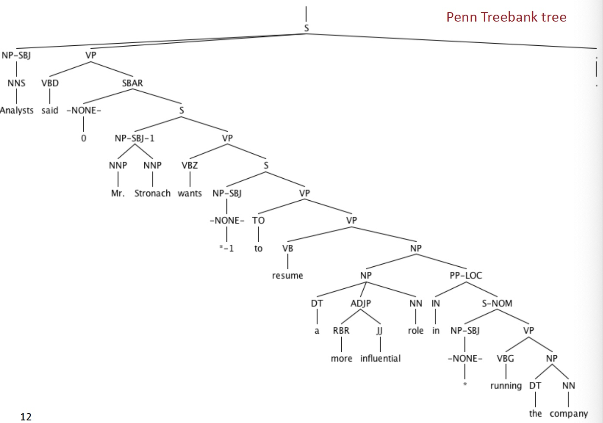

**2. Building on Word Vector Space Models**

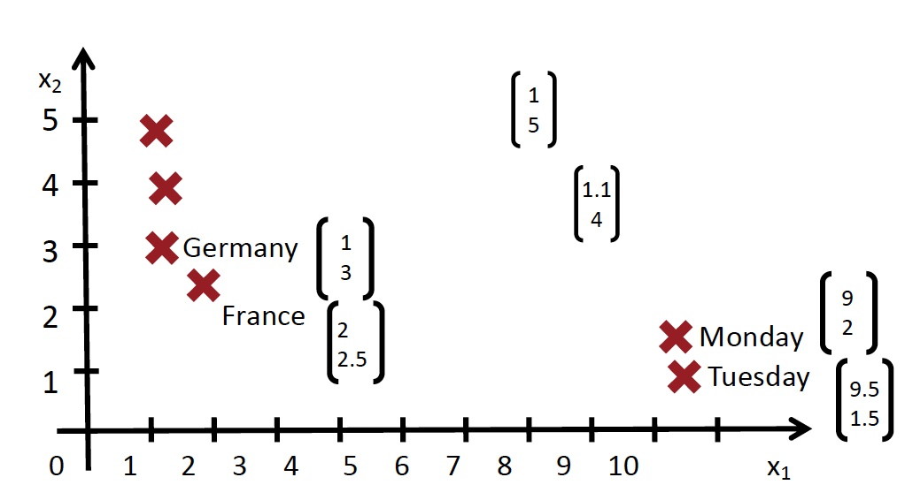

-   the country of my birth
-   the place where I was born
-   我们怎样表示更长短语的意思呢？
-   通过将他们映射到相同的向量空间！

**How should we map phrases into a vector space?**

-   基于组合原则，使用单词的含义和组合他们的规则，得到一个句子的含义向量
-   同时学习解析树以及组合向量表示

**Constituency Sentence Parsing: What we want**

**Learn Structure and Representation**

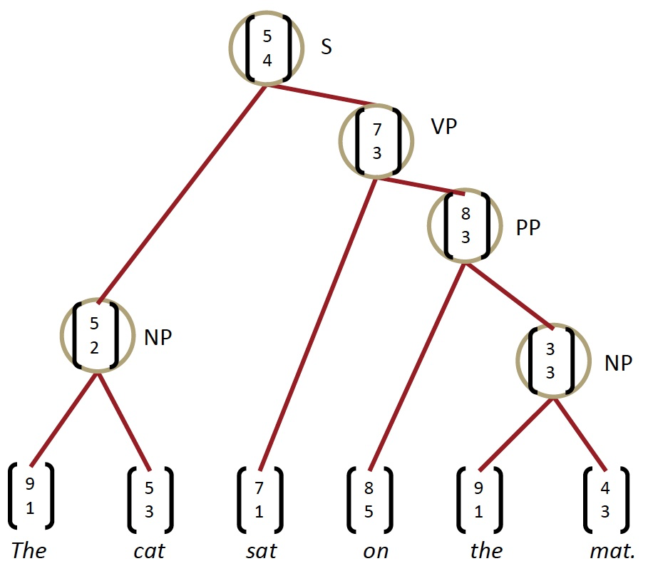

-   我们需要能够学习如何解析出正确的语法结构，并学习如何基于语法结构，来构建句子的向量表示

**Recursive vs. recurrent neural networks**

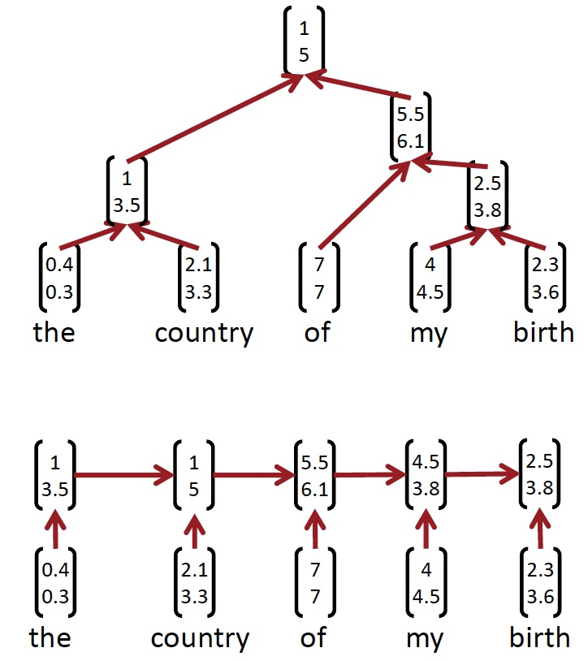

-   递归神经网络需要一个树结构
-   循环神经网络不能在没有前缀上下文的情况下捕捉短语，并且经常在最终的向量中过度捕捉最后一个单词

**Recursive Neural Networks for Structure Prediction**

如果我们自上而下的工作，那么我们在底层有单词向量，所以我们想要递归地计算更大成分的含义

输入：两个候选的子节点的表示

输出：

-   两个节点被合并后的语义表示
-   新节点的合理程度

**Recursive Neural Network Definition**

**Parsing a sentence with an RNN (greedily)**

**Parsing a sentence**

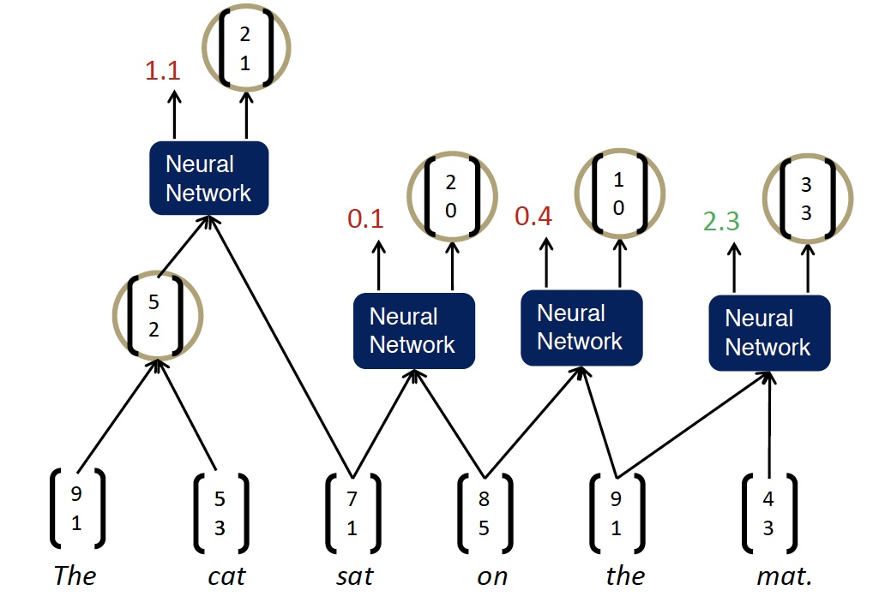

-   自左向右重复遍历，每次将得分最高的两者组合在一起

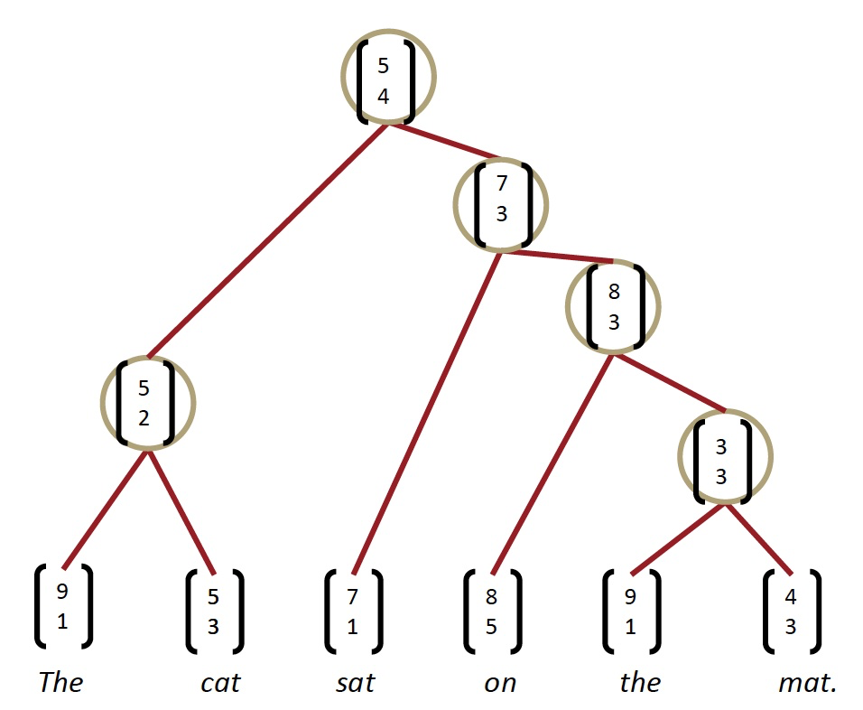

**Max-Margin Framework - Details**

-   树的得分是通过每个节点的解析决策得分的总和来计算的：

$$
s(x, y)=\sum_{n \in n o d e (y)} s_{n}
$$

-   x 是句子，y 是解析树

-   类似于最大边距解析（Taskar et al.2004），一个受监督的最大边际目标

$$
J=\sum_{i} s\left(x_{i}, y_{i}\right)-\max _{y \in A\left(x_{i}\right)}\left(s\left(x_{i}, y\right)+\Delta\left(y, y_{i}\right)\right)
$$

-   损失 $\Delta\left(y, y_{i}\right)$ 惩罚所有不正确的决策
-   结构搜索 $A(x)$ 是贪婪的（每次加入最佳节点）
    -   相反：使用 Beam search 搜索图

**Scene Parsing**

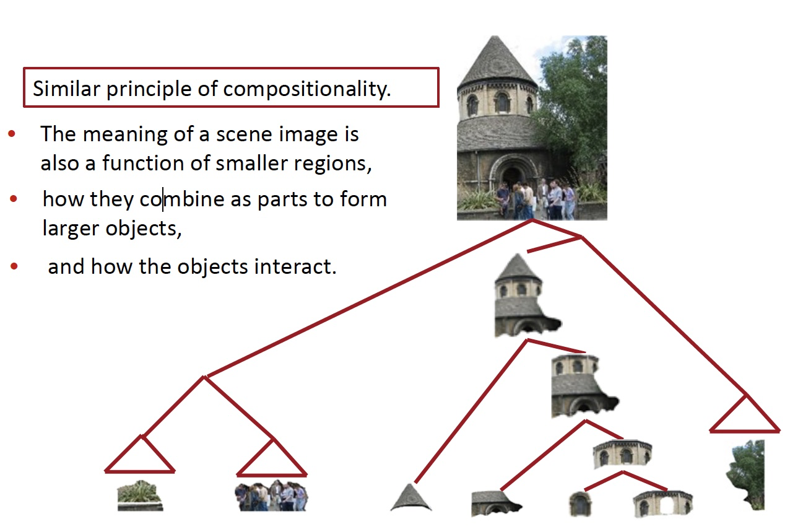

和组合类似的准则

-   场景图像的含义也是较小区域的函数
-   它们如何组合成部分以形成更大的对象
-   以及对象如何相互作用

**Algorithm for Parsing Images**

Same Recursive Neural Network as for natural language parsing! (Socher et al. ICML 2011)

**Multi-class segmentation**

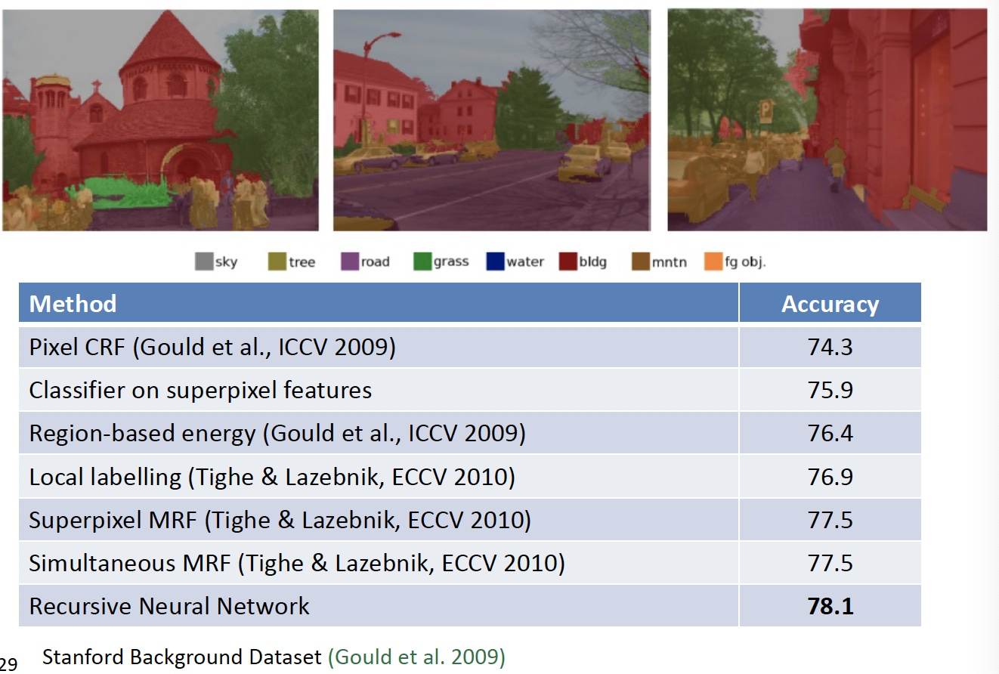

### 3. Backpropagation Through Structure

Introduced by Goller & Küchler (1996)

和通用的反向传播的规则相同
$$
\delta^{(l)}=\left(\left(W^{(l)}\right)^{T} \delta^{(l+1)}\right) \circ f^{\prime}\left(z^{(l)}\right), \quad \quad \quad \frac{\partial}{\partial W^{(l)}} E_{R}=\delta^{(l+1)}\left(a^{(l)}\right)^{T}+\lambda W^{(l)}
$$
递归和树结构导致的计算：

1.  从所有节点（如RNN）求和W的导数
2.  在每个节点处拆分导数（对于树）
3.  从父节点和节点本身添加错误消息

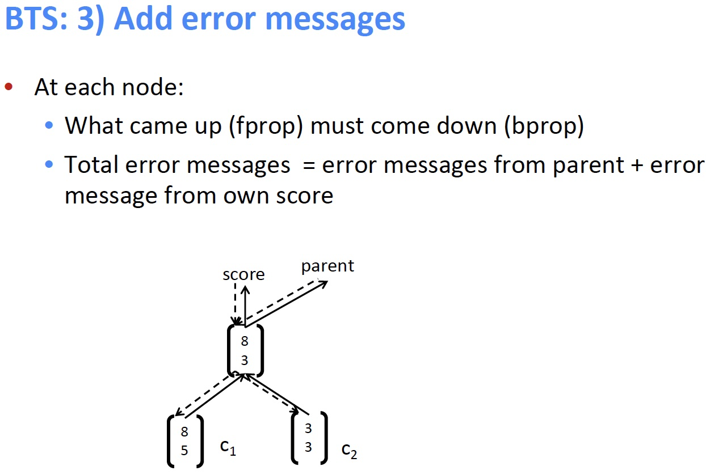

**Discussion: Simple TreeRNN**

-   使用单矩阵TreeRNN的结果
-   单个权重矩阵TreeRNN可以捕获一些现象但不适合更复杂的现象以及更高阶的构成和解析长句
-   输入词之间没有真正的交互
-   组合函数对于所有句法类别，标点符号等都是相同的

### 4. Version 2: Syntactically-Untied RNN

[Socher, Bauer, Manning, Ng 2013]

-   符号的上下文无关的语法（CFG）主干是足以满足基本的句法结构
-   我们使用子元素的离散句法类别来选择组合矩阵
-   对于不同的语法环境，TreeRNN可以针对不同的组合矩阵做得更好
-   结果为我们提供了更好的语义

-   左边 RNN 是使用概率的上下文无关的语法解析，为句子生成可能的树结构
-   右边 SU-RNN 是语法解开的递归神经网络，此时每个节点和序列都有一个类别，我们可以使用对应不同类别的矩阵组合起来，例如将类别 B 和类别 C 的矩阵组合起来作为本次计算的权重矩阵，所以这个权重矩阵是更符合句子结构的

**Compositional Vector Grammars**

-   问题：速度。Beam search 中的每个候选分数都需要一次矩阵向量乘法
-   解决方案：仅针对来自更简单，更快速模型（PCFG）的树的子集计算得分
    -   修剪非常不可能的速度候选人
    -   为每个 beam 候选者提供子句的粗略语法类别
-   组合矢量语法= PCFG + TreeRNN

**Related Work for parsing**

-   产生的 CVG Parser 与以前扩展PCFG解析器的工作有关
-   Klein and Manning (2003a)：手工特征工程
-   Petrov et al. (2006)：分解和合并句法类别的学习算法
-   词汇化解析器(Collins, 2003; Charniak, 2000)：用词汇项描述每个类别
-   Hall and Klein (2012) 在一个因式解析器中结合了几个这样的注释方案
-   CVGs 将这些想法从离散表示扩展到更丰富的连续表达

**SU-RNN / CVG [Socher, Bauer, Manning, Ng 2013]**

Learns soft notion of head words

初始化：$W^{(\cdot)}=0.5\left[I_{n \times n} I_{n \times n} 0_{n \times 1}\right]+\epsilon$

-   初始化为一对对角矩阵
-   学习的是一个短语中哪个子节点是重要的

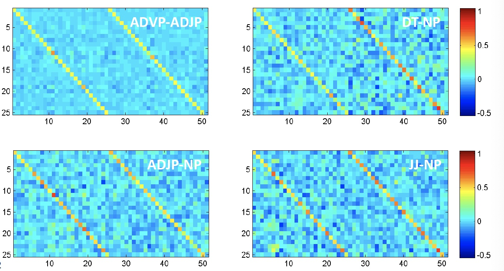

**Analysis of resulting vector representations**

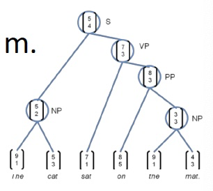

所有数据均根据季节变化进行调整

1.  所有数字都根据季节性波动进行调整
2.  调整所有数字以消除通常的季节性模式

Knight-Ridder不会评论这个提议

1.  Harsco declined to say what country placed the order

2.  Coastal wouldn’t disclose the terms

Sales grew almost 7% to $\text{\$UNK m.}$ from $\text{\$UNK m.}$

1. Sales rose more than 7% to $94.9 m. from $88.3 m.
2. Sales surged 40% to UNK b. yen from UNK b.

**Version 3: Compositionality Through Recursive Matrix-Vector Spaces**

[Socher, Huval, Bhat, Manning, & Ng, 2012]

-   之前：$p=\tanh \left(W\left[\begin{array}{l}{c_{1}} \\ {c_{2}}\end{array}\right]+b\right)$ ，$c_1$ 和 $c_2$ 之间并没有相互影响
-   使组合函数更强大的一种方法是解开权重 W
-   但是，如果单词主要作为运算符，例如 “very” in “very good”，是没有意义的，是用于增加 good 的规模的运算符
-   提案：新的组合函数
-   问题是如何定义呢，因为不知道 $c_1$ 和 $c_2$ 哪个是 operator，比如 very good ，就应该讲 very 视为作用在 good 的矩阵上的向量

**Compositionality Through Recursive Matrix-Vector Recursive Neural Networks**

-   每个单词都拥有一个向量意义和一个矩阵意义

**Matrix-vector RNNs**

[Socher, Huval, Bhat, Manning, & Ng, 2012]

-   左侧计算得到合并后的向量意义
-   右侧计算得到合并后的矩阵意义
-   可以捕获运算符语义，即中一个单词修饰了另一个单词的含义 

**Predicting Sentiment Distributions**

语言中非线性的好例子

**Classification of Semantic Relationships**

-   MV-RNN 可以学习到大的句法上下文传达语义关系吗？
-   
-   为包括两项的最小成分构建单个组合语义

-   问题：参数量过大，并且获得短语的矩阵意义的方式不够好

**Version 4: Recursive Neural Tensor Network**

Socher, Perelygin, Wu, Chuang, Manning, Ng, and Potts 2013

-   比 MV-RNN 更少的参数量
-   允许两个单词或短语向量乘法交互

**Beyond the bag of words: Sentiment detection**

一段文字的语调是积极的，消极的还是中性的？

-   某种程度上情绪分析是容易的
-   较长文档的检测精度~90％，但是

**Stanford Sentiment Treebank**

-   215,154 phrases labeled in 11,855 sentences
-   可以真的训练和测试组合

http://nlp.stanford.edu:8080/sentiment/

**Better Dataset Helped All Models**

-   严重的否定的案例仍然大多判断错误的
-   我们还需要一个更强大的模型！

想法：允许载体的加性和介导的乘法相互作用

-   在树中使用结果向量作为逻辑回归的分类器的输入
-   使用梯度下降联合训练所有权重

-   回到最初的使用向量表示单词的意义，但不是仅仅将两个表示单词含义的向量相互作用，左上图是在中间插入一个矩阵，以双线性的方式做注意力并得到了注意力得分。即令两个单词的向量相互作用并且只产生一个数字作为输出
-   如上中图所示，我们可以拥有三维矩阵，即多层的矩阵（二维），从而得到了两个得分
-   使用 softmax 做分类

**Positive/Negative Results on Treebank**

Classifying Sentences: Accuracy improves to 85.4

**Experimental Results on Treebank**

-   RNTN 可以捕捉类似 X but Y  的结构
-   RNTN accuracy of 72%, compared to MV-RNN (65%), biword NB (58%) and RNN (54%)

**Negation Results**

双重否定时，积极反应应该上升

-   Demo: http://nlp.stanford.edu:8080/sentiment/

**Version 5: Improving Deep Learning Semantic Representations using a TreeLSTM**

[Tai et al., ACL 2015; also Zhu et al. ICML 2015]

目标：

-   仍试图将句子的含义表示为（高维，连续）向量空间中的位置
-   一种准确处理语义构成和句子含义的方式
-   将广泛使用的链式结构LSTM推广到树结构

**Long Short-Term Memory (LSTM) Units for Sequential Composition**

门是 $[0,1]^{d}$ 的向量，用于逐元素乘积的软掩蔽元素

**Tree-Structured Long Short-Term Memory Networks** 

[Tai et al., ACL 2015]

**Tree-structured LSTM**

将连续LSTM推广到具有任何分支因子的树

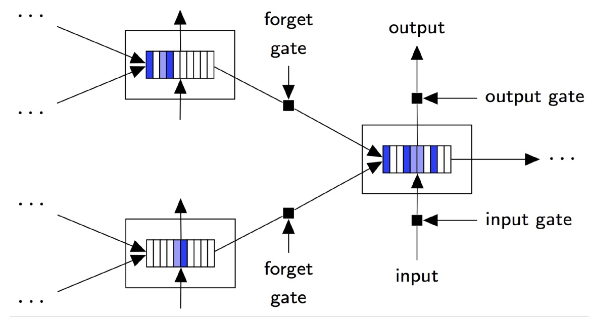

**Results: Sentiment Analysis: Stanford Sentiment Treebank**

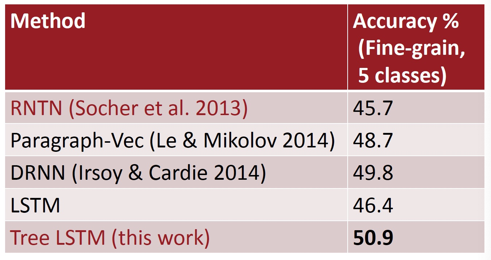

**Results: Semantic Relatedness SICK 2014 (Sentences Involving Compositional Knowledge)**

**Forget Gates: Selective State Preservation**

Stripes = forget gate activations; more white ⇒ more preserved

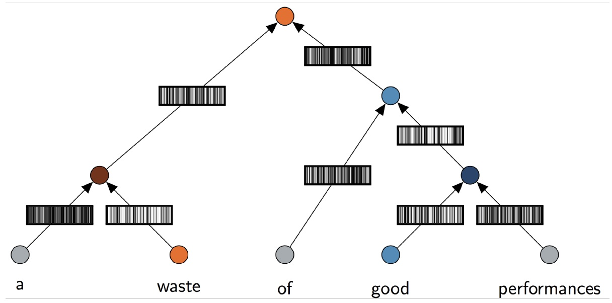

### 5. QCD-Aware Recursive Neural Networks for Jet Physics

Gilles Louppe, Kyunghun Cho, Cyril Becot, Kyle Cranmer (2017)

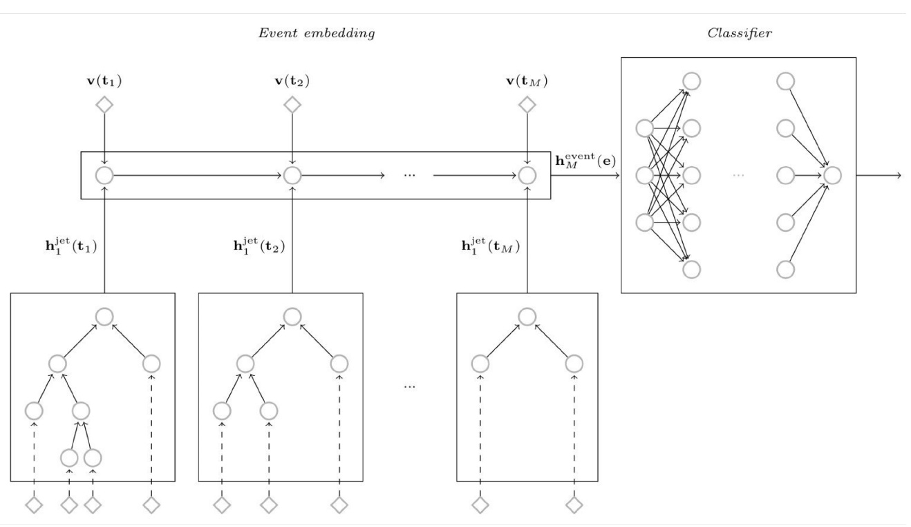

**Tree-to-tree Neural Networks for Program Translation**

[Chen, Liu, and Song NeurIPS 2018]

-   探索在编程语言之间使用树形结构编码和生成进行翻译
-   在生成中，将注意力集中在源树上

**Human-Centered Artificial Intelligence**

-   人工智能有望改变经济和社会，改变我们沟通和工作的方式，重塑治理和政治，并挑战国际秩序
-   HAI的使命是推进人工智能研究，教育，政策和实践，以改善人类状况

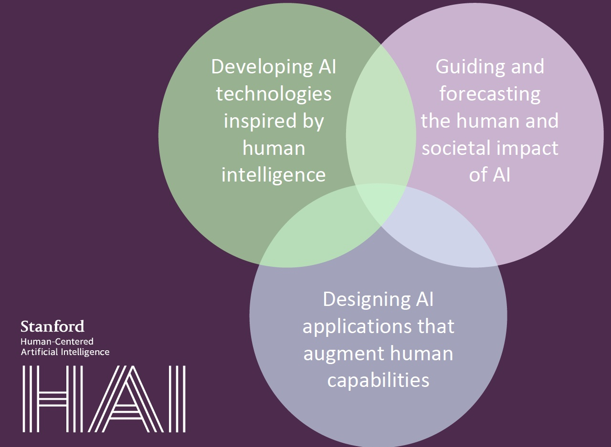

## Notes 09 Recursive Neural Networks and Constituency Parsing

## Reference

以下是学习本课程时的可用参考书籍：

[《基于深度学习的自然语言处理》](<https://item.jd.com/12355569.html>) （车万翔老师等翻译）

[《神经网络与深度学习》](<https://nndl.github.io/>)

以下是整理笔记的过程中参考的博客：

[斯坦福CS224N深度学习自然语言处理2019冬学习笔记目录](<https://zhuanlan.zhihu.com/p/59011576>) (课件核心内容的提炼，并包含作者的见解与建议)

[斯坦福大学 CS224n自然语言处理与深度学习笔记汇总](<https://zhuanlan.zhihu.com/p/31977759>) {>>这是针对note部分的翻译<<}