# CS224n-2019 学习笔记

-   结合每课时的课件、笔记与推荐读物等整理而成
-   作业部分将单独整理

## Lecture 19 Safety, Bias, and Fairness

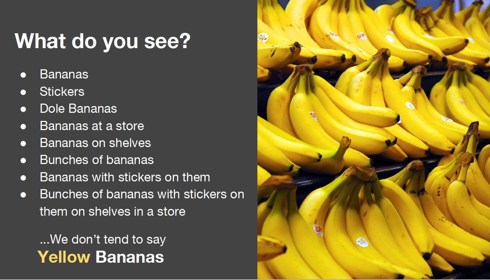

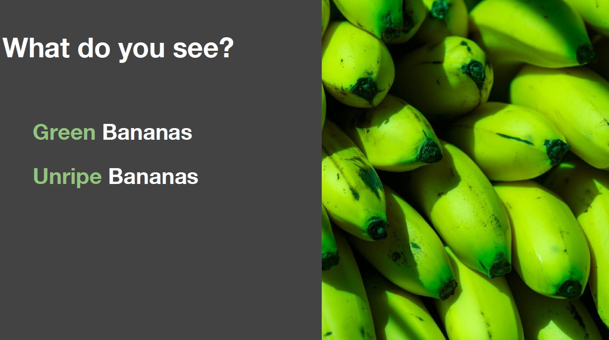

**Prototype Theory**

分类的目的之一是减少刺激行为和认知上可用的比例的无限差异

物品的一些核心、原型概念可能来自于存储的对象类别的典型属性(Rosch, 1975)

也可以存储范例(Wu & Barsalou, 2009)

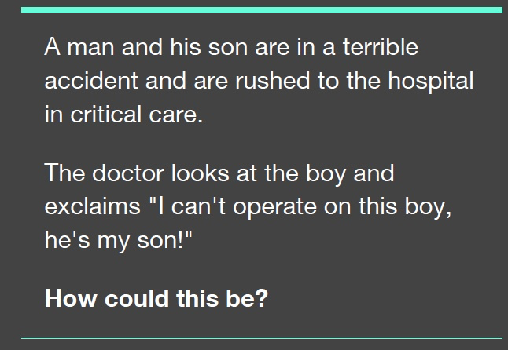

Doctor —— Female Doctor

大多数受试者忽视了医生是女性的可能性，包括男性、女性和自称女权主义者的人们。

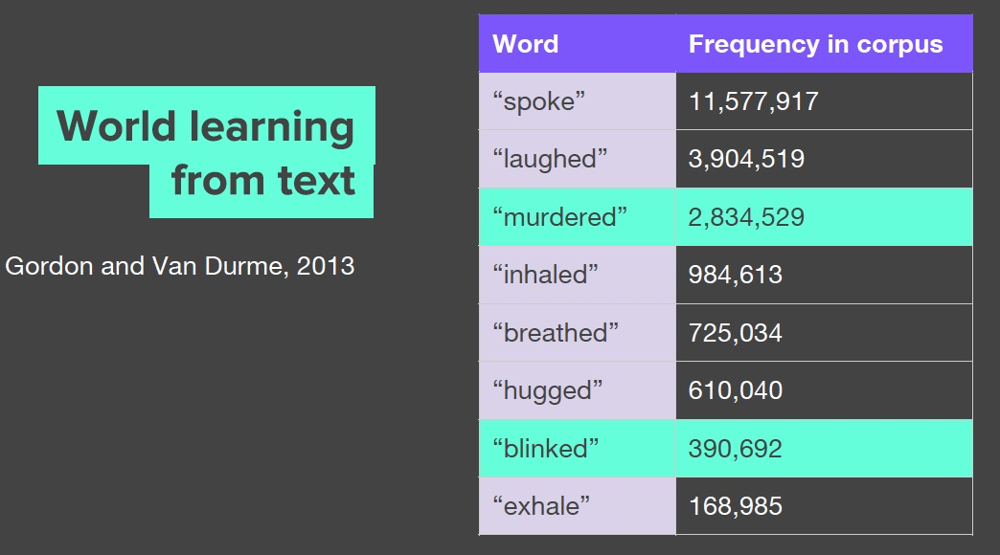

-   murdered 是 blinked 出现次数的十倍
-   我们不倾向于提及眨眼和呼吸等事情

Human Reporting Bias：人们写作中的行为、结果或属性的频率并不反映真实世界的频率，也不反映某一属性在多大程度上是某一类个体的特征。

更多关于我们处理世界和我们认为非凡的东西的实际情况。这影响到我们学习的一切。

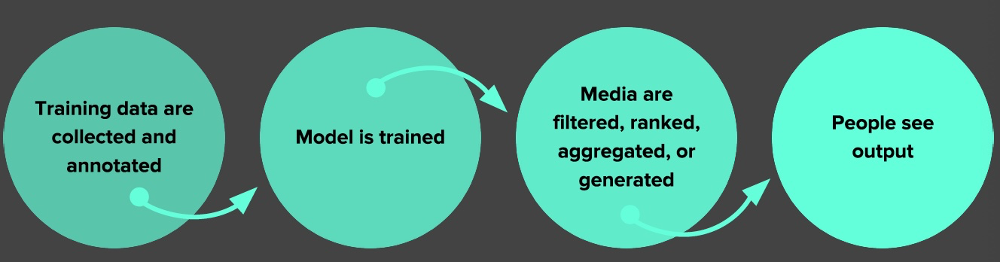

-   数据
    -   Reporting bias 报告偏见:人们分享的并不是真实世界频率的反映
    -   Selection Bias 选择偏差:选择不反映随机样本
    -   Out-group homogeneity bias 外群体同质性偏见:People tend to see outgroup members as more alike than ingroup members when comparing attitudes, values, personality traits, and other characteristics
-   解释
    -   Confirmation bias 确认偏见:倾向于寻找、解释、支持和回忆信息，以确认一个人先前存在的信念或假设
    -   Overgeneralization 泛化过度:根据过于笼统和/或不够具体的信息得出结论
    -   Correlation fallacy 相关性谬误:混淆相关性和因果关系
    -   Automation bias 自动化偏差:人类倾向于喜欢来自自动化决策系统的建议，而不是没有自动化的相互矛盾的信息

**Biases in Data**

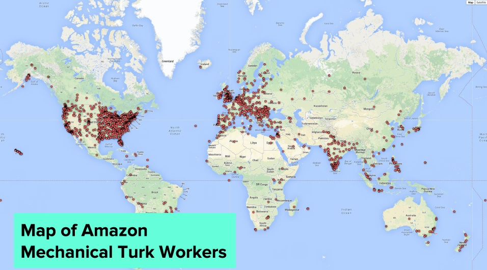

Selection Bias 选择偏差:选择不反映随机样本

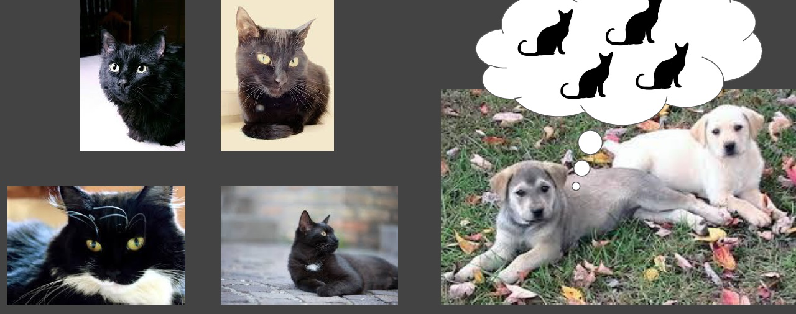

Out-group homogeneity bias 外群体同质性偏见：在比较态度、价值观、个性特征和其他特征时，往往群体外的成员认为比群体内的成员更相似

-   这有些难以理解：意思就是左边的四只猫之间是非常不同的，但是在狗的眼里他们是相同的

**Biases in Data → Biased Data Representation**

你可能对你能想到的每一个群体都有适当数量的数据，但有些群体的表现不如其他群体积极。

**Biases in Data → Biased Labels**

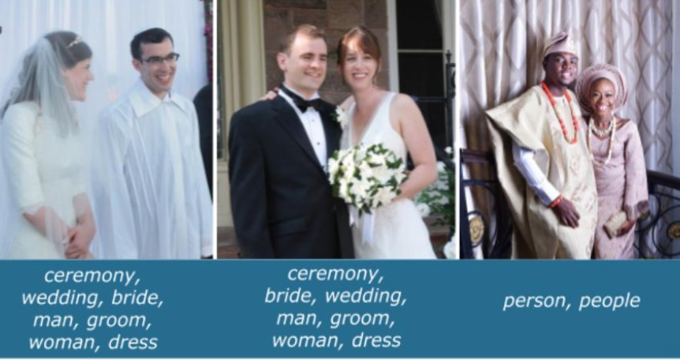

数据集中的注释将反映注释者的世界观

**Biases in Interpretation**

Confirmation bias 确认偏见:倾向于寻找、解释、支持和回忆信息，以确认一个人先前存在的信念或假设

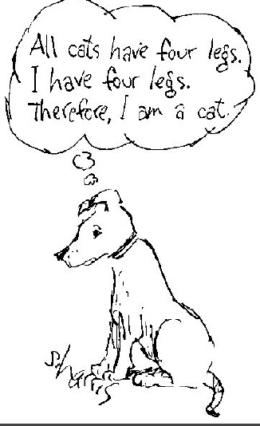

Overgeneralization 泛化过度:根据过于笼统和/或不够具体的信息得出结论（相关：过拟合）

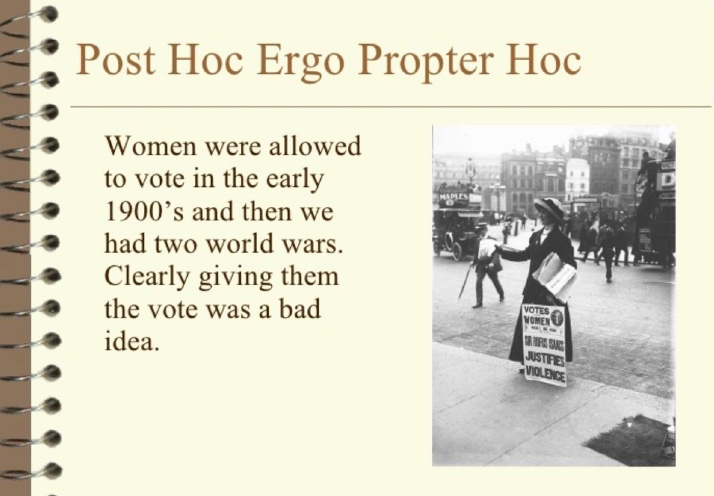

Correlation fallacy 相关性谬误:混淆相关性和因果关系

Automation bias 自动化偏差:人类倾向于喜欢来自自动化决策系统的建议，而不是没有自动化的相互矛盾的信息

-   会形成反馈循环
-   这被称为 Bias Network Effect 以及 Bias “Laundering”

人类数据延续了人类的偏见。当ML从人类数据中学习时，结果是一个偏置网络效应。

BIAS = BAD ??

**“Bias” can be Good, Bad, Neutral**

-   统计以及 ML中的偏差
    -   估计值的偏差：预测值与我们试图预测的正确值之间的差异
    -   “偏差”一词b(如y = mx + b)
-   认知偏见
    -   确认性偏差、近因性偏差、乐观性偏差
-   算法偏差
    -   对与种族、收入、性取向、宗教、性别和其他历史上与歧视和边缘化相关的特征相关的人的不公平、不公平或偏见待遇，何时何地在算法系统或算法辅助决策中体现出来”

-   如何避免算法偏差，开发出不会放大差异的算法

**Predicting Future Criminal Behavior**

-   算法识别潜在的犯罪热点
-   基于之前报道的犯罪的地方，而不是已知发生在哪里
-   从过去预测未来事件
-   预测的是逮捕的地方而不是犯罪的地方

**Predicting Sentencing**

-   Prater (白人)额定低风险入店行窃后,尽管两个武装抢劫;一次持械抢劫未遂。
-   Borden (黑色)额定高危后她和一个朋友(但在警察到来之前返回)一辆自行车和摩托车坐在外面。
-   两年后，Borden没有被指控任何新的罪行。Prater因重大盗窃罪被判8年有期徒刑。

系统默认认为黑人的犯罪风险高于拜仁

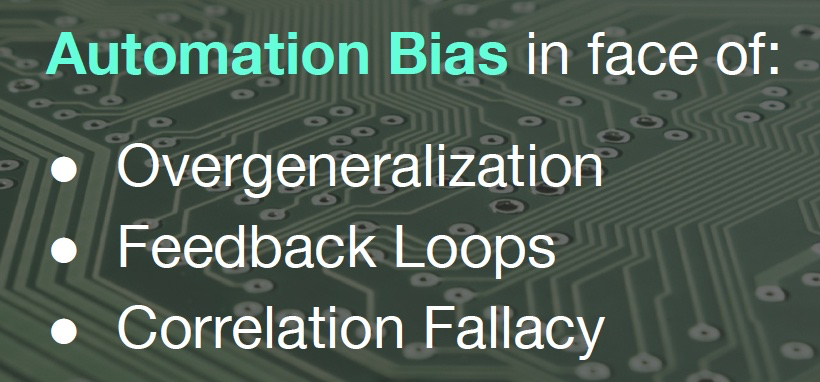

**Predicting Criminality**

以色列启动 Faception

Faception是第一个科技领域的率先面市的，专有的计算机视觉和机器学习技术分析人员和揭示他们的个性只基于他们的面部图像。

提供专业的引擎从脸的形象识别“高智商”、“白领犯罪”、“恋童癖”,和“恐怖分子”。

主要客户为国土安全和公共安全。

“[Automated Inference on Criminality using Face Images](https://arxiv.org/abs/1611.04135)” Wu and Zhang, 2016. arXiv

1856个紧密裁剪的面孔的图像,包括“通缉犯”ID特定区域的照片

存在确认偏差和相关性偏差

See our longer piece on Medium, [“Physiognomy’s New Clothes”](https://medium.com/@blaisea/physiognomys-new-clothes-f2d4b59fdd6a)

-   Selection Bias + Experimenter’s Bias + Confirmation Bias + Correlation Fallacy + Feedback Loops

**Predicting Criminality - The Media Blitz**

**(Claiming to) Predict Internal Qualities Subject To Discrimination**

**Predicting Homosexuality**

-   Wang and Kosinski, [Deep neural networks are more accurate than humans at detecting sexual orientation from facial images](https://psyarxiv.com/hv28a/), 2017.
-   “Sexual orientation detector” using 35,326 images from public profiles on a US dating website.
-   “与性取向的产前激素理论(PHT)相一致，男同性恋者和女同性恋者往往具有非典型的性别面部形态。”

-   在自拍中，同性恋和异性恋之间的差异与打扮、表现和生活方式有关，也就是说，文化差异，而不是面部结构的差异

See our longer response on Medium, “[Do Algorithms Reveal Sexual Orientation or Just Expose our Stereotypes?](https://medium.com/@blaisea/do-algorithms-reveal-sexual-orientation-or-just-expose-our-stereotypes-d998fafdf477)”

-   Selection Bias + Experimenter’s Bias + Correlation Fallacy

**Measuring Algorithmic Bias**

评估公平性和包容性

-   分类评估
    -   为每个创建（子组，预测）对。跨子组比较
    -   例如
        -   女性，面部检测
        -   男性，面部检测

-   交叉评估
    -   为每个创建（子组1，子组2，预测）对。跨子组比较
    -   例如
        -   黑人女性，面部检测
        -   白人，面部检测

**Evaluate for Fairness & Inclusion: Confusion Matrix**

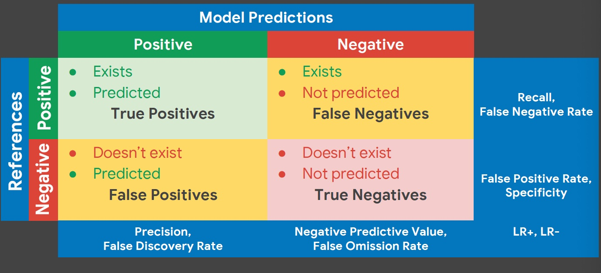

**Evaluate for Fairness & Inclusion**

-   “机会平等”公平准则：子组的 recall 是相等的

-   “预测平价”公平准则：子组的 precision 是相等

选择评价指标的可接受的假阳性和假阴性之间的权衡

**False Positives Might be Better than False Negatives**

-   Privacy in Images

-   Spam Filtering

**AI Can Unintentionally Lead to Unjust Outcomes**

-   缺乏对数据和模型中的偏见来源的洞察力
-   缺乏对反馈循环的洞察力
-   缺乏细心，分类的评价
-   人类偏见在解释和接受结果

**It’s up to us to influence how AI evolves.**

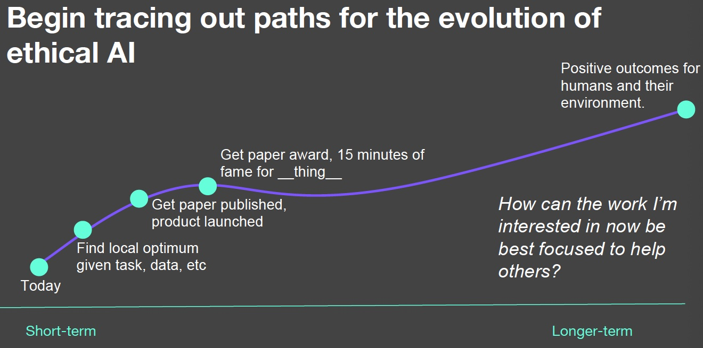

**Here are some things we can do.**

**Data**

**Data Really, Really Matters**

-   了解您的数据：偏差，相关性
-   从类似的分布放弃单一训练集/测试集
-   结合来自多个来源的输入
-   对于困难的用例使用held-out测试集
-   与专家讨论其他信号

**Understand Your Data Skews**

Facets: pair-code.github.io

没有一个数据集是没有偏差的，因为这是一个有偏差的世界。重点是知道是什么偏差。

**Machine Learning**

**Use ML Techniques for Bias Mitigation and Inclusion**

Bias Mitigation 偏差缓解

-   删除有问题的输出的信号
    -   刻板印象
    -   性别歧视,种族歧视,*-ism
    -   又称为“debiasing”

Inclusion

-   添加信号所需的变量
    -   增加模型性能
    -   注意性能很差的子组或数据片

**Multi-task Learning to Increase Inclusion**

**Multiple Tasks + Deep Learning for Inclusion: Multi-task Learning Example**

Benton, Mitchell, Hovy. [Multi-task learning for Mental Health Conditions with Limited Social Media Data](http://m-mitchell.com/publications/multitask-clinical.pdf). EACL, 2017.

-   与宾夕法尼亚大学WWP合作
-   直接与临床医生合作
-   目标
    -   系统警告临床医生如果企图自杀迫在眉睫
    -   几个训练实例可用时诊断的可行性

-   内部数据
    -   电子健康记录
        -   病人或病人家属提供
        -   包括心理健康诊断,自杀企图,竞赛
    -   社交媒体数据
-   代理数据
    -   Twitter 媒体数据
        -   代理心理健康诊断中使用自称诊断
            -   我被诊断出患有 X
            -   我试图自杀

**Single-Task: Logistic Regression**

**Single-Task: Deep Learning**

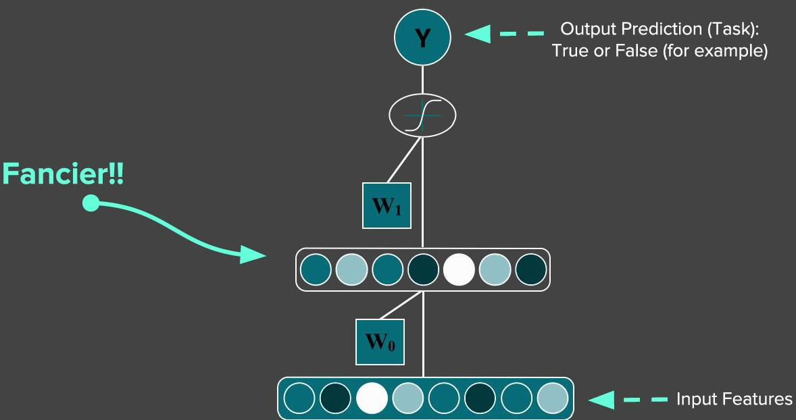

**Multiple Tasks with Basic Logistic Regression**

**Multi-task Learning**

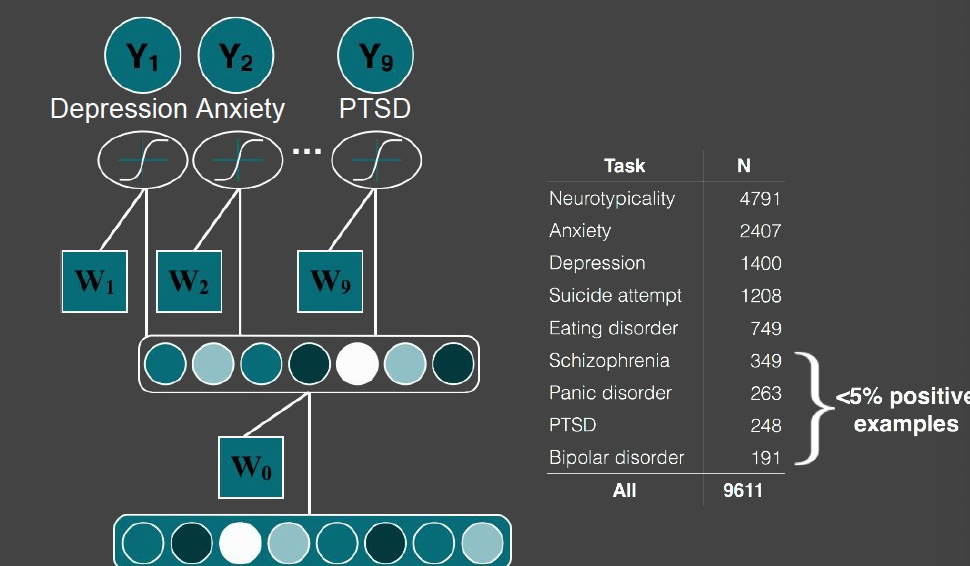

Multitask, given cormorbidity

Benton, Mitchell, Hovy. [Multi-task learning for Mental Health Conditions with Limited Social Media Data.](http://m-mitchell.com/publications/multitask-clinical.pdf) EACL, 2017.

**Improved Performance across Subgroups**

**Reading for the masses….**

**Adversarial Multi-task Learning to Mitigate Bias**

**Multitask Adversarial Learning**

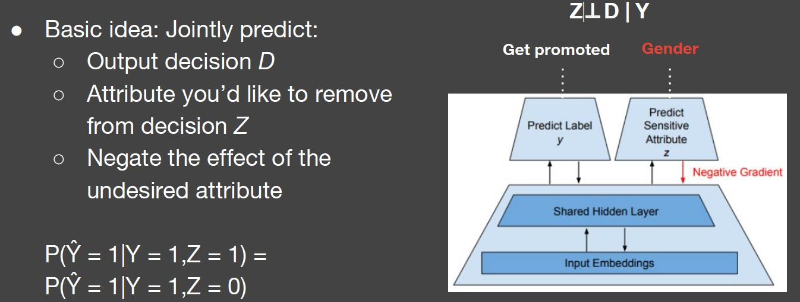

Beutel, Chen, Zhao, Chi. [Data Decisions and Theoretical Implications when Adversarially Learning Fair Representations](https://arxiv.org/abs/1707.00075). FAT/ML, 2017.

Zhang, Lemoine, Mitchell. [Mitigating Unwanted Biases with Adversarial Learning](https://arxiv.org/abs/1801.07593). AIES, 2018.

**Equality of Opportunity in Supervised Learning**

 考虑到真正正确的决策，分类器的输出决策应该在敏感特征之间是相同的。

**Case Study: Conversation AI Toxicity**

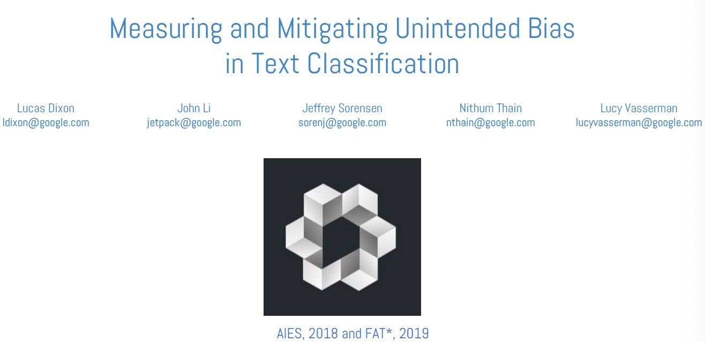

-   Conversation-AI
    -   ML 提高在线对话的规模

-   Research Collaboration
    -   Jigsaw, CAT, several Google-internal teams, and external partners (NYTimes, Wikimedia, etc)

http://perspectiveapi.com/

**Unintended Bias**

模型错误地将经常受到攻击的身份与毒性联系起来：False Positive Bias

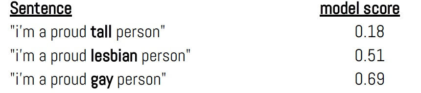

**Bias Source and Mitigation**

-   偏见造成的数据不平衡
    -   经常袭击了有毒的身份所占比例评论长度问题

-   添加维基百科文章中假定的无毒数据来修复这种不平衡
    -   原始数据集有127820个例子
    -   4620个补充的无毒例子

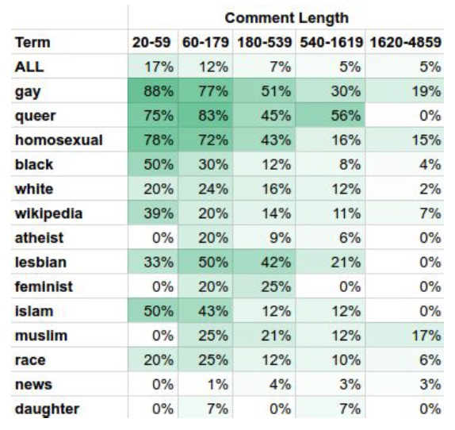

**Measuring Unintended Bias - Synthetic Datasets**

挑战与真实数据

-   现有数据集是小 and/or 有错误的相关性
-   每个例子是完全独特的

Approach: "bias madlibs”: 一个综合生成的模板化数据集进行评估

**Assumptions**

-   数据集是可靠的
    -   和产品相似的分布
    -   忽略注释器偏见
    -   没有因果分析

**Deep Learning Model**

-   CNN 架构
-   预训练的 GloVe 嵌入
-   Keras 实现

**Measuring Model Performance**

How good is the model at distinguishing good from bad examples? (ROC-AUC)

AUC (for a given test set) = Given two randomly chosen examples, one in-class (e.g. one is toxic and the other is not), AUC is the probability that the model will give the in-class example the higher score.

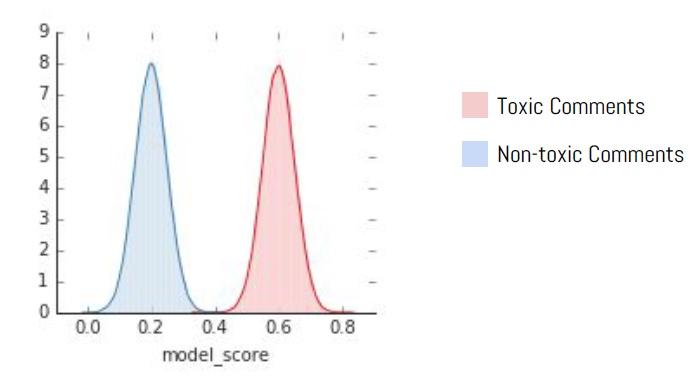

**Types of Bias**

**Low Subgroup Performance**

模型在子组注释上的性能比在总体注释上差

Metric : Subgroup AUC

**Subgroup Shift (Right)**

该模型系统地对来自子组的评价打分更高

Metric: BPSN AUC

(Background Positive Subgroup Negative)

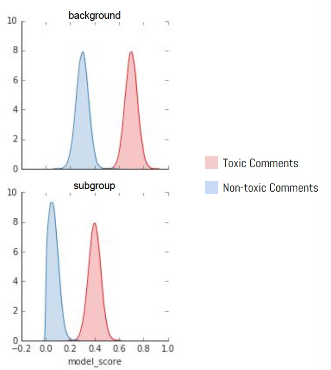

**Subgroup Shift (Left)**

该模型系统地对来自子组的评价打分较低。

Metric: BNSP AUC

(Background Negative Subgroup Positive)

**Release Responsibly**

**Model Cards for Model Reporting**

目前还没有模型发布时报告模型效果的common practice

-   What It Does
    -   一份关注模型性能透明度的报告，以鼓励负责任的人工智能的采用和应用。
-   How It Works
    -   这是一个容易发现的和可用的工件在用户旅程中重要的步骤为一组不同的用户和公共利益相关者。
-   Why It Matter
    -   它使模型开发人员有责任发布高质量和公平的模型。

**Intended Use, Factors and Subgroups**

**Metrics and Data**

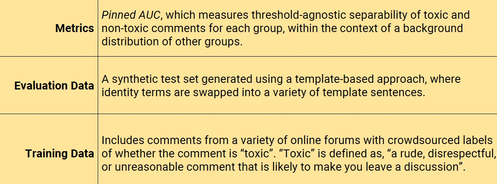

**Considerations, Recommendations**

**Disaggregated Intersectional Evaluation**

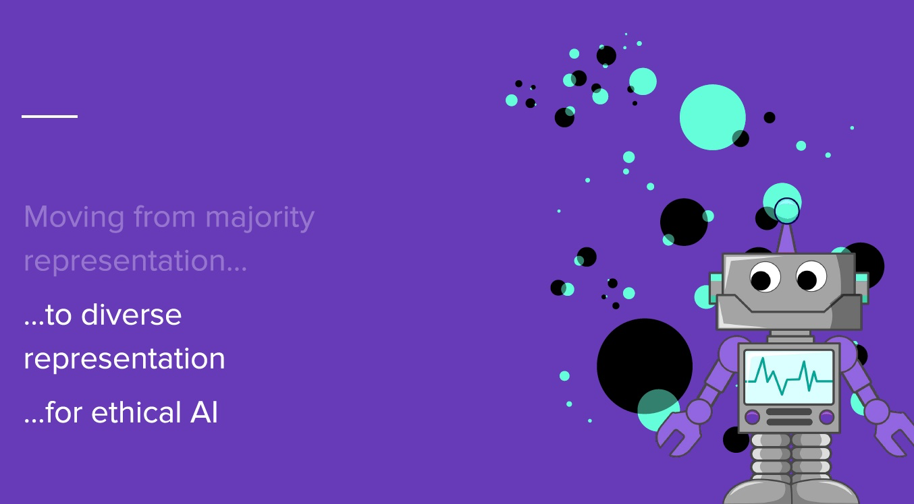

## Reference

以下是学习本课程时的可用参考书籍：

[《基于深度学习的自然语言处理》](<https://item.jd.com/12355569.html>) （车万翔老师等翻译）

[《神经网络与深度学习》](<https://nndl.github.io/>)

以下是整理笔记的过程中参考的博客：

[斯坦福CS224N深度学习自然语言处理2019冬学习笔记目录](<https://zhuanlan.zhihu.com/p/59011576>) (课件核心内容的提炼，并包含作者的见解与建议)

[斯坦福大学 CS224n自然语言处理与深度学习笔记汇总](<https://zhuanlan.zhihu.com/p/31977759>) {>>这是针对note部分的翻译<<}