# CS224n-2019 学习笔记

-   结合每课时的课件、笔记与推荐读物等整理而成
-   作业部分将单独整理

## Lecture 20 The Future of NLP + Deep Learning

**Deep Learning for NLP 5 years ago**

-   No Seq2Seq
-   No Attention
-   No large-scale QA/reading comprehension datasets
-   No TensorFlow or Pytorch

**Future of Deep Learning + NLP**

-   利用无标签数据
    -   Back-translation 和 无监督机器翻译
    -   提高预训练和GPT-2
-   接下来呢？
    -   NLP技术的风险和社会影响
    -   未来的研究方向

**Why has deep learning been so successful recently?**

-   扩展能力（模型和数据大小）是深度学习近些年来成功的原因
-   过去受到计算资源和数据资源的规模限制

**Big deep learning successes**

三个使用大量数据获得成功的范例

-   图像识别：被 Google, Facebook 等广泛使用
    -   ImageNet: 14 million examples

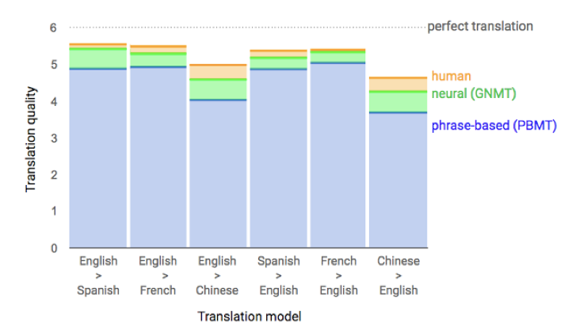

-   机器翻译：谷歌翻译等
    -   WMT: Millions of sentence pairs

-   打游戏：Atari Games, AlphaGo, and more
    -   10s of millions of frames for Atari AI
    -   10s of millions of self-play games for AlphaZero

**NLP Datasets**

-   即使是英语，大部分任务也只有 100k 或更少的有标签样本
-   其他语言的可用数据就更少了
    -   有成千上万的语言，其中有成百上千的语言的母语使用者是大于一百万的
    -   只有 10% 的人将英语作为他们的第一语言
-   越来越多的解决方案是使用 **无标签** 数据

### Using Unlabeled Data for Translation

**Machine Translation Data**

-   获得翻译需要人类的专业知识
    -   限制数据的大小和领域

-   语言文本更容易获得

**Pre-Training**

-   分别将两个预训练好的语言模型作为 Encoder 和 Decoder 

-   然后使用双语数据共同训练

-   English -> German Results: 2+ BLEU point improvement

[Ramachandran et al., 2017](https://www.aclweb.org/anthology/D17-1039)

**Self-Training**

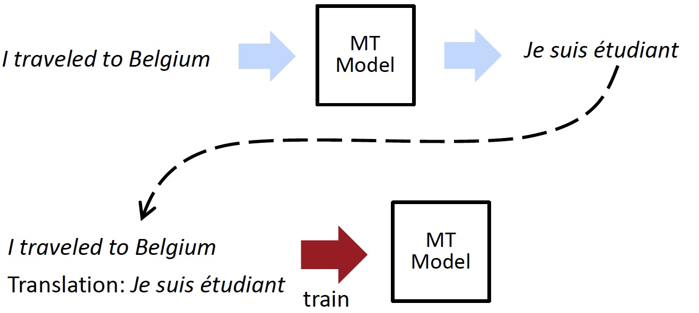

-   预训练的问题：预训练中两个语言之间没有交互
-   自训练：标记未标记的数据以获得有噪声的训练样本

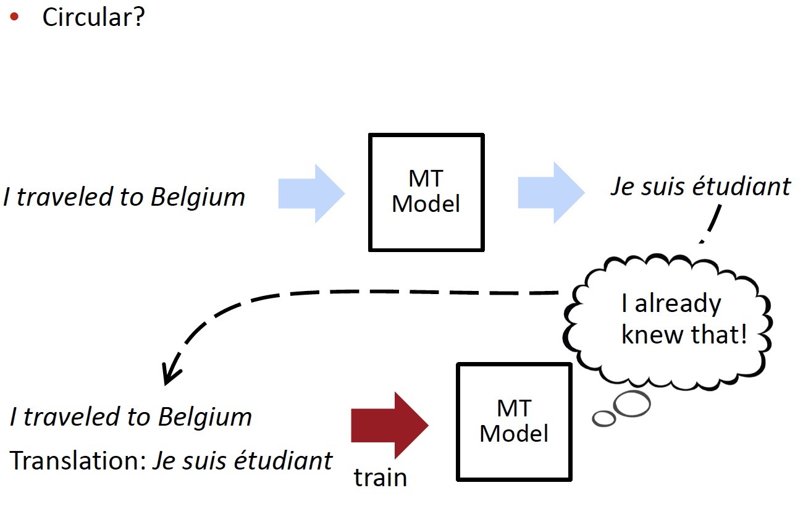

-   自训练技术没有被广泛使用，因为其训练的来源是其之前的产出

**Back-Translation**

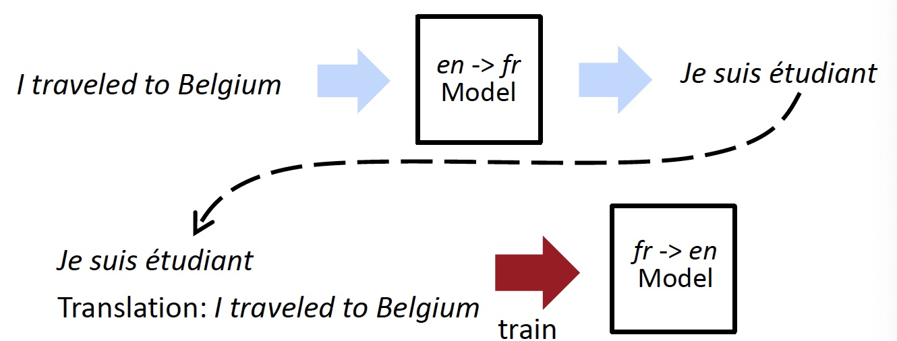

-   有两种方向相反的机器翻译模型 $\text{en} \to \text{fr}$ 和  $\text{fr} \to \text{en}$
-   不再循环
-   模型再也看不到“坏”翻译,只有坏输入
-   模型训练时会加入一些标记数据，确保 $\text{en} \to \text{fr}$ 模型的输出，即  $\text{fr} \to \text{en}$ 模型的输入，从而保证模型的正常
-   如何协调对标记数据与未标记数据的训练呢？
    -   先在标记数据上训练两个模型
    -   然后在未标记数据上标记一些数据
    -   再在未标记数据上进行反向翻译的训练
    -   重复如上的过程

**Large-Scale Back-Translation**

-   4.5M English-German sentence pairs and 226M monolingual sentences

**What if there is no Bilingual Data?**

当我们只有未标记的句子时，我们使用一种比完全的翻译更简单的任务

-   不是做句子翻译
-   而是做单词翻译

我们想要找到某种语言的翻译但不使用任何标记数据

**Unsupervised Word Translation**

-   跨语言文字嵌入 cross-lingual word embeddings
    -   两种语言共享嵌入空间
    -   保持词嵌入的正常的好属性
    -   但也要接近他们的翻译
-   想从单语语料库中学习

-   如上图所示，在共享的嵌入空间中，每个英文单词都有其对应的德语单词，并且距离很近
-   我们在使用时，只需选取英文单词在嵌入空间中距离最近的德语单词，就可以获得对应的翻译

-   词嵌入有很多结构
-   假设:不同语言之间的结构应该相似

即使是运行两次 word2vec 会获得不同的词嵌入，嵌入空间的结构有很多规律性

-   如上图所示，是英语与意大利语的词嵌入，矢量空间看上去彼此十分不同，但是结构是十分相似的
    -   可以理解为，在英语词嵌入空间中的 cat 与 feline 的距离与意大利语词典如空间中的 gatto 和 felino 之间的距离是相似的
-   我们在跨语言的词嵌入中想要学习不同种语言的词嵌入之间的对齐方式

-   首先在单语语料库上运行 word2vec 以得到单词嵌入 X 和 Y
-   学习一个（正交）矩阵 W 使得 WX~Y
    -   使用对抗训练来学习 W
    -   鉴别器：预测一个嵌入是来自于 Y 的还是来自于 X 并使用 W 转换后的嵌入
    -   训练 W 使得鉴别器难以区分这两者
    -   其他可以被用来进一步提升效果的方法参见 [Word Translation without Parallel Data](https://arxiv.org/pdf/1710.04087.pdf)
    -   正交性来约束词嵌入的原因是为了防止过拟合
        -   我们假设我们的嵌入空间是类似的，只是需要对英语的词向量和意大利语的词向量进行旋转

**Unsupervised Machine Translation**

-   模型：不考虑不同输入和输出语言，使用相同的(共享的) encoder-decoder (没有使用注意力)
    -   使用 cross-lingual 的词嵌入来初始化，即其中的英语和法语单词应该看起来完全相同

-   我们可以喂给 encoder 一个英文句子，也可以喂一个法语句子，从而获得 cross-lingual embeddings ，即英文句子和法语句子中各个单词的词嵌入，这意味着 encoder 可以处理任何输入
-   对于 decoder，我们需要喂一个特殊的标记 $\text{<Fr>}$ 来告诉模型应该生成什么语言的输出
    -   可以用做一个 auto-encoder，完成 $en \to en$ ，即再现输入序列

接下里是模型的训练过程

-   Training objective 1: de-noising autoencoder 去噪自编码器
    -   输入一个打乱后的英语 / 法语句子
    -   输出其原来的句子
    -   由于这是一个没有注意力机制的模型，编码器将整个源句子转换为单个向量，自编码器的作用是保证来自于 encoder 的向量包含和这个句子有关的，能使得我们恢复原来的句子的所有信息

-   Training objective 2: back translation (只有无标签的数据)
    -   首先翻译 $fr \to en$
    -   然后使用一个监督样本来训练 $en \to fr$ 
-   注意，这里的 $fr \to en$ 输出的句子，是 $en \to fr$ 输入的句子，这个句子是有些混乱的，不完美的，例如这里的 “I am student”，丢失了 “a”
-    我们需要训练模型，即使是有这样糟糕的输入，也能够还原出原始的法语句子

**Why Does This Work?**

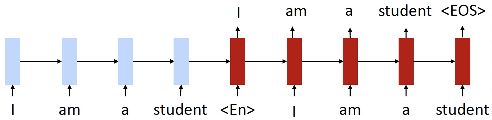

-   跨语言嵌入和共享编码器为模型提供了一个起点
    -   使用 cross-lingual 的词嵌入来初始化，即其中的英语和法语单词应该看起来完全相同

-   共享编码器
    -   例如我们以一个法语句子作为模型的输入
    -   由于嵌入看起来非常相似，并且我们使用的是相同的 encoder
    -   因此 encoder 得到的法语句子的 representation 应该和英语句子的 representation 非常相似
    -   所以希望能够获得和原始的英语句子相同的输出

-   目标鼓励 language-agnostic 语言无关的表示
    -   获得一个与语言类型无关的 encoder vector

**Unsupervised Machine Translation**

>   [Lample et al., 2018](https://arxiv.org/pdf/1711.00043.pdf)

-   水平线是无监督模型，其余的都是有监督的
-   在一定的监督数据规模下，无监督模型能够取得和监督模型类似的效果
-   当然，随着数据规模的增大，监督模型的效果会提升，超过无监督模型

**Attribute Transfer**

还可以使用无监督的机器翻译模型完成属性转移

>   [Lample et al., 2019](https://openreview.net/forum?id=H1g2NhC5KQ)

-   Collector corpora of “relaxed” and “annoyed” tweets using hashtags
-   Learn un unsupervised MT model

**Not so Fast**

-   英语，法语和德语是相当类似的语言
-   在非常不同的语言上（例如英语和土耳其语）
    -   完全的无监督的词翻译并不十分有效。需要种子字典可能的翻译
        -   简单的技巧：使用相同的字符串从词汇
    -   UNMT几乎不工作

**Cross-Lingual BERT**

>   [Lample and Conneau., 2019](https://arxiv.org/pdf/1901.07291.pdf)

-   上图 1 是常规的 BERT ，有一系列的英语句子，并且会 mask 一部分单词
    -   谷歌实际上已经完成的是训练好的多语言的 BERT
    -   基本上是连接一大堆不同语言的语料库，然后训练一个模型
        -   masked LM training objective
-   上图 2 是 Facebook 提出的
    -   联合了 masked LM training objective 和 翻译
    -   给定一个英语句子和法语句子，并分别 mask 一部分单词，并期望模型填补

Unsupervised MT Results

### Huge Models and GPT-2

**Training Huge Models**

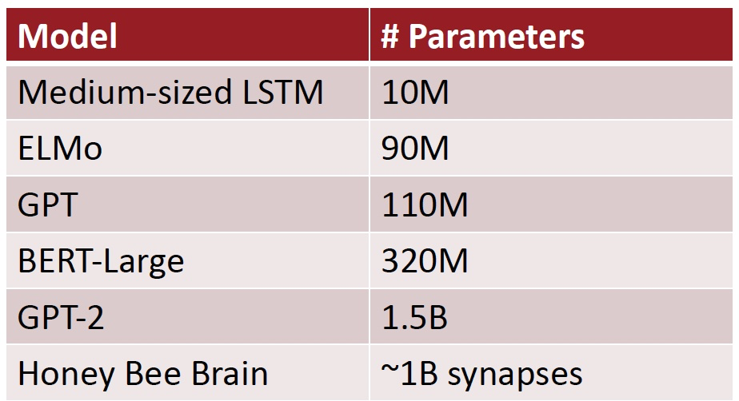

**This is a General Trend in ML**

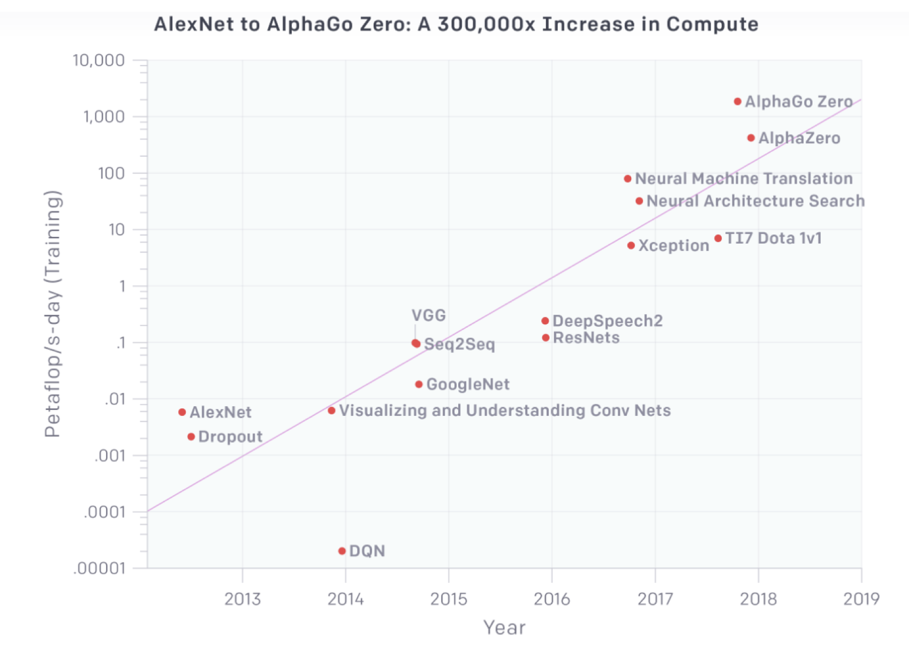

-   peta : 用于计量单位，表示10的15次方，表示千万亿次
-   FLOPS = FLoating-point Operations Per Second，每秒浮点运算次数

**Huge Models in Computer Vision**

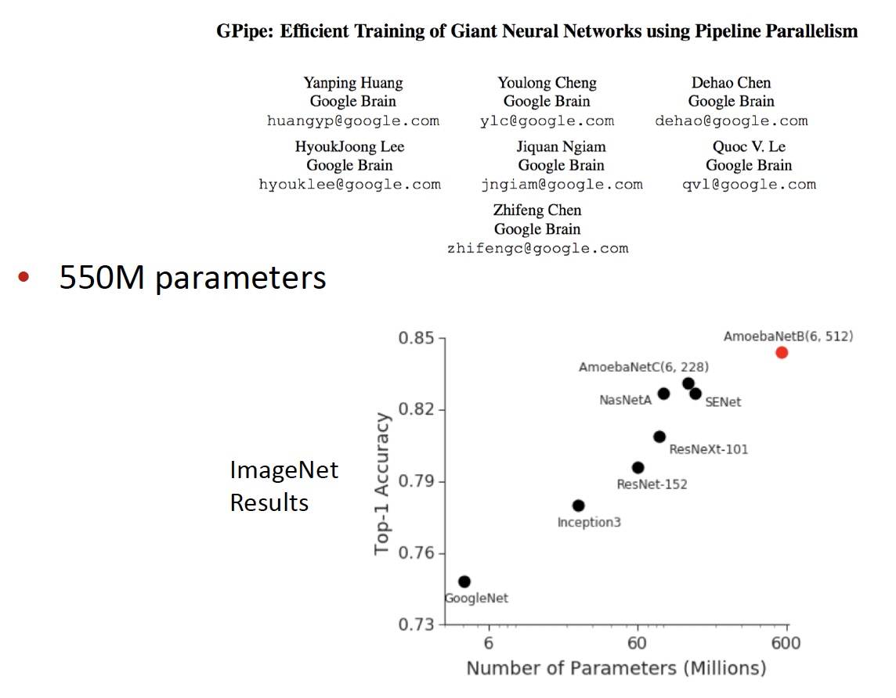

**Training Huge Models**

-   更好的硬件
-   数据和模型的并行化

**GPT-2**

-   只是一个非常大的 Transformer LM
-   40 GB的训练文本
    -   投入相当多的努力去确保数据质量
    -   使用 reddit  中获得高投票的网页 link

**So What Can GPT-2 Do?**

-   显然，语言建模(但是非常好)
-   数据集上得到最先进的困惑，甚至没有训练

>   [Radford et al., 2019](https://d4mucfpksywv.cloudfront.net/better-language-models/language_models_are_unsupervised_multitask_learners.pdf)

-   **Zero-Shot Learning**: no supervised training data! 在没有接受过训练的情况下常识完成任务

    -   Ask LM to generate from a prompt

-   **Reading Comprehension:** \<context\> \<question\> A:

-   **Summarization:** \<article\> TL;DR:

-   **Translation:**

    \<English sentence1\> = \<French sentence1\>

    \<English sentence 2\> = \<French sentence 2\>

    **…..**

    \<Source sentenc\> =

-   **Question Answering:** \<question\> A:

**GPT-2 Results**

**How can GPT-2 be doing translation?**

-   它有一个很大的语料库，里面几乎全是英语

-    由于数据集中存在一些翻译的例子
    -   法语习语及其翻译
    -   法语引用及其翻译

**GPT-2 Question Answering**

-   Simple baseline: 1% accuracy
-   GPT-2: ~4% accuracy
-   Cherry-picked most confident results 精选出最自信的结果

**What happens as models get even bigger?**

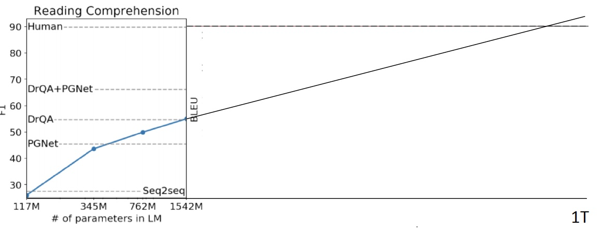

-   对于一些任务，性能似乎随着 log(模型大小) 的增加而增加

-   但如下图所示趋势并不明朗

**GPT-2 Reaction**

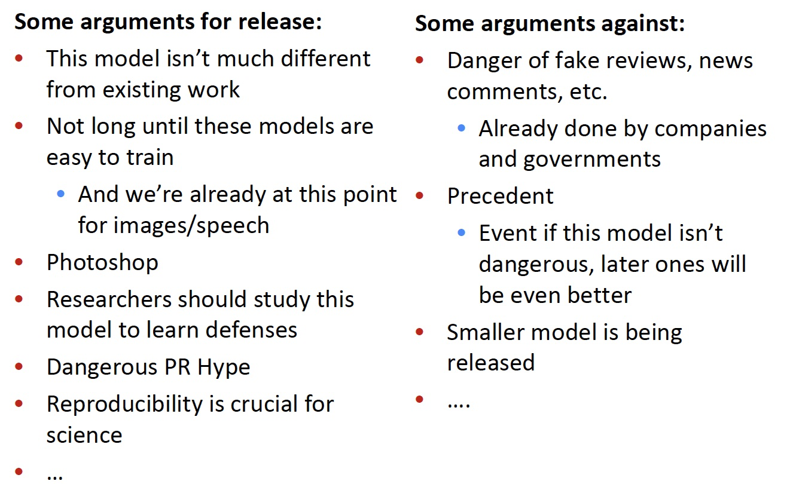

-   NLP专家应该做这些决定吗？
    -   计算机安全专家？
    -   技术和社会专家？
    -   道德专家？
-   需要更多的跨学科科学
-   许多NLP具有较大社会影响的例子，尤其是对于偏见/公平

**High-Impact Decisions**

-   越来越感兴趣用NLP帮助高影响力的决策
    -   司法判决
    -   招聘
    -   等级测试
-   一方面，可以快速评估机器学习系统某些偏见
-   然而，机器学习反映了训练数据
    -   甚至放大偏见…这可能导致更偏向数据的创建

**Chatbots**

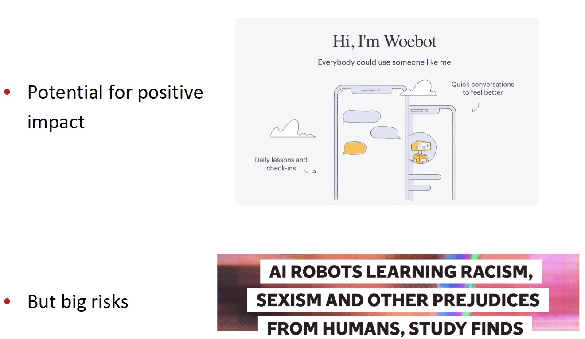

### What did BERT “solve” and what do we work on next?

**GLUE Benchmark Results**

**The Death of Architecture Engineering?**

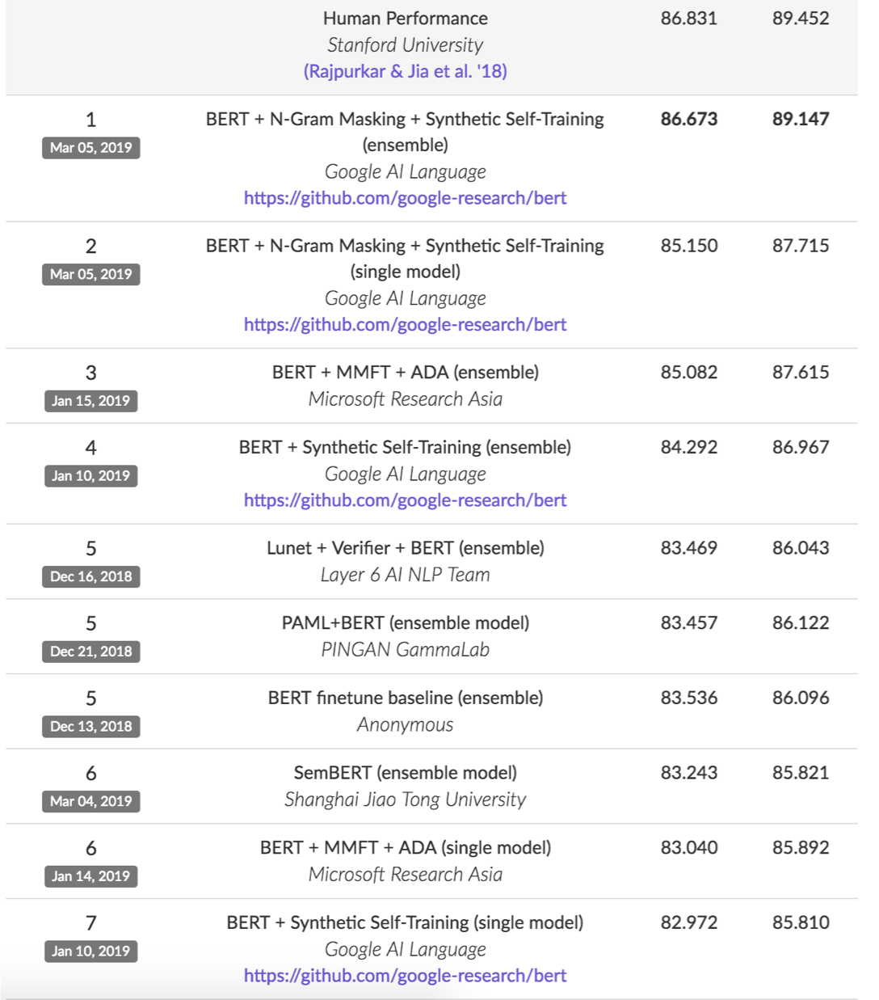

-   花费六个月来研究 体系结构的设计，得到了 1 F1 的提升
-   或知识让 BERT 变得 3 倍大小，得到了 5 F1 的提升
-   SQuAD 的 TOP20  参赛者都是用了 BERT

**Harder Natural Language Understanding**

-   阅读理解
    -   在长文档或多个文档
    -   需要多跳推理
    -   在对话中定位问答
-   许多现有阅读理解数据集的关键问题：人们写问题时看着上下文
    -   不现实的
    -   鼓励简单的问题

**QuAC: Question Answering in Context**

>   [Choi et al., 2018](https://arxiv.org/pdf/1808.07036.pdf)

-   学生问问题，老师回答的对话
    -   教师看到维基百科文章主题，学生不喜欢
-    仍然和人类水平有很大差距

**HotPotQA**

>   [Zang et al., 2018](https://arxiv.org/pdf/1809.09600.pdf)

-   设计要求多跳推理
-   问题在多个文档
-   Human performance is above 90 F1

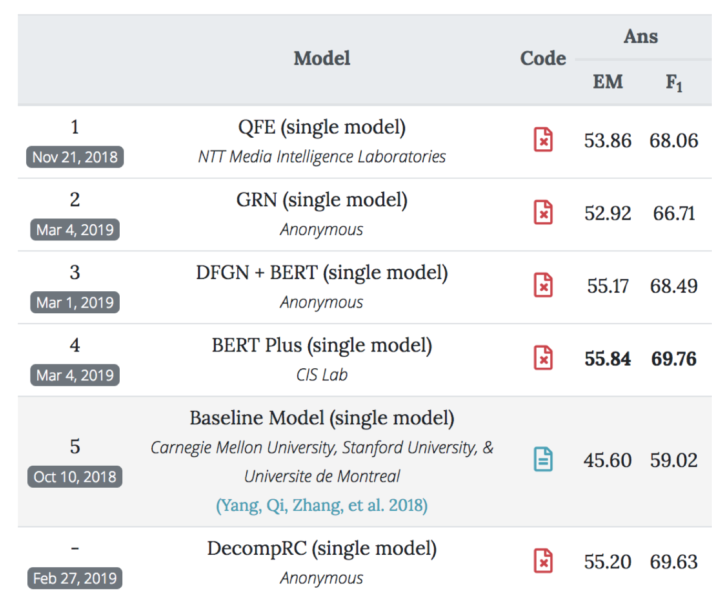

**Multi-Task Learning**

-   NLP的另一个前沿是让一个模型执行许多任务。GLUE 和 DecaNLP是最近的例子
-   在BERT的基础上，多任务学习产生了改进

**Low-Resource Settings**

-   不需要很多计算能力的模型(不能使用BERT)
    -   为移动设备尤其重要
-   低资源语言
-   低数据环境(few shot learning 小样本学习)
    -   ML 中的元学习越来越受欢迎

**Interpreting/Understanding Models**

-   我们能得到模型预测的解释吗？
-   我们能理解模型，例如BERT知道什么和他们为什么工作这么好？
-   NLP中快速增长的地区
-   对于某些应用程序非常重要(如医疗保健)

**Diagnostic/Probing Classifiers**

-   看看模型知道什么语言的信息
-   诊断分类器需要表示一个模型(例如BERT)作为输入，并做一些任务
-   只有诊断分类器被训练

-   诊断分类器通常非常简单(例如，单个softmax)。否则他们不通过模型表示来自省会学会完成任务
-   一些诊断任务

**Diagnostic/ Probing Classifiers: Results**

-   低层的 BERT 在低层的任务中表现更好

**NLP in Industry**

-   NLP是快速增长的行业。尤其是两大领域：
-   对话
    -   聊天机器人
    -   客户服务
-   健康
    -   理解健康记录
    -   理解生物医学文献

**Conclusion**

-   在过去的5年里，由于深度学习，进步很快
-   由于较大的模型和更好地使用无标记数据，在去年有了更大的进展
    -   是在NLP领域的激动人心的时刻
-   NLP是正逐渐对社会产生巨大影响力，使偏差和安全等问题越来越重要

## Reference

以下是学习本课程时的可用参考书籍：

[《基于深度学习的自然语言处理》](<https://item.jd.com/12355569.html>) （车万翔老师等翻译）

[《神经网络与深度学习》](<https://nndl.github.io/>)

以下是整理笔记的过程中参考的博客：

[斯坦福CS224N深度学习自然语言处理2019冬学习笔记目录](<https://zhuanlan.zhihu.com/p/59011576>) (课件核心内容的提炼，并包含作者的见解与建议)

[斯坦福大学 CS224n自然语言处理与深度学习笔记汇总](<https://zhuanlan.zhihu.com/p/31977759>) {>>这是针对note部分的翻译<<}