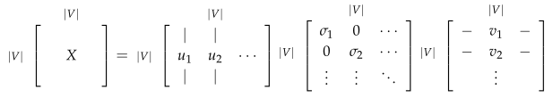

# CS224n-2019 笔记

-   结合每课时的课件、笔记与推荐读物等整理而成

-   作业部分将单独整理

## Lecture 01 Introduction and Word Vectors

**Lecture Plan**

-   The course
-   Human language and word meaning
-   Word2vec introduction
-   Word2vec objective function gradients
-   Optimization basics
-   Looking at word vectors

>   Singular Value Decomposition (SVD) 奇异值分解

### Human language and word meaning

人类之所以比类人猿更“聪明”，是因为我们有语言，因此是一个人机网络，其中人类语言作为网络语言。人类语言具有 **信息功能** 和 **社会功能** 。

据估计，人类语言只有大约5000年的短暂历。语言是人类变得强大的主要原因。写作是另一件让人类变得强大的事情。它是使知识能够在空间上传送到世界各地，并在时间上传送的一种工具。

但是，相较于如今的互联网的传播速度而言，人类语言是一种缓慢的语言。然而，只需人类语言形式的几百位信息，就可以构建整个视觉场景。这就是自然语言如此迷人的原因。

**How do we represent the meaning of a word?**

***meaning***

-   用一个词、词组等表示的概念。
-   一个人想用语言、符号等来表达的想法。
-   表达在作品、艺术等方面的思想

理解意义的最普遍的语言方式(***linguistic way***) : 语言符号与语言符号的意义的转化
$$
signifier(symbol)\Leftrightarrow signified(idea \ or \ thing) \\
= \textbf{denotational semantics}
$$

>   denotational semantics 指称语义

**How do we have usable meaning in a computer?**

***WordNet***, 一个包含同义词集和上位词(“is a”关系) ***synonym sets and hypernyms*** 的列表的辞典

```python tab="synonym"
from nltk.corpus import wordnet as wn
poses = { 'n':'noun', 'v':'verb', 's':'adj (s)', 'a':'adj', 'r':'adv'}
for synset in wn.synsets("good"):
	print("{}: {}".format(poses[synset.pos()],
					", ".join([l.name() for l in synset.lemmas()])))
```


```python tab=“hypernyms”
from nltk.corpus import wordnet as wn
panda = wn.synset("panda.n.01")
hyper = lambda s: s.hypernyms()
list(panda.closure(hyper))
```


**Problems with resources like WordNet**

-   作为一个资源很好，但忽略了细微差别
    -   例如“proficient”被列为“good”的同义词。这只在某些上下文中是正确的。
-   缺少单词的新含义
    -   难以持续更新
    -   例如 wicked, badass, nifty, wizard, genius, ninja, bombest
-   主观的
-   需要人类劳动来创造和调整
-   无法计算单词相似度

**Representing words as discrete symbols**

在传统的自然语言处理中，我们把词语看作离散的符号: hotel, conference, motel - a **localist** representation。单词可以通过独热向量(one-hot vectors，只有一个1，其余均为0的稀疏向量) 。向量维度=词汇量(如500,000)。
$$
motel = [0 \  0 \  0 \  0 \  0 \  0 \  0 \  0 \  0 \  0 \  1 \  0 \  0 \  0 \  0] \\ 
hotel = [0 \  0 \  0 \  0 \  0 \  0 \  0 \  1 \  0 \  0 \  0 \  0 \  0 \  0 \  0]
$$
**Problem with words as discrete symbols**

所有向量是正交的。对于独热向量，没有关于相似性概念，并且向量维度过大。

**Solutions**

-   使用类似 ***WordNet*** 的工具中的列表，获得相似度，但会因不够完整而失败
-   学习在向量本身中编码相似性

**Representing words by their context**

-   **<u>Distributional semantics</u>** ：一个单词的意思是由经常出现在它附近的单词给出的
    -   *“You shall know a word by the company it keeps”* (J. R. Firth 1957: 11)
    -   现代统计NLP最成功的理念之一
    -   有点物以类聚，人以群分的感觉
-   当一个单词$w$出现在文本中时，它的上下文是出现在其附近的一组单词(在一个固定大小的窗口中)。
-   使用$w$的许多上下文来构建$w$的表示


### Word2vec introduction

我们为每个单词构建一个 **密集** 的向量，使其与出现在相似上下文中的单词向量相似

词向量 ***word vectors*** 有时被称为词嵌入 ***word embeddings***  或词表示 ***word representations***  

它们是分布式表示 ***distributed representation***
$$
\mathrm{banking} = \left[\begin{matrix}0.286 \\0.792 \\-0.177 \\-0.107 \\0.109 \\-0.542 \\0.349 \\0.271 \end{matrix}\right]
$$
***Word2vec*** (Mikolov et al. 2013)是一个学习单词向量的 **框架** 

Idea：

-   我们有大量的文本 (corpus means 'body' in Latin. 复数为corpora)
-   固定词汇表中的每个单词都由一个向量表示
-   文本中的每个位置 $t$，其中有一个中心词 $c$ 和上下文(“外部”)单词 $o$ 
-   使用 $c$ 和 $o$ 的 **词向量的相似性** 来计算给定 $c$ 的 $o$ 的 **概率** (反之亦然)
-    **不断调整词向量** 来最大化这个概率

下图为窗口大小 $j=2$ 时的 $P\left(w_{t+j} | w_{t}\right)$ 计算过程，center word分别为 $into$ 和 $banking$


### Word2vec objective function

对于每个位置$t=1, \ldots, T$ ，在大小为$m$的固定窗口内预测上下文单词，给定中心词 $w_j$

$$
Likelihoood = L(\theta) = \prod^{T}_{t=1} \prod_{-m \leq j \leq m \atop j \neq 0} P(w_{t+j} | w_{t} ; \theta)
$$

-   其中，$\theta$ 为所有需要优化的变量

目标函数$J(\theta)$ (有时被称为代价函数或损失函数) 是(平均)负对数似然
$$
J(\theta)=-\frac{1}{T} \log L(\theta)=-\frac{1}{T} \sum_{t=1}^{T} \sum_{-m \leq j \leq m \atop j \neq 0} \log P\left(w_{t+j} | w_{t} ; \theta\right)
$$
其中log形式是方便将联乘转化为求和，负号是希望将极大化似然率转化为极小化损失函数的等价问题。

-   **最小化目标函数 $\Leftrightarrow$  最大化预测精度**
-   <u>问题</u>：如何计算 $  P(w_{t+j} | w_{t} ; \theta)$ ？
-   <u>回答</u>：对于每个单词都是用两个向量
    -   $v_w$ 当 $w$ 是中心词时
    -   $u_w$ 当 $w$ 是上下文词时
-   于是对于一个中心词 $c$ 和一个上下文词  $o$ 

$$
P(o | c)=\frac{\exp \left(u_{o}^{T} v_{c}\right)}{\sum_{w \in V} \exp \left(u_{w}^{T} v_{c}\right)}
$$

### Word2vec prediction function

$$
P(o | c)=\frac{\exp \left(u_{o}^{T} v_{c}\right)}{\sum_{w \in V} \exp \left(u_{w}^{T} v_{c}\right)}
$$

-   取幂使任何数都为正
-   点积比较o和c的相似性 $u^{T} v=u . v=\sum_{i=1}^{n} u_{i} v_{i}$ ，点积越大则概率越大
-   分母：对整个词汇表进行标准化，从而给出概率分布

**softmax function** $\mathbb{R}^{n} \rightarrow \mathbb{R}^{n}$
$$
\operatorname{softmax}\left(x_{i}\right)=\frac{\exp \left(x_{i}\right)}{\sum_{j=1}^{n} \exp \left(x_{j}\right)}=p_{i}
$$
将任意值 $x_i$ 映射到概率分布 $p_i$

-   **max** ：因为放大了最大的概率
-   **soft** ：因为仍然为较小的 $x_i$ 赋予了一定概率
-   深度学习中常用

梯度下降，随机梯度下降以及链式求导法则的知识在此不再赘述，你可以在 **Reference** 部分找到你需要的资料:smile:

## Notes 01  Introduction, SVD and Word2Vec

**Keyphrases: Natural Language Processing. Word Vectors. Singular Value Decomposition. Skip-gram. Continuous Bag of Words**
**(CBOW). Negative Sampling. Hierarchical Softmax. Word2Vec.**

>   这组笔记首先介绍了自然语言处理(NLP)的概念及其面临的问题。然后我们继续讨论将单词表示为数字向量的概念。最后，讨论了常用的词向量设计方法。

### Introduction to Natural Language Processing

**What is so special about NLP?**

Natural language is a discrete/symbolic/categorical system 

>    离散的/符号的/分类的

人类的语言有什么特别之处？人类语言是一个专门用来表达意义的系统，而不是由任何形式的物理表现产生的。在这方面上，它与视觉或任何其他机器学习任务都有很大的不同。

大多数单词只是一个语言学以外的的符号：单词是一个映射到所指(signified 想法或事物)的能指(signifier)。

例如，“rocket”一词指的是火箭的概念，因此可以引申为火箭的实例。当我们使用单词和字母来表达符号时，也会有一些例外，例如“whoompaa”的使用。最重要的是，这些语言的符号可以被 编码成几种形式：声音、手势、文字等等，然后通过连续的信号传输给大脑，大脑本身似乎也能以一种连续的方式对这些信号进行解码。人们在语言哲学和语言学方面做了大量的工作来概念化人类语言，并将词语与其参照、意义等区分开来。

**Examples of tasks**

自然语言处理有不同层次的任务，从语言处理到语义解释再到语篇处理。自然语言处理的目标是通过设计算法使得计算机能够“理解”语言，从而能够执行某些特定的任务。不同的任务的难度是不一样的

**Easy**

-   拼写检查  Spell Checking
-   关键词检索 Keyword Search
-   同义词查找  Finding Synonyms

**Medium**

-   解析来自网站、文档等的信息

**Hard**

-   机器翻译  Machine Translation
-   语义分析  Semantic Analysis
-   指代消解  Coreference
-   问答系统  Question Answering

**How to represent words?**

在所有的NLP任务中，第一个也是可以说是最重要的共同点是我们如何将单词表示为任何模型的输入。在这里我们不会讨论早期的自然语言处理工作是将单词视为原子符号 atomic symbols。为了让大多数的自然语言处理任务能有更好的表现，我们首先需要了解单词之间的相似和不同。有了词向量，我们可以很容易地将其编码到向量本身中。

### Word Vectors

使用词向量编码单词，N维空间足够我们编码语言的所有语义，每一维度都会编码一些我们使用语言传递的信息。简单的one-hot向量无法给出单词间的相似性，我们需要将维度  $|V|$  减少至一个低纬度的子空间，来获得稠密的词向量，获得词之间的关系。

### SVD Based Methods

这是一类找到词嵌入的方法（即词向量），我们首先遍历一个很大的数据集和统计词的共现计数矩阵 X，然后对矩阵 X 进行 SVD 分解得到 $USV^{T}$ 。然后我们使用 U 的行来作为字典中所有词的词向量。我们来讨论一下矩阵 X 的几种选择。

**Word-Document Matrix**

我们最初的尝试，我们猜想相关连的单词在同一个文档中会经常出现。例如，“banks”，“bonds”，“stocks”，“moneys”等等，出现在一起的概率会比较高。但是“banks”，“octopus”，“banana”，“hockey”不大可能会连续地出现。我们根据这个情况来建立一个 ***Word-Document*** 矩阵，$X$ 是按照以下方式构建：遍历数亿的文档和当词 $i$ 出现在文档 $j$，我们对 $X_{ij}$ 加一。这显然是一个很大的矩阵 $\mathbb{R}^{|V|\times M}$，它的规模是和文档数量 $M$ 成正比关系。因此我们可以尝试更好的方法。

**Window based Co-occurrence Matrix**

同样的逻辑也适用于这里，但是矩阵 $X$ 存储单词的共现，从而成为一个关联矩阵。在此方法中，我们计算每个单词在特定大小的窗口中出现的次数。我们按照这个方法对语料库中的所有单词进行统计。

-   生成维度为 $|V| \times|V|$ 的共现矩阵$X$
-   在 $X$ 上应用 **SVD** 从而得到 $X = {USV}^T$ 
-   选择 $U$ 前 $k$ 行 得到 $k$ 维的词向量
-   $\frac{\sum_{i=1}^{k} \sigma_{i}}{\sum_{i=1}^{|V|} \sigma_{i}}$ 表示第一个k维捕获的方差量

 **Applying SVD to the cooccurrence matrix**

我们对矩阵 $X$ 使用 SVD，观察奇异值（矩阵 S 上对角线上元素），根据期望的捕获方差百分比截断，留下前 k 个元素：

然后取子矩阵 $U_{1:|V|, 1:k}$ 作为词嵌入矩阵。这就给出了词汇表中每个词的 k 维表示

对矩阵 $X$ 使用SVD



通过选择前 k 个奇异向量来降低维度


这两种方法都给我们提供了足够的词向量来编码语义和句法(part of speech)信息，但伴随许多其他问题

-   矩阵的维度会经常发生改变（经常增加新的单词和语料库的大小会改变）。
-   矩阵会非常的稀疏，因为很多词不会共现。
-   矩阵维度一般会非常高 $\approx 10^{6}\times 10^{6}$
-   基于 SVD 的方法的计算复杂度很高 ( $m×n$ 矩阵的计算成本是 $O({mn}^2)$ )，并且很难合并新单词或文档
-   需要在 X 上加入一些技巧处理来解决词频的极剧的不平衡
-   需要在 X 上加入一些技巧处理来解决词频的极剧的不平衡

然而，基于计数的方法可以有效地利用统计量

对上述讨论中存在的问题存在以下的解决方法：

-   忽略功能词，例如 “the”，“he”，“has” 等等。
-   使用 ramp window，即根据文档中单词之间的距离对共现计数进行加权
-   使用皮尔逊相关系数并将负计数设置为0，而不是只使用原始计数

正如我们在下一节中看到的，基于迭代的方法以一种优雅得多的方式解决了大部分上述问题。

### Iteration Based Methods - Word2vec

这里我们尝试一个新的方法。我们可以尝试创建一个模型，该模型能够一次学习一个迭代，并最终能够对给定上下文的单词的概率进行编码，而不是计算和存储一些大型数据集(可能是数十亿个句子)的全局信息。

这个想法是设计一个模型，该模型的参数就是词向量。然后根据一个目标函数训练模型，在每次模型的迭代计算误差，并遵循一些更新规则，该规则具有惩罚造成错误的模型参数的作用，从而可以学习到词向量。这个方法可以追溯到 1986年，我们称这个方法为“反向传播”，模型和任务越简单，训练它的速度就越快。

-   基于迭代的方法一次捕获一个单词的共现情况，而不是像SVD方法那样直接捕获所有的共现计数。

已经很多人按照这个思路测试了不同的方法。[Collobert et al., 2011] 设计的模型首先将每个单词转换为向量。对每个特定的任务（命名实体识别、词性标注等等），他们不仅训练模型的参数，同时也训练单词向量，计算出了非常好的词向量的同时取得了很好的性能。

在这里，我们介绍一个非常有效的概率模型：Word2vec。Word2vec 是一个软件包实际上包含：

-   **两个算法**：continuous bag-of-words（CBOW）和 skip-gram。CBOW 是根据中心词周围的上下文单词来预测该词的词向量。skip-gram 则相反，是根据中心词预测周围上下文的词的概率分布。
-   **两个训练方法：**negative sampling 和 hierarchical softmax。Negative sampling 通过抽取负样本来定义目标，hierarchical softmax 通过使用一个有效的树结构来计算所有词的概率来定义目标。

**Language Models (Unigrams, Bigrams, etc.)**

首先，我们需要创建一个模型来为一系列的单词分配概率。我们从一个例子开始：

“The cat jumped over the puddle”

一个好的语言模型会给这个句子很高的概率，因为在句法和语义上这是一个完全有效的句子。相似地，句子“stock boil fish is toy”会得到一个很低的概率，因为这是一个无意义的句子。在数学上，我们可以称为对给定 n 个词的序列的概率是：
$$
P(w_{1}, w_{2}, \ldots, w_{n})
$$
我们可以采用一元语言模型方法(**Unigram model**)，假设单词的出现是完全独立的，从而分解概率
$$
P\left(w_{1}, w_{2}, \cdots, w_{n}\right)=\prod_{i=1}^{n} P\left(w_{i}\right)
$$
但是我们知道这是不大合理的，因为下一个单词是高度依赖于前面的单词序列的。如果使用上述的语言模型，可能会让一个无意义的句子具有很高的概率。所以我们让序列的概率取决于序列中的单词和其旁边的单词的成对概率。我们称之为 bigram 模型：
$$
P\left(w_{1}, w_{2}, \cdots, w_{n}\right)=\prod_{i=2}^{n} P\left(w_{i} | w_{i-1}\right)
$$
但是，这个方法还是有点简单，因为我们只关心一对邻近的单词，而不是针对整个句子来考虑。但是我们将看到，这个方法会有显著的提升。考虑在词-词共现矩阵中，共现窗口为 1，我们基本上能得到这样的成对的概率。但是，这又需要计算和存储大量数据集的全局信息。

既然我们已经理解了如何考虑具有概率的单词序列，那么让我们观察一些能够学习这些概率的示例模型。

**Continuous Bag of Words Model (CBOW)**

## Reference

以下是学习本课程时的可用参考书籍：

[《神经网络与深度学习》](<https://nndl.github.io/>)

以下是整理笔记的过程中参考的博客：

[斯坦福CS224N深度学习自然语言处理2019冬学习笔记目录](<https://zhuanlan.zhihu.com/p/59011576>)

[斯坦福NLP课程 CS224N Winter 2019 学习笔记](<https://zhuanlan.zhihu.com/p/61625439>)

[斯坦福大学 CS224n自然语言处理与深度学习笔记汇总](<https://zhuanlan.zhihu.com/p/31977759>) (这是针对note部分的翻译)