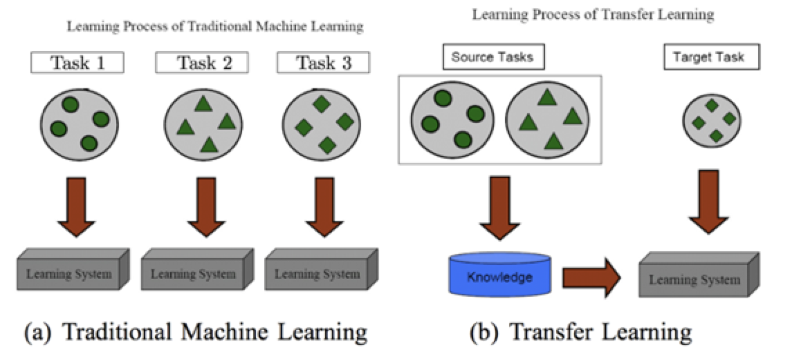

# Transfer Learning in Natural Language Processing

Follow along with the tutorial:

-   Slides: http://tiny.cc/NAACLTransfer
-   Colab: http://tiny.cc/NAACLTransferColab
-   Code: http://tiny.cc/NAACLTransferCode

**What is transfer learning ?**

[Pan and Yang (2010)](https://www.cse.ust.hk/~qyang/Docs/2009/tkde_transfer_learning.pdf)

**Why transfer learning in NLP ?**

-   许多NLP任务共享关于语言的共同知识(例如语言表示、结构相似性)
-   任务可以互相通知——例如语法和语义
-   带注释的数据很少见，尽可能多地利用监督
-   经验上看，迁移学习促成了许多有监督的NLP任务的 SOTA (如分类、信息提取、问答等)。

**Why transfer learning in NLP? (Empirically)**

**Types of transfer learning in NLP**

