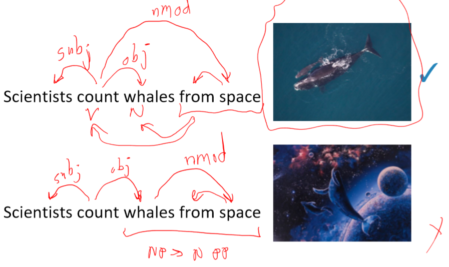
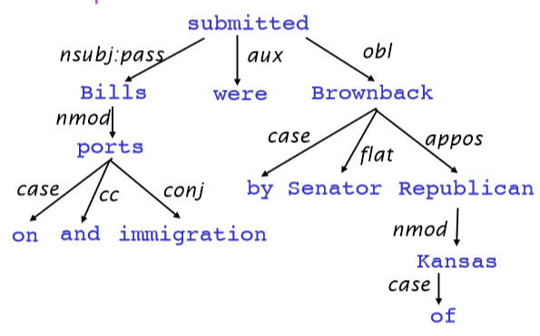
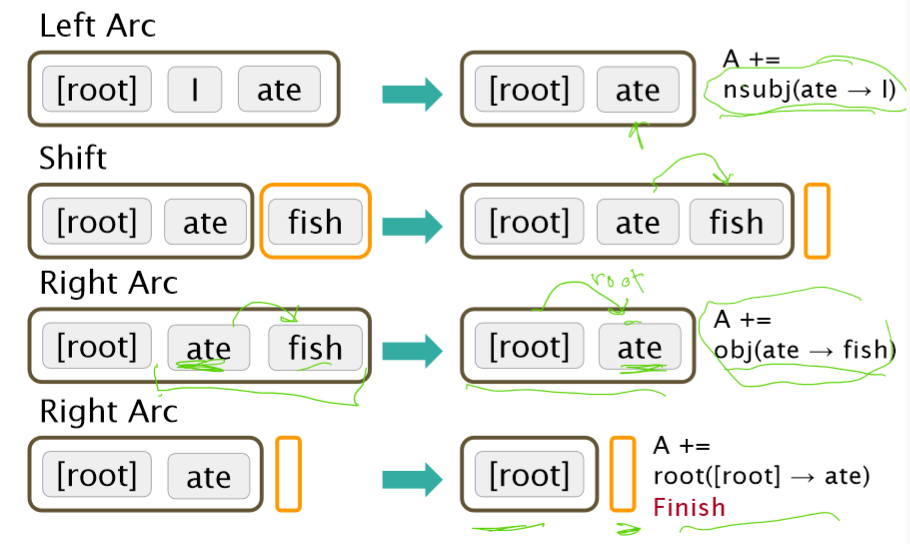
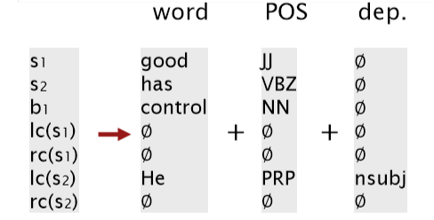
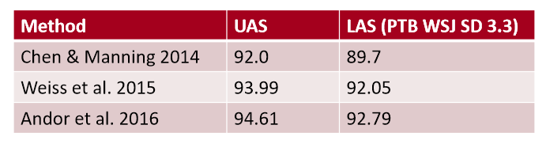

# CS224n-2019 学习笔记

-   结合每课时的课件、笔记与推荐读物等整理而成
-   作业部分将单独整理

## Lecture 05 Linguistic Structure: Dependency Parsing 

??? abstract "Lecture Plan"

    -   Syntactic Structure: Consistency and Dependency
    -   Dependency Grammar and Treebanks
    -   Transition-based dependency parsing
    -   Neural dependency parsing

!!! tip "Dependency Parsing"

    中文释义：依存关系语法分析，简称 依存分析。

### 1. Two views of linguistic structure

#### Constituency Parsing

**Constituency = phrase structure grammar = context-free grammars (CFGs)** 

!!! tip "context-free grammars (CFGs)"

    无上下文语法

句子是使用逐步嵌套的单元构建的

-   短语结构将单词组织成嵌套的成分
-   **起步单元：单词<u>被赋予一个类别</u> (part of speech=pos 词性)**
-   **单词组合成不同类别的短语**
-   **短语可以<u>递归</u>地组合成更大的短语**

上图中

-   `Det` 指的是 **Determiner**，在语言学中的含义为 **限定词**
-   `NP` 指的是 **Noun Phrase** ，在语言学中的含义为 **名词短语**
-   `VP` 指的是 **Verb Phrase** ，在语言学中的含义为 **动词短语**
-   `P` 指的是 **Preposition** ，在语言学中的含义为 **介词**
    -   `PP` 指的是 **Prepositional Phrase** ，在语言学中的含义为 **介词短语**

-   $\text{NP} \to \text{Det N}$
-   $\text{NP} \to \text{Det (Adj) N}$
-   $\text{NP} \to \text{Det (Adj) N PP}$
    -   $\text{PP} \to \text{P NP}$
-   $\text{VP} \to \text{V PP}$
    -   中文中，介词短语会出现在动词之前
-   Example : The cat by the large crate on the large table by the door

但是另一种观点在计算语言学中占主导地位。

#### Dependency Parsing

不是使用各种类型的短语，而是直接通过单词与其他的单词关系表示句子的结构，显示哪些单词依赖于(修饰或是其参数)哪些其他单词

-   $\text{look}$ 是整个句子的根源， $\text{look}$ 依赖于 $\text{crate}$ （或者说 $\text{crate}$ 是 $\text{look}$ 的依赖）
    -   $\text{in, the, large}$ 都是 $\text{crate}$ 的依赖
    -   $\text{in the kitchen}$ 是 $\text{crate}$ 的修饰
    -   $\text{in, the}$ 都是 $\text{kitchen}$ 的依赖
    -   $\text{by the door}$ 是 $\text{crate}$ 的依赖

**Why do we need sentence structure?**

-   为了能够正确地解释语言，我们需要理解句子结构
-   人类通过将单词组合成更大的单元来传达复杂的意思，从而交流复杂的思想
-   我们需要知道什么与什么相关联
    -   除非我们知道哪些词是其他词的参数或修饰词，否则我们无法弄清楚句子是什么意思

##### Prepositional phrase attachment ambiguity

**介词短语依附歧义**

$\text{San Jose cops kill man with knife}$

-   警察用刀杀了那个男子
    -   `cops` 是 `kill` 的 `subject` (subject 指 主语)
    -   `man` 是 `kill `的 `object` (object 指 宾语)
    -   `knife` 是 `kill` 的 `modifier ` (modifier 指 修饰符)
-   警察杀了那个有刀的男子
    -   `knife` 是 ` man` 的 `modifier` (名词修饰符，简称为 `nmod` )

`from space`  这一介词短语修饰的是前面的动词 `count` 还是名词 `whales` ？

这就是人类语言和编程语言中不同的地方

-   关键的解析决策是我们如何 “依存” 各种成分
    -   介词短语、状语或分词短语、不定式、协调等。

-   上述句子中有四个介词短语
-   `board` 是 `approved` 的 主语，`acquisition` 是 `approved` 的谓语
-   `by Royal Trustco Ltd.` 是修饰 `acquisition` 的，即董事会批准了这家公司的收购
-   `of Toronto` 可以修饰 `approved, acquisition, Royal Trustco Ltd.` 之一，经过分析可以得知是修饰 `Royal Trustco Ltd.` 即表示这家公司的位置
-   `for $27 a share` 修饰 `acquisition`
-   `at its monthly meeting` 修饰 `approved` ，即表示批准的时间地点

面对这样复杂的句子结构，我们需要考虑 **指数级** 的可能结构，这个序列被称为 **Catalan numbers**

**Catalan numbers** : $C_{n}=(2 n) ! /[(n+1) ! n !]$

-   一个指数增长的序列，出现在许多类似树的环境中
    -   例如，一个 n+2 边的多边形可能的三角剖分的数量
        -   出现在概率图形模型的三角剖分中(CS228)

##### Coordination scope ambiguity

**协调范围模糊**

 例句：Shuttle veteran and longtime NASA executive Fred Gregory appointed to board

-   一个人：[[Shuttle veteran and longtime NASA executive] Fred Gregory] appointed to board
-   两个人：[Shuttle veteran] and [longtime NASA executive Fred Gregory] appointed to board

例句：Doctor: No heart, cognitive issues

##### Adjectival Modifier Ambiguity

**形容词修饰语歧义**

例句：Students get first hand job experience

-   `first hand` 表示 第一手的，直接的，即学生获得了直接的工作经验
    -   `first` 是 `hand` 的形容词修饰语(amod)
-   first 修饰 experience, hand 修饰 job :smiley: 

##### Verb Phrase (VP) attachment ambiguity

**动词短语(VP)依存歧义**

例句：Mutilated body washes up on Rio beach to be used for Olympic beach volleyball.

-   `to be used for Olympic beach volleyball` 是 动词短语 (VP) 
-   修饰的是 `body` 还是 `beach`

**Dependency paths identify semantic relations –e.g., for protein interaction**

依赖路径识别语义关系

### 2. Dependency Grammar and Dependency Structure

关联语法假设句法结构包括词汇项之间的关系，通常是二元不对称关系(“箭头”)，称为依赖关系

Dependency Structure有两种表现形式

-   一种是直接在句子上标出依存关系箭头及语法关系

-   另一种是将其做成树状机构（Dependency Tree Graph）

-   箭头通常标记(**type**)为语法关系的名称(主题、介词对象、apposition等)。

-   依赖关系标签的系统，例如 **universal dependency** 通用依赖
-   箭头连接头部(**head**)(调速器,上级,regent)和一个依赖(修饰词,下级,下属)
    -   A $\to$ 依赖于 A 的事情
-   通常,依赖关系形成一棵树(单头 无环 连接图)

**Dependency Grammar/Parsing History**

-   依赖结构的概念可以追溯到很久以前
    -   Pāṇini的语法(公元前5世纪)
    -   一千年 阿拉伯语的语法的基本方法
-   选区/上下文无关文法是一个新奇的发明
    -   20世纪发明(R.S.Wells,1947; then  Chomsky)
-   现代依赖工作经常源于 L. Tesnière(1959)
    -   是20世纪“东方”的主导方法(俄罗斯，中国，…)
        -   有利于更自由的语序语言
-   NLP中最早类型的解析器在美国
    -   David Hays 是美国计算语言学的创始人之一，他很早就(第一个?)构建了依赖解析器(Hays 1962)。

**Dependency Grammar and Dependency Structure**

-   人们对箭头指向的方式不一致：有些人把箭头朝一个方向画；有人是反过来的
    -   Tesnière 从头开始指向依赖，本课使用此种方式
-   通常添加一个伪根指向整个句子的头部，这样每个单词都精确地依赖于另一个节点

**The rise of annotated data: Universal Dependencies treebanks**

[Universal Dependencies: http://universaldependencies.org/ ; cf. Marcus et al. 1993, The Penn Treebank, Computational Linguistics]

**Universal Dependencies**：我们想要拥有一个统一的、并行的依赖描述，可用于任何人类语言

-   从前手工编写语法然后训练得到可以解析句子的解析器

-   用一条规则捕捉很多东西真的很有效率，但是事实证明这在实践中不是一个好主意
    -   语法规则符号越来越复杂，并且没有共享和重用人类所做的工作
-   句子结构上的treebanks 支持结构更有效

**The rise of annotated data**

从一开始，构建 treebank 似乎比构建语法慢得多，也没有那么有用

但是 treebank  给我们提供了许多东西

-   劳动力的可重用性
    -   许多解析器、词性标记器等可以构建在它之上
    -   语言学的宝贵资源
-   广泛的覆盖面，而不仅仅是一些直觉
-   频率和分布信息
-   一种评估系统的方法

**Dependency Conditioning Preferences**

依赖项解析的信息来源是什么？

1.  **Bilexical affinities** (两个单词间的密切关系) 
    -   [discussion $\to$ issues] 是看上去有道理的
2.  **Dependency distance**  依赖距离 
    -   主要是与相邻词
3.  **Intervening material** 介于中间的物质
    -   依赖很少跨越介于中间的动词或标点符号
4.  **Valency of heads**
    -   How many dependents on which side are usual for a head? 

#### Dependency Parsing

-   通过为每个单词选择它所依赖的其他单词(包括根)来解析一个句子
-   通常有一些限制
    -   只有一个单词是依赖于根的
    -   不存在循环 $A \to B, B \to A$
-   这使得依赖项成为树
-   最后一个问题是箭头是否可以交叉(非投影的 non-projective)
    -   没有交叉的就是non-projectice

**Projectivity**

-   定义：当单词按线性顺序排列时，没有交叉的依赖弧，所有的弧都在单词的上方
-   与CFG树并行的依赖关系必须是投影的
    -   通过将每个类别的一个子类别作为头来形成依赖关系
-   但是依赖理论通常允许非投射结构来解释移位的成分
    -   如果没有这些非投射依赖关系，就不可能很容易获得某些结构的语义

#### Methods of Dependency Parsing

1.  Dynamic programming 
    -   Eisner(1996)提出了一种复杂度为 $O(n^3)$ 的聪明算法，它生成头部位于末尾而不是中间的解析项
2.  Graph algorithms 
    -   为一个句子创建一个最小生成树
    -   McDonald et al.’s (2005) MSTParser 使用ML分类器独立地对依赖项进行评分(他使用MIRA进行在线学习，但它也可以是其他东西)
3.  Constraint Satisfaction 
    -   去掉不满足硬约束的边 Karlsson(1990), etc. 
4.   “Transition-based parsing” or “deterministic dependency parsing“
    -   良好的机器学习分类器 MaltParser(Nivreet al. 2008) 指导下的依存贪婪选择。已证明非常有效。

### 3. Greedy transition-based parsing [Nivre 2003]

-   贪婪判别依赖解析器  **greedy discriminative dependency parser**  的一种简单形式
-   解析器执行一系列自底向上的操作
    -   大致类似于[shift-reduce解析器](<https://en.wikipedia.org/wiki/Shift-reduce_parser>)中的“shift”或“reduce”，但“reduce”操作专门用于创建头在左或右的依赖项
-   解析器如下：
    -   栈 $\sigma$ 以 ROOT 符号开始，由若干 $w_i$ 组成
    -   缓存 $\beta$ 以输入序列开始，由若干 $w_i$ 组成
    -   一个依存弧的集合 $A$ ，一开始为空。每条边的形式是 $(w_i,r,w_j)$ ，其中 $r$ 描述了节点的依存关系
    -   一组操作
-   最终目标是 $\sigma = [\text{ROOT}], \beta = \phi$ ，$A$ 包含了所有的依存弧

**Basic transition-based dependency parser** 

state之间的transition有三类：

-   SHIFT：将buffer中的第一个词移出并放到stack上。
-   LEFT-ARC：将 $(w_j,r,w_i)$ 加入边的集合 A ，其中 $w_i$ 是stack上的次顶层的词， $w_j$ 是stack上的最顶层的词。
-   RIGHT-ARC:将 $(w_i,r,w_j)$ 加入边的集合 A ，其中 $w_i$ 是stack上的次顶层的词， $w_j$ 是stack上的最顶层的词。

我们不断的进行上述三类操作，直到从初始态达到最终态。

在每个状态下如何选择哪种操作呢？当我们考虑到LEFT-ARC与RIGHT-ARC各有$|R|$（$|R|$为 $r$ 的类的个数）种类，我们可以将其看做是class数为 $2|R|+1$ 的分类问题，可以用SVM等传统机器学习方法解决。

**Arc-standard transition-based parser** 

>   还有其他的 transition 方案

Analysis of “**I ate fish**”

**MaltParser** [Nivreand Hall 2005]

-   我们需要解释如何选择下一步行动
    -   Answer：机器学习
-   每个动作都由一个有区别分类器(例如softmax classifier)对每个合法的移动进行预测
    -   最多三种无类型的选择，当带有类型时，最多 $|R| \times 2 + 1$ 种 
    -   Features：栈顶单词，POS；buffer中的第一个单词，POS；等等
-   在最简单的形式中是没有搜索的
    -   但是，如果你愿意，你可以有效地执行一个 Beam search 束搜索(虽然速度较慢，但效果更好)：你可以在每个时间步骤中保留 k个好的解析前缀
-   该模型的精度略低于依赖解析的最高水平，但它提供了非常快的线性时间解析，性能非常好

**Conventional Feature Representation**

传统的特征表示使用二元的稀疏向量$10^6 \sim 10^7$

-   特征模板：通常由配置中的1 ~ 3个元素组成
-   Indicator features

#### Evaluation of Dependency Parsing: (labeled) dependency accuracy

其中，**UAS** (unlabeled attachment score) 指 **无标记依存正确率** ，**LAS** (labeled attachment score) 指 **有标记依存正确率**

**Handling non-projectivity**

-   我们提出的弧标准算法只构建投影依赖树
-   头部可能的方向
    -   在非投影弧上宣布失败
    -   只具有投影表示时使用依赖形式
        -   CFG只允许投影结构
    -   使用投影依赖项解析算法的后处理器来识别和解析非投影链接
    -   添加额外的转换，至少可以对大多数非投影结构建模（添加一个额外的交换转换，冒泡排序）
    -   转移到不使用或不需要对投射性进行任何约束的解析机制(例如，基于图的MSTParser)

### 4. Why train a neural dependency parser? Indicator Features Revisited

Indicator Features的问题

-   稀疏
-   不完整
-   计算复杂
    -   超过95%的解析时间都用于特征计算

**A neural dependency parser** [Chen and Manning 2014]

斯坦福依赖关系的英语解析

-   Unlabeled attachment score (UAS) = head
-   Labeled attachment score (LAS) = head and label

-   效果好，速度快

**Distributed Representations**

-   我们将每个单词表示为一个d维稠密向量（如词向量）
    -   相似的单词应该有相近的向量
-   同时，**part-of-speech tags** 词性标签(POS)和 **dependency labels**  依赖标签也表示为d维向量
    -   较小的离散集也表现出许多语义上的相似性。
-   **NNS**(复数名词)应该接近**NN**(单数名词)
-   **num**(数值修饰语)应该接近**amod**(形容词修饰语)。

对于Neural Dependency Parser，其输入特征通常包含三种

-   stack和buffer中的单词及其dependent word
-   单词的part-of-speech tag
-   描述语法关系的arc label

我们根据堆栈/缓冲区位置提取一组令牌:

我们将其转换为词向量并将它们联结起来作为输入层，再经过若干非线性的隐藏层，最后加入softmax layer得到shift-reduce解析器的动作

**Model Architecture**

**Dependency parsing for sentence structure**

神经网络可以准确地确定句子的结构，支持解释

Chen and Manning(2014)是第一个简单，成功的神经依赖解析器

密集的表示使得它在**精度和速度**上都优于其他贪婪的解析器

**Further developments in transition-based neural dependency parsing**

这项工作由其他人进一步开发和改进，特别是在谷歌

-   更大、更深的网络中，具有更好调优的超参数
-   Beam Search 更多的探索动作序列的可能性，而不是只考虑当前的最优
-   全局、条件随机场(CRF)的推理出决策序列

这就引出了SyntaxNet和Parsey McParseFace模型

**Graph-based dependency parsers** 

-   为每条边的每一个可能的依赖关系计算一个分数
    -   然后将每个单词的边缘添加到其得分最高的候选头部
    -   并对每个单词重复相同的操作

**A Neural graph-based dependency parser** [Dozat and Manning 2017; Dozat, Qi, and Manning 2017] 

-   在神经模型中为基于图的依赖分析注入活力
    -   为神经依赖分析设计一个双仿射评分模型
        -   也使用神经序列模型，我们将在下周讨论
-   非常棒的结果
    -   但是比简单的基于神经传递的解析器要慢
        -   在一个长度为 n 的句子中可能有 $n^2$ 个依赖项

## Notes 04  Dependency Parsing 

??? abstract "Keyphrases"

    Dependency Parsing

### 1 Dependency Grammar and Dependency Structure

与编译器中的解析树类似， **NLP** 中的解析树是用于分析句子的句法结构。使用的结构主要有两种类型——短语结构和依存结构。

短语结构文法使用短语结构语法将词组织成嵌套成分。以下章节将对此进行更详细的说明。我们现在关注依存语法。

句子的依存结构展示了单词依赖于另外一个单词（修饰或者是参数）。词与词之间的二元非对称关系称为依存关系，描述为从 **head**（被修饰的主题）用箭头指向 **dependent** （修饰语）。一般这些依存关系形成树结构。他们通常用语法关系的名称（主体，介词宾语，同位语等）。一个依存树的例子如下图所示：

有时，在树的头部增加一个假的 ROOT 节点，这样每个单词都依存于唯一一个节点。

#### 1.1 Dependency Parsing 

依存语法是给定一个输入句子 $S$ ，分析句子的句法依存结构的任务。依存句法的输出是一棵依存语法树，其中输入句子的单词是通过依存关系的方式连接。正式地，依存语法问题是创建一个输入句子的单词 $S=w_{0}w_{1}...w_{n}$ （其中 $w_{0}$ 是 ROOT ）到它的依存语法树的映射图 $G$ 。最近几年提出了很多以依存句法为基础的的变体，包括基于神经网络的方法，我们将会在后面介绍。

确切地说，在依存语法中有两个子问题：

-   学习：给定用依赖语法图标注的句子的训练集 $D$ ，创建一个可以用于解析新句子的解析模型 $M$ 
-   解析：给定解析模型 $M$ 和句子 $S$，根据 $M$ 得到 $S$ 的最优依存语法图

#### 1.2 Transition-Based Dependency Parsing

**Transition-based** 依存语法依赖于定义可能转换的状态机，以创建从输入句到依存句法树的映射。学习问题是创建一个可以根据转移历史来预测状态机中的下一个转换的模型。分析问题是使用在学习问题中得到的模型对输入句子构建一个**最优的转移序列**。大多数 **Transition-based** 系统不会使用正式的语法。

#### 1.3 Greedy Deterministic Transition-Based Parsing

这个系统是由 Nivre 在 2003 年提出，与当时的常用方法截然不同。

这个转换系统是一个状态机，它由状态和这些状态之间的转换组成。该模型导出了从初始状态到几种终端状态之一的一系列转换。

**状态**：对任意句子 $S=w_{0}w_{1}...w_{n}$ ，一个状态可以描述为一个三元组 $c=(\sigma, \beta,A)$ ：

-   来自 S 的单词 $w_{i}$ 的堆 $\sigma$ 
-   来自 $S$ 的单词 $w_{i}$ 的缓冲区 $\beta$ 
-   一组形式为 $(w_{i},r,w_{j})$ 的依存弧，其中 $w_{i},w_{j}$ 是来自 $S$，和 $r$ 描述依存关系。

因此，对于任意句子 $S=w_{0}w_{1}...w_{n}$

-   一个形式为 $([w_{0}]_{\sigma},[w_{1}...w_{n}]_{\beta},\varnothing)$ 的初始状态 $c_{0}$ （现在只有 ROOT 在堆 $\sigma$ 中，没有被选择的单词都在缓冲区 $\beta$ 中。
-   一个形式为 $(\sigma,[]_{\beta},A)$ 的终点状态。

**转移**：在状态之间有三种不同类型的转移：

-   SHIFT ：移除在缓冲区的第一个单词，然后将其放在堆的顶部（前提条件：缓冲区不能为空）。
-   $Left\text{-}Arc_{r}$ ：向依存弧集合 A 中加入一个依存弧 $(w_{j},r,w_{i})$ ，其中 $w_{i}$ 是堆顶的第二个单词， $w_{j}$ 是堆顶部的单词。从栈中移除 $w_{i}$ （前提条件：堆必须包含两个单词以及 $w_{i}$ 不是 ROOT ）。
-   $Right\text{-}Arc_{r}$ ：向依存弧集合 A 中加入一个依存弧 $(w_{i},r,w_{j})$ ，其中 $w_{i}$ 是堆顶的第二个单词， $w_{j}$ 是堆顶部的单词。从栈中移除 $w_{j}$ （前提条件：堆必须包含两个单词）。

下图给出了这三个转换的更正式的定义

**1.4 Neural Dependency Parsing**

虽然依赖项解析有很多深层模型，这部分特别侧重于贪心，基于转移的神经网络依存语法解析器。与传统的基于特征的判别依存语法解析器相比，神经网络依存语法解析器性能和效果更好。与以前模型的主要区别在于这类模型依赖稠密而不是稀疏的特征表示。

我们将要描述的模型采用上一部分中讲述的标准依存弧转换系统。最终，模型的目标是预测从一些初始状态 $c$ 到一个终点状态的转换序列，对模型中的依存语法树进行编码的。由于模型是贪心的，它基于从当前的状态 $c=(\sigma, \beta, A)$ 提取特征，然后尝试一次正确地预测一次转移 $T\in \{SHIFT, Left\text{-}Arc_{r},Right\text{-}Arc_{r}\}$ 。回想一下， $\sigma$ 是栈，$\beta$ 是缓存, $A$ 是对于一个给定的句子的依赖弧的集合

**特征选择**：根据该模型所需的复杂性，定义神经网络的输入是有灵活性的。对给定句子 $S$ 的特征包含一些子集：

1.  $S_{word}$ ：在堆 $\sigma$ 的顶部和缓冲区 $\beta$ 的 $S$ 中一些单词的词向量（和它们的依存）。
2.  $S_{tag}$ ：在 $S$ 中一些单词的词性标注（ POS ）。词性标注是由一个离散集合组成： $\mathcal{P}=\{NN,NNP,NNS,DT,JJ,...\}$ 。
3.  $S_{label}$ ：在 $S$ 中一些单词的依存标签。依存标签是由一个依存关系的离散集合组成： $\mathcal{L}=\{amod,tmod,nsubj,csubj,dobj,...\}$。

对每种特征类型，我们都有一个对应的将特征的 **one-hot** 编码映射到一个 $d$ 维的稠密的向量表示的嵌入矩阵。$S_{word}$ 的完全嵌入矩阵是 $E^{w}\in \mathbb{R}^{d\times N_{w}}$ ，其中 $N_{w}$ 是字典/词汇表的大小。相应地，POS 和依存标签的嵌入矩阵分别为 $E^{t}\in \mathbb{R}^{d\times N_{t}}$ 和  $E^{l}\in \mathbb{R}^{d\times N_{l}}$ ，其中 $N_{t}$ 和 $N_{l}$ 分别为不同词性标注和依存标签的个数。最后，定义从每组特征中选出的元素的数量分别为 $n_{word}, n_{tag}, n_{label}$ 。

**特征选择的例子**：作为一个例子，考虑一下对 $S_{word}$，$S_{tag}$ 和 $S_{label}$ 的选择：

1.  $S_{word}$ ：在堆和缓冲区的前三个单词： $s_{1},s_{2},s_{3},b_{1},b_{2},b_{3}$ 。栈顶部两个单词的第一个和第二个的 leftmost / rightmost 的子单词： $lc_{1}(s_{i}),rc_{1}(s_{i}),lc_{2}(s_{i}),rc_{2}(s_{i}),i=1,2$ 。栈顶部两个单词的第一个和第二个的 leftmost of leftmost / rightmost of rightmost 的子单词： $lc_{1}(lc_{1}(s_{i})),rc_{1}(rc_{1}(s_{i})),i=1,2$ 。$S_{word}$ 总共含有 $n_{word}=18$ 个元素。
2.  $S_{tag}$ ：相应的词性标注，则 $S_{tag}$ 含有 $n_{tag}=18$ 个元素。
3.  $S_{label}$ ：单词的对应的依存标签，不包括堆/缓冲区上的 6 个单词，因此 $S_{label}$ 含有 $n_{label}=12$ 个元素。

注意我们使用一个特殊的 $NULL$ 表示不存在的元素：当堆和缓冲区为空或者还没有指定依存关系时。对一个给定句子例子，我们按照上述的方法选择单词，词性标注和依存标签，从嵌入矩阵 $E^{w},E^{t},E^{l}$ 中提取它们对应的稠密的特征的表示，然后将这些向量连接起来作为输入 $[x^{w},x^{t},x^{l}]$ 。在训练时间，我们反向传播到稠密的向量表示，以及后面各层的参数。

前馈神经网络模型：这个神经网络包含一个输入层 $[x^{w},x^{t},x^{l}]$ ，一个隐藏层，以及具有交叉熵损失函数的最终 softmax 层。我们可以在隐藏层中定义单个权值矩阵，与 $[x^{w},x^{t},x^{l}]$ 进行运算，我们可以使用三个权值矩阵 $[W^{w}_{1},W^{t}_{1},W^{l}_{1}]$ ，每个矩阵对应着相应的输入类型，如下图所示。然后我们应用一个非线性函数并使用一个额外的仿射层 $[W_{2}]$ ，使得对于可能的转移次数（输出维度），有相同数量的 softmax 概率。

注意在上图中，使用的非线性函数是 $f(x)=x^{3}$ 。

有关 greedy transition-based 神经网络依存语法解析器的更完整的解释，请参考论文：[A Fast and Accurate Dependency Parser using Neural Networks](https://link.zhihu.com/?target=https%3A//cs.stanford.edu/~danqi/papers/emnlp2014.pdf)。

## Reference

以下是学习本课程时的可用参考书籍：

[《基于深度学习的自然语言处理》](<https://item.jd.com/12355569.html>) （车万翔老师等翻译）

[《神经网络与深度学习》](<https://nndl.github.io/>)

以下是整理笔记的过程中参考的博客：

[斯坦福CS224N深度学习自然语言处理2019冬学习笔记目录](<https://zhuanlan.zhihu.com/p/59011576>) (课件核心内容的提炼，并包含作者的见解与建议)

[斯坦福大学 CS224n自然语言处理与深度学习笔记汇总](<https://zhuanlan.zhihu.com/p/31977759>) {>>这是针对note部分的翻译<<}