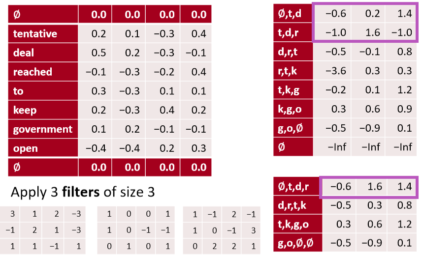
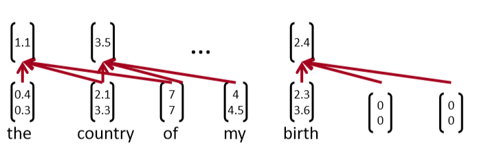
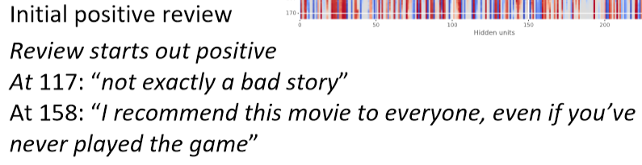

# CS224n-2019 学习笔记

-   结合每课时的课件、笔记与推荐读物等整理而成
-   作业部分将单独整理

## Lecture 11 ConvNets for NLP

??? abstract "Lecture Plan"

    1.  Announcements
    2.  Intro to CNNs
    3.  Simple CNN for Sentence Classification: Yoon (2014)
    4.  CNN potpourri 
    5.  Deep CNN for Sentence Classification: Conneauet al. (2017) 
    6.  Quasi-recurrent Neural Networks	

**Welcome to the second half of the course!** 

-   现在，我们正在为您准备成为DL+NLP研究人员/实践者
-   讲座不会总是有所有的细节
    -   这取决于你在网上搜索/阅读来了解更多
    -   这是一个活跃的研究领域，有时候没有明确的答案
    -   Staff 很乐意与你讨论，但你需要自己思考
-   作业的设计是为了应付项目的真正困难
    -   每个任务都故意比上一个任务有更少的帮助材料。
    -   在项目中，没有提供 autograder 或 合理性检查
    -   DL调试很困难，但是您需要学习如何进行调试！

**Wanna read a book?**


### 2. From RNNs to Convolutional Neural Nets 

-   递归神经网络不能捕获没有前缀上下文的短语
-   经常在最终向量中捕获太多的最后单词


-   例如，softmax通常只在最后一步计算

**From RNNs to Convolutional Neural Nets** 

-   卷积网络的主要想法：
-   如果我们为每个可能的子序列计算一定长度的向量呢？
-   例如：“tentative deal reached to keep government open” 计算的向量为
    -   tentative deal reached, deal reached to, reached to keep, to keep government, keep government open
-   不管短语是否合乎语法
-   在语言学上或认知上不太可信
-   然后将它们分组(很快)

**What is a convolution anyway?** 

-   一维离散卷积一般为： $(f * g)[n]=\sum_{m=-M}^{M} f[n-m] g[m]$
-   卷积经典地用于从图像中提取特征
    -   模型位置不变的识别
    -   转到cs231n！
-   2d example 


-   黄色和红色数字显示过滤器(=内核)权重
-   绿色显示输入
-   粉色显示输出

**A 1D convolution for text**


**1D convolution for text with padding**


-   输入长度为 $L$ 的词序列，假设单词维度为 4，即有 4 channels
-   卷积后将会得到 1 channel

**3 channel 1D convolution with padding = 1**


-   多个channel则最终得到多个channel的输出，关注的文本潜在特征也不同

**conv1d, padded with max pooling over time**


-   通过 max pooling over time，获得最大的激活值

**conv1d, padded with avepooling over time**


**In PyTorch**

```python
batch_size= 16 
word_embed_size= 4 
seq_len= 7 
input = torch.randn(batch_size, word_embed_size, seq_len) 
conv1 = Conv1d(in_channels=word_embed_size, out_channels=3, kernel_size=3) # can add: padding=1 
hidden1 = conv1(input)
hidden2 = torch.max(hidden1, dim=2)  # max pool
```

**Other less useful notions: stride = 2**


-   stride 步长，减少计算量

**Less useful: local max pool, stride = 2**



-   每两行做 max pooling，被称为步长为2的局部最大池化

**conv1d, k-max pooling over time, k= 2**


-   记录每一个channel的所有时间的 top k的激活值，并且按原有顺序保留（上例中的-0.2 0.3）

**Other somewhat useful notions: dilation = 2**


-   扩张卷积
-   上例中，对1 3 5行进行卷积，通过两个filter得到两个channel的激活值
-   可以在第一步的卷积中将卷积核从3改为5，即可实现这样的效果，既保证了矩阵很小，又保证了一次卷积中看到更大范围的句子

Summary

-   在CNN中，一次能看一个句子的多少内容是很重要的概念
-   可以使用更大的filter、扩张卷积或者增大卷积深度（层数）

### 3. Single Layer CNN for Sentence Classification 

-   Yoon Kim (2014): Convolutional Neural Networks for Sentence Classification. EMNLP 2014. https://arxiv.org/pdf/1408.5882.pdf Code: https://arxiv.org/pdf/1408.5882.pdf[Theano!, etc.]
-    A variant of convolutional NNs of Collobert, Weston et al. (2011) 
-   目标：句子分类
    -   主要是句子的积极或消极情绪
    -   其他任务
        -   判断句子主观或客观
        -   问题分类：问题是关于什么实体的？关于人、地点、数字、……
-   一个卷积层和池化层的简单使用
-   词向量：$\mathbf{x}_{i} \in \mathbb{R}^{k}$
-   句子：$\mathbf{x}_{1 : n}=\mathbf{x}_{1} \oplus x_{2} \oplus \cdots \oplus \mathbf{x}_{n}$ (向量连接)
-   连接 $\mathbf{X}_{i : i+j}$ 范围内的句子 (对称更常见)
-   卷积核 $\mathbf{w} \in \mathbb{R}^{h k}$ (作用范围为 h 个单词的窗口)
-   注意，filter是向量，size  可以是2,3或4

**Single layer CNN**

-   过滤器 $\boldsymbol w$ 应用于所有可能的窗口(连接向量)

-   为CNN层计算特征(一个通道)

$$
c_{i}=f\left(\mathbf{w}^{T} \mathbf{x}_{i : i+h-1}+b\right)
$$

-   句子 $\mathbf{x}_{1 : n}=\mathbf{x}_{1} \oplus \mathbf{x}_{2} \oplus \ldots \oplus \mathbf{x}_{n}$
-   所有可能的长度为 h 的窗口 $\left\{\mathbf{x}_{1 : h}, \mathbf{x}_{2 : h+1}, \dots, \mathbf{x}_{n-h+1 : n}\right\}$
-   结果是一个 feature map $\mathbf{c}=\left[c_{1}, c_{2}, \dots, c_{n-h+1}\right] \in \mathbb{R}^{n-h+1}$



**Pooling and channels**

-   池化：max-over-time pooling layer
-   想法：捕获最重要的激活(maximum over time)
-   从feature map中 $\mathbf{c}=\left[c_{1}, c_{2}, \dots, c_{n-h+1}\right] \in \mathbb{R}^{n-h+1}$
-   池化得到单个数字 $\hat{c}=\max \{\mathbf{c}\}$
-   使用多个过滤器权重 $\boldsymbol{w}$ 
-   不同窗口大小 h 是有用的
-   由于最大池化 $\hat{c}=\max \{\mathbf{c}\}$ ，和 $\mathbf{c}$ 的长度无关

$$
\mathbf{c}=\left[c_{1}, c_{2}, \dots, c_{n-h+1}\right] \in \mathbb{R}^{n-h+1}
$$

-   所以我们可以有一些 filters 来观察 unigrams, bigrams, tri-grams, 4-grams,等等

**Multi-channel input idea** 

-   使用预先训练的单词向量初始化(word2vec或Glove)
-   从两个副本开始
-   只有一个副本进行了反向传播，保持其他“静态”
-   两个通道集都在最大池化前添加到 $c_i$

**Classification after one CNN layer** 

-   首先是一个卷积，然后是一个最大池化
-   为了获得最终的特征向量 $\mathbf{z}=\left[\hat{c}_{1}, \dots, \hat{c}_{m}\right]$
    -   假设我们有 m 个 filter $\mathbf{w}$
    -   使用100个大小分别为3、4、5的特征图
-   最终是简单的 softmax layer $y=\operatorname{softmax}\left(W^{(S)} z+b\right)$


https://arxiv.org/pdf/1510.03820.pdf 

-   输入长度为 7 的一句话，每个词的维度是 5 ，即输入矩阵是 $7 \times 5$
-   使用不同的filter_size : (2,3,4)，并且每个size都是用两个filter，获得两个channel的feature，即共计6个filter
-   对每个filter的feature进行1-max pooling后，拼接得到 6 维的向量，并使用softmax后再获得二分类结果

**Regularization**

-   使用 **Dropout** : 使用概率 p (超参数)的伯努利随机变量（只有0 1并且p是为1的概率）创建mask向量 r 
-   训练过程中删除特征

$$
y=\operatorname{softmax}\left(W^{(S)}(r \circ z)+b\right)
$$

-   解释：防止互相适应(对特定特征的过度拟合)(Srivastava, Hinton, et al. 2014) 
-   在测试时不适用dropout，使用概率p缩放最终向量

$$
\hat{W}^{(S)}=p W^{(S)}
$$

-   此外：限制每个类的权重向量的L2 Norm(softmax 权重 $W^{(S)}$ 的每一行)不超过固定数 $s$ (也是超参数)
-   如果 $\left\|W_{c}^{(S)}\right\|>s$ ，则重新缩放为 $\left\|W_{c}^{(S)}\right\|=s$
    -   不是很常见

**All hyperparametersin Kim (2014)** 


**Problem with comparison?**

-   Dropout提供了2 - 4%的精度改进
-   但几个比较系统没有使用Dropout，并可能从它获得相同的收益
-   仍然被视为一个简单架构的显著结果
-   与我们在前几节课中描述的窗口和RNN架构的不同之处：池化、许多过滤器和dropout
-   这些想法中有的可以被用在RNNs中

### 4. Model comparison: Our growing toolkit

-   **Bag of Vectors** ：对于简单的分类问题，这是一个非常好的基线。特别是如果后面有几个ReLU层(See paper: Deep Averaging Networks) 
-   **Window Model** ：对于不需要广泛上下文的问题（即适用于local问题），适合单字分类。例如POS, NER
-   **CNNs** ：适合分类，较短的短语需要零填充，难以解释，易于在gpu上并行化
-   **RNNs** ：从左到右的认知更加具有可信度，不适合分类(如果只使用最后一种状态)，比CNNs慢得多，适合序列标记和分类以及语言模型，结合注意力机制时非常棒

RNN对序列标记和分类之类的事情有很好的效果，以及语言模型预测下一个单词，并且结合注意力机制会取得很好的效果，但是对于某个句子的整体解释，CNN做的是更好的

**Gated units used vertically** 

-   我们在LSTMs和GRUs中看到的门/跳过是一个普遍的概念，现在在很多地方都使用这个概念
-   您还可以使用垂直的门
-   实际上，关键的概念——用快捷连接对候选更新求和——是非常深的网络工作所需要的


-   Note: pad $\mathbf{x}$ for conv so same size when add them

**Batch Normalization (BatchNorm)**

[Ioffeand Szegedy. 2015. Batch normalization: Accelerating deep network training by reducing internal covariate shift. arXiv:1502.03167.] 

-   常用于 CNNs
-   通过将激活量缩放为零均值和单位方差，对一个mini-batch的卷积输出进行变换
    -   这是统计学中熟悉的 Z-transform 
    -   但在每组mini-batch都会更新，所以波动的影响不大
-   使用BatchNorm使模型对参数初始化的敏感程度下降，因为输出是自动重新标度的
    -   也会让学习率的调优更简单
    -   模型的训练会更加稳定
-   PyTorch: nn.BatchNorm1d

**1 x 1 Convolutions**

[Lin, Chen, and Yan. 2013. Network in network. arXiv:1312.4400.] 

-   这个概念有意义吗?是的
-   1x1卷积，即网络中的 Network-in-network (NiN) connections，是内核大小为1的卷积内核
-   1x1卷积为您提供了一个跨通道的全连接的线性层
-   它可以用于从多个通道映射到更少的通道
-   1x 1卷积添加了额外的神经网络层，附加的参数很少，
    -   与全连接(FC)层不同，全连接(FC)层添加了大量的参数

**CNN application: Translation** 


-   最早成功的神经机器翻译之一
-   使用CNN进行编码，使用RNN进行解码
-    Kalchbrennerand Blunsom(2013) “Recurrent Continuous Translation Models”

**Learning Character-level Representations for Part-of-Speech Tagging** 

Dos Santos and Zadrozny(2014) 


-   对字符进行卷积以生成单词嵌入
-   固定窗口的词嵌入被用于POS标签

**Character-Aware Neural Language Models** 

(Kim, Jernite, Sontag, and Rush 2015) 


-   基于字符的单词嵌入
-   利用卷积、highway network和LSTM

### 5. Very Deep Convolutional Networks for Text Classification 

-   Conneau, Schwenk, Lecun, Barrault. EACL 2017. 
-   起始点：序列模型(LSTMs)在NLP中占主导地位；还有CNNs、注意力等等，但是所有的模型基本上都不是很深入——不像计算机视觉中的深度模型
-   当我们为NLP构建一个类似视觉的系统时会发生什么
-   从字符级开始工作


**Convolutional block in VD-CNN**


-   每个卷积块是两个卷积层，每个卷积层后面是BatchNorm和一个ReLU
-   卷积大小为3
-   pad 以保持(或在局部池化时减半)维数

**Experiments**

-   使用大文本分类数据集
    -   比NLP中经常使用的小数据集大得多，如Yoon Kim(2014)的论文


-   以上数据均为错误率，所以越低越好
-   深度网络会取得更好的结果，残差层取得很好的结果，但是深度再深时并未取得效果提升
-   实验表明使用 MaxPooling 比 KMaxPooling 和 使用stride的卷积 的两种其他池化方法要更好
-   ConvNets可以帮助我们建立很好的文本分类系统

**6. RNNs are Slow …** 

-   RNNs是深度NLP的一个非常标准的构建块
-   但它们的并行性很差，因此速度很慢
-   想法：取RNNs和CNNs中最好且可并行的部分
-   Quasi-Recurrent Neural Networks by James Bradbury, Stephen Merity, CaimingXiong& Richard Socher. ICLR 2017

**Quasi-Recurrent Neural Network** 

-   努力把两个模型家族的优点结合起来


-   时间上并行的卷积，卷积计算候选，遗忘门和输出门

$$
\begin{aligned} \mathbf{z}_{t} &=\tanh \left(\mathbf{W}_{z}^{1} \mathbf{x}_{t-1}+\mathbf{W}_{z}^{2} \mathbf{x}_{t}\right) \\ \mathbf{f}_{t} &=\sigma\left(\mathbf{W}_{f}^{1} \mathbf{x}_{t-1}+\mathbf{W}_{f}^{2} \mathbf{x}_{t}\right) \\ \mathbf{o}_{t} &=\sigma\left(\mathbf{W}_{o}^{1} \mathbf{x}_{t-1}+\mathbf{W}_{o}^{2} \mathbf{x}_{t}\right) \end{aligned}
$$

$$
\begin{aligned} \mathbf{Z} &=\tanh \left(\mathbf{W}_{z} * \mathbf{X}\right) \\ \mathbf{F} &=\sigma\left(\mathbf{W}_{f} * \mathbf{X}\right) \\ \mathbf{O} &=\sigma\left(\mathbf{W}_{o} * \mathbf{X}\right) \end{aligned}
$$

-   跨通道并行性的逐元素的门控伪递归是在池化层中完成的 $\mathbf{h}_{t}=\mathbf{f}_{t} \odot \mathbf{h}_{t-1}+\left(1-\mathbf{f}_{t}\right) \odot \mathbf{z}_{t}$

**Q-RNN Experiments: Language Modeling**

James Bradbury,Stephen Merity,CaimingXiong,Richard Socher (ICLR 2017) 


**Q-RNNs for Sentiment Analysis**

-   通常比LSTMs更好更快
-   更加的可解释
-   例如：



**QRNN limitations**

-   对于字符级的LMs并不像LSTMs那样有效
    -   建模时遇到的更长的依赖关系问题
-   通常需要更深入的网络来获得与LSTM一样好的性能
    -   当它们更深入时，速度仍然更快
    -   有效地使用深度作为真正递归的替代

## Notes 08 Convolutional Neural Networks

### 1 CNNs (Convolutional Neural Networks)

#### 1.1 Why CNNs?

卷积神经网络接收词向量的序列，并首先为所有子短语创建短语向量，而不仅仅是语法正确的短语(与递归神经网络一样，将在下一组笔记中讨论)。然后，CNNs将他们分组完成手头的任务。

#### 1.2 What is Convolution? 

我们从一维的情况开始。考虑两个一维向量 $f$ 和 $g$ ，其中 $f$ 是主向量，g 是 filter。$f$ 和 $g$ 之间的卷积，第n项处的值表示为 $(f * g)[n]$，它等于 $\sum_{m=-M}^{M} f[n-m] g[m]$ 。


上图显示了二维卷积的情况。$9\times9$ 的绿色矩阵表示关注的主矩阵 $f$ 。$3\times3$ 的红色矩阵表示 filter g，当前正在计算的卷积位于位置[2,2]。图1显示了第二个表中[2,2]= 4处卷积的值。你能完成第二张表格吗?

### 1.3 A Single-Layer CNN


考虑单词向量 $x_{i} \in R^{k}$ 和一个n个单词的句子的单词向量串联， $x_{1 : n}=x_{1} \oplus x_{2} \ldots \oplus x_{n}$ 。最后，考虑卷积滤波器 $w \in R^{h k}$ ，即作用于 h 个单词。对于$k = 2, n = 5, h = 3$，图 2 为NLP的单层卷积层。在"the country of my birth"这个句子中，连续三个单词的每一个可能组合都将得到一个值。注意，滤波器 w 本身是一个向量，我们将有 $c_{i}=f\left(w^{T} x_{i : i | h-1}+b\right)$ 来给出 $\mathbf{c}=\left[c_{1}, c_{2} \dots c_{n-h+1}\right] \in R^{n-h+1}$ 。最后两个时间步，即从“my”或“birth”开始，我们没有足够的字向量来与滤波器相乘(因为h = 3)。如果我们需要与后两个词向量相关的卷积，一个常见的技巧是用h - 1个零向量填充句子的右边，如上图3所示。

#### 1.4 Pooling 

假设我们不使用补零，我们将得到最终的卷积输出， $\mathbf{c}$ 有 $n-h+1$ 个数。通常，我们希望接收CNN的输出，并将其作为输入，输入到更深层，如前馈神经网络或RecNN。但是，所有这些都需要一个固定长度的输入，而CNN输出的长度依赖于句子的长度 $n$ 。解决这个问题的一个聪明的方法是使用max-pooling。CNN的输出 $\mathbf{c} \in \mathbb{R}^{n-h-1}$ 是 max-pooling 层的输入。max-pooling的输出层 $\hat{c}=\max \{\mathbf{c}\}$ ，因此 $\hat{c} \in \mathbb{R}$ 。

我们也可以使用最小池化，因为通常我们使用ReLU作为非线性激活函数而ReLU的下界是0。因此，一个最小池化可能会被ReLU覆盖，所以我们几乎总是使用最大池化而不是最小池化。

#### 1.5 Multiple-Filters 

在上面与图2相关的例子中，我们有 h = 2，这意味着我们只使用一个特定的组合方法，即使用过滤器来查看bi-grams。我们可以使用多个bi-grams过滤器，因为每个过滤器将学习识别不同类型的bi-grams。更一般地说，我们并不仅限于使用bi-grams，还可以使用tri-grams、 quad-grams 甚至更长的过滤器。每个过滤器都有一个关联的最大池化层。因此，CNN层的最终输出将是一个长度等于过滤器数量的向量

#### 1.6 Multiple-Channels 

如果我们允许梯度流入这里使用的单词向量，那么单词向量可能会随着训练而发生显著变化。这是需要的，因为它将单词向量专门用于当前特定任务(远离GloVe初始化)。但是，如果单词只出现在测试集中而没有出现在训练集上呢？虽然出现在训练集中的其他语义相关的单词向量将从它们的起始点显著移动，但是这些单词仍将处于它们的初始点。神经网络将专门用于已更新的输入。因此，我们在使用这些单词的句子中会表现得很差。

一种方法是维护两组单词向量，一组“静态”(没有梯度流)和一组“动态”(通过SGD更新)。它们最初是一样的（GloVe 或者其他初始化）。这两个集合同时作为神经网络的输入。因此，初始化的词向量在神经网络的训练中始终起着重要的作用。在测试中给出看不见的单词可以提高正确理解的几率。

有几种处理这两个channel的方法，最常见的是在CNN中使用之前对它们进行平均。另一种方法是将CNN过滤器的长度加倍。

#### 1.7 CNN Options 


##### Narrow vs Wide 

参见图4。另一种问这个问题的方法是我们应该缩小还是扩大 ？即我们是否使用zero-pad ？

如果我们使用窄卷积，我们只在一个滤波器的所有分量都有一个匹配输入分量的位置计算卷积。在输入的开始和结束边界处显然不是这样，如图4中的左侧网络所示。

如果我们使用宽卷积，我们有一个输出分量对应于卷积滤波器的每个对齐。为此，我们必须在输入的开始和结束处填充 $h - 1$ 个零。

在窄卷积情况下，输出长度为 $n - h+ 1$ ，而在宽卷积情况下，输出长度为 $n+h - 1$

##### k-max pooling 

这是对最大池化层的概括。k-max 池化层不是只从它的输入中选择最大的值，而是选择k个最大的值（并且保持原有的顺序）。设置 $k = 1$ 则是我们前面看到的最大池化层。

## Reference

以下是学习本课程时的可用参考书籍：

[《基于深度学习的自然语言处理》](<https://item.jd.com/12355569.html>) （车万翔老师等翻译）

[《神经网络与深度学习》](<https://nndl.github.io/>)

以下是整理笔记的过程中参考的博客：

[斯坦福CS224N深度学习自然语言处理2019冬学习笔记目录](<https://zhuanlan.zhihu.com/p/59011576>) (课件核心内容的提炼，并包含作者的见解与建议)

[斯坦福大学 CS224n自然语言处理与深度学习笔记汇总](<https://zhuanlan.zhihu.com/p/31977759>) {>>这是针对note部分的翻译<<}