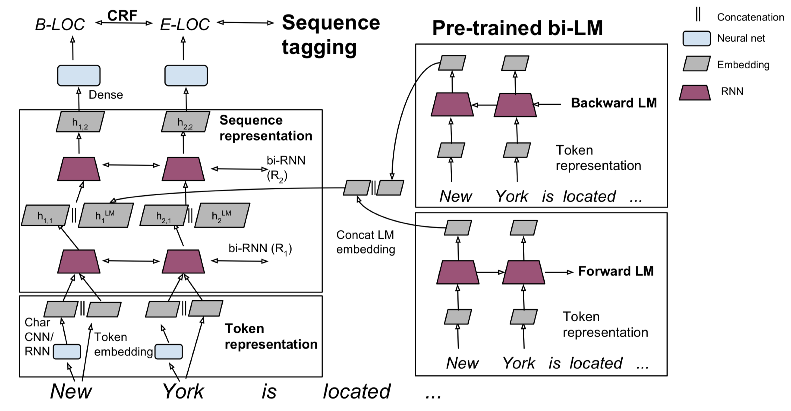
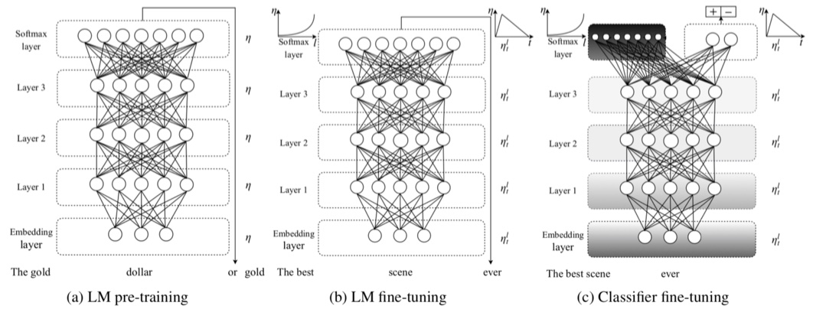
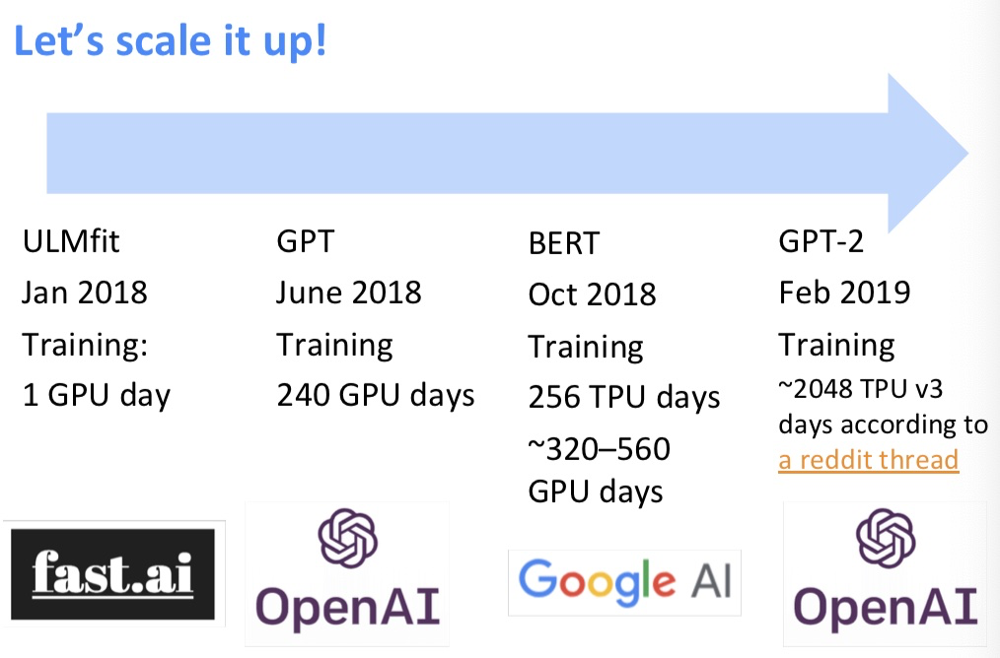
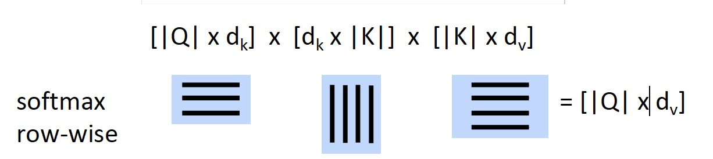
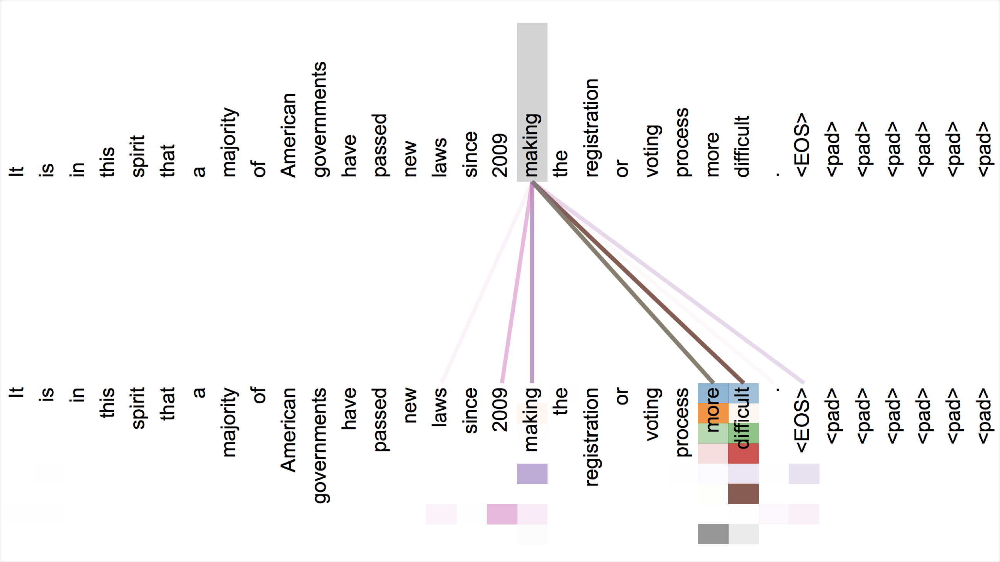

# CS224n-2019 学习笔记

-   结合每课时的课件、笔记与推荐读物等整理而成
-   作业部分将单独整理

## Lecture 13 Contextual Word Representations and Pretraining

??? abstract "Lecture Plan"

    1.  Reflections on word representations 
    2.  Pre-ELMo and ELMO
    3.  ULMfit and onward
    4.  Transformer architectures (20 mins)
    5.  BERT

The remaining lectures

-   Transformers
-   BERT
-   Question answering
-   Text generation and summarization
-   “New research, latest updates in the field”
-   “Successful applications of NLP in industry today”
-   “More neural architectures that are used to solve NLP problem”
-   “More linguistics stuff and NLU!”

### 1. Representations for a word

现在我们可以获得一个单词的表示

-   我们开始时学过的单词向量 Word2vec, GloVe, fastText

**Tips for unknown words with word vectors**

-   简单且常见的解决方案
-   训练时：词汇表 Vocab 为 $\{\text { words occurring, say, } \geq 5 \text { times }\} \cup\{<\cup N K>\}$
-   将所有罕见的词（数据集中出现次数小于 5）都映射为 $<\text{UNK}>$ ，为其训练一个词向量
-   运行时：使用 $<\text{UNK}>$ 代替词汇表之外的词 OOV
-   问题
    -   没有办法区分不同UNK话说,无论是身份还是意义
-   解决方案
    1.  使用字符级模型学习期词向量
        -   特别是在 QA 中，match on word identity 是很重要的,即使词向量词汇表以外的单词
    2.  Try these tips (from Dhingra, Liu, Salakhutdinov, Cohen 2017)
        -   如果测试时的 $<\text{UNK}>$ 单词不在你的词汇表中，但是出现在你使用的无监督词嵌入中，测试时直接使用这个向量
        -   此外，你可以将其视为新的单词，并为其分配一个随机向量，将它们添加到你的词汇表。
-   帮助很大 或者 也许能帮点忙
-   你可以试试另一件事
    -   将它们分解为词类（如未知号码，大写等等），每种都对应一个 $<\text{UNK-class}>$

**Representations for a word**

存在两个大问题

-   对于一个 **word type** 总是是用相同的表示，不考虑这个 **word token** 出现的上下文
    -   比如 star 这个单词，有天文学上的含义以及娱乐圈中的含义
    -   我们可以进行非常细粒度的词义消歧
-   我们对一个词只有一种表示，但是单词有不同的方面，包括语义，句法行为，以及表达 / 含义
    -   表达：同样的意思可以是用多个单词表示，他们的词义是一样的

**Did we all along have a solution to this problem?**

-   在模型中，我们通过LSTM层(也许只在语料库上训练)
-   那些LSTM层被训练来预测下一个单词
-   但这些语言模型在每一个位置生成特定于上下文的词表示

### 2. Peters et al. (2017): TagLM – “Pre-ELMo”

https://arxiv.org/pdf/1705.00108.pdf

-   想法：想要获得单词在上下文的意思，但标准的 RNN 学习任务只在 task-labeled 的小数据上（如 NER ）
-   为什么不通过半监督学习的方式在大型无标签数据集上训练 NLM，而不只是词向量 

**Tag LM**

-   与上文无关的单词嵌入 + RNN model 得到的 hidden states 作为特征输入

$$
\mathbf{h}_{k, l}=\left[\overrightarrow{\mathbf{h}}_{k, 1} ; \overleftarrow{\mathbf{h}}_{k, 1} ; \mathbf{h}_{k}^{L M}\right]
$$

-   Char CNN / RNN + Token Embedding 作为 bi-LSTM 的输入
-   得到的 hidden states 与 Pre-trained bi-LM（冻结的） 的 hidden states 连接起来输入到第二层的 bi-LSTM 中

**Named Entity Recognition (NER)**

-   一个非常重要的NLP子任务：查找和分类文本中的实体，例如

**CoNLL 2003 Named Entity Recognition (en news testb)**

**Peters et al. (2017): TagLM – “Pre-ELMo”**

语言模型在“Billion word benchmark”的8亿个训练单词上训练

语言模型观察结果

-   在监督数据集上训练的LM并不会受益
-   双向LM仅有助于 forward 过程，提升约0.2
-   具有巨大的 LM 设计（困惑度 30） 比较小的模型（困惑度 48）提升约0.3

>   [困惑度](https://blog.csdn.net/index20001/article/details/78884646)

任务特定的BiLSTM观察结果

-   仅使用LM嵌入来预测并不是很好：88.17 F1
    -   远低于仅在标记数据上使用 BiLSTM 标记器

**Also in the air: McCann et al. 2017: CoVe**

https://arxiv.org/pdf/1708.00107.pdf

-   也有使用训练好的序列模型为其他NLP模型提供上下文的想法
-   想法：机器翻译是为了保存意思，所以这也许是个好目标？
-   使用seq2seq + attention NMT system中的Encoder，即 2层 bi-LSTM ，作为上下文提供者
-   所得到的 CoVe 向量在各种任务上都优于 GloVe 向量
-   但是，结果并不像其他幻灯片中描述的更简单的NLM培训那么好，所以似乎被放弃了
    -   也许NMT只是比语言建模更难？
    -   或许有一天这个想法会回来？

**Peters et al. (2018): ELMo: Embeddings from Language Models** 

Deep contextualized word representations. NAACL 2018.
https://arxiv.org/abs/1802.05365

-    **word token vectors** or **contextual word vectors** 的爆发版本
-   使用长上下文而不是上下文窗口学习 word token 向量(这里，整个句子可能更长)
-   学习深度Bi-NLM，并在预测中使用它的所有层 
-   训练一个双向LM
-   目标是 performant 但LM不要太大
    -   使用2个biLSTM层
    -   (仅)使用字符CNN构建初始单词表示
    -   2048 个 char n-gram filters 和 2 个 highway layers，512 维的 projection
    -   4096 dim hidden/cell LSTM状态，使用 512 dim的对下一个输入的投影
    -   使用残差连接
    -   绑定 token 的输入和输出的参数(softmax)，并将这些参数绑定到正向和反向LMs之间
-   ELMo学习biLM表示的特定任务组合
-   这是一个创新，TagLM 中仅仅使用堆叠LSTM的顶层，ELMo 认为BiLSTM所有层都是有用的

$$
\begin{aligned} R_{k} &=\left\{\mathbf{x}_{k}^{L M}, \overrightarrow{\mathbf{h}}_{k, j}^{L M}, \overleftarrow{\mathbf{h}}_{k, j}^{L M} | j=1, \ldots, L\right\} \\ &=\left\{\mathbf{h}_{k, j}^{L M} | j=0, \ldots, L\right\} \end{aligned}
\\ \mathbf{E} \mathbf{L} \mathbf{M} \mathbf{o}_{k}^{t a s k}=E\left(R_{k} ; \Theta^{t a s k}\right)=\gamma^{t a s k} \sum_{j=0}^{L} s_{j}^{t a s k} \mathbf{h}_{k, j}^{L M}
$$

-   $\gamma^{t a s k}$ 衡量ELMo对任务的总体有用性，是为特定任务学习的全局比例因子
-   $\mathbf{s}^{t a s k}$ 是 softmax 归一化的混合模型权重，是 BiLSTM 的加权平均值的权重，对不同的任务是不同的，因为不同的任务对不同层的 BiLSTM 的

**Peters et al. (2018): ELMo: Use with a task**

-   首先运行 biLM 获取每个单词的表示
-   然后让(无论什么)最终任务模型使用它们
-   冻结ELMo的权重，用于监督模型
-   将ELMo权重连接到特定于任务的模型中
    -   细节取决于任务
        -   像 TagLM 一样连接到中间层是典型的
        -   可以在生产输出时提供更多的表示，例如在问答系统中

**ELMo used in a sequence tagger**

$$
\mathbf{h}_{k, l}=\left[\overrightarrow{\mathbf{h}}_{k, 1} ; \overleftarrow{\mathbf{h}}_{k, 1} ; \mathbf{h}_{k}^{L M}\right]
$$

**ELMo results: Great for all tasks**

**ELMo: Weighting of layers**

-   这两个biLSTM NLM层有不同的用途/含义
    -   低层更适合低级语法，例如
        -   词性标注(part-of-speech tagging)、句法依赖(syntacticdependency)、NER
    -   高层更适合更高级别的语义
        -   情绪、Semantic role labeling 语义角色标记 、question answering、SNLI
-   这似乎很有趣，但它是如何通过两层以上的网络来实现的看起来更有趣

**Also around: ULMfit**

Howard and Ruder (2018) Universal Language Model Fine-tuning
for Text Classification. https://arxiv.org/pdf/1801.06146.pdf

-   转移NLM知识的一般思路是一样的
-   这里应用于文本分类

### 3. ULMfit

-   在大型通用领域的无监督语料库上使用 biLM 训练
-   在目标任务数据上调整 LM
-   对特定任务将分类器进行微调

**ULMfit emphases**

-   使用合理大小的“1 GPU”语言模型，并不是真的很大
-   在LM调优中要注意很多
    -   不同的每层学习速度
    -   倾斜三角形学习率(STLR)计划
    -   学习分类器时逐步分层解冻和STLR
    -   使用$\left[h_{T}, \operatorname{maxpool}(\mathbf{h}), \operatorname{meanpool}(\mathbf{h})\right]$进行分类
-   使用大型的预训练语言模型是一种提高性能的非常有效的方法

**ULMfit performance**

-   文本分类器错误率

**ULMfit transfer learning**

-   如果使用监督数据进行训练文本分类器，需要大量的数据才能学习好

**GPT-2 language model (cherry-picked) output**

-   文本生成的样例

-   Transformer 不仅狠强大，而且允许扩展到更大的尺寸

### 4. The Motivation for Transformers

-   我们想要并行化，但是RNNs本质上是顺序的
-   尽管有GRUs和LSTMs, RNNs仍然需要注意机制来处理长期依赖关系——否则状态之间的 path length **路径长度** 会随着序列增长
-   但如果注意力让我们进入任何一个状态……也许我们可以只用注意力而不需要RNN?

**Transformer Overview**

Attention is all you need. 2017. Aswani, Shazeer, Parmar, Uszkoreit, Jones, Gomez, Kaiser, Polosukhin
https://arxiv.org/pdf/1706.03762.pdf

-   Non-recurrent sequence-to-sequence encoder-decoder model
-   任务：平行语料库的机器翻译
-   预测每个翻译单词
-   最终成本/误差函数是 softmax 分类器基础上的标准交叉熵误差

**Transformer Basics**

-   自学
    -   主要推荐资源
        -   http://nlp.seas.harvard.edu/2018/04/03/attention.html
        -   The Annotated Transformer by Sasha Rush
    -   An Jupyter Notebook using PyTorch that explains everything!
-   现在：我们定义 Transformer 网络的基本构建块：第一，新的注意力层

**Dot-Product Attention (Extending our previous def.)**

-   输入：对于一个输出而言的查询 q 和一组键-值对 k-v 
-   Query, keys, values, and output 都是向量
-   输出值的加权和
-   权重的每个值是由查询和相关键的内积计算结果
-   Query 和 keys 有相同维数 $d_k$ ，value 的维数为 $d_v$

$$
A(q, K, V)=\sum_{i} \frac{e^{q \cdot k_{i}}}{\sum_{j} e^{q \cdot k_{j}}} v_{i}
$$

**Dot-Product Attention – Matrix notation**

-   当我们有多个查询 q 时，我们将它们叠加在一个矩阵 Q 中

$$
A(Q, K, V)=\operatorname{softmax}\left(Q K^{T}\right) V
$$

**Scaled Dot-Product Attention**

-   问题：$d_k$ 变大时，$q^Tk$ 的方差增大 $\to$ 一些 softmax 中的值的方差将会变大 $\to$ softmax 得到的是峰值 $\to$ 因此梯度变小了
-   解决方案：通过query/key向量的长度进行缩放

$$
A(Q, K, V)=\operatorname{softmax}\left(\frac{Q K^{T}}{\sqrt{d_{k}}}\right) V
$$

**Self-attention in the encoder**

-   输入单词向量是queries, keys and values
-   换句话说：这个词向量自己选择彼此
-   词向量堆栈= Q = K = V
-   我们会通过解码器明白为什么我们在定义中将他们分开

**Multi-head attention**

-   简单self-attention的问题
-   单词只有一种相互交互的方式
-   解决方案：多头注意力
-   首先通过矩阵 W 将 Q, K, V 映射到 h = 8 的许多低维空间
-   然后应用注意力，然后连接输出，通过线性层

$$
\begin{array}{c}{\text {MultiHead}(\boldsymbol{Q}, \boldsymbol{K}, \boldsymbol{V})=\text {Concat(head}_{1}, \ldots, \text { head }_{h} )} \\ {\text {where head}_{i}=\text {Attention}\left(Q W_{i}^{Q}, K W_{i}^{K}, V W_{i}^{V}\right)}\end{array}
$$

**Complete transformer block**

-   每个 block 都有两个“子层”
    1.  多头 attention
    2.  两层的前馈神经网络，使用 ReLU

这两个子层都：

-   残差连接以及层归一化
    -   LayerNorm(x+Sublayer(x))
    -   层归一化将输入转化为均值是 0，方差是 1 ，每一层和每一个训练点（并且添加了两个参数）

$$
\mu^{l}=\frac{1}{H} \sum_{i=1}^{H} a_{i}^{l} \quad \sigma^{l}=\sqrt{\frac{1}{H} \sum_{i=1}^{H}\left(a_{i}^{l}-\mu^{l}\right)^{2}} \quad h_{i}=f\left(\frac{g_{i}}{\sigma_{i}}\left(a_{i}-\mu_{i}\right)+b_{i}\right)
$$

Layer Normalization by Ba, Kiros and Hinton, https://arxiv.org/pdf/1607.06450.pdf

**Encoder Input**

-   实际的词表示是 byte-pair 编码
-   还添加了一个 **positional encoding** 位置编码，相同的词语在不同的位置有不同的整体表征

$$
\begin{equation}
\begin{cases}
PE(pos, 2i)=\sin \left(pos / 10000^{2 i / d_{model}}\right) \\
PE(\text {pos}, 2 i+1)=\cos \left(pos / 10000^{2 i / d_{model}}\right)
\end{cases}
\end{equation}
$$

**Complete Encoder**

-   encoder 中，每个 block 都是来自前一层的 Q, K, V
-   Blocks 被重复 6 次（垂直方向）
-   在每个阶段，你可以通过多头注意力看到句子中的各个地方，累积信息并将其推送到下一层。在任一方向上的序列逐步推送信息来计算感兴趣的值
-   非常善于学习语言结构

**Attention visualization in layer 5**

-   词语开始以合理的方式关注其他词语

-   不同的颜色对应不同的注意力头

**Attention visualization: Implicit anaphora resolution**

-   对于代词，注意力头学会了如何找到其指代物
-   在第五层中，从 head 5 和 6 的单词“its”中分离出来的注意力。请注意，这个词的注意力是非常鲜明的。

**Transformer Decoder**

-   decoder 中有两个稍加改变的子层
-   对之前生成的输出进行 Masked decoder self-attention

-   Encoder-Decoder Attention，queries 来自于前一个 decoder 层，keys 和 values 来自于 encoder 的输出
-   Blocks 同样重复 6 次

**Tips and tricks of the Transformer**

细节(论文/讲座)

-   Byte-pair encodings
-   Checkpoint averaging
-   Adam 优化器控制学习速率变化
-   训练时，在每一层添加残差之前进行 Dropout
-   标签平滑
-   带有束搜索和长度惩罚的 Auto-regressive decoding
-   因为 transformer 正在蔓延，但他们很难优化并且不像LSTMs那样开箱即用，他们还不能很好与其他任务的构件共同工作

**Experimental Results for MT**

**Experimental Results for Parsing**

### 5. BERT: Devlin, Chang, Lee, Toutanova (2018)

BERT (Bidirectional Encoder Representations from Transformers):

Pre-training of Deep Bidirectional Transformers for Language Understanding

-   **问题**：语言模型只使用左上下文或右上下文，但语言理解是双向的
-   为什么LMs是单向的？
-   原因1：方向性对于生成格式良好的概率分布是有必要的
    -   我们不在乎这个
-   原因2：双向编码器中单词可以“看到自己”

-   **解决方案**：mask out k % 的输入单词，然后预测 masked words
-   不再是传统的计算生成句子的概率的语言模型，目标是填空
    -   总是使用k = 15%

-   Masking 太少：训练太昂贵
-   Masking 太多：没有足够的上下文

-   GPT 是经典的单项的语言模型
-   ELMo 是双向的，但是两个模型是完全独立训练的，只是将输出连接在一起，并没有使用双向的 context
-   BERT 使用 mask 的方式进行整个上下文的预测，使用了双向的上下文信息

**BERT complication: Next sentence prediction**

-   学习句子之间的关系，判断句子 B 是句子 A 的后一个句子还是一个随机的句子。

**BERT sentence pair encoding**

-   token embeddings 是 word pieces （$\text{paly}, \text{##ing}$）
-   使用学习好的分段嵌入表示每个句子
-   位置嵌入与其他 Transformer 体系结构类似
-   将以上三种 embedding 相加，作为最终输入的表示

**BERT model architecture and training**

-   Transformer encoder（和之前的一样）
-   自注意力 $\to$ 没有位置偏差
    -   长距离上下文“机会均等”
-   每层乘法 ⇒ GPU / TPU上高效
-   在 Wikipedia + BookCorpus 上训练
-   训练两种模型尺寸
    -   BERT-Base: 12-layer, 768-hidden, 12-head
    -   BERT-Large: 24-layer, 1024-hidden, 16-head
-   Trained on 4x4 or 8x8 TPU slice for 4 days

**BERT model fine tuning**

-   只学习一个建立在顶层的分类器，微调的每个任务

**BERT results on GLUE tasks**

-   GLUE benchmark 是由自然语言推理任务,还有句子相似度和情感

-   **MultiNLI**

-   Premise: Hills and mountains are especially sanctified in Jainism.

    Hypothesis: Jainism hates nature.

    Label: Contradiction

-   **CoLa**

-   Sentence: The wagon rumbled down the road. Label: Acceptable

-   Sentence: The car honked down the road. Label: Unacceptable

**BERT results on SQuAD 1.1**

**SQuAD 2.0 leaderboard, 2019-02-07**

**Effect of pre-training task**

**Size matters**

-   从 119M 到 340M 的参数量改善了很多
-   改进尚未渐进

## Suggested Readings

[The Annotated Transformer](http://nlp.seas.harvard.edu/2018/04/03/attention.html) 代码解析

-   https://github.com/rsennrich/subword-nmt
-   https://github.com/opennmt/opennmt-py

jalammar 的一系列可视化简单教程

[Visualizing A Neural Machine Translation Model (Mechanics of Seq2seq Models With Attention)](https://jalammar.github.io/visualizing-neural-machine-translation-mechanics-of-seq2seq-models-with-attention/)

[The Illustrated Transformer](https://jalammar.github.io/illustrated-transformer/)

>   **Go Forth And Transform**
>
>   I hope you’ve found this a useful place to start to break the ice with the major concepts of the Transformer. If you want to go deeper, I’d suggest these next steps:
>
>   -   Read the [Attention Is All You Need](https://arxiv.org/abs/1706.03762) paper, the Transformer blog post ([Transformer: A Novel Neural Network Architecture for Language Understanding](https://ai.googleblog.com/2017/08/transformer-novel-neural-network.html)), and the [Tensor2Tensor announcement](https://ai.googleblog.com/2017/06/accelerating-deep-learning-research.html).
>   -   Watch [Łukasz Kaiser’s talk](https://www.youtube.com/watch?v=rBCqOTEfxvg) walking through the model and its details
>   -   Play with the [Jupyter Notebook provided as part of the Tensor2Tensor repo](https://colab.research.google.com/github/tensorflow/tensor2tensor/blob/master/tensor2tensor/notebooks/hello_t2t.ipynb)
>   -   Explore the [Tensor2Tensor repo](https://github.com/tensorflow/tensor2tensor).
>
>   **Follow-up works**
>
>   -   [Depthwise Separable Convolutions for Neural Machine Translation](https://arxiv.org/abs/1706.03059)
>   -   [One Model To Learn Them All](https://arxiv.org/abs/1706.05137)
>   -   [Discrete Autoencoders for Sequence Models](https://arxiv.org/abs/1801.09797)
>   -   [Generating Wikipedia by Summarizing Long Sequences](https://arxiv.org/abs/1801.10198)
>   -   [Image Transformer](https://arxiv.org/abs/1802.05751)
>   -   [Training Tips for the Transformer Model](https://arxiv.org/abs/1804.00247)
>   -   [Self-Attention with Relative Position Representations](https://arxiv.org/abs/1803.02155)
>   -   [Fast Decoding in Sequence Models using Discrete Latent Variables](https://arxiv.org/abs/1803.03382)
>   -   [Adafactor: Adaptive Learning Rates with Sublinear Memory Cost](https://arxiv.org/abs/1804.04235)

[The Illustrated BERT, ELMo, and co. (How NLP Cracked Transfer Learning)](http://jalammar.github.io/illustrated-bert/)

Smith, Noah A. [Contextual Word Representations: A Contextual Introduction](https://arxiv.org/abs/1902.06006). 

## Reference

以下是学习本课程时的可用参考书籍：

[《基于深度学习的自然语言处理》](<https://item.jd.com/12355569.html>) （车万翔老师等翻译）

[《神经网络与深度学习》](<https://nndl.github.io/>)

以下是整理笔记的过程中参考的博客：

[斯坦福CS224N深度学习自然语言处理2019冬学习笔记目录](<https://zhuanlan.zhihu.com/p/59011576>) (课件核心内容的提炼，并包含作者的见解与建议)

[斯坦福大学 CS224n自然语言处理与深度学习笔记汇总](<https://zhuanlan.zhihu.com/p/31977759>) {>>这是针对note部分的翻译<<}