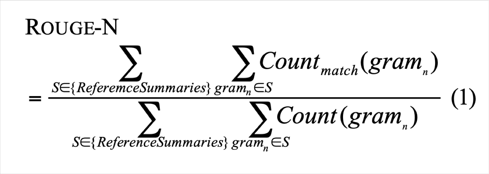
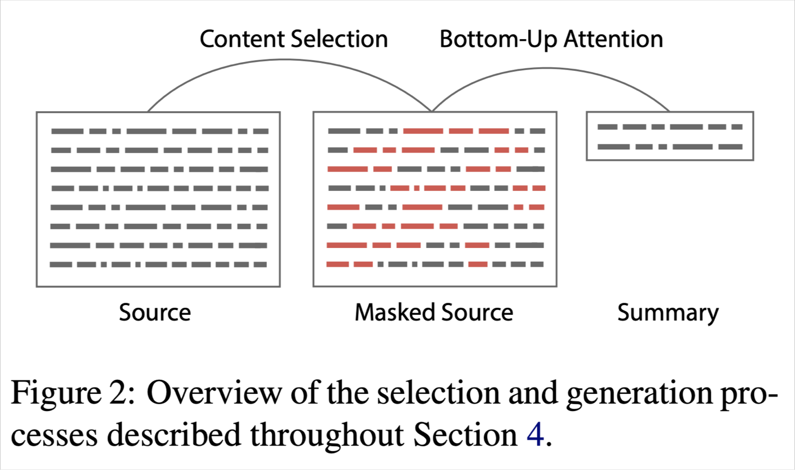
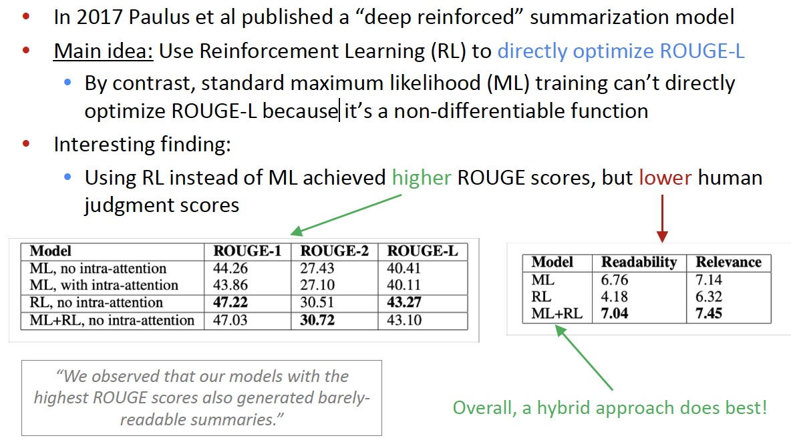
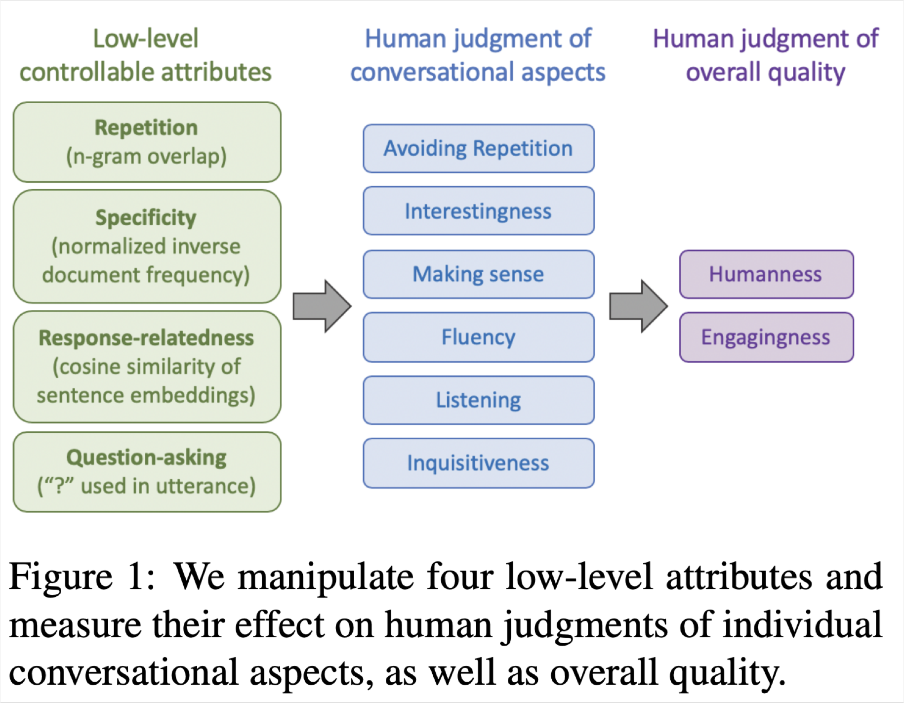

# CS224n-2019 学习笔记

-   结合每课时的课件、笔记与推荐读物等整理而成
-   作业部分将单独整理

## Lecture 15 Natural Language Generation

??? abstract "Lecture Plan"

    -   Recap what we already know about NLG
    -   More on decoding algorithms
    -   NLG tasks and neural approaches to them
    -   NLG evaluation: a tricky situation
    -   Concluding thoughts on NLG research, current trends, and the future

Today we’ll be learning about what’s happening in the world of **neural approaches** to ==Natural Language Generation (NLG)==

### Section 1: Recap: LMs and decoding algorithms

**Natural Language Generation (NLG)**

-   自然语言生成指的是我们生成（即写入）新文本的任何设置
-   NLG 包括以下成员：
    -   机器翻译
    -   摘要
    -   对话（闲聊和基于任务）
    -   创意写作：讲故事，诗歌创作
    -   自由形式问答（即生成答案，从文本或知识库中提取）
    -   图像字幕

**Recap**

-   **语言建模** 是给定之前的单词，预测下一个单词的任务：

$$
P\left(y_{t} | y_{1}, \ldots, y_{t-1}\right)
$$

-   一个产生这一概率分布的系统叫做 **语言模型**
-   如果系统使用 RNN，则被称为 **RNN-LM**

-   **条件语言建模** 是给定之前的单词以及一些其他输入 $x$ ，预测下一个单词的任务：

$$
P\left(y_{t} | y_{1}, \dots, y_{t-1}, x\right)
$$

-   条件语言建模任务的例子：
    -   机器翻译 x=source sentence, y=target sentence
    -   摘要 x=input text, y=summarized text
    -   对话 x=dialogue history, y=next utterance

**Recap: training a (conditional) RNN-LM**

-   这是神经机器翻译中的例子
-   在训练期间,我们将正确的(又名引用)目标句子输入解码器，而不考虑
    解码器预测的。这种培训方法称为 **Teacher Forcing**

**Recap: decoding algorithms**

-   问题：训练条件语言模型后，如何使用它生成文本？
-   答案：解码算法是一种算法，用于从语言模型生成文本
-   我们了解了两种解码算法
    -   贪婪解码
    -   光束搜索

**Recap: greedy decoding**

-   一个简单的算法
-   在每一步中，取最可能的单词（即argmax）
-   将其用作下一个单词，并在下一步中将其作为输入提供
-   继续前进，直到您产生 $\text{<END>}$ 或达到某个最大长度
-   由于缺乏回溯，输出可能很差（例如，不合语法，不自然，荒谬）

**Recap: beam search decoding**

-    一种旨在通过一次跟踪多个可能的序列，找到高概率序列（不一定是最佳序列）的搜索算法
-   核心思想：在解码器的每一步，跟踪 k 个最可能的部分序列（我们称之为假设）
    -   k是光束大小
-   达到某个停止标准后，选择概率最高的序列（考虑一些长度调整）

**What’s the effect of changing beam size k?**

-   小的 k 与贪心解码有类似的问题（k = 1）
    -   不符合语法，不自然，荒谬，不正确
-   更大的 k 意味着您考虑更多假设
    -   增加 k 可以减少上述一些问题
    -   更大的 k 在计算上更昂贵
    -   但增加 k 可能会引入其他问题：
        -   对于NMT，增加k太多会降低BLEU评分(Tu et al, Koehnet al)。 这主要是因为大 k 光束搜索产生太短的翻译（即使得分归一化）
        -   在闲聊话等开放式任务中，大 k 可以输出更通用（见下一张幻灯片）

**Effect of beam size in chitchat dialogue**

-   低 beam size
    -   更关于话题但是没有意义的
    -   语法差
-   高 beam size
    -   融合安全
    -   “正确”的反应
    -   但它是通用的，不太相关

**Sampling-based decoding**

-   纯采样
    -   在每个步骤t，从概率分布 $P_t$ 中随机抽样以获取你的下一个单词。
    -   像贪婪的解码，但是是采样而不是argmax。
-   Top-n 采样
    -   在每个步骤 t ，从 $P_t$ 中随机采样，仅限于前n个最可能的单词
    -   与纯采样一样，但截断概率分布
    -   n = 1是贪婪搜索，n = V是纯采样
    -   增加n以获得更多样化/风险的输出
    -   减少n以获得更通用/安全的输出
-   这两者都更多比光束搜索更有效——没有多重假设

**Softmax temperature**

-   回顾：在时间步 t ，语言模型通过对分数向量 $s \in \mathbb{R}^{|V|}$ 使用 softmax 函数计算出概率分布 $P_t$ 

$$
P_{t}(w)=\frac{\exp \left(s_{w}\right)}{\sum_{w^{\prime} \in V} \exp \left(s_{w^{\prime}}\right)}
$$

-   你可以对 softmax 函数时候用温度超参数

$$
P_{t}(w)=\frac{\exp \left(s_{w} / \tau\right)}{\sum_{w^{\prime} \in V} \exp \left(s_{w^{\prime}} / \tau\right)}
$$

-   提高温度 $\tau$ : $P_t$ 变得更均匀
    -   因此产出更多样化（概率分布在词汇中）
-   降低温度 $\tau$ : $P_t$ 变得更尖锐
    -   因此输出的多样性较少（概率集中在顶层词汇上）

**Decoding algorithms: in summary**

-   **贪心解码** 是一种简单的译码方法；给低质量输出
-   **Beam搜索** (特别是高beam大小)搜索高概率输出
    -   比贪婪提供更好的质量，但是如果 Beam 尺寸太大，可能会返回高概率但不合适的输出(如通用的或是短的)
-   **抽样方法** 来获得更多的多样性和随机性
    -   适合开放式/创意代(诗歌,故事)
    -   Top-n个抽样允许您控制多样性
-   **Softmax 温度控制** 的另一种方式多样性
    -   它不是一个解码算法！这种技术可以应用在任何解码算法。

### Section 2: NLG tasks and neural approaches to them

**Summarization: task definition**

任务：给定输入文本x，写出更短的总结 y 并包含x的主要信息

摘要可以是单文档，也可以是多文档

-   单文档意味着我们写一个文档 x 的总结 y

-   多文档意味着我们写一个多个文档 $x_{1}, \ldots, x_{n}$ 的总结y

通常 $x_{1}, \ldots, x_{n}$ 有重叠的内容：如对同一事件的新闻文章

在单文档总结，数据集中的源文档具有**不同长度和风格**

-   **Gigaword**: 新闻文章的前一两句 $\to$ 标题(即句子压缩)
-   **LCSTS** (中文微博)：段落 $\to$ 句子总结
-   **NYT, CNN/DailyMail**: 新闻文章  $\to$ (多个)句子总结
-   **Wikihow (new!)**: 完整的 how-to 文章 $\to$ 总结句子

**句子简化** 是一个不同但相关的任务：将源文本改写为更简单（有时是更短）的版本

-   Simple Wikipedia：标准维基百科句子 $\to$ 简单版本
-   Newsela：新闻文章 $\to$ 为儿童写的版本

**Summarization: two main strategies**

**抽取式总结 Extractive summarization**

-   **选择部分**(通常是句子)的原始文本来形成总结
    -   更简单
    -   限定性的（无需解释）

**摘要式总结 Abstractive summarization**

-   使用自然语言生成技术 **生成新的文本**
    -   更困难
    -   更多变（更人性化）

**Pre-neural summarization**

-   Pre-neural总结系统大多是抽取式的
-   类似Pre-neural MT，他们通常有一个流水线
    -   **内容选择 Content selection**：选择一些句子
    -   **信息排序 Information ordering**：为选择的句子排序
    -   **句子实现 Sentence realization**：编辑句子的顺序(例如，简化、删除部分、修复连续性问题)

Pre-neural **内容选择** 算法

-   **句子得分函数** 可以根据
    -   主题关键词，通过计算如tf-idf等
    -   特性，例如这句话出现在文档的哪里
-   **图论算法** 将文档为一组句子(节点)，每对句子之间存在边
    -   边的权重与句子相似度成正比
    -   使用图算法来识别图中最重要的句子

**Summarization evaluation: ROUGE**

**ROUGE** (Recall-Oriented Understudy for Gisting Evaluation)

类似于 BLEU，是基于 n-gram 覆盖的算法，不同之处在于：

-   没有简洁惩罚
-   基于召回率 recall，BLEU 是基于准确率的
    -   可以说，准确率对于MT 来说是更重要的(通过添加简洁惩罚来修正翻译过短)，召回率对于总结来说是更重要的(假设你有一个最大长度限制)
    -   但是，通常使用 F1(结合了准确率和召回率)

**Neural summarization (2015 - present)**

-   2015: Rush et al. publish the first seq2seq summarization paper

-   单文档摘要总结是一项翻译任务！

-   因此我们可以使用标准的 seq2seq + attention NMT 方法

>   A Neural Attention Model for Abstractive Sentence Summarization, Rush et al, 2015 https://arxiv.org/pdf/1509.00685.pdf

-   自2015年以来，有了更多的发展
    -   使其更容易复制
        -   也防止太多的复制
    -   分层/多层次的注意力机制
    -   更多的 全局/高级 的内容选择
    -   使用 RL 直接最大化 ROUGE 或者其他离散目标（例如长度）
    -   复兴 pre-neural 想法(例如图算法的内容选择)，把它们变成神经系统

**Neural summarization: copy mechanisms**

-   Seq2seq+attention systems 善于生成流畅的输出，但是不擅长正确的复制细节(如罕见字)
-   复制机制使用注意力机制，使seq2seq系统很容易从输入复制单词和短语到输出
    -   显然这是非常有用的总结
    -   允许复制和创造给了我们一个混合抽取/摘要式的方法
-   There are several papers proposing copy mechanism variants:
    -   Language as a Latent Variable: Discrete Generative Models for Sentence Compression, Miao et al, 2016 https://arxiv.org/pdf/1609.07317.pdf
    -   Abstractive Text Summarization using Sequence-to-sequence RNNs and Beyond, Nallapati et al, 2016 https://arxiv.org/pdf/1602.06023.pdf
    -   Incorporating Copying Mechanism in Sequence-to-Sequence Learning, Gu et al, 2016 https://arxiv.org/pdf/1603.06393.pdf
    -   etc

>   Get To The Point: Summarization with Pointer-Generator Networks, See et al, 2017 https://arxiv.org/pdf/1704.04368.pdf

-   复制机制的大问题
    -   他们复制太多
        -   主要是长短语，有时甚至整个句子
    -   **一个原本应该是抽象的系统，会崩溃为一个主要是抽取的系统**
-   另一个问题
    -   他们不善于整体内容的选择，特别是如果输入文档很长的情况下
    -   没有选择内容的总体战略

**Neural summarization: better content selection**

-   回忆：pre-neural总结是不同阶段的内容选择和表面实现(即文本生成)
-   标准seq2seq + attention 的总结系统，这两个阶段是混合在一起的
    -   每一步的译码器(即表面实现)，我们也能进行词级别的内容选择(注意力)
    -   这是不好的：没有全局内容选择策略
-   一个解决办法：自下而上的汇总

**Bottom-up summarization**

-   内容选择阶段：使用一个神经序列标注模型来将单词标注为 include / don’t-include
-   自下而上的注意力阶段：seq2seq + attention 系统不能处理 don’t-include 的单词（使用 mask ）

简单但是非常有效！

-   更好的整体内容选择策略
-   减少长序列的复制(即更摘要的输出)

**Neural summarization via Reinforcement Learning**

-   使用 RL 直接优化 ROUGE-L 
    -   相比之下，标准的最大似然(ML)训练不能直接优化ROUGE-L，因为它是一个不可微函数
-   有趣的发现
    -   使用RL代替ML取得更高的ROUGE分数，但是人类判断的得分越低
-   混合模型最好

>   A Deep Reinforced Model for Abstractive Summarization, Paulus et al, 2017 https://arxiv.org/pdf/1705.04304.pdf
>
>   Blog post: https://www.salesforce.com/products/einstein/ai-research/tl-dr-reinforced-model-abstractive-summarization/

**Dialogue**

“对话”包括各种各样的设置

-   面向任务的对话
    -   辅助 (如客户服务、给予建议，回答问题，帮助用户完成任务，如购买或预订)
    -   合作 (两个代理通过对话在一起解决一个任务)
    -   对抗 (两个代理通过对话完成一个任务)
-   社会对话
    -   闲聊 (为了好玩或公司)
    -   治疗/精神健康

**Pre- and post-neural dialogue**

-   由于开放式自由NLG的难度，pre-neural对话系统经常使用预定义的模板，或从语料库中检索一个适当的反应的反应

-   总结过去的研究，自2015年以来有很多论文将seq2seq方法应用到对话，从而导致自由对话系统兴趣重燃

-   一些早期seq2seq对话文章包括

    -   A Neural Conversational Model, Vinyals et al, 2015

        https://arxiv.org/pdf/1506.05869.pdf

    -   Neural Responding Machine for Short-Text Conversation, Shang et al, 2015

        https://www.aclweb.org/anthology/P15-1152

**Seq2seq-based dialogue**

然而，很快他们就明白简单的应用标准seq2seq +attention 的方法在对话(闲聊)任务中有严重的普遍缺陷

-   一般性/无聊的反应
-   无关的反应(与上下文不够相关)
-   重复
-   缺乏上下文(不记得谈话历史)
-   缺乏一致的角色人格

**Irrelevant response problem**

-   问题：seq2seq经常产生与用户无关的话语
    -   要么因为它是通用的(例如,“我不知道”)
    -   或因为改变话题为无关的一些事情
-   一个解决方案：优化输入S 和回复 T 之间的最大互信息Maximum Mutual Information (MMI)

$$
\log \frac{p(S, T)}{p(S) p(T)}
$$

$$
\hat{T}=\underset{T}{\arg \max }\{\log p(T | S)-\log p(T)\}
$$

**Genericness / boring response problem**

-   简单的测试时修复
    -   直接在Beam搜索中增大罕见字的概率
    -   使用抽样解码算法而不是Beam搜索
-   条件修复
    -   用一些额外的内容训练解码器(如抽样一些内容词并处理)
    -   训练 retrieve-and-refine 模型而不是 generatefrom-scratch 模型
        -   即从语料库采样人类书面话语并编辑它以适应当前的场景
        -   这通常产生更加多样化/人类/有趣的话语！

**Repetition problem**

简单的解决方案

-   直接在 Beam 搜索中禁止重复n-grams
    -   通常非常有效
-   更复杂的解决方案
    -   在seq2seq中训练一个覆盖机制，这是客观的，可以防止注意力机制多次注意相同的单词
    -   定义训练目标以阻止重复
        -   如果这是一个不可微函数生成的输出，然后将需要一些技术例如RL来训练

**Lack of consistent persona problem**

-   2016年，李等人提出了一个seq2seq对话模式，学会将两个对话伙伴的角色编码为嵌
    -   生成的话语是以嵌入为条件的
-   最近有一个闲聊的数据集称为PersonaChat，包括每一次会话的角色(描述个人特质的5个句子的集合)
    -   这提供了一种简单的方式，让研究人员构建 persona-conditional 对话代理

>   A Persona-Based Neural Conversation Model, Li et al 2016, https://arxiv.org/pdf/1603.06155.pdf
>
>   Personalizing Dialogue Agents: I have a dog, do you have pets too?, Zhang et al, 2018 https://arxiv.org/pdf/1801.07243.pdf

**Negotiation dialogue**

2017年，Lewis et al收集谈判对话数据集

-   两个代理协商谈判对话(通过自然语言)如何分配一组项目
-   代理对项目有不同的估值函数
-   代理人会一直交谈直到达成协议

>   Deal or No Deal? End-to-End Learning for Negotiation Dialogues, Lewis et al, 2017 https://arxiv.org/pdf/1706.05125.pdf

-   他们发现用标准的最大似然(ML)来训练seq2seq系统的产生了流利但是缺乏策略的对话代理
-   和Paulus等的总结论文一样，他们使用强化学习来优化离散奖励(代理自己在训练自己)
-   RL 的基于目的的目标函数与 ML 目标函数相结合
-   潜在的陷阱：如果两两对话时，代理优化的只是RL目标，他们可能会偏离英语

在测试时，模型通过计算 rollouts，选择可能的反应：模拟剩余的谈话和预期的回报

-   2018年，Yarats 等提出了另一个谈判任务的对话模型，将策略和NLG方面分开

-   每个话语 $x_t$ 都有一个对应的离散潜在变量 $z_t$
-    $z_t$ 学习成为一个很好的预测对话中的未来事件的预测器(未来的消息，策略的最终收获)，但不是 $x_t$ 本身的预测器
-   这意味着 $z_t$ 学会代表 $x_t$ 对对话的影响，而不是 $x_t$ 的话
-   因此 $z_t$ 将任务的策略方面从 NLG方面分离出来
-   这对可控制性、可解释性和更容易学习策略等是有用的

>   Hierarchical Text Generation and Planning for Strategic Dialogue, Yarats et al, 2018 https://arxiv.org/pdf/1712.05846.pdf

**Conversational question answering: CoQA**

-   一个来自斯坦福NLP的新数据集
-   任务：回答关于以一段对话为上下文的文本的问题
-   答案必须写摘要地(不是复制)
-   QA / 阅读理解任务，和对话任务

>   CoQA: a Conversational Question Answering Challenge, Reddy et al, 2018 https://arxiv.org/pdf/1808.07042.pdf

**Storytelling**

-   神经讲故事的大部分工作使用某种提示
    -   给定图像生成的故事情节段落
    -   给定一个简短的写作提示生成一个故事
    -   给定迄今为止的故事，生成故事的下一个句子（故事续写）
        -   这和前两个不同，因为我们不关心系统在几个生成的句子上的性能
-   神经故事飞速发展
    -   第一个故事研讨会于2018年举行
    -   它举行比赛(使用五张图片的序列生成一个故事)

**Generating a story from an image**

有趣的是，这并不是直接的监督图像标题。没有配对的数据可以学习。

>   Generating Stories about Images, https://medium.com/@samim/generating-stories-about-images-d163ba41e4ed

-   问题：如何解决缺乏并行数据的问题
-   回答：使用一个通用的sentence-encoding space
-   Skip-thought 向量空间是一种通用的句子嵌入方法
-   想法类似于我们如何学通过预测周围的文字来学习单词的嵌入
-   使用COCO (图片标题数据集)，学习从图像到其标题的Skip-thought编码的映射
-   使用目标样式语料库(Taylor Swift lyrics)，训练RNN-LM将Skip-thought向量解码为原文
-   把两个房在一起

>   Skip-Thought Vectors, Kiros 2015, https://arxiv.org/pdf/1506.06726v1.pdf

**Generating a story from a writing prompt**

-   2018年，Fan 等发布了一个新故事生成数据集 collected from Reddit’s WritingPrompts subreddit.
-   每个故事都有一个相关的简短写作提示

Fan 等也提出了一个复杂的 seq2seq prompt-to-story 模型

>   Hierarchical Neural Story Generation, Fan et al, 2018 https://arxiv.org/pdf/1805.04833.pdf

-   convolutional-based
    -   这使它的速度比RNN-based seq2seq
-   封闭的多头多尺度的self-attention
    -   self-attention 对于捕获远程上下文而言十分重要
    -   门控允许更有选择性的注意机制
    -   不同的注意力头在不同的尺度上注意不同的东西——这意味着有不同的注意机制用于检索细粒度和粗粒度的信息
-   模型融合
    -   预训练一个seq2seq模型，然后训练第二个 seq2seq 模型访问的第一个 model 的隐状态
    -   想法是，第一seq2seq模型学习通用LM，第二个model学习基于提示的条件

结果令人印象深刻

-   与提示相关

-   多样化，并不普通

-   在文体上戏剧性

但是

-   主要是氛围/描述性/场景设定，很少是事件/情节
-   生成更长时，大多数停留在同样的想法并没有产生新的想法——一致性问题

**Challenges in storytelling**

由神经LM生成的故事听起来流畅…但是是曲折的，荒谬的，情节不连贯的

缺失的是什么？

LMs对单词序列进行建模。故事是事件序列

-   为了讲一个故事，我们需要理解和模拟
    -   事件和它们之间的因果关系结构
    -   人物，他们的个性、动机、历史、和其他人物之间的关系
    -   世界(谁、是什么和为什么)
    -   叙事结构(如说明 $\to$ 冲突 $\to$ 解决)
    -   良好的叙事原则(不要引入一个故事元素然后从未使用它)

**Event2event Story Generation**

>   Event Representations for Automated Story Generation with Deep Neural Nets, Martin et al, 2018
>
>   https://www.aaai.org/ocs/index.php/AAAI/AAAI18/paper/view/17046/15769

**Structured Story Generation**

>   Strategies for Structuring Story Generation, Fan et al, 2019 https://arxiv.org/pdf/1902.01109.pdf

**Tracking events, entities, state, etc.**

-   旁注：在神经NLU(自然语言理解)领域，已经有大量关于跟踪事件/实体/状态的工作
    -   例如，Yejin Choi’s group* 很多工作在这一领域
-   将这些方法应用到 NLG是更加困难的
    -   如果你缩小范围，则更可控的
    -   不采用自然语言生成开放域的故事，而是跟踪状态
    -   生成一个配方(考虑到因素)，跟踪因素的状态

**Tracking world state while generating a recipe**

-   过程神经网络：给定因素，生成配方指示
-   显式跟踪所有因素的状态，并利用这些知识来决定下一步要采取什么行动

>   Simulating Action Dynamics with Neural Process Networks, Bosselut et al, 2018 https://arxiv.org/pdf/1711.05313.pdf

**Poetry generation: Hafez**

-   Hafez：Ghazvininejad et al 的诗歌系统

-   主要思想：使用一个有限状态受体(FSA)来定义所有可能的序列，服从希望满足的节奏约束

-   然后使用FSA约束RNN-LM的输出

例如

-   莎士比亚的十四行诗是14行的iambic pentameter
-   所以莎士比亚的十四行诗的FSA是 $((01)^5)^{14}$
-   在Beam搜索解码中，只有探索属于FSA的假设

>   Generating Topical Poetry, Ghazvininejad et al, 2016 http://www.aclweb.org/anthology/D16-1126
>
>   Hafez: an Interactive Poetry Generation System, Ghazvininejad et al, 2017 http://www.aclweb.org/anthology/P17-4008

-   全系统
-   用户提供主题字
-   得到一个与主题相关的词的集合
-   识别局部词语押韵。这将是每一行的结束
-   使用受制于FSA的RNN-LM生成这首诗
-   RNN-LM向后(自右向左)。这是必要的,因为每一行的最后一个词是固定的。

在后续的一篇论文中，作者制作了系统交互和用户可控

控制方法很简单：在Beam搜索中，增大具有期望特征的单词的分数

**Poetry generation: Deep-speare**

更多的诗歌生成的端到端方法(lau等)

三个组件

-   语言模型
-   pentameter model
-   rhyme model 韵律模型……

作为一个多任务学习问题共同学习

-   作者发现 meter 和押韵是相对容易的，但生成的诗歌上有些缺乏“情感和可读性”

>   Deep-speare: A joint neural model of poetic language, meter and rhyme, Lau et al, 2018 http://aclweb.org/anthology/P18-1181

**Non-autoregressive generation for NMT**

>   Non-Autoregressive Neural Machine Translation, Gu et al, 2018 https://arxiv.org/pdf/1711.02281.pdf

-   2018年,顾等发表了“Non-autoregressive 神经机器翻译”模型
-   意义：它不是根据之前的每个单词，从左到右产生翻译
-   它并行生成翻译
-   这具有明显的效率优势，但从文本生成的角度来看也很有趣
-   架构是基于Transformer 的；最大的区别是，解码器可以运行在测试时并行

### Section 3: NLG evaluation

**Automatic evaluation metrics for NLG**

基于词重叠的指标(BLEU，ROUGE，METROR，F1，等等)

-   我们知道他们不适合机器翻译
-   对于总结而言是更差的，这比机器翻译更开放
    -   不幸的是，与抽象系统相比，提取摘要系统也更受ROUGE青睐
-   对于对话甚至更糟，这比总结更开放
    -   类似的例子还有故事生成

**Word overlap metrics are not good for dialogue**

>   How NOT To Evaluate Your Dialogue System: An Empirical Study of Unsupervised Evaluation Metrics for
>
>   Dialogue Response Generation, Liu et al, 2017 https://arxiv.org/pdf/1603.08023.pdf

>    Why We Need New Evaluation Metrics for NLG, Novikova et al, 2017 https://arxiv.org/pdf/1707.06875.pdf

**Automatic evaluation metrics for NLG**

-   困惑度？
    -   捕捉你的LM有多强大，但是不会告诉你关于生成的任何事情(例如，如果你的困惑度是未改变的，解码算法是不好的)
-   词嵌入基础指标？
    -   主要思想：比较词嵌入的相似度(或词嵌入的均值)，而不仅仅是重叠的单词。以更灵活的方式捕获语义。
    -   不幸的是,仍然没有与类似对话的开放式任务的人类判断，产生很好的联系

-   我们没有自动指标充分捕捉整体质量(即代表人类的质量判断)
-   但我们可以定义更多的集中自动度量来捕捉生成文本的特定方面
    -   流利性(使用训练好的LM计算概率)
    -   正确的风格(使用目标语料库上训练好的LM的概率)
    -   多样性(罕见的用词，n-grams 的独特性)
    -   相关输入(语义相似性度量)
    -   简单的长度和重复
    -   特定于任务的指标，如总结的压缩率
-   虽然这些不衡量整体质量，他们可以帮助我们跟踪一些我们关心的重要品质

**Human evaluation**

-   人类的判断被认为是黄金标准
-   当然，我们知道人类评价是缓慢而昂贵的
-   但这些问题？
-   假如你获得人类的评估：人类评估解决你所有的问题吗？
-   不！
-   进行人类有效评估非常困难
-   人类
    -   是不一致的
    -   可能是不合逻辑的
    -   失去注意力
    -   误解了你的问题
    -   不能总是解释为什么他们会这样做

**Detailed human eval of controllable chatbots**

-   在聊天机器人项目上工作的个人经验（PersonaChat）
-   我们研究了可控性（特别是控制所产生的话语，如重复，特异性，回应相关性和问题询问）

>   What makes a good conversation? How controllable attributes affect human judgments,
>
>   See et al, 2019 https://arxiv.org/pdf/1902.08654.pdf

-   如何要求人的质量判断？

-   我们尝试了简单的整体质量（多项选择）问题，例如：

    -   这次对话有多好？
    -   这个用户有多吸引人？
    -   这些用户中哪一个给出了更好的响应？

    ●您想再次与该用户交谈吗？

    ●您认为该用户是人还是机器人？

主要问题：

-   必然非常主观
-   回答者有不同的期望；这会影响他们的判断
-   对问题的灾难性误解（例如“聊天机器人非常吸引人，因为它总是回写”）
-   总体质量取决于许多潜在因素；他们应该如何被称重和/或比较？

最终，我们设计了一个详细的人类评价体系分离的重要因素，有助于整体chatbot质量

发现：

-   控制重复对于所有人类判断都非常重要
-   提出更多问题可以提高参与度
-   控制特异性（较少的通用话语）提高了聊天机器人的吸引力，趣味性和感知的听力能力。
-   但是，人类评估人员对风险的容忍度较低（例如无意义或非流利的输出）与较不通用的机器人相关联
-   总体度量“吸引力”（即享受）很容易最大化 - 我们的机器人达到了近乎人性化的表现

-   整体度量“人性化”（即图灵测试）根本不容易最大化 - 所有机器人远远低于人类表现
-   人性化与会话质量不一样！
-   人类是次优的会话主义者：他们在有趣，流利，倾听上得分很低，并且问的问题太少

**Possible new avenues for NLG eval?**

-   语料库级别的评价指标
    -   度量应独立应用于测试集的每个示例，或整个语料库的函数
    -   例如，如果对话模型对测试集中的每一个例子回答相同的通用答案，它应该被惩罚
-   评估衡量多样性安全权衡的评估指标
-   免费的人类评估
    -   游戏化：使任务（例如与聊天机器人交谈）变得有趣，这样人类就可以为免费提供监督和隐式评估，作为评估指标
-   对抗性鉴别器作为评估指标
    -   测试NLG系统是否能愚弄经过训练能够区分人类文本和AI生成的文本的识别器

### Section 4: Thoughts on NLG research, current trends, and the future

**Exciting current trends in NLG**

-   将离散潜在变量纳入NLG
    -   可以帮助在真正需要它的任务中建模结构，例如讲故事，任务导向对话等
-   严格的从左到右生成的替代方案
    -   并行生成，迭代细化，自上而下生成较长的文本
-   替代teacher forcing的最大可能性培训
    -   更全面的句子级别的目标函数（而不是单词级别）

**Neural NLG community is rapidly maturing**

-   在NLP+深度学习的早期，社区主要将成功的非机动车交通方法转移到NLG任务中。
-   现在，越来越多的创新NLG技术出现，针对非NMT生成环境。
-   越来越多（神经）NLG研讨会和竞赛，特别关注开放式NLG
    -   NeuralGen workshop
    -   Storytelling workshop
    -   Alexa challenge
    -   ConvAI2 NeurIPS challenge
-   这些对于组织社区提高再现性、标准化评估特别有用
-   最大障碍是评估

**8 things I’ve learnt from working in NLG**

1.  任务越开放，一切就越困难
    -   约束有时是受欢迎的
2.  针对特定改进的目标比旨在提高整体生成质量更易于管理
3.  如果你使用一个LM作为NLG：改进LM（即困惑）最有可能提高生成质量
    -   但这并不是提高生成质量的唯一途径
4.  多看看你的输出
5.  你需要一个自动度量，即使它是不受影响的
    -   您可能需要几个自动度量
6.  如果你做了人工评估，让问题尽可能的集中
7.  在今天的NLP + 深度学习和 NLG中，再现性是一个巨大的问题。
    -   请公开发布所有生成的输出以及您的论文
8.  在NLG工作可能很令人沮丧，但也很有趣

## Reference

以下是学习本课程时的可用参考书籍：

[《基于深度学习的自然语言处理》](<https://item.jd.com/12355569.html>) （车万翔老师等翻译）

[《神经网络与深度学习》](<https://nndl.github.io/>)

以下是整理笔记的过程中参考的博客：

[斯坦福CS224N深度学习自然语言处理2019冬学习笔记目录](<https://zhuanlan.zhihu.com/p/59011576>) (课件核心内容的提炼，并包含作者的见解与建议)

[斯坦福大学 CS224n自然语言处理与深度学习笔记汇总](<https://zhuanlan.zhihu.com/p/31977759>) {>>这是针对note部分的翻译<<}