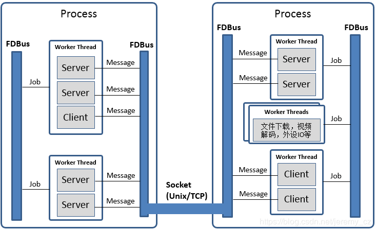
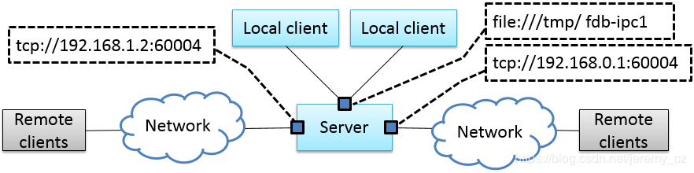

# Fast Distributed Bus

`FDBus`： 高速分布式总线以及中间件开发框架

>   [简介](https://blog.csdn.net/jeremy_cz/article/details/89060291) || [Repo](https://github.com/jeremyczhen/fdbus)

## 摘要

本文描述了一种新型IPC机制：`Fast Distributed Bus(FDBus)`。从`IPC(Inter-Process Communication)`角度，`FDBus`和广泛使用的`D-Bus(Desktop Bus)`有类似之处，但是`FDBus`具有自身优势，功能更齐全，性能更高，使用更便利，除了支持主机内的IPC，还能在多个主机之间组网，同时可以定制安全策略，支持不同的安全等级。FDBus构筑于`socket(Unix domain和TCP)`之上，采用`Google protobuf`做序列化和反序列化。`FDBus`支持字符串形式的名字作为`server`地址，通过`name server`自动为`server`分配`Unix domain`地址和`TCP`端口号，实现`client`和`server`之间用服务名字寻址。

`FDBus`旨在为`client-server`之间提供面向连接，伸缩性强，稳定可靠的IPC机制，进而发展成一套中间件开发框架，用于开发跨平台(Windows，QNX，Linux)，多线程/多进程协同工作的中间件层。FDBus开发框架适用于在定制系统上开发交互复杂的分布式项目，包括：

-   基于Linux的车载ECU，包括仪表，娱乐主机，TBox，自动驾驶域控制器
-   Hypervisors上多个Guest OS之间的通信
-   为Android系统提供跨主机的IPC机制 （目前不支持Java API）
-   基于Linux的小型通信设备，例如家用路由器
-   其它基于Linux的工控设备，智能设备
-   基于Windows开发的自动化测试设备

## 背景介绍

不像其它内核，Linux一直没有自己独特且好用的IPC机制。Windows，Mac OS，QNX都有这样的机制，即便是基于Linux的Android也有用作IPC的binder系统。Linux内核提供的只是一些最基础的组件-socket，pipe，message queue，shared memory。这也符合Linux的理念：每个工具只做一件事，把它做好。但是现实的系统非常复杂，只做一件事远不能解决现实中遇到的问题，更不要说产品开发和大型商用项目。举个例子，订阅-广播是一个最基本的通信需求，但没有一个基础组件能够满足。

Linux实际上也有一个功能强大的IPC——D-Bus。它有完善的方法调用请求-回复机制和事件广播机制；它还包含一些诸如安全策略和服务按需启动之类的高级功能。但对它最大的争议是性能：它的性能非常低，由于要经daemon中转，一个请求-回复需要来回复制十次消息，四次消息验证，以及四次上下文切换。因此它只能用于处理实时要求较低，数据量较小的控制命令和消息传递，否则还是得求助于基础IPC框架。为此有人将D-Bus写进内核，产生了KDBus，虽然性能上得到提升，但缺点也很明显，只能在单机上运行，不支持跨主机。这样的话Android的Binder就够了，况且Binder已经被内核接受了，KDBus至今还没“转正”。另外，无论是DBus还是KDBus，提供还是基础API，离“中间件开发框架”还有较大差距。但各行业包括车载领域对此都有越来越强烈需求，从而各种各样的DBus封装随之产生：Qt DBus，gDBus，commonAPI，DBus-C++... 这些封装或者从属于大框架，或者缺少维护，总之使用起来并不友好。

在Linux以及以太网使用越来越广泛的车载领域，缺乏合适的IPC逐渐成为突出问题：公司原来自创的IPC机制由于技术落后，定制痕迹明显，已经无法满足分布式，高性能，伸缩性要求，却又无法为新平台找到合适的IPC机制，更别说基于IPC机制衍生出的中间件开发框架。以太网在车载的应用催生了SOME/IP（Scalable service-Oriented MiddlewarE over IP）。SOME/IP同样是一套比较完善的IPC规范，甚至是专门为车载领域开发的。但是就如名字里暗示的，它是基于IP层的，在单机上性能并不好。且SOME/IP开源的实现也很少，GENIVI组织贡献了vsomeip，但活跃度非常低，GENIVI本身就是个松散的组织，参与者多，开发者少。不像DBus，SOME/IP是为车载打造，应用范围很窄，不可能指望有一个活跃的社区聚集一群专业的程序员来维护开放的源码。最后很可能的情况是，不得不花钱购买闭源软件。

FDBus就是为解决以上各种问题而开发的，具有如下特点：

-   分布式：基于TCP socket和Unix Domain socket（UDS），既可用于本地IPC，也支持网络主机之间的IPC
-   跨平台：目前已在Windows，Linux和QNX上验证
-   高性能：点对点直接通信，不通过中央Hub或Broker转发
-   服务名解析：server地址用名字标识，通过name server注册服务和解析名字，从而server可以在全网络任意部署
-   支持跨平台的中间件开发框架，包括如下组件：
    1.  Thread模型
    2.  Event Loop
    3.  基于Job-Worker的线程间通信
    4.  基于Event Loop的Timer
    5.  基于Event Loop的watch
    6.  Mutex
    7.  Semaphore
    8.  Socket
    9.  Notification
-   IPC采用Client-Server模式，支持如下通信模式：
    1.  带超时的同步请求-答复
    2.  带超时的异步请求-答复
    3.  无答复的命令请求
    4.  注册-发布模式，实现多点广播
-   IPC消息采用Protocol buffer序列化和反序列化，支持IDL代码生成，高效简便；也支持raw data格式，便于大量数据传输
-   可靠的心跳和重连机制，确保无论网络状况如何，无论哪个服务重新上线或重启，通信各方都能保持连接
-   C++实现，易于开发和维护

### 主流框架对比

|        | 底层          | 性能                         | 同步请求 | 异步请求           | 请求超时           |
| ------ | ------------- | ---------------------------- | -------- | ------------------ | ------------------ |
| FDBus  | Socket        | 点对点，性能高，仅次于Binder | 支持     | 支持               | 支持               |
| GDBus  | Socket        | 通过daemon转，性能较低       | 支持     | 支持               | 支持               |
| Binder | Binder driver | 直接拷贝，性能最高           | 支持     | 能支持，但需要封装 | 能支持，但需要封装 |

## 基于FDBus的中间件模型

中间件层包含多个进程，无论这些进程位于同一主机系统还是不同主机系统。每个进程可以运行多个线程，**FDBus的线程运行特定的事件循环(event loop)，将通用的线程增强为能够执行job，timer和watch的worker线程**。FDBus的通信双方：client和server统称为endpoint。endpoint可以部署在不同的worker上；多个endpoint也可以共享同一个worker。

endpoint部署在worker是指endpoint的事件处理在该worker上执行，例如server在指定的worker上处理client请求；client在指定的worker上处理server的事件广播。中间件开发者可以根据实际情况用一个worker来处理多个endpoint的事件，避免消耗过多线程，更可以避免多线程带来的“并发灾难”。开发者也可以用多个worker为一个endpoint服务，例如endpoint可以创建工作线程完成耗时的文件下载，视频编解码，外设IO等操作。

多线程协同工作要求线程之间能够传递消息和数据，例如文件下载完毕要通知endpoint做后续处理。在进程内由于可以访问同一地址空间，最好的通信载体是对象，既能承载数据，还能指定数据的处理方式。job就是FDBus在线程之间传递的对象，通过job在线程之间的传递和执行实现进程间通信。

FDBus更重要的功能是进程间通信(IPC)。进程之间无法直接传递对象，只能以消息形式交互，并且消息传输过程中需要做序列化，接收到消息后需要做反序列化。每种IPC机制，包括Binder，SOME/IP，DBus，都有自己的序列化方式。序列化方式的好坏直接影响到通信效率，负载，对数据结构的支持程度以及使用的便利性。FDBus没有自己的序列化方式，直接采用`google protocol buffer`，使用方便，功能齐全，并支持idl自动代码生成。数据在进程间的通信采用socket，包括Unix Domain Socket（UDS）和TCP socket。具体采用哪种类型，系统会根据Client和Server的部署而自动选择：如果在同一主机内部使用UDS，否则使用TCP socket。对于Windows，由于不支持UDS，全部采用TCP socket。

## FDBus寻址和组网

### Server地址

server地址是server在网络中的标识，通过该标识client可以找到指定的server并与之建立通信。前面提到，FDBus支持UDS和TCP socket，每种socket有自己的命名方式和命名空间。为了统一FDBus使用如下规则定义Server地址：

-   `UDS`：`file://socket文件名`
-   `TCP socket`：`tcp://ip地址:端口号`

不同于一般意义上的socket server，FDBus server可以同时绑定多个地址，每个地址都可接受client的连接。一旦连接上，每个地址都提供同样的服务，所以client可以选择任意一个地址建立连接。下面是一个FDBus server地址绑定示意图：

上图中，server绑定了一个UDS地址：`file:///tmp/fdb-ipc1`。同一主机上的client可以用该地址发起连接，当然也可连接到其它任意地址，但无疑使用UDS是最高效的。由于主机有多个网口，server还可以在每个网口上各绑定一个地址（端口号）：`tcp://192.168.1.2:60004` 和`tcp://192.168.0.1:60004` ，每个地址用于连接对应网段的client。

### Server命名和地址分配

用上述方式定位server使用不方便，不直观，地址会随组网方式变化而改变，无法灵活部署。为此FDBus增加了一种寻址方式：server名字寻址，每个server可以拥有自己的名字；运行一个叫name server的服务，负责为server分配地址，管理server名字-地址映射，解析server名字，发布server地址。name server有点类似internet上的DNS。为支持server名字寻址，在两种URL之外增加一种格式，作为名字地址，如下所示：

-   svc://server名字

名字地址是虚拟地址。无论server位于何处，只要它的名字地址不变，client都可以通过该地址与之建立联系。如果server绑定名字地址，name server会为其分配实际地址(`tcp://`或`file://`开头的地址)，并将名字和地址注册到映射表里。如果client连接名字地址，name server会根据名字查找server的实际地址，选择一个最合适的实际地址发布给client。client通过该地址与server建立点对点的直连。下图是在name server协助下，client和Server利用名字地址建立连接的流程：

首先client调用`connect("svc://medisServer")`要求和名叫mediaServer的server建立连接。由于使用的是名字地址，FDBus会向name server索要mediaServer的实际地址。但现在mediaServer还没有上线，所以无法解析该名字，只是订阅了对该服务的上线通知。不久后server调用`bind("svc://mediaServer")`上线，由于使用名字地址，同样会向name server发出请求。name server为其注册名字，分配UDS和TCP地址并返给server。server分别绑定每个实际地址，成功后通知name server。name server向整个系统发布该server上线的消息以及server地址：广播给本地client的是UDS地址，广播给其它节点上client的是TCP地址。client利用收到的地址与server建立连接，同时client和server都能收到onOnline()的事件通知。

`name server`使用如下规则分配server地址：

| Server       | TCP Address                             | UDS Address                    |
| ------------ | --------------------------------------- | ------------------------------ |
| host server  | port No. 61000                          | /tmp/fdb-hs                    |
| name server  | port No. 61001                          | /tmp/fdb-ns                    |
| user servers | Port 61002 – Port 65535 或 系统自动分配 | /tmp/fdb-ipc0, /tmp/fdb-ipc1 … |

### 多主机组网

由于name server的地址是固定的，endpoint启动后，会自动连接name server注册(server)或解析名字(client)。如果有多台主机，每台主机上运行自己的name server，负责各自的名字服务，那么这些主机就成了孤岛，无法通过`svc://server_name`的方式互相连接。当然client可以绕开name server，用实际地址直接连接上server，但这样无法灵活部署和组网。为了支持跨网络的名字服务，需要有一个服务管理系统里所有主机，把主机信息同步给所有name server，进而这些name server之间可以建立连接，协同工作，共同完成全网络的名字服务。这个服务就是host server。

host server的工作原理是：整个网络运行一个host server，可以位于任意一台大家都能访问的主机上。所有主机的name server都连接到host server，注册自己所在的主机。host server维护一张包含各主机ip地址的主机列表，并把该表同步给网络里所有的name server。name server根据该表与所有主机上的name server建立连接。

一旦所有主机上的name server都两两建立连接，就可以通过一套内部协议完成跨主机的服务名解析和服务上线通知。例如当一台主机上的client向本地name server请求解析服务名对应的地址，本地name server可以把该请求广播给所有相连的name server，在整个网络范围内查找服务。下面是整个系统组网示例图：

上图中，name server和host server之间建立星形连接，name server和name server之间两两相连，组成一张网。在这个系统里，name server和host server的主要任务是：

-   name server连接到host server，把所在的主机注册进host server
-   host server收集所有主机信息，形成主机地址表
-   host server把主机地址表广播给所有name server
-   name server从表中获得其它主机上name server的地址，并与之建立连接
-   所有server与本地name server相连，向其注册服务名字。本地name server将新注册的服务广播给本地的client以及网络里所有其它的name server
-   其它name server收到该广播后，同样在本地做一个广播，通知给所有client。通过这种方式把服务上线的消息扩散到整个网络
-   所有client与本地name server相连，申请服务名字解析。本地name server搜索自身的server地址映射表，同时把申请发送给其它所有name server
-   其它name server收到申请后，搜索各自的server地址映射表，并把结果返回给发起申请的name server
-   name server把收到的返回结果转发给发起申请的client，client利用结果里的实际地址与服务建立直连。通过这种方式可以找到所有主机上的服务

从上图也可以看出，一旦client和server之间建立连接，所有的通信都通过这个连接完成，无需经过中间环节转发。

### 服务名字的唯一性

由于每台主机都有自己的name server，所以在主机内部，服务不能重名，但是在不同主机上可以重名。在这种情况下，当client申请名字解析时，可能会收到来自不同主机反馈server信息。client可以定制连接策略：总是连接连接新的server，只连接第一个server，或是只连接指定的server。

### 心跳检测，重连和上线、离线检测

为了使整个系统可靠运行，保证任何服务都可以优雅重启（重启后整个系统工作正常），FDBus有完善的心跳检测和上线、离线检测机制：

-   `endpoints`和`name server`之间有重连机制，确保name server重启后endpoint总是能够与之建立连接

-   `name server`和`host server`之间有心跳检测；一旦心跳消失，name server会尝试与host server重连，确保name server与host server之间连接的可靠性

-   `name server`和`name server`之间的连接建立由`host server`来保证：当name server上线时，host server会通知所有其它name server与之建立连接，也会通知该name server与所有其它name server建立连接

-   `client`和`server`之间的连接建立由`name server`来保证：server上线时，name server会通知client与之建立连接

## 安全性 (Security)

随着系统越来越复杂和开放，安全性已经成为系统架构设计时关注的焦点。一个开放的系统意味着可能存在入侵者，一旦入侵者访问了不应该访问的资源就可能造成信息泄露或破坏。一个系统的安全性是建立在信任链的基础之上的，只有满足必要的安全基础才能构筑自身的安全能力。对于FDBus来说，有以下两个前提条件：

-   最基本的前提是FDBus自身的完整性：系统中运行的FDBus库，name server，host server都是合法的，没有被篡改或替换。这一点操作系统能够通过权限管理，secure boot，DM-verity，FS-verity，安全升级等机制来确保。

-   其次在网络上，FDBus消息是以明文传递的，一旦有人非法监听网络报文就有可能造成信息泄露以及安全漏洞。所以讨论FDBus安全性的另一前提是入侵者无法截取网络报文，获得FDBus上传递的数据。当然如果对数据进行加密可以防止窃听，但考虑到效率和性能，目前还没有这么做。

基于这些假设，FDBus面临的攻击主要来自三方面：

1.  非法主机连接到FDBus总线上并运行非法程序与其它主机通信；
2.  在一台合法主机上运行非法程序，并连接到FDBus上，执行非法操作。
3.  合法的主机上运行合法程序，但试图访问没有权限访问的数据或执行没有权限的操作。

基于以上攻击，FDBus从如下方面确保系统安全运行：

1.  主机节点的合法性：只有合法的主机才能加入FDBus，成为总线上的一个成员
2.  服务访问的合法性：只有合法的client才能访问server；server能够识别出非法的client并拒绝访问
3.  访问者安全级别鉴定：每个访问者有各自的安全级别，只有合适的安全级别才能访问对应的资源

### 主机节点鉴权

一台主机若要加入FDBus必须与host server建立连接。host server可以通过检查主机的IP地址或MAC地址对主机做鉴权，也可以通过公私钥对判断主机的合法性。对于合法的主机，host server会为其颁发访问其它主机的“通行证”，持有通行证后，主机上的name server才能与其它主机上的name server建立连接，也就意味这加入了FDBus。

“通行证”采用token来实现。当主机上的name server发起连接时，host server会为其分配多个token，每个token对应一个安全等级。下表表示一个系统里各主机的token分配：

|       | 安全等级1 | 安全等级2 | 安全等级3 | 安全等级4 |
| ----- | --------- | --------- | --------- | --------- |
| 主机1 | token11   | token12   | token13   | token14   |
| 主机2 | token21   | token22   | token23   | token24   |
| 主机3 | token31   | token32   | token33   | token34   |

表中一共有4个安全等级，对于主机1，各个安全等级对应的token分别是token11，token12，token13，token14。对于其它主机依次类推。当主机2的name server连接主机1的name server时，需要持有主机1四个token中的一个。例如主机2用token11去连接主机1，那么在主机1眼里，主机2的安全等级是1；如果用token13，那么主机2的安全等级是3，等等。安全等级数可以根据情况配置。

主机的安全等级是host server对主机做身份鉴别和鉴权后指定的。上面提到，host server可以根据主机的MAC地址或其它方式识别主机身份，然后通过如下配置表为其发布访问其它主机时使用的token：

|                      | 主机1   | 主机2   | 主机3   |
| -------------------- | ------- | ------- | ------- |
| 主机1 (MAC address1) | NA      | token22 | token31 |
| 主机2 (MAC address2) | token14 | NA      | token34 |
| 主机3 (MAC address3) | token12 | token23 | NA      |

上表表示，主机1连主机2使用token22，也就是说，对于主机2，主机1的安全等级是2级；当主机1连主机3时使用token31，也就是说，对于主机3，主机1的安全等级是1级。其它依次类推。对于不在表里的主机，出于开放性考虑，host server不会拒接，但不会为其发布token。对于没有token的主机，其安全等级视为0，最低级。

### 服务访问鉴权

和host server负责主机鉴权一样，name server负责服务访问的鉴权，原理也采用认证鉴权+token。当server向name server注册服务名时，name server在分配地址的同时，也分配多个token，每个token对应一个安全等级，如下表所示：

|         | 安全等级1 | 安全等级2 | 安全等级3 | 安全等级4 |
| ------- | --------- | --------- | --------- | --------- |
| server1 | token11   | token12   | token13   | token14   |
| server2 | token21   | token22   | token23   | token24   |
| server3 | token31   | token32   | token33   | token34   |

表中一共有4个安全等级，对于server1，各个安全等级对应的token分别是token11，token12，token13，token14。对于其它server依次类推。当client连接server1时，需要持有server1四个token中的一个。例如client用token11去连接server1，那么在server1眼里，client的安全等级是1；如果用token13，那么client的安全等级是3，等等。安全等级数可以根据情况配置。

client的安全等级是name server对client做身份鉴别和鉴权后指定的。当client通过UDS连接到name server时，UDS同时会把client的credentials发生给name server，其中包括client的uid和guid。由于Windows不支持UDS，所以不支持服务访问鉴权。对于QNX，虽然支持UDS，但由于不支持SO_PEERCRED选项，也不支持服务访问鉴权。因此目前只有Linux能够支持。根据uid和guid，name server可以识别client的身份，通过如下配置表为其发布访问其它server时使用的token：

|                      | server1 | server2 | server3 | server4 |
| -------------------- | ------- | ------- | ------- | ------- |
| client1 (uid1:guid1) | token12 | token22 | token31 | token43 |
| client2 (uid2:guid2) | token14 | token21 | token34 | token43 |
| client3 (uid3:guid3) | token12 | token23 | token33 | token41 |

上表表示，client1连server1使用token12，也就是说，对于server1，client1的安全等级是2级；当client1连server2时使用token22，也就是说，对于server2，client1的安全等级是2级。其它依次类推。对于不在表里的client，出于开放性考虑，name server不会拒接，但不会为其发布token。对于没有token的client，其安全等级视为0，最低级。

## 安全等级与访问权限

server在判断client的安全等级时，需要综合client本身的安全等级和client所在主机(即name server)的安全等级：client的最高安全等级不超过其所在主机的安全等级。有了安全等级，server可以根据不同等级定义访问权限：在哪些级别可以调用哪些方法，监听哪些消息广播。下图表示一个server的访问权限划分：

每个server都可以通过配置文件定义不同安全等级对应的访问权限。通常是将**方法和通知ID分段**，落在不同段的ID对应不同的安全等级。对于方法调用，如果client的安全等级没有达到要求的等级，server将会拒绝执行；对于消息通知，如果client没有权限将无法注册高安全等级的消息，从而也就收不到该消息的变化通知。

## 调试和日志

DBus提供的DBus monitor令人印象深刻：它可以抓取DBus总线上所有消息，还能设置过滤条件，抓取特定消息。抓取的消息具有很好地可读性，各种数据结构和字段名都能显示出来。类似的，FDBus也提供抓取消息的工具`log server`，并且其功能更强，除了FDBus消息，还支持调试log输出，并把FDBus消息和调试log合并在一起显示，便于时序分析。

`log server`是挂在FDBus上的一个普通server，每个endpoint都包含它的client端，如下图所示：

和普通server一样，log server运行起来后向name server注册，后者通过广播告知每个endpoint里的LogClient。以后当endpoint向外发送FDBus消息时，也会拷贝一份通过LogClient发给log server。发送的数据除了FDBus消息内容，还包含：

-   时间戳
-   发送端和接收端名字
-   消息类型（请求，答复，广播，订阅等）

protocol buffer在线路上以二进制格式传输，不能直接打印出来。为调试方便protocol buffer可以把消息转变成便于阅读的文本格式，直观显示消息里每个成员的名字和取值，并把数组类型（repeated类型）和嵌套类型展开显示。

对于调试log输出，FDBus有自己的API，并支持以下输出级别（优先级依次递增）：

-   Debug
-   Information
-   Warning
-   Error
-   Fatal

只要log server启动起来，当endpoint通过API打印调试log时，这些log会通过LogClient发送给log server。log server可以把调试log和FDBus消息合并起来输出，也可以选择单独输出特定内容。

无论endpoint部署于哪台主机上，log server都能收集到它的FDBus消息和调试log。整个系统只能运行一个log server，不方便分布式调试。为此FDBus有另一个工具 - log viewer，多个log viewer可以同时启动，全部连接到log server上，获取当前的log信息，打印在标准输出。

## FDBus内部结构

下图是FDBus内部组成框图：

-   基础平台抽象层 - 包含系统无关的抽象，用于适配不同的操作系统
-   高级平台抽象层 - 中间件进程模型，包含构成进程的基本组件
-   IPC层 - 进程间通信模型，包含实现IPC通信的基本组件
-   Server层 - 提供服务名解析，组网，日志和调试服务

## 总结

FDBus提供分布式IPC通信机制，支持跨主机的client-server通信，使用服务名而非物理地址作为寻址方式，通过各种服务和心跳重连机制确保连接的动态性和可靠性，进而保证系统内的节点可以动态增删，动态部署，任意重启，无需管理启动顺序和依赖，从而把各个分立的模块绑定在一起，组成一个牢固的整体。作为IPC一个重要组成部分，protocol buffer支持各种复杂的数据类型，能够用idl定义接口并支持自动代码生成，大大降低序列化和反序列化工作。FDBus支持安全策略，对访问区分安全等级，确保整个系统的安全性。

FDBus不仅仅是IPC机制，也是一个中间件开发框架，包含开发中间件过程中经常用到的公共组件和基础模型，为中间件开发提供了跨平台且功能强大的支持。

源码开放后，FDBus期待更多开发者的使用，测试和改进，成为众多中间件开发框架的选项之一。