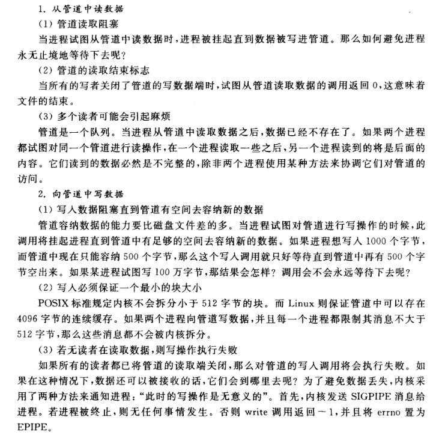

#  Linux 选修课

> [Syh](https://lzw429.github.io/)
>
> [Shell Programming](https://github.com/jaywcjlove/shell-tutorial)

## 一. History And Common Sense

### 什么是 UNIX

- 多任务和多用户的操作系统
- 1969 年于 AT&T 的 Bell 实验室开发。
- System V (1983): 第一代 UNIX 商用版本。

BSD (Berkley Software Distribution)

POSIX (Portable Operation System Interface)

### MAN 目录

1. Standard commands 标准命令
2. System calls 系统调用
3. Library functions 库函数
4. Special devices 设备说明
5. File formats 文件格式
6. Games and toys 游戏与娱乐
7. Miscellaneous 杂项
8. Administrative Commands 管理员命令
9. 其他存放内核例行程序的文档

查询Man手册

- 如果没有 whatis  则 `make whatis`
- man -k 关键字 

## 二. Common commands

命令格式：`命令名` `-简写选项` `--全写选项` `参数1,参数2,...`

根目录 ： / 

当前目录：.

父级目录：..

`pwd`：打印工作目录

`mkdir`：新建目录 `-p`：创建目录树

`cd`：改变工作目录

`cp`：复制文件 `-R`：递归

`mv`：移动文件

`ls`：当前目录列表 `-l`：展示详细信息

`cat`：连接文件或标准输入并打印

`more`：分屏，不能向前看 

- 空格：下一屏幕
- 回车：下一行

`less`：可向前向后阅览文件 支持HJKL

查看文件` more/less `+ 文件名

- 查看ls: `ls path |more `
- `man -k 关键字|more`

检索关键字：`man -k 关键字|grep open|more`

`man 2 open` : man手册第二章的open命令

`/关键字` ：检索

| 指令             | 作用                 | 备注                                                     |
| ---------------- | -------------------- | -------------------------------------------------------- |
| CTRL + C         | 杀死进程             |                                                          |
| CTRL + SHIFT + C | 复制                 |                                                          |
| cd               | 切换目录             |                                                          |
| cp               | 复制                 | cp source target                                         |
| cp -R            | 复制（递归）         | source为目录时 需要递归复制 R:                           |
| cat              | 打开（连接）一个文件 |                                                          |
| HJKL             | ←↓↑→                 | /+查询内容+回车 -> 查询                                  |
| ls               | 查看当前目录文件内容 | ls path                                                  |
| ls -R            | 递归查看             |                                                          |
| mkdir            | 新建文件夹           | make directory1,directory2,……（支持for循环） mkdir (for) |
| mkdir -p a/b/cd  | 自动层级目录         |                                                          |
| N                | 下一个               | SHIFT + N 下一个                                         |
| pwd              | 当前目录             | print working directory                                  |
| rm               | 删除                 |                                                          |
| rm -R            | 递归删除             | 删除文件夹                                               |
| rm -Rf           | 递归删除（别问我）   |                                                          |
| tail             | 查看文件的后十行     |                                                          |

### Hello World

```
vi hello.c
cc hello.c  //编译并自动生成a.out
./a.out
cc hello.c -o hello //指定生成的文件名

```

### VI

进入 `VI` 默认是`命令模式`，按下 `I`键进入`插入模式`。

`I` 光标前，`a` 光标后，`o` 下一行，`O` 上一行。

插入模式按下  `esc` 返回 `命令模式`。

命令模式按下 `:`  进入`执行模式`，按下 `回车` 返回命令`CMD`模式。

- `set number` : 显示行号
- `q` 直接退出
- `wq `保存并退出
- `w 文件名 `：另存为

输入I 左下角显示进入插入INSERT模式 ESC进入命令`CMD`模式

- i : 光标前插入
- a : 光标后插入
- o :下一行插入
- O : 上一行插入 
- `y?y  ` 复制?行  `yank` 
- `d?d` 剪切?行  (？均可省略)
- `p`粘贴
- `^` : 行头
- `$`：行尾
- `gg`：第一行
- `G`： 最后一行zhantie
- `gg=G`：排版
  - `=`：将选中的行进行排版；
- `x`：删除一个字符
- `J`：上下行合并

`vimtutor`：手册

## 三. Files/Users

系统通过系统调用打开文件，将文件信息装载到打开文件表。

### 管道

`|more`  分屏显示

`|grep` 字符串查找

`cc/gcc`  source  -o  target   编译source并生成target

### CP

1. 打开源文件
2. 打开或创建目标文件
3. 从源文件读取
4. 写入目标文件，直到源文件读完

Linux 不区分文本文件、二进制文件等。

Linux 通过系统调用实现复制，频繁的系统调用将影响性能，所以buffer的大小设定将直接影响进程运行速度。

### 九项权限

拥有者读、写、执行；同组用户读、写、执行；其他用户读、写、执行。

ls -l 显示所有用户

rwx可读可写可执行，三组分别对应

- user(owner)
- group
- others
  看做八进制的一组数字 三位对应一个八进制数
  rw-r----- :  0640

### 文件操作

要对某个设备进行操作时，就打开此设备文件，打开文件就会获得该文件的文件描述符fd( file discriptor), 它就是一个整数，每个进程在PCB（Process Control Block）中保存着一份文件描述符表，文件描述符就是这个表的索引，每个表项都有一个指向已打开文件的指针。

写文件是输出不是输入 读文件是输入

- cp(选项)(参数)

  选项：

  > -a：此参数的效果和同时指定"-dpR"参数相同；
  >
  > -d：当复制符号连接时，把目标文件或目录也建立为符号连接，并指向与源文件或目录连接的原始文件或目录；
  >
  > -f：强行复制文件或目录，不论目标文件或目录是否已存在；
  >
  > -i：覆盖既有文件之前先询问用户；
  >
  > -l：对源文件建立硬连接，而非复制文件；
  >
  > -p：保留源文件或目录的属性；
  >
  > -R/r：递归处理，将指定目录下的所有文件与子目录一并处理；
  >
  > -s：对源文件建立符号连接，而非复制文件；
  >
  > -u：使用这项参数后只会在源文件的更改时间较目标文件更新时或是名称相互对应的目标文件并不存在时，才复制文件；
  >
  > -S：在备份文件时，用指定的后缀“SUFFIX”代替文件的默认后缀；
  >
  > -b：覆盖已存在的文件目标前将目标文件备份；
  >
  > -v：详细显示命令执行的操作。

  参数：

  	源文件：制定源文件列表。默认情况下，cp命令不能复制目录，如果要复制目录，则必须使用-R选项；
  	
  	目标文件：指定目标文件。当“源文件”为多个文件时，要求“目标文件”为指定的目录。

  例子：

  	cp file1 file 将file1复制至file2中

   	cp file /usr/men/file1 将文件file复制到目录/usr/men下，并改名为file1

- cat命令连接文件并打印到标准输出设备上，cat经常用来显示文件的内容，类似于下的type命令。

  cat(选项)(参数)

  选项：

  > -n或-number：有1开始对所有输出的行数编号；
  >
  > -b或--number-nonblank：和-n相似，只不过对于空白行不编号；
  >
  > -s或--squeeze-blank：当遇到有连续两行以上的空白行，就代换为一行的空白行；
  >
  > -A：显示不可打印字符，行尾显示“$”；
  >
  > -e：等价于"-vE"选项；
  >
  > -t：等价于"-vT"选项；

  参数：文件列表：指定要连接的文件列表

  例子：

  	cat m1 （在屏幕上显示文件ml的内容）
  	
  	cat m1 m2 （同时显示文件ml和m2的内容）
  	
  	cat m1 m2 > file （将文件ml和m2合并后放入文件file中）

- open file

  - 输入命令 man 2 open 可查看系统调用open

  - 两种形式：

    `int open(const char *pathname, int flags);`

    `int open(const char *pathname, int flags, mode_t mode);`

  - pathname : 文件路径

  - flags : 

    > 分为两类：主类、副类
    >
    > 主类：
    >
    > O_RDONLY 以只读方式打开    
    >
    > O_WRONLY 以只写方式打开    
    >
    > O_RDWR 以可读可写方式打开
    >
    > 副类：
    >
    > O_CREAT 如果文件不存在则创建该文件
    >
    > O_EXCL 如果使用O_CREAT选项且文件存在，则返回错误消息
    >
    > O_NOCTTY 如果文件为终端，那么终端不可以调用open系统调用的那个进程的控制终端
    >
    > O_TRUNC 如果文件已经存在泽删除文件中原有数据
    >
    > O_APPEND 以追加的方式打开

  - mode

    - 如果文件被新建，则其权限为mode
    - mode为3位八进制码     
      - 第一位代表文件所有者的权限，第二位代表群组的权限，第三位为其他人的权限
      - 4为读权限
      - 2为写权限
      - 1为执行权限    
      - mode的每一位为这三个权限数字的和

`su - `: 变为超级用户 提示符变成#

`who` : 查看当前登录的用户的用户信息

`w` : 查看已登录的用户以及用户的活动

`/etc` 下都是配置文件

组的信息存储在 `/etc/group`

用户和密码信息存储在 `/etc/passwd` 和 `/etc/shadow`

/etc 下的passwd 文件 修改用户ID为0  用户就会变为ROOT 

- 即系统是通过用户ID来识别用户 而不是用户名

- 此时 root下查看 /etc 的shadow文件就可以看到MD5加密后的密码 而不是X
  - useradd <username>   添加用户
  - password  <username>  设置密码

### 目录文件信息与位操作

`opendir`打开目录

`readdir`读取目录

`closedir`关闭目录

`stat`系统调用获取文件状态

` ls -a ` 展示文件以及隐藏文件

`ls -i` 展示文件以及文件号

`ls -l 文件名` 查看FCB内容 

- 重命名和移动文件 都不会改变其文件号 因为你只是在修改目录(目录也是一个文件)

**UNIX文件系统是index类型的文件存储**

> 分为 super block  |  i_nodes(FCB 指向后面的文件块)    |       blocks
>
> 由i_node可以指向十个block 那么第十一个指向的就是一个新的 全是指针的文件 
>
> 以此类推 还有二级指针

文件名只在目录中存在  i 节点中不存储文件名

st_mode 是一个16位的二进制数，文件类型和权限被编码在这个数中。

- 16 bit  0000 000 000 000 000  

- 前四位为file type 
  - regularfile
  - directory

- 再三位 setuid setgid sticky 文件的特殊属性
  - 如果setuid 和 表示user的三位的最后一位都为1 则表示user的三位的最后一位变为s

  - sticky 对目录有意义 sticky为1时 other的最后一位变为t  所以一般不可以有777的mode  可以采用 chmod 1777d

  - 对可执行文件设置 `setuid` 权限时，将对运行该文件的进程授予基于文件所有者的访问权限。该访问权限**不是**基于正在运行可执行文件的用户。使用此特殊权限，用户可以访问通常只有属主才可访问的文件和目录。

    `setgid` 权限与 `setuid` 权限类似。可将进程的有效组 ID 更改为拥有该文件的组，并基于授予该组的权限对用户授予访问权限。

    `sticky` 位是保护目录中文件的权限位。如果对目录设置了 sticky 位，则只有文件所有者、目录所有者或特权用户才可以删除文件。`root` 用户是特权用户的一个示例。sticky 位禁止用户从公共目录（如 `/tmp`）中删除其他用户的文件，777 权限的文件需要对 `sticky` 置位，否则其他程序能轻易地删掉它。

- -rwxrwxrw-  各三位 八进制表示为766

  - 最后的 9 位是许可权限，分为 3 组，对应 3 组用户，分别是文件所有者、同组用户和其他用户。每组 3 位，分别是读、写和执行的权限。
  - user group other

- mask(掩码) 
| 运算 | 含义 | 备注|
|-------|-------|-------|
| & mask  | testing | 使用位与的方式得到对应位的情况 |
| \| mask | set     | 使用位或的方式赋某一位值为1 |
| & ~mask | reset   | 使用取反再与去掉某一位 |

- 函数不要超过48行 超过则分割为子函数

  - 目录可读：可执行 `ls` 查看内容
  - 目录可写：在目录中添加或删除文件
  - 目录可执行：可执行 `cd` 命令打开目录

- <sys/stat.h> 中有以下定义：

  ```c
  #define	S_IFMT	0170000	/* type of file */
  #define	S_IFREG	0100000	/* regular */
  #define S_IFDIR	0040000 /* directory */
  #define	S_IFBLK	0060000 /* block special */
  #define S_IFCHR	0020000 /* character special */
  #define S_IFIFO	0010000 /* fifo */
  #define S_IFLNK	0120000 /* symbolic link */
  #define S_IFSOCK 0140000 /* socket */
  ```

- chmod
  - chmod g-w  让group去掉 w
  - chmod +w  加上w
  - chmod 640   直接修改为rw-r-----
  - 权利举例：
    - r 读 : ls   x : cd

- touch 文件名 
  - 创建空的新文件
  - chown 用户名 文件名    改变所有者

- ln source target
  - 链接  两个文件的inode节点号相同 只是源文件多了一个入口 
  - ls -li 文件名  权限之后的数字表示入口个数
  - 当入口数为0时  inode释放
  - rm 其实用的是unlink   删除了链接
  - move 其实用的是rename  本质上是重命名 删除到回收站只是移动。从回收站彻底删除时，i 节点被释放。

- 符号链接
  - ln -s source target

  - 节点号不一样了    

  - ls-l 文件名 可以看到 source -> target

  - 链接到目录的时候 可以使用符号链接

    

#### 其他命令

| 命令     | 含义                                 |
| -------- | ------------------------------------ |
| chown    | 改变某个文件或目录的所有者和所属的组 |
| mkdir    | 创建目录                             |
| rmdir    | 删除目录                             |
| rm       | 系统调用 unlink                      |
| mv       | 系统调用 rename                      |
| cd       | 系统调用 chdir                       |
| opendir  | 打开目录                             |
| readdir  | 读取目录                             |
| closedir | 关闭目录                             |

## 四. Device,Files and Connection Control

应当使用绝对路径，防止移动后失效。

**硬链接**是将目录链接到树的指针，硬链接同时也是将文件名和文件本身链接起来的指针。
硬链接不能指向其他系统中的 i 节点，即使根也不能生成到目录的链接。

**符号链接**通过名字引用文件，而不是 i 节点号，因而它可能跨越文件系统。

在 Unix 系统中，每个设备都被当做一个文件。

对设备进行读写就是对设备对应的驱动进行调用，相当于读写文件。

每个设备都有一个文件名、一个 i-节点号、一个文件所有者、一个权限位的集合和最近修改时间。你所了解的和文件有关的所有内容都将被运用于终端和其他的设备。

Linux 将设备映射到 /dev/... 目录，部分设备使⽤用主设备号和次设备号来区分指定的外设。主设备号说明设备类型，次设备号说明具体指哪一个设备。比如：

- `/dev/sda` 指向 SCSI ID 最小的 SCSI 硬盘
- `/dev/input/mice` 指向鼠标设备文件的符号链接
- `/dev/fd0`的主设备号为fd（软盘驱动器 floppy disk），次设备号为0（软盘驱动器编号）

常用的磁盘文件由字节组成，磁盘文件中的字节数就是文件的大小。设备文件是链接，而不是容器。键盘和鼠标不存储击键数和点击数。设备文件的 i 节点存储的是指向内核子程序的指针，而不是文件的大小和存储列表。内核中传输设备数据的子程序被称为设备驱动程序。

- ls -l 路径 
  - ls -l /dev/input/mice 发现第一位是c 表示是字符型
- inode指向内核中的设备的驱动

### 设备与文件的不同之处

磁盘文件和设备文件都有文件名和属性，系统调用 `open` 用于创建与文件和设备的连接。

- 磁盘连接的属性：例如缓冲。与磁盘文件的连接通常包含内核缓冲区。从进程到磁盘的字节先被缓冲，然后从内核的缓冲区被发送出去。
- 终端连接的属性：例如回显。回显字符不是键盘或程序的任务。

### Connection Control - 连接控制

`man -k file|grep manipulate|grep 2`

> 查询后发现 在fcntl中有对文件描述符的函数

可以获取标志位 如：

- `F_GETFL`
  - 获取到一个int类型的返回值
  - 利用 |  将append位为置为1
    - s = (fd,F_GETFL);
    - s |= O_APPEND
- `F_SETFL`
  - fcntl(fd,F_SETFL,s)
- `0_SYNC `和 `0_ASYNC`实现同步IO和异步IO

#### 磁盘连接的属性

系统调用 `open` 用于在进程和磁盘文件之间创建一个连接。

##### 属性 1：缓冲

`O_SYNC` 位告知内核，对 `write` 的调用仅能在数据写入实际的硬件时才能返回（同步 I/O），而不是在数据复制到内核缓冲时就执行默认的返回操作（异步 I/O）。

`O_SYNC` 会关闭内核的缓冲机制，如非特殊情况，最好不要关闭缓冲。

##### 属性 2：自动添加模式

自动添加模式的使用场景是若干进程在同一时间写入文件，可用于处理竞争。例如系统写日志。

当文件描述符的 `O_APPEND` 位被开启时，每个对 `write` 的调用自动调用 `lseek` 将内容添加到文件的末尾。

对 `lseek` 和 `write` 的调用是独立的系统调用，内核可以随时打断进程，从而使后面这两个操作被中断。当 `O_APPEND` 被置位，内核将 `lseek` 和 `write`组合成一个原子操作，被连接成一个不可分割的单元。

#### 终端连接的属性

终端是键盘和显示单元，最重要的功能是接受来自用户的字符输入和将输出信息显示给用户。

##### stty 命令

`stty` 命令让用户读取和修改终端驱动程序的设置。

##### 编写终端驱动程序

###### 关于设置

驱动程序包含很多对传入的数据所进行的操作，这些操作被分为 4 种：

- 输入：驱动程序如何处理从终端来的字符
- 输出：驱动程序如何处理流向终端的字符
- 控制：字符如何被表示——位的个数、位的奇偶性、停止位等
- 本地：驱动程序如何处理来自驱动程序内部的字符

库函数 `tcgetattr` 和 `tcsetattr` 提供对终端驱动程序的访问。两个函数在 `termios` 结构中交换设置。

###### 关于函数

改变终端驱动程序的设置如同改变磁盘文件连接的设置：

- 从驱动程序获取属性
- 修改相关属性
- 将修改后的属性返回到驱动程序

###### 关于位

`termios` 结构类型包括若干个标志集和一个控制字符的数组。

每个属性在标志集中都占有一位。属性的掩码定义在 `termios.h` 中。

| 操作   | 代码                  |
| ------ | --------------------- |
| 测试位 | if (flagset & MASK) . |
| 置位   | flagset \|= MASK      |
| 清除位 | flagset &= ~MASK      |

- 回车 `\r `13 

- 换行 `\n `10

- 键盘输入回车时  13被传递给内核 内核内核返回的是13 和 10

- `stty -a`

  - 查看CMD热键
  - `stty -echo` 关闭回显
  - `stty echo`打开回显
  - `stty erase ~`  将退格从`^？` 替换为 ~ 
  - `stty -icanon` 设置一次性读完操作，如使用getchar()读操作，不需要按enter
  - `stty icanon` 重回规范模式 

- `man tcgetattr`

  - 得知有`struct termios`

    - 先get后修改再用`tcsetattr`设置
    - 改完记得还原

    ```c++
    tcgetattr(0,&dist);
    buf = dist;
    buf.c_lflag &= -ECHO;
    tcsetattr(0,TCSANOW,&buf); //第二个参数表示立刻修改
    //使用后还原
    tcsetattr(0,TCSANOW,&dist);
    ```

- 0 : 标准输入 `stdin`

- 1 : 标准输出 `stdout`

- 2 : 标准错误输出 `stderr`

## 五. Terminal Control and Signal

### 软件工具

对磁盘文件和设备文件不加以区分的程序被称为**软件工具**。软件工具从标准输入读取字节，进行一些处理，然后将包含结果的字节流写到标准输出。工具发送错误消息到标准错误输出，它们也被当做简单的字节流来处理。

### 特定设备程序

其它程序(如控制扫描仪、记录压缩盘、操作磁带驱动程序和拍摄数码相片的程序)也能同特定设备进行交互。在本章中将通过了解最常见的与特定设备相关的程序(通过终端与人交互的程序)来探讨在写这些程序时用到的概念和技术。将这些面向终端的程序称为用户程序

### 用户程序

`用户程序`:一种常见的设备相关程序用户程序的例子有vi,emacs,pine,more,lynx,hangman,robots和许多加利福尼亚大学,伯克利分校编写的游戏程序 ,这些程序设置终端驱动程序的击键和输出处理方式

### 信号

`stty -a` 得知 `CTRL+C`  ------> `^C` 

 - 是一个`intr`信号 `中断信号`
 - 信号是由单个词组成的消息。每个信号都有一个数字编码
 - 信号的请求来源：用户、内核和进程。
    - 同步信号：由进程的某个操作产生的信号。
    - 异步信号：由像用户击键这样的进程外的事件引起的信号。
- 信号编号以及它们的名字通常出现在 `/usr/include/signal.h` 文件中。
 - 进程处理信号的方式：
    - 接收默认处理，通常是消亡
    - 忽略信号，但 `SIGSTOP` 和 `SIGKILL` 两信号不可被忽略
    - 调用一个函数，使用 `void (*signal(int sig, void (*func)(int)))(int)` 
      - `func` 的特殊值： `SIG_IGN` 忽略信号；`SIG_DEF` 信号恢复为默认处理。
 - `kill` 向程序发送命令
    - `ps `看到当前前台的命令
    - `ps -e `看到包括后台的
    - `kill -l`
       - 查看所有信号的宏定义
      - 不指定信号则默认发送TERM信号 
   - `kill `进程号 杀死进程
     - kill -9 进程号 对应SIGKILL

#### 信号处理函数 

1. `^S` : 停止 
2. `^\` : 退出 
3. `^Z` :  将一个进程挂起到后台并暂停

`signal(SIGINT,SIG_IGN)` : 忽视中断信号

- `man 7 signal `
  - 查看SIGNAL宏定义的值和定义
  - `SIGKILL`和`SIGSTOP` 不可以被阻止和忽略

## 六. Screen programming

`curses` 库是一组函数/字符终端库，屏幕的本质是一个矩阵，程序员可以用它们来设置光标的位置和终端屏幕上显示的字符样式。

`curses` 将终端屏幕看成是由字符单元组成的网格，每个单元由行列坐标对标示。坐标系原点是屏幕左上角，行坐标自上而下递增，列坐标自左向右递增。

`curses` 保留了屏幕的两个内部版本。一个内部屏幕是真实屏幕的复制，另一个是工作屏幕，记录了对屏幕的改动。

`refresh` 函数比较工作屏幕和真实屏幕的差异，通过终端驱动送出能使真实屏幕与工作屏幕一致的字符和控制码。

- 编译时候需要使用 -lcurses  表示链接curses库 `cc ～.c -lcurses`

### 常用函数

`move(y,x) `: 将游标移动至  `(x,y) `的位置.
`getyx(win,y,x)` : 得到目前游标的位置. (请注意! 是 ` y,x `而不是  `&y,&x` )
`clear()` `erase()` : 将整个屏幕清除. (请注意配合` refresh() `使⽤用)
`echochar(ch)` : 显示某个字元.  `addch(ch)` : 在当前位置画字符ch
`mvaddch(y,x,ch) `: 在`(x,y)` 上显示某个字元. 相当于 ` move(y,x);addch(ch);`
`addstr(str)` : 在当前位置画字符串`str`
`mvaddstr(y,x,str)` : 在(x,y) 上显示一串字串. 相当于`move(y,x);addstr(str);`
`printw(format,str) `: 类似 `printf() `, 以⼀一定的格式输出至萤幕.
`mvprintw(y,x,format,str) `: 在`(x,y) `位置上做` printw `的⼯工作. 相当于`move(y,x);printw(format,str);`
`getch() `: 从键盘读取⼀一个字元. (注意! 传回的是整数值)
`getstr() `: 从键盘读取⼀一串串字元.  `scanw(format,&arg1,&arg2…) `: 如同 ` scanf` , 从键盘读取一串字元.
`beep()` : 发出⼀一声哔声.
`box(win,ch1,ch2)` : 自动画方框
`refresh()` : 使屏幕按照你的意图显示。比较工作屏幕和真实屏幕的差异，然后refresh通过终端驱
动送出那些能使真实屏幕于工作屏幕一致的字符和控制码。（工作屏幕就像磁盘缓存，curses中的
大部分的函数都只对它进行修改）
`standout() `: 启动standout模式（一般使屏幕发色）
`standend() `: 关闭standout模式

### 时钟编程：Alarms

#### sleep 的工作机制

系统中的每个进程都有一个私有的闹钟(alarm clock) 。这个闹钟很像一个计时器，可以设置在一定秒数后闹铃。时间一到，时钟就发送一个信号 SIGALRM 到进程。除非进程为 SIGALRM 设置了处理函数(handler) ，否则信号将杀死这个进程。

sleep 函数由 3 个步骤组成： `man 3 sleep` 查看sleep函数

1. 为 SIGALRM 设置一个处理函数
2. 调用 alarm(num_seconds) 
3. 调用 pause

系统调用 pause 挂起进程直到信号到达。任何信号都可以唤醒进程，而非仅仅等待 SIGALRM。

```c
#include <stdio.h>
#include <signal.h>

main()
{
    void wakeup(int);
    
    printf("about to sleep for 4 seconds\n"); 
    signal(SIGALRM, wakeup); // catch it
    alarm(4); // set clock
    pause(); // freeze here wait for a signal
    printf("Morning so soon? \n"); // back to work
}

void wakeup(int signum)
{
#ifndef SHHHH
    printf("Alarm received from kernel\n");
#endif    
}
```

### 时间编程：间隔计时器 

`interval timer` 软中断

3 类计时器的名称和功能如下：

- ITIMER_REAL

  该计时器计量真实时间，如同手表记录时间。无论程序在用户态还是核心态，用了多少处理器时间它都记录。当该计时器用尽，发送 SIGALRM 消息。

  - `it_value` 初始时间
  - `it_interval`间隔时间
  - 时间应为双精度时间：秒`sec`和微妙`usec`
  - `man -k interval | gerp timer`  -> `man 2 getitimer`

  ```c++
  #include <stdio.h>
  #include <signal.h>
  #include <sys/time.h>
  void wakeup(){
  	printf("Wake up!\n");
  }
  
  main(){
  	struct itimerval itv;
  	signal(SIGALRM,wakeup);
  
  	printf("Go to sleep\n");
  	itv.it_interval.tv_sec = 1;
  	itv.it_interval.tv_usec = 500000;
  	itv.it_value.tv_sec = 5;
  	itv.it_value.tv_usec = 0;
      // 5s 中开始执⾏，每１.5ｓ循环
  	setitimer(ITIMER_REAL,&itv,NULL);
  	while(1){
  		printf("About to sleep\n");
  		pause();
  	}
  }
  ```

- ITIMER_VIRTUAL

  只有进程在用户态运行时才计时。虚拟计时器的三十秒比实际计时器的三十秒要长。当虚拟计时器用尽时，发送 SIGVTALRM 消息。

- ITIMER_PROF 系统调用时间 + 自身运行时间

  这个计时器在进程运行于用户态或由该进程调用而陷入核心态时计时。当这个计时器用尽，发送 SIGPROF 消息。

#### 间隔

每个间隔计时器的设置都需要两个参数：初始时间和重复间隔。

#### 精度更高的时延：usleep

`usleep(n)`

将当前进程挂起 n 微秒或者直到有一个不能被忽略的信号到达。

#### 计算机只有一个时钟

每个进程可能有多个独立的时钟，但一个系统只需要一个硬件时钟的脉冲。

每个进程设置自己的计数时间，操作系统在每过一个时间片后为所有的计数器的数值做递减。

## 七. Processes and procedures

### ps 命令

进程存在于用户空间。用户空间是存放运行的程序和它们的数据的一部分内存空间

可以通过使用 ps（process status）命令来查看用户空间的内容，这个命令会列出当前的进程。

`S` status 表示各个进程的状态

- S 列的值为 R 说明 ps 对应的进程**正在运行**。其他进程的 S 列值都是 S，说明它们都处于**睡眠状态**。每个进程都属于相应的由 UID 列指明的用户 ID。每个进程都有一个 ID（PID），同时也有一个父进程 ID（PPID）
- `S` sleep `R` running `Z`zombie

`UID`进程owner

`PRI` 优先级 越小越高 `PPID` 父进程ID

 `PRI` 和` NI` 的列分别是进程的优先级和 niceness 级别。

- nice值是进程优先级的修正数值 可以为负值 
- 内核根据这些值来决定何时运行进程。
- 一个进程可以增加 nice值，让其他进程排在其前面。
- 超级用户可以减少它的 nice值，使它排在其他进程前面
- 用户只能将NI变⼤，root修改的范围是 -19〜20

`进程名 + &`后台执行

`nice -n 5 进程名`

- `NI ` 变为5
- `PRI` 加上了5
- 直接`nice 进程名` 直接令`PRI`增加10

`renice` 命令用于重新指定一个或多个进程的优先级 `renice 9 进程号`

`ps` 查看进程的

- PID 进程号
- TTY 终端机连接标准输入设备的文件名称
- TIME 
- CMD

`ps -l` 查看进程的相关信息

`ps -d` 除session leader 以外的全部进程 包括后台以及其他用户的进程

`ps -e` 选择所有进程

`ps -aux` 显示所有包含其他使用者的进程

`top` 类似任务管理器

### Shell

#### shell 是如何运行程序的

shell 打印提示符，输入命令，shell 就运行这个命令，然后 shell 再次打印提示符，如此反复。

一个 shell 程序的主循环执行下面的 4 步：

1. 用户键入 a.out
2. shell 建立一个新的进程来运行这个程序
3. shell 将程序从磁盘载入
4. 程序在它的进程中运行直到结束

#### 一个程序如何运行另一个程序

exec 函数族：

```c
int execl(const char *path, const char *arg, ...
                       /* (char  *) NULL */);
int execlp(const char *file, const char *arg, ...
                       /* (char  *) NULL */);
int execle(const char *path, const char *arg, ...
                       /*, (char *) NULL, char * const envp[] */);
int execv(const char *path, char *const argv[]);
int execvp(const char *file, char *const argv[]);
int execvpe(const char *file, char *const argv[], char *const envp[]);

```

**如同换脑**。exec 系统调用从当前进程中把当前程序的机器指令清除，然后从空的进程中载入调用的指定的程序代码，最后运行这个新的程序。exec 调整进程的内存分配使之适应新的程序对内存的要求。相同的进程，不同的内容。

步骤如下：

1. 程序调用 execvp
2. 内核从磁盘将程序载入
3. 内核将 arglist 复制到进程
4. 内核调用 main(argc, argv)

exec 执行之后，原进程无法继续执行，因此需要创建新进程。

#### 如何建立新的进程

```c
fork();
```

fork 的执行步骤：

1. 分配新的内存块和内核数据结构
2. 复制原来的进程到新的进程
3. 向运行进程集添加新的进程
4. 将控制返回给两个进程

`fork()` 的返回值 是子进程的进程号 

- 如果是 -1 说明子进程创建失败

```c++
#include <stdio.h>
main(){
    printf("About to execute ls /\n");
    execlp("ls","ls","/",NULL);
    printf("DONE!\n");
}

#include <stdio.h>
main(){
    printf("I am %d. About to fork\n",getpid());
    fork();// 子进程会从fork()的后一个语句开始执行
    printf("After fork: I am %d \n",getpid());
}
/*I am 22917. About to fork
  After fork: I am 22917 
  After fork: I am 22918*/

/*父进程先运行*/
#include <stdio.h>
main(){
    printf("I am %d. About to fork\n",getpid());
    fork();// 子进程会从fork()的后一个语句开始执行  共计八个进程
    fork();
    fork();
    printf("After fork: I am %d \n",getpid());
}

#include <stdio.h>
main(){
    int rv;
    printf("I am %d. About to fork\n",getpid());
    rv = fork();// 子进程会从fork()的后一个语句开始执行
    if(0 == rv){ // 我是子进程
        printf("I am a child. I am %d\n",getpid());
    }else{
        printf("I am a parent.I am %d. \nMy child is %d\n",getpid(),rv);
    }

}

#include <stdio.h>
main(){
    int rv;
    printf("About to execute ls /:\n");
    rv = fork();// 子进程会从fork()的后一个语句开始执行
    if(0 == rv){
        execlp("ls","ls","/",NULL);
    }else{
        rv_wait = wait(NULL);//直至当前进程的所有子进程都执行结束后，才继续执行
        printf("%d is back. Done\n",rv_wait);//返回值为子进程的进程号
    }    
}
```

`wait [进程号 或 作业号]`

eg：`wait 23   or  wait %1`

> 如果wait后面不带任何的进程号或作业号，那么wait会阻塞当前进程的执行，直至当前进程的所有子进程都执行结束后，才继续执行。

rv_wait wait()的返回值分为三部分

  - 前八位 exit value 一位的Core dump 后七位Signum
  - 返回009 即表示被9号命令杀死
  - 返回a00 即表示子进程返回值为10
  - 如果父进程被杀死 子进程会认1号进程init作为父进程 成为孤儿进程  
    - ps -e|head 查看init进程
  - 如果子进程正常运行完毕 子进程会变成Zombie进程
    - 需要用wait回收 才不会用僵尸进程
    - ps -l 可以查看到 该子进程有 <defunct> 标示

  ```c++
  #include <stdio.h>
  int main(){
      int rv,rv_wait; 
      printf("About to cook:");
      rv = fork();
      if(0 == rv){
          return 10;
      }else{
          int status;
          rv_wait = wait(&status);
          printf("%d is back. status: %0x\n",rv_wait,status);
          //返回值为a00 10的16进制为a
      }    
  }
  
  #include <stdio.h>
  main(){
      int rv,rv_wait;
      printf("About to cook:\n");
      rv = fork();
      if(0 == rv){
          return 10;
      }else{
          signal(SIGCHLD,SIG_IGN);//通知内核对⼦进程的结束不关⼼，由内核回收，并且避免⽗进程被挂起。
          while(1){
              sleep(1);
          }
      }
      return 0;
  }
  ```

#### 父进程如何等待子进程的退出

```c
pid = wait(&status);
```

进程调用 wait 等待子进程结束。

wait 暂停调用它的进程直到子进程结束，然后 wait 取得子进程结束时传给 exit 的值。

父进程如何知道子进程是以何种方式退出的呢？

答案在传给 wait 的参数之中。父进程调用 wait 时传一个整型变量地址给函数。内核将子进程的退出状态保存在这个变量中。

- 如果子进程调用 exit 退出，那么内核把 exit 的返回值存放到这个整数变量中。
- 如果进程是被杀死的，则内核将信号序号存放在这个变量中。这个整数由 3 部分组成—— 8 个 bit 是记录退出值，7 个 bit 是记录信号序号，另一个 bit 用来指明发生错误并产生了内核映像。

wait 系统函数挂起调用它的进程直到得到这个进程的子进程的一个结束状态 

`rv_wait  = wait(&status)`

结束状态`rv_wait`是退出值或者是信号序号

- 如果有一个子进程已退出或被杀死，对 wait 的调用立即返回。wait 返回结束进程的 PID。
- 如果 statusptr 不是 NULL，wait 将退出状态或者信号序号复制到 statusptr 指向的整数中。该值可用 <sys/wait.h> 中的宏来检测。
- 如果调用的进程没有子进程也没有得到终止状态值，则 wait 返回 -1。
- `status`为`NULL` 则表示父进程不关心子进程的终止状态
-  `signal(SIGCHLD,SIG_IGN);`
  - 通知内核对⼦进程的结束不关⼼，由内核回收，并且避免⽗进程被挂起。

### exit 与 exec 的其他细节

#### 进程死亡：exit 和 _exit

exit 是 fork 的逆操作，进程通过调用 exit 来停止运行。fork 创建一个进程，exit 删除一个进程。

子进程传给 exit 的参数被存放到内核，直到这个进程的父进程通过 wait 系统调用取回这个值。如果父进程没有在等这个值，则它将被保存在内核直到父进程调用 wait，那时内核将通告这个父进程，其子进程的结束。

#### 僵尸进程

已死亡但还没有向父进程返回 exit 参数的进程称为**僵尸进程**。在进程状态表中，常使用 `defunct ` 表示。

如果其父进程没有安装 `SIGCHLD` 信号处理函数调用 wait() 或者 waitpid 等待子进程结束，也没有显式地忽略该信号，则子进程将持续保持僵尸状态。如果此时父进程结束，init 进程会接管该子进程并清除它。

`kill -9` 命令无法清除僵尸进程，僵尸进程已经结束，不能接收信号。

**如何避免大量僵尸进程？**

- 信号处理函数中调用 wait 等函数
- 使用两次 fork()，使紧跟的子进程直接退出，子进程的子进程成为孤儿进程，init 将清除它

## 八. I/O Redirection and Pipes

### I/O Redirection

#### 3 个标准文件描述符

所有的Unix工具都使用

`0:stdin` `1:stdout` `2:stderr`

shell 的子进程默认继承其父进程的文件描述符。

#### 最低可用文件描述符原则

**文件描述符**是一个数组的索引号，每个进程都有其打开的一组文件，这些打开的文件被保持在一个数组中。文件描述符即为某个文件在此数组中的索引。

当打开文件时，为此文件安排的描述符总是此数组中最低可用位置的索引。

==重定向的是shell而不是程序==

`cmd > filename`  : shell将文件描述符1定位到文件 但并不将重定向标记和文件名传递给程序

`cmd2 > filename`  : 重定向文件描述符2 即标准错误输出到指定的文件中

`>`  覆盖原文件 `>>` 追加原文件

参照课本305页代码如下

#### 8.1 close then open

```c
// stdinredir1.c
#include <stdio.h>
#include <fcntl.h>
main()
{
    int fd;
    char line[100];

    // 读取并打印三行

    fgets(line, 100, stdin); printf("%s", line);
    fgets(line, 100, stdin); printf("%s", line);
    fgets(line, 100, stdin); printf("%s", line);

    // 重定向输入
    close(0); // 关闭连接到终端的标准输入流
    fd = open("/etc/passwd" , O_RDONLY); 
    if(fd != 0)
    {
        fprintf(stderr, "Could not open data as fd 0\n");
        exit(1);
    }

    // 读取并打印三行
    fgets(line, 100, stdin); printf("%s", line);
    fgets(line, 100, stdin); printf("%s", line);
    fgets(line, 100, stdin); printf("%s", line);
}
```


#### 8.2 open.. close. . dup. . close

```c
// stdinredir2.c
#include <stdio.h>
#include <fcntl.h>

/* #define CLOSE_DUP /* open, close, dup, close */
/* #define USE_DUP2  /* open, dup2, close */

main()
{
    int fd;
    int newfd;
    char line[100];

    fgets(line, 100, stdin); printf("%s", line);
    fgets(line, 100, stdin); printf("%s", line);
    fgets(line, 100, stdin); printf("%s", line);

    fd = open("data", O_RDONLY); 
    
#ifdef CLOSE_DUP
    close(0);
    newfd = dup(fd); // 复制打开的 fd 到 0
#else
    newfd = dup2(fd, 0); // 关闭 0，复制 fd 到 0
#endif
    if(newfd != 0)
    {
        fprintf(stderr, "Could not duplicate fd to 0\n");
        exit(1);
    }
    close(fd); // 关闭原有 fd
    
    fgets(line, 100, stdin); printf("%s", line);
    fgets(line, 100, stdin); printf("%s", line);
    fgets(line, 100, stdin); printf("%s", line);
}
```

#### 8.3 open..dup2..close

上文的 stdinredir2.c 包含了条件编译代码，已经描述了此方法。

### Pipes

将一个进程的输出作为另一个进程的输入

0 1 2 对应标准输入、输出、错误  从1写 从0读

于是3 4 也对应着输入和输出

```c++
#include <stdio.h>
#include <unistd.h>
main(){
	int pipefd[2];
	int rv;
	pipe(pipefd);
	printf("%d %d\n",pipefd[0],pipefd[1]); // 3 和 4
	if((rv = fork()) == -1){
		perror("cannot fork");
		exit(1);
	}else if(0 == rv){//如果是子进程
		close(pipefd[1]);
		close(0);
		dup(pipefd[0]);
		close(pipefd[0]);
		execlp("wc","wc",NULL);
	}else{
		close(pipefd[0]);
		close(1);
		dup(pipefd[1]);
		close(pipefd[1]);
		execlp("ls","ls","-l","/",NULL);
		
	}
}
```

#### 管道并非文件



==管道是不带有任何结构的字节序列==

## 九. Server and Socket

管道使得进程向其他进程发送数据就像向文件发送数据一样容易，但是管道具有两个重大的缺陷。管道在一个进程中被创建，通过fork来实现共享，因此，管道只能连接两个相关的进程，也只能连接同一台主机上的进程。

`socket` 允许在不相关的进程间创建类似管道的连接，甚至是其他主机上的进程。

`socket` 作为端点 bind listen accept

`IPV4` 是32位二进制数 而后拆开成数字与点的形式表示 每段对应八位二进制数

```c
// 服务器demo
#include <sys/socket.h>
#include <netinet/in.h>
#include <netinet/ip.h>
#include <stdlib.h>

main(int ac, char *av[]){
	int tcp_socket;
	struct sockaddr_in addr;
	int fd;
	tcp_socket  =  socket(AF_INET,  SOCK_STREAM, 0);
	addr.sin_family=AF_INET;
	addr.sin_port=htons(atoi(av[1]));// 从终端输入端口号；网络字节序转换，htons 适用于 16 位，htonl 适用于 32 位
	addr.sin_addr.s_addr=INADDR_ANY;

	if(bind(tcp_socket, (const struct sockaddr *)&addr, sizeof(addr))==-1){
		perror("cannot bind");
		exit(1);
	}

	listen(tcp_socket, 1);

	while(1){
		fd=accept(tcp_socket, NULL, NULL);

		write(fd,"This is 10086!\n", 15);

		close(fd);	
	}
}
```

```c
//客户端demo 也可使用telnet
#include <sys/socket.h>
#include <netinet/in.h>
#include <netinet/ip.h>
#include <stdlib.h>
#include <stdio.h>

main(int ac, char *av[]){
	int tcp_socket;
	struct sockaddr_in addr;
	int fd;
	char buf[1024];
	int n;
	tcp_socket  =  socket(AF_INET,  SOCK_STREAM, 0);
	addr.sin_family=AF_INET;
	addr.sin_port=htons(atoi(av[2]));
	addr.sin_addr.s_addr=inet_addr(av[1]);

	if(connect(tcp_socket, (const struct sockaddr *)&addr, sizeof(addr))==-1){
		perror("cannot connect");
		exit(1);
	}

	n=read(tcp_socket, buf, sizeof(buf));	
	
	printf("%.*s\n", n, buf);

	close(tcp_socket);
}
```

## 十. Web Server

客户和服务器都是进程。服务器设立服务，然后进入循环接受和处理请求。客户连接到服务器，然后发送、接受或者交换数据，最后退出。交互过程包含如下三个操作：

1. 服务器设立服务
2. 客户连接到服务器
3. 服务器和客户处理事务

参照教材364页socklib.c

```c
// 实现了服务器设立服务与客户连接到服务器的相关函数
#include <stdio.h>
#include <unistd.h>
#include <sys/types.h>
#include <sys/socket.h>
#include <netinet/in.h>
#include <netdb.h>
#include <time.h>
#include <strings.h>

#define HOSTLEN 256
#define BACKLOG 1

int make_server_socket_q(int, int);

int make_server_socket(int portnum) {
    return make_server_socket_q(portnum, BACKLOG);
}

int make_server_socket_q(int portnum, int backlog) {
    struct sockaddr_in saddr; /* build our address here */
    struct hostent *hp; /* this is part of our */
    char hostname[HOSTLEN]; /* address */
    int sock_id; /* the socket */
    sock_id = socket(PF_INET, SOCK_STREAM, 0); /* get a socket */
    if (sock_id == -1)
        return -1;
    /** build address and bind it to socket **/
    bzero((void *) &saddr, sizeof(saddr)); /* clear out struct */
    gethostname(hostname, HOSTLEN); /* where am I ? */
    hp = gethostbyname(hostname); /* get info about host */
/* fill in host part */
    bcopy((void *) hp->h_addr, (void *) &saddr.sin_addr, hp->h_length);
    saddr.sin_port = htons(portnum); /* fill in socket port */
    saddr.sin_family = AF_INET; /* fill in addr family */
    if (bind(sock_id, (struct sockaddr *) &saddr, sizeof(saddr)) != 0)
        return -1;
/** arrange for incoming calls **/
    if (listen(sock_id, backlog) != 0)
        return -1;
    return sock_id;
}

int connect_to_server(char *host, int portnum) {
    int sock;
    struct sockaddr_in servadd; /* the number to call */
    struct hostent *hp; /* used to get number */
/** Step 1: Get a socket **/
    sock = socket(AF_INET, SOCK_STREAM, 0); /* get a line */
    if (sock == -1)
        return -1;
/** Step 2: connect to server **/
    bzero(&servadd, sizeof(servadd)); /* zero the address */
    hp = gethostbyname(host); /* lookup host's ip # */
    if (hp == NULL)
        return -1;
    bcopy(hp->h_addr, (struct sockaddr *) &servadd.sin_addr, hp->h_length);
    servadd.sin_port = htons(portnum); /* fill in port number */
    servadd.sin_family = AF_INET; /* fill in socket type */
    if (connect(sock, (struct sockaddr *) &servadd, sizeof(servadd)) != 0)
        return -1;
    return sock;
}
```

## 十一. Thread mechanism: use of concurrent functions

### pthread函数

```c
//a simple multi example
#include <stdio.h>
#include <pthread.h>

void *print_msg(void *msg){
	int i;
	for(i=0;i<5;i++){
		printf("%s\n", (char *)msg);
		sleep(1);
	}
}

main(){
	pthread_t t1, t2;
	pthread_create(&t1, NULL, print_msg, "hello");
	pthread_create(&t2, NULL, print_msg, "world");
	pthread_join(t1, NULL);
	pthread_join(t2, NULL);
}

```

#### 互斥锁

`pthread_mutex_lock`、`pthread_mutex_unlock`

```c
// 互斥锁的使用
#include <stdio.h>
#include <pthread.h>

int tickets=100;
pthread_mutex_t mutex_lock=PTHREAD_MUTEX_INITIALIZER;

void *print_msg(void *msg){
	while(1){
		pthread_mutex_lock(&mutex_lock);
		if(tickets>0){
			printf("%s sells No. %d ticket\n", (char *)msg, tickets);
			tickets--;
		}
		pthread_mutex_unlock(&mutex_lock);
	}
}

main(){
	pthread_t t1, t2;
	pthread_create(&t1, NULL, print_msg, "Shenyangnan");
	pthread_create(&t2, NULL, print_msg, "Shenyang");
	pthread_join(t1, NULL);
	pthread_join(t2, NULL);
}

```

#### 条件变量

`pthread_cond_wait`、`pthread_cond_signal`、`pthread_cond_broadcast`

**pthread_cond_wait**函数的前后需要对互斥锁进行lock与unlock，函数会使得线程在此阻塞并释放互斥锁，而后等待`signal`或`broadcast`的唤醒并同时对申请互斥锁

```c
// 条件变量的使用
#include <stdio.h>
#include <pthread.h>

#define NUM 5

int buf[NUM]={0};
int num=0;

pthread_mutex_t mutex_lock=PTHREAD_MUTEX_INITIALIZER;
pthread_cond_t flag=PTHREAD_COND_INITIALIZER;

void *producer(void *useless){
	int count=0;
	while(1){
		pthread_mutex_lock(&mutex_lock);
		if(num<NUM){
			buf[num]=count;
			count++;
			printf("put %d\n", buf[num]);	
			num++;
			fflush(stdout);
			pthread_cond_signal(&flag);
		}else{
			pthread_cond_wait(&flag, &mutex_lock);	
		}
		sleep(1);
		pthread_mutex_unlock(&mutex_lock);
	}
}

void *consumer(void *useless){
	while(1){
		pthread_mutex_lock(&mutex_lock);
		if(num>0){
			num--;
			printf("get %d\n", buf[num]);	
			buf[num]=0;
			fflush(stdout);
			sleep(1);
			pthread_cond_signal(&flag);
		}else{
			pthread_cond_wait(&flag, &mutex_lock);	
			sleep(1);
		}
		pthread_mutex_unlock(&mutex_lock);
	}
}
main(){
	pthread_t t1, t2;
        pthread_create(&t1, NULL, consumer, NULL);
        pthread_create(&t2, NULL, producer, NULL);
        pthread_join(t1, NULL);
        pthread_join(t2, NULL);
}

```


```c
// 多线程版本的WebServer
//
// Created by looper on 18-10-2.
//
/* webserv.c - a minimal web server (version 0.2)
* usage: ws portnumber
* features: supports the GET command only
* runs in the current directory
* forks a new child to handle each request
* has MAJOR security holes, for demo purposes only
* has many other weaknesses, but is a good start
* build: cc webserv.c socklib.c -o webserv
*/
#include <stdio.h>
#include <sys/types.h>
#include <sys/stat.h>
#include <string.h>
#include <cstdlib>
#include <dnet.h>
#include <zconf.h>
#include <unistd.h>
#include <sys/socket.h>
#include <netinet/in.h>
#include <netdb.h>
#include <time.h>

#define HOSTLEN 256
#define BACKLOG 1

int make_server_socket(int);

int make_server_socket_q(int, int);

int connect_to_server(char *, int);

void read_til_crnl(FILE *);

void process_rq(char *, int);

void header(FILE *, char *);

void cannot_do(int);

void do_404(char *, int);

bool isadir(char *);

bool not_exist(char *);

void do_ls(char *, int );

char *file_type(char *);

bool ends_in_cgi(char *);

void do_exec(char *, int );

void do_cat(char *, int );

int main(int ac, char *av[]) {
    int sock, fd;
    FILE *fpin;
    char request[BUFSIZ];
    if (ac == 1) {
        fprintf(stderr, "usage: ws portnum\n");
        exit(1);
    }
    sock = make_server_socket(atoi(av[1]));
    if (sock == -1) exit(2);
/* main loop here */
    while (1) {
/* take a call and buffer it */
        fd = accept(sock, NULL, NULL);
        fpin = fdopen(fd, "rf");
/* read request */
        fgets(request, BUFSIZ, fpin);
        printf("got a call: request = %s", request);
        read_til_crnl(fpin);
/* do what client asks */
        process_rq(request, fd);
        fclose(fpin);
    }
}

int make_server_socket(int portnum) {
    return make_server_socket_q(portnum, BACKLOG);
}

int make_server_socket_q(int portnum, int backlog) {
    struct sockaddr_in saddr{}; /* build our address here */
    struct hostent *hp; /* this is part of our */
    char hostname[HOSTLEN]; /* address */
    int sock_id; /* the socket */
    sock_id = socket(PF_INET, SOCK_STREAM, 0); /* get a socket */
    if (sock_id == -1)
        return -1;
/** build address and bind it to socket **/
    bzero((void *) &saddr, sizeof(saddr)); /* clear out struct */
    gethostname(hostname, HOSTLEN); /* where am I ? */
    hp = gethostbyname(hostname); /* get info about host */
/* fill in host part */
    bcopy((void *) hp->h_addr, (void *) &saddr.sin_addr, hp->h_length);
    saddr.sin_port = htons(portnum); /* fill in socket port */
    saddr.sin_family = AF_INET; /* fill in addr family */
    if (bind(sock_id, (struct sockaddr *) &saddr, sizeof(saddr)) != 0)
        return -1;
/** arrange for incoming calls **/
    if (listen(sock_id, backlog) != 0)
        return -1;
    return sock_id;
}

int connect_to_server(char *host, int portnum) {
    int sock;
    struct sockaddr_in servadd{}; /* the number to call */
    struct hostent *hp; /* used to get number */
/** Step 1: Get a socket **/
    sock = socket(AF_INET, SOCK_STREAM, 0); /* get a line */
    if (sock == -1)
        return -1;
/** Step 2: connect to server **/
    bzero(&servadd, sizeof(servadd)); /* zero the address */
    hp = gethostbyname(host); /* lookup host's ip # */
    if (hp == nullptr)
        return -1;
    bcopy(hp->h_addr, (struct sockaddr *) &servadd.sin_addr, hp->h_length);
    servadd.sin_port = htons(portnum); /* fill in port number */
    servadd.sin_family = AF_INET; /* fill in socket type */
    if (connect(sock, (struct sockaddr *) &servadd, sizeof(servadd)) != 0)
        return -1;
    return sock;
}

/* ------------------------------------------------------ *
read_til_crnl(FILE *)
skip over all request info until a CRNL is seen
------------------------------------------------------ */
void read_til_crnl(FILE *fp) {
    char buf[BUFSIZ];
    while (fgets(buf, BUFSIZ, fp) != nullptr && strcmp(buf, "\r\n") != 0);
}

/* ------------------------------------------------------ *
process_rq( char *rq, int fd )
do what the request asks for and write reply to fd
handles request in a new process
rq is HTTP command: GET /foo/bar.html HTTP/1.0
------------------------------------------------------ */
void process_rq(char *rq, int fd) {
    char cmd[BUFSIZ], arg[BUFSIZ];
/* create a new process and return if not the child */
    if (fork() != 0)
        return;
    strcpy(arg, "./"); /* precede args with ./ */
    if (sscanf(rq, "%s%s", cmd, arg + 2) != 2)
        return;
    if (strcmp(cmd, "GET") != 0)
        cannot_do(fd);
    else if (not_exist(arg))
        do_404(arg, fd);
    else if (isadir(arg))
        do_ls(arg, fd);
    else if (ends_in_cgi(arg))
        do_exec(arg, fd);
    else
        do_cat(arg, fd);
}

/* ------------------------------------------------------ *
the reply header thing: all functions need one
if content_type is NULL then don't send content type
------------------------------------------------------ */
void header(FILE *fp, char *content_type) {
    fprintf(fp, "HTTP/1.0 200 OK\r\n");
    if (content_type)
        fprintf(fp, "Content-type: %s;charset=utf-8\r\n", content_type);
}

/* ------------------------------------------------------ *
simple functions first:
cannot_do(fd) unimplemented HTTP command
and do_404(item,fd) no such object
------------------------------------------------------ */
void cannot_do(int fd) {
    FILE *fp = fdopen(fd, "w");
    fprintf(fp, "HTTP/1.0 501 Not Implemented\r\n");
    fprintf(fp, "Content-type: text/plain;charset=utf-8\r\n");
    fprintf(fp, "\r\n");
    fprintf(fp, "That command is not yet implemented\r\n");
    fclose(fp);
}

void do_404(char *item, int fd) {
    FILE *fp = fdopen(fd, "w");
    fprintf(fp, "HTTP/1.0 404 Not Found\r\n");
    fprintf(fp, "Content-type: text/plain;charset=utf-8\r\n");
    fprintf(fp, "\r\n");
    fprintf(fp, "The item you requested: %s\r\nis not found\r\n",
            item);
    fclose(fp);
}

/* ------------------------------------------------------ *
the directory listing section
isadir() uses stat, not_exist() uses stat
do_ls runs ls. It should not
------------------------------------------------------ */
bool isadir(char *f) {
    struct stat info{};
    return (stat(f, &info) != -1 && S_ISDIR(info.st_mode));
}

bool not_exist(char *f) {
    struct stat info{};
    return (stat(f, &info) == -1);
}

void do_ls(char *dir, int fd) {
    FILE *fp;
    fp = fdopen(fd, "w");
    header(fp, "text/plain;charset=utf-8");
    fprintf(fp, "\r\n");
    fflush(fp);
    dup2(fd, 1);
    dup2(fd, 2);
    close(fd);
    execlp("ls", "ls", "-l", dir, NULL);
    perror(dir);
    exit(1);
}

/* ------------------------------------------------------ *
the cgi stuff. function to check extension and
one to run the program.
------------------------------------------------------ */
char *file_type(char *f) {/* returns 'extension' of file */
    char *cp;
    if ((cp = strrchr(f, '.')) != nullptr)
        return cp + 1;
    return "";
}

bool ends_in_cgi(char *f) {
    return (strcmp(file_type(f), "cgi") == 0);
}

void do_exec(char *prog, int fd) {
    FILE *fp;
    fp = fdopen(fd, "w");
    header(fp, nullptr);
    fflush(fp);
    dup2(fd, 1);
    dup2(fd, 2);
    close(fd);
    execl(prog, prog, NULL);
    perror(prog);
}

/* ------------------------------------------------------ *
do_cat(filename,fd)
sends back contents after a header
------------------------------------------------------ */
void do_cat(char *f, int fd) {
    char *extension = file_type(f);
    char *content = "text/plain;charset=utf-8";
    FILE *fpsock, *fpfile;
    int c;
    if (strcmp(extension, "html") == 0)
        content = "text/html;charset=utf-8";
    else if (strcmp(extension, "gif") == 0)
        content = "image/gif";
    else if (strcmp(extension, "jpg") == 0)
        content = "image/jpeg";
    else if (strcmp(extension, "jpeg") == 0)
        content = "image/jpeg";
    fpsock = fdopen(fd, "w");
    fpfile = fopen(f, "r");
    if (fpsock != NULL && fpfile != NULL) {
        header(fpsock, content);
        fprintf(fpsock, "\r\n");
        while ((c = getc(fpfile)) != EOF)
            putc(c, fpsock);
        fclose(fpfile);
        fclose(fpsock);
    }
    exit(0);
}
```

## 十二.  Interprocess communication(IPC)

### 异步I/O

Unix系统提供了系统调用select,它允许程序挂起,并等待从不止一个文件描述符的输人。它的原理很简单:

(1)获得所需要的文件描述符列表;

(2)将此列表传给select;

(3)select挂起直到任何一个文件描述符有数据到达;

(4)select设置一个变量中的若干位,用来通知你哪一个文件描述符已经有输入的数据。

- 下图为教材468页的select小结


```c
#include <fcntl.h>
#include <stdio.h>
#include <stdlib.h>
#include <sys/time.h>
#include <sys/types.h>
#include <unistd.h>
#include <sys/select.h>

main ()
{
	int fd1, fd2;
	fd_set rfds;
	struct timeval tv;
	int retval;
	int n;
	char buf[1024];

	if ((fd1 = open ("/dev/input/mice", O_RDONLY)) == -1)
	{
		perror ("cannot open");
		exit (1);
	}
	if ((fd2 = open ("/dev/pts/0", O_RDONLY)) == -1)
	{
		perror ("cannot open");
		exit (1);
	}

	while (1)
	{
		FD_ZERO (&rfds);
		FD_SET (fd1, &rfds);
		FD_SET (fd2, &rfds);

		/* Wait up to five seconds. */
		tv.tv_sec = 5;
		tv.tv_usec = 0;

		retval = select (fd2 + 1, &rfds, NULL, NULL, &tv);

		if (retval == -1)
		{
			perror ("select()");
		}
		else if (retval > 0)
		{
			printf ("Data is available now.\n");
			if (FD_ISSET (fd1, &rfds))
			{
				n = read (fd1, buf, sizeof (buf));
				fflush (stdout);
				printf ("mice:%.*s\n", n, buf);
			}
			if (FD_ISSET (fd2, &rfds))
			{
				n = read (fd2, buf, sizeof (buf));
				fflush (stdout);
				printf ("tty:%.*s\n", n, buf);
			}
		}
		else
		{
			printf ("No data within five seconds.\n");
		}
	}
}
```

### 进程间通信的方案选择

三种解决方案：文件、管道、共享内存。分别通过磁盘、内核以及用户空间进行数据的传输。

#### 通过文件的进程间通信


#### 命名管道


#### 共享内存


```c
//shmwrite.c
#include <sys/ipc.h>
#include <sys/shm.h>
#include <sys/types.h>
#include <string.h>

main(){
	int seg_id=shmget(99, 128, IPC_CREAT|0777);

	char *p;
	p=shmat(seg_id, NULL, 0);

	strcpy(p, "Hello shm!\n");
}
//shmread,c
#include <sys/ipc.h>
#include <sys/shm.h>
#include <sys/types.h>
#include <string.h>
#include <stdio.h>

main(){
	int seg_id=shmget(99, 128, 0777);

	char *p;
	p=shmat(seg_id, NULL, 0);

	printf("%s", p);
}

```


#### 通信方法比较

| 标准             | 文件                                         | 命名管道                                   | 共享内存          | socket                                                       |
| ---------------- | -------------------------------------------- | ------------------------------------------ | ----------------- | ------------------------------------------------------------ |
| **速度**         | 内核将数据复制到磁盘，然后再从磁盘上复制出去 | 内核将数据复制到内核空间，再切换回用户空间 |                   |                                                              |
| **连接和无连接** | 多客户可同时读取                             | 要求建立连接，单客户可读取                 | 多客户可同时读取  | 流 socket 面向连接，数据报 socket 无连接                     |
| **范围**         | 远程通信                                     | 本机进程通信                               | 本机进程通信      | IP 地址的 socket 可远程通信，Unix 地址的 socket 不能         |
| **访问限制**     | Unix 文件系统权限                            | Unix 文件系统权限                          | Unix 文件系统权限 | Unix 地址 socket 提供 Unix 文件权限，Internet socket 没有权限机制 |
| **竞态条件**     | 需要处理                                     | 内核管理的队列                             | 需要处理          | 内核管理的队列                                               |

## 十二. Shell Programming

### 脚本运行

建立一个文本文件[demo1](./example/demo1)，以`.sh`结尾的或者不需要后缀都可以，下面是demo1的内容:

```shell
#!/bin/bash
NUM=10
printf "输出数字$NUM\n"
echo $NUM
```

直接运行是会报错误的，因为没有权限执行（Permission denied），需要给权限。下面方式

```bash
chmod +x ./demo1   # 使每个人都有执行的权限
chmod +rx ./demo1  # 使每个人都有读和执行的权限
chmod u+rx ./demo1 # 仅仅使脚本文件拥有者有读和执行的权限
chmod u+x ./demo1  # 只有自己可以执行，其它人不能执行
chmod ug+x ./demo1 # 只有自己以及同一群可以执行，其它人不能执行 
chmod 555 ./demo1  # 使每个人都有读和执行的权限
chmod 777 ./demo1 
```

当前目录下运行 [demo1](./example/demo1) 脚本

```bash
./demo1
# 输出结果===>
输出数字10
10
```

直接运行demo1脚本，这个方法是把脚本给系统中所有其他的用户使用，这个时候需要你将demo1脚本移动到目录`/usr/local/bin` 中(必须要有root的权限)，移动到 bin 目录之后，你只需使用 `demo1` 加回车就能执行脚本了。

```bash
demo1

# 输出结果===>
输出数字10
10
```

通过sh或者bash命令运行脚本，`sh scriptname` 运行一个Bash脚本将会禁止所有Bash的扩展特性。

```bash
# 你能够运行它用命令
sh demo1

# 另外也也可以用bash来执行
bash demo1
```

脚本以"#!"行开头，行将会命令解释器(sh或是bash)。`#!/bin/rm` 当你运行这个脚本时，除了这个脚本消失了之外，你不会发现更多其他的东西。

特殊字符

### 注释

以`#`开头的行就是注释，会被解释器忽略。注释行前面也可以有空白字符。

```shell
#--------------------------------------------
# 这是一个注释
# author：作者
# site：https://github.com/jaywcjlove
#--------------------------------------------

echo "A comment will follow." # 这里可以添加注释.
#                            ^ 注意在#前面可以有空白符
```

echo命令给出的一个转义的#字符并不会开始一个注释。同样地，出现在一些参数代换结构和在数值常量表达式中的#字符也同样不会开始一个注释。

```shell
echo "这里的 # 不会被注释"
echo '这里的 # 不会被注释'
echo 这里的 \# 不会被注释
echo 这里的 # 会被注释

echo ${PATH#*:}       # 前面的#是参数代换，不是注释.
echo $(( 2#101011 ))  # 基本转换，不是注释.
```

### 命令分割符

分号`;`命令分割符，分割符允许在同一行里有两个或更多的命令。执行[demo2](./example/demo2)，会将 demo2 拷贝输出 demo2.bak 。

```shell
echo hello; echo there         # 输出 hello 和 there
filename='demo2'               # 变量
if [ -x "$filename" ]; then    # 注意："if" and "then"需要分隔符
                               # 思考一下这是为什么?
  echo "File $filename exists."; cp $filename $filename.bak
else
  echo "File $filename not found."; touch $filename
fi; echo "File test complete."
```

### 结束符

双分号`;;`，case语句分支的结束符。[demo3](./example/demo3)

```shell
read Keypress
case "$Keypress" in
  [[:lower:]]   ) echo "Lowercase letter";;
  [[:upper:]]   ) echo "Uppercase letter";;
  [0-9]         ) echo "Digit";;
  *             ) echo "Punctuation, whitespace, or other";;
esac      #  允许字符串的范围出现在[]中,
          #+ 或者POSIX风格的[[中.
exit 0
```

### 句号/圆点

作为一个文件名的组成部分`.`，当点`.`以一个文件名为前缀时，起作用使该文件变成了隐藏文件。这种隐藏文件ls一般是不会显示出来的。

作为目录名时，单个点（.）表示当前目录，两个点(..)表示上一级目录（或称为父目录）。

点(.)字符匹配。作为正则表达式的一部分,匹配字符时，单点（.）表示匹配任意一个字符。

### 引号

引号一个很重要的作用是保护命令行上的一个参数不被shell解释，而把此参数传递给要执行的程序来处理它。

```bash
bash$ grep '[Ff]ile' demo*
demo2:filename='demo2'
demo2:if [ -x "$filename" ]; then    # 注意："if" and "then"需要分隔符
demo2:  echo "File $filename exists."; cp $filename $filename.bak
```

引号能改掉echo's不换行的“习惯”。

```bash
bash$ echo $(ls -al)
total 24 drwxr-xr-x 5 kacperwang staff 170 1 22 16:47 . drwxr-xr-x 5 kacperwang staff 170 1 22 13:29 .. -rwxr-xr-x 1 kacperwang staff 58 1 22 16:20 demo1 -rwxr-xr-x 1 kacperwang staff 325 1 22 16:39 demo2 -rwxr-xr-x 1 kacperwang staff 899 1 22 17:16 demo3

bash$ echo "$(ls -al)"
total 24
drwxr-xr-x  5 kacperwang  staff  170  1 22 16:47 .
drwxr-xr-x  5 kacperwang  staff  170  1 22 13:29 ..
-rwxr-xr-x  1 kacperwang  staff   58  1 22 16:20 demo1
-rwxr-xr-x  1 kacperwang  staff  325  1 22 16:39 demo2
-rwxr-xr-x  1 kacperwang  staff  899  1 22 17:16 demo3
```

**单引号**

```shell
str='this is a string'
```

单引号里的任何字符都会原样输出，单引号字符串中的变量是无效的  
单引号字串中不能出现单引号（对单引号使用转义符后也不行）  

**双引号**

```shell
your_name='qinjx'
str="Hello, I know your are \"$your_name\"! \n"
```

双引号里可以有变量  
双引号里可以出现转义字符  

### 命令替换

命令替换"`"，将会重新分配一个命令甚至是多个命令的输出；它会将命令的输出如实地添加到另一个上下文中。[demo4](./example/demo4)

```shell
script_name=`basename $0`
echo "The name of this script is $script_name."

textfile_listing=`ls *`
# 变量中包含了当前工作目录下所有的*文件
echo $textfile_listing
```

通过这个符号，批量删除文件

```shell
rm `cat filename`   # "filename" 包含了需要被删除的文件列表
# 可能会产生"参数列表太长"的错误
# 更好的方法是              xargs rm -- < filename 
# ( -- 同时覆盖了那些以"-"开头的文件所产生的特殊情况 )
```

### 操作符

#### 赋值

变量赋值，初始化或改变一个变量的值，通用的变量赋值操作符，可以用于数值和字符串的赋值

```shell
var=27
category=minerals  # "="字符后面不能加空白字符.
```

不要把"="赋值操作符和`=`测试操作符搞混了。

```shell
# = 用于测试操作符
if [ "$string1" = "$string2" ]
# if [ "X$string1" = "X$string2" ] 会更安全,
# 它为了防止其中有一个字符串为空时产生错误信息.
# (增加的"X"字符可以互相抵消.) 
then
   command
fi
```

#### 计算操作符

| 操作符 | 描述 | 操作符 | 描述 | 操作符 | 描述                         |
| ------ | ---- | ------ | ---- | ------ | ---------------------------- |
| `+`    | 加   | `/`    | 除   | `**`   | 求幂                         |
| `-`    | 减   | `*`    | 乘   | `%`    | 求模[demo6](./example/demo6) |

```shell
# Bash在版本2.02引入了"**"求幂操作符.
let "z=5**3"
echo "z = $z"   # z = 125

# 求模（它返回整数整除一个数后的余数）
let "y=5 % 3"
echo "y = $y"   # y = 2
```

| 操作符 | 描述                                                         |
| ------ | ------------------------------------------------------------ |
| `+=`   | 加等(plus-equal) 把原变量值增加一个常量并重新赋值给变量      |
| `-=`   | 减等(minus-equal) 把原变量值减少一个常量并重新赋值给变量     |
| `*=`   | 乘等(times-equal) 把原变量值乘上一个常量并重新赋值给变量     |
| `/=`   | 除等(slash-equal) 把原变量值除以一个常量并重新赋值给变量     |
| `%=`   | 模等(mod-equal) 把原变量值除以一个常量整除（即取模）并重新赋余数的值给变量 |

```shell
let "var += 5" # 会使变量var值加了5并把值赋给var.
let "var *= 4" # 使变量var的值乘上4并把值赋给var.
```

例子：
- [用10种不同的方法计数到11](./example/demo8)
- [最大公约数](./example/demo8)
- [整数变量符号的长整数测试](./example/demo9)，到2.05b版本为止，Bash支持64位的整数，以前的版本会有长度溢出错误。
- [Bash不能处理浮点计算,它会把含有小数点的数当成字符串。](./example/demo10)


#### 位操作符

位操作符很少在脚本中使用。他们主要用于操作和测试从端口或sockets中读到的数据。“位运算”更多地用于编译型的语言，比如说C和C++，它们运行起来快地像飞。

| 操作符 | 描述                        | 操作符 | 描述     |
| ------ | --------------------------- | ------ | -------- |
| `<<`   | 位左移（每移一位相当乘以2） | `|`    | 位或     |
| `<<=`  | 位左移赋值                  | `|=`   | 位或赋值 |
| `>>`   | 位右移（每移一位相当除以2） | `~`    | 位反     |
| `>>=`  | "位右移赋值"（和<<=相反）   | `!`    | 位非     |
| `&`    | 位与                        | `^`    | 位或     |
| `&=`   | 位于赋值                    | `^=`   | 位或赋值 |


```shell
# <<=
# "位左移赋值"
let "var <<= 2" 结果使var的二进制值左移了二位（相当于乘以4）
```

逻辑操作符

逻辑与`&&`

```shell
if [ $condition1 ] && [ $condition2 ]
# 等同于:  if [ $condition1 -a $condition2 ]
# 如果condition1和condition2都为真则返回真...
fi;

if [[ $condition1 && $condition2 ]]    # Also works.
# 注意&&操作不能在[ ... ]结构中使用.
fi;
```

逻辑或`||`

```shell
if [ $condition1 ] || [ $condition2 ]
# 等同于:  if [ $condition1 -o $condition2 ]
# 如果condition1和condition2有一个为真则返回真...
fi;
if [[ $condition1 || $condition2 ]]    # Also works.
# 注意||操作不能在[ ... ]结构中使用.
fi;
```

使用&&和||进行混合条件测试[demo11](./example/demo11)。在算术计算的环境中，&&和||操作符也可以使用。

```
bash$ echo $(( 1 && 2 )) $((3 && 0)) $((4 || 0)) $((0 || 0))
 1 0 1 0
```

#### 逗号操作符

逗号`,`操作符连接两个或更多的算术操作。所有的操作都被求值(可能会有副作用)，但只返回最后一个操作的结构。[demo5](./example/demo5)

```shell
let "t1 = ((5 + 3, 7 - 1, 15 - 4))"
echo "t1 = $t1"               # t1 = 11

let "t2 = ((a = 9, 15 / 3))"  # 初始化"a"并求"t2"的值.
echo "t2 = $t2    a = $a"     # t2 = 5    a = 9
```

### 变量

变量，是脚本编程中的如何进行数据表现的办法。它们可以在算术计算中作为操作数，在一个字符串表达式中作为符号表达抽象的意义或是其他的其它意义。变量是表示计算机内存中保存一种数据需要占的一个位置或一组的位置的标识。

#### 变量值

如果variable1是一个变量的名字，那么$variable1就是引用这个变量的值――即这个变量它包含的数据。[变量赋值与替换例子](./example/demo12)

```shell
t1=12
echo $t1
```

一个未初始化的变量有一个”null”值――表示从没有被赋值过（注意null值不等于零）。在一个变量从未赋值之前就使用它通常会引起问题。然而，仍然有可能在执行算术计算时使用一个未初始化的变量。

```shell
echo "$uninitialized"      # (blank line)
let "uninitialized += 5"   # Add 5 to it.
echo "$uninitialized"      # 5

#  结论:
#  一个未初始化的变量没有值，
#+ 但是似乎它在算术计算中的值是零。
#  这个无法证实（也可能是不可移植）的行为。
```

#### 定义变量

```shell
# 变量名不加美元符号
your_var="elaine"
# 重新定义
your_var="newname"
```

**注意⚠️**

1. 首个字符必须为字母（a-z，A-Z）。
2. 中间不能有空格，可以使用下划线（_），等号左右也不能有空格。
3. 不能使用标点符号。
4. 不能使用bash里的关键字（可用help命令查看保留关键字）。

#### 只读变量

```shell
#!/bin/bash
github="https://jaywcjlove.github.io"
readonly github
github="https://www.github.com"

# 运行脚本，结果如下：
/bin/sh: NAME: This variable is read only.
```

#### 使用变量

```shell
your_var="github"
echo $your_var
echo ${your_var}
echo "your name is ${your_var}-l"
```

### 删除变量unset

变量被删除后不能再次使用。unset 命令不能删除只读变量。

```shell
myUrl="https://jaywcjlove.github.io"
unset myUrl
echo $myUrl
```

#### 变量类型

不同与许多其他的编程语言，Bash不以"类型"来区分变量。本质上来说，Bash变量是字符串，但是根据环境的不同，Bash允许变量有整数计算和比较。其中的决定因素是变量的值是不是只含有数字。

1. **局部变量** 局部变量在脚本或命令中定义，仅在当前shell实例中有效，其他shell启动的程序不能访问局部变量。
2. **环境变量** 所有的程序，包括shell启动的程序，都能访问环境变量，有些程序需要环境变量来保证其正常运行。必要的时候shell脚本也可以定义环境变量。
3. **shell变量** shell变量是由shell程序设置的特殊变量。shell变量中有一部分是环境变量，有一部分是局部变量，这些变量保证了shell的正常运行

#### 内部变量

| 内部变量          | 说明                                                         |
| ----------------- | ------------------------------------------------------------ |
| $BASH             | Bash二进制程序文件的路径                                     |
| $BASH_ENV         | 该环境变量保存一个Bash启动文件路径，当启动一个脚本程序时会去读该环境变量指定的文件。 |
| $BASH_SUBSHELL    | 一个指示子shell(subshell)等级的变量。它是Bash版本3新加入的。 |
| $BASH_VERSINFO[n] | 这个数组含有6个元素，指示了安装的Bash版本的信息。它和$BASH_VERSION相似，但它们还是有一些小小的不同。 |
| $BASH_VERSION     | 安装在系统里的Bash版本。                                     |
| $DIRSTACK         | 在目录堆栈里面最顶端的值(它受pushd和popd的控制)              |
| $EDITOR           | 由脚本调用的默认的编辑器，一般是vi或是emacs。                |
| $EUID             | 有效用户ID                                                   |
| $FUNCNAME         | 当前函数的名字                                               |
| $GLOBIGNORE       | 由通配符(globbing)扩展的一列文件名模式。                     |
| $GROUPS           | 目前用户所属的组                                             |
| $HOME             | 用户的家目录，通常是/home/username                           |
| $HOSTNAME         | 在系统启动时由一个初始化脚本中用hostname命令给系统指派一个名字。然而，gethostname()函数能设置Bash内部变量E$HOSTNAME。 |
| $HOSTTYPE         | 机器类型，像$MACHTYPE一样标识系统硬件。                      |
| $IFS              | 内部字段分隔符                                               |
| $IGNOREEOF        | 忽略EOF：在退出控制台前有多少文件结尾标识（end-of-files,control-D）会被shell忽略。 |
| $LC_COLLATE       | 它常常在.bashrc或/etc/profile文件里被设置，它控制文件名扩展和模式匹配的展开顺序。 |
| $LINENO           | 这个变量表示在本shell脚本中该变量出现时所在的行数。它只在脚本中它出现时有意义，它一般可用于调试。 |
| $MACHTYPE         | 机器类型，识别系统的硬件类型。                               |
| $OLDPWD           | 上一次工作的目录("OLD-print-working-directory",你上一次进入工作的目录) |
| $TZ               | 时区                                                         |
| $MAILCHECK        | 每隔多少秒检查是否有新的信件                                 |
| $OSTYPE           | 操作系统类型                                                 |
| $MANPATH man      | 指令的搜寻路径                                               |
| $PATH             | 可执行程序文件的搜索路径。一般有/usr/bin/, /usr/X11R6/bin/, /usr/local/bin,等等。 |
| $PIPESTATUS       | 此数组变量保存了最后执行的前台管道的退出状态。相当有趣的是，它不一定和最后执行的命令的退出状态一样。 |
| $PPID             | 一个进程的$PPID变量保存它的父进程的进程ID(pid)。用这个变量和pidof命令比较。 |
| $PROMPT_COMMAND   | 这个变量在主提示符前($PS1显示之前)执行它的值里保存的命令。   |
| $PS1              | 这是主提示符（第一提示符），它能在命令行上看见。             |
| $PS2              | 副提示符（第二提示符），它在期望有附加的输入时能看见。它显示像">"的提示。 |
| $PS3              | 第三提示符。它在一个select循环里显示 (参考例子 10-29)。      |
| $PS4              | 第四提示符，它在用-x选项调用一个脚本时的输出的每一行开头显示。它通常显示像"+"的提示。 |
| $PWD              | 工作目录(即你现在所处的目录) ，它类似于内建命令pwd。         |
| $REPLY            | 没有变量提供给read命令时的默认变量．这也适用于select命令的目录，但只是提供被选择的变量项目编号而不是变量本身的值。 |
| $SECONDS          | 脚本已运行的秒数。                                           |
| $SHELLOPTS        | 已经激活的shell选项列表，它是一个只读变量。                  |
| $SHLVL            | SHELL的嵌套级别．指示了Bash被嵌套了多深．在命令行里，$SHLVL是1，因此在一个脚本里，它是2 |
| $TMOUT            | 如果$TMOUT环境变量被设为非零值时间值time，那么经过time这么长的时间后，shell提示符会超时．这将使此shell退出登录 |
| $UID              | 用户ID号，这是当前用户的用户标识号，它在/etc/passwd文件中记录。 |

#### 位置参数

| 参数处理 | 说明                                                         |
| -------- | ------------------------------------------------------------ |
| `$#`     | 传递到脚本的参数个数                                         |
| `$*`     | 以一个单字符串显示所有向脚本传递的参数。如"∗"用「"」括起来的情况、以"1 2…n"的形式输出所有参数。 |
| `$$`     | 脚本运行的当前进程ID号                                       |
| `$!`     | 后台运行的最后一个进程的ID号                                 |
| `$@`     | 与∗相同，但是使用时加引号，并在引号中返回每个参数。如"@"用「"」括起来的情况、以"1""2" … "$n" 的形式输出所有参数。 |
| `$-`     | 显示Shell使用的当前选项，与set命令功能相同。                 |
| `$?`     | 显示最后命令的退出状态。0表示没有错误，其他任何值表明有错误。 |

#### 参数替换

**${parameter}**：和$parameter是相同的，都是表示变量parameter的值，可以把变量和字符串连接。

```shell
your_id=${USER}-on-${HOSTNAME}
echo "$your_id"
#
echo "Old \$PATH = $PATH"
PATH=${PATH}:/opt/bin  #在脚本的生存期内，能额外增加路径/opt/bin到环境变量$PATH中去.
echo "New \$PATH = $PATH"
```

**${parameter-default}, ${parameter:-default}**：如果变量没有被设置，使用默认值。`${parameter-default}`和`${parameter:-default}`几乎是相等的。它们之间的差别是：当一个参数已被声明，但是值是NULL的时候两者不同。

```shell
echo ${username-`whoami`}
# 如果变量$username还没有被设置，则把命令`whoami`的结果赋给该变量
```

**${parameter=default}, ${parameter:=default}**：如果变量parameter没有设置，把它设置成默认值。除了引起的当变量被声明且值是空值时有些不同外，两种形式几乎相等。

```shell
echo "===== \${parameter+alt_value} ====="
echo

a=${param1+xyz}; echo "a = $a"      # a =

param2=
a=${param2+xyz}
echo "a = $a"      # a = xyz

param3=123
a=${param3+xyz}
echo "a = $a"      # a = xyz

echo
echo "====== \${parameter:+alt_value} ======"
a=${param4:+xyz}
echo "a = $a"      # a =

param5=
a=${param5:+xyz}
echo "a = $a"      # a =
# 产生与a=${param5+xyz}不同。

param6=123
a=${param6+xyz}
echo "a = $a"      # a = xyz
```

**${parameter?err_msg}, ${parameter:?err_msg}**：如果变量parameter已经设置，则使用该值，否则打印err_msg错误信息。[demo20](./example/demo20)

```shell
#!/bin/bash
# 变量替换和"usage"信息

: ${1?"Usage: $0 ARGUMENT"}
#  如果没有提供命令行参数则脚本在这儿就退出了,
#+ 并打印了错误信息.
#    usage-message.sh: 1: Usage: usage-message.sh ARGUMENT

echo "These two lines echo only if command-line parameter given."
echo "command line parameter = \"$1\""

exit 0  # 仅在命令行参数提供时，才会在这儿退出.

# 分别检查有命令行参数和没有命令行参数时的退出状态。
# 如果有命令行参数,则"$?"为0.
# 否则, "$?"为1.
```

**${#var}**：字符串长度（即变量$var的字符个数）。对于数组来说，${#array}是数组的第一个元素的升序。`${#*}和${#@}` 表示位置参数的个数。对于一个数组来说，`${#array[*]}`和`${#array[@]}`表示数组中元素的个数。

```shell
E_NO_ARGS=65

if [ $# -eq 0 ]  # 必须要有命令行参数给这个演示程序.
then
  echo "Please invoke this script with one or more command-line arguments."
  exit $E_NO_ARGS
fi  

var01=abcdEFGH28ij
echo "var01 = ${var01}"
echo "Length of var01 = ${#var01}"
# 现在,让我们在变量值内嵌入一个空格.
var02="abcd EFGH28ij"
echo "var02 = ${var02}"
echo "Length of var02 = ${#var02}"

echo "Number of command-line arguments passed to script = ${#@}"
echo "Number of command-line arguments passed to script = ${#*}"

exit 0
```

`${var##Pattern}`：删除从$var前端开始的最短或最长匹配$Pattern的字符串。[demo22](./example/demo22)

```shell
echo `basename $PWD`        # 当前工作目录的基本名字.
echo "${PWD##*/}"           # 当前工作目录的基本名字.
echo
echo `basename $0`          # 脚本名.
echo $0                     # 脚本名.
echo "${0##*/}"             # 脚本名.
echo
filename=test.data
echo "${filename##*.}"      # data
                            # 文件的扩展名.
```

#### declare/typeset

declare或typeset内建命令(它们是完全相同的)可以用来限定变量的属性。这是在某些编程语言中使用的定义类型不严格的方式。

- 命令declare是bash版本2之后才有的。
- 命令typeset也可以在ksh脚本中运行。

**选项**

[用declare来声明变量类型](./example/demo23)

| 参数            | 说明                                                | 例子                                            |
| --------------- | --------------------------------------------------- | ----------------------------------------------- |
| `-r`            | 只读                                                | `declare -r var1`                               |
| `-i`            | 整数                                                | `declare -i number;number=3;`                   |
| `-a`            | 数组                                                | `declare -a indices`                            |
| `-f`            | 函数                                                | `declare -f` 会列出所有在此脚本前面已定义的函数 |
| `-x export`     | 函这样将声明一个变量作为脚本的环境变量而被导出。    | `declare -x var3`                               |
| `-x var=$value` | declare命令允许在声明变量类型的时候同时给变量赋值。 | `declare -x var3=373`                           |

#### 变量间接引用

假设一个变量的值是第二个变量的名字。这样要如何才能从第一个变量处重新获得第二个变量的值？例如，`a=letter_of_alphabet`和`letter_of_alphabet=z`，是否能由a引用得到z ? 这确实可以办到，这种技术被称为间接引用。

```shell
a=letter_of_alphabet   # 变量"a"保存着另外一个变量的名字.
letter_of_alphabet=z
# 直接引用.
echo "a = $a"          # a = letter_of_alphabet

# 间接引用.
eval a=\$$a
echo "Now a = $a"      # 现在 a = z
exit 0
```

#### $RANDOM

$RANDOM是Bash的一个返回伪随机整数(范围为0 - 32767)的内部函数(而不是一个常量或变量)，它不应该用于产生加密的密钥。[demo25](./example/demo25)

```shell
# 模拟掷骰子.
SPOTS=6   # 模除 6 会产生 0 - 5 之间的值.
          # 结果增1会产生 1 - 6 之间的值.
          # 多谢Paulo Marcel Coelho Aragao的简化.
die1=0
die2=0
# 这会比仅设置SPOTS=7且不增1好?为什么会好？为什么会不好?

# 单独地掷每个骰子，然后计算出正确的机率.

    let "die1 = $RANDOM % $SPOTS +1" # 掷第一个.
    let "die2 = $RANDOM % $SPOTS +1" # 掷第二个.
    #  上面的算术式中，哪个操作符优先计算 --
    #+ 取模 (%) 还是 加法 (+)?

let "throw = $die1 + $die2"
echo "Throw of the dice = $throw"

exit 0
```

#### 双括号结构

用`((...))`结构来使用C风格操作符来处理变量。[demo26](./example/demo26)

```shell
(( a = 23 ))  # 以C风格来设置一个值，在"="两边可以有空格.
echo "a (initial value) = $a"

(( a++ ))     # C风格的计算后自增.
echo "a (after a++) = $a"

(( a-- ))     # C风格的计算后自减.
echo "a (after a--) = $a"


(( ++a ))     # C风格的计算前自增.
echo "a (after ++a) = $a"

(( --a ))     # C风格的计算前自减.
echo "a (after --a) = $a"
```

转义字符

在单个字符前面的转义符`\`告诉shell不必特殊解释这个字符，只把它当成字面上的意思。但在一些命令和软件包里，比如说echo和sed,转义一个字符可能会引起一个相反的效果－－因为它们可能触发那个字符的特殊意思。[demo13](./example/demo13)

`\r` 回车  
`\n` 换行  
`\c` 不换行  
`\t` 水平制表符  
`\v` 垂直制表符  
`\a` 表示“警告”（蜂鸣或是闪动）  
`\\` 反斜杠字符  
`\0ddd` 将自负表示成1到3的八进制数值  

### 退出/退出状态

`$?` 变量用于测试脚本中的命令执行结果非常的有用。[demo14](./example/demo14)

```shell
echo hello
echo $?    # 因为上一条命令执行成功，打印0。

lskdf      # 无效命令。
echo $?    # 因为上面的无效命令执行失败，打印一个非零的值。

exit 113   # 返回113状态码给shell。
           # 可以运行脚本结束后立即执行命令"echo $?" 检验。

#  依照惯例,命令'exit 0'表示执行成功,
#+ 当产生一个非零退出值时表示一个错误或是反常的条件。
```

下面这些退出状态码，用于保留(reserved meanings) 的含义，不应该在用户脚本使用。

| Exit Code Number | Meaning                                                    | Example            | Comments                                                     |
| ---------------- | ---------------------------------------------------------- | ------------------ | ------------------------------------------------------------ |
| 1                | Catchall for general errors                                | `let "var1 = 1/0"` | Miscellaneous errors, such as "divide by zero"               |
| 2                | Misuse of shell builtins (according to Bash documentation) | -                  | Seldom seen, usually defaults to exit code 1                 |
| 126              | Command invoked cannot execute                             | -                  | Permission problem or command is not an executable           |
| 127              | "command not found"                                        | -                  | Possible problem with $PATH or a typo                        |
| 128              | Invalid argument to exit                                   | `exit 3.14159`     | exit takes only integer args in the range 0 - 255 (see footnote) |
| 128+n            | Fatal error signal "n"                                     | `kill -9 $PPID`    | of script $? returns 137 (128 + 9)                           |
| 130              | Script terminated by Control-C                             | -                  | Control-C is fatal error signal 2, (130 = 128 + 2, see above) |
| 255*             | Exit status out of range                                   | `exit -1`          | exit takes only integer args in the range 0 - 255            |

测试

### 测试结构

一个if/then结构能包含嵌套的比较和测试。

```shell
echo "Testing \"false\""
if [ "false" ]              #  "false"是一个字符串.
then
  echo "\"false\" is true." #+ 它被测试为真.
else
  echo "\"false\" is false."
fi            # "false"为真.
```

Else if 和 elif

elif是else if的缩写。作用是在一个if/then里嵌入一个内部的if/then结构。

`[[]]`结构比Bash版本的`[]`更通用。用`[[ ... ]]`测试结构比用`[ ... ]`更能防止脚本里的许多逻辑错误。比如说，`&&`,`||`,`<`和`>`操作符能在一个`[[]]`测试里通过，但在`[]`结构会发生错误。

`(( ))`结构扩展并计算一个算术表达式的值。如果表达式值为0，会返回1或假作为退出状态码。一个非零值的表达式返回一个0或真作为退出状态码。这个结构和先前test命令及`[]`结构的讨论刚好相反。

### 文件测试操作符

如果下面的条件成立返回真。[demo15](./example/demo15)

| 操作符    | 描述                                                         |
| --------- | ------------------------------------------------------------ |
| -e        | 文件存在                                                     |
| -a        | 文件存在，这个和-e的作用一样. 它是不赞成使用的，所以它的用处不大。 |
| -f        | 文件是一个普通文件(不是一个目录或是一个设备文件)             |
| -s        | 文件大小不为零                                               |
| -d        | 文件是一个目录                                               |
| -b        | 文件是一个块设备(软盘，光驱，等等。)                         |
| -c        | 文件是一个字符设备(键盘，调制解调器，声卡，等等。)           |
| -p        | 文件是一个管道                                               |
| -h        | 文件是一个符号链接                                           |
| -L        | 文件是一个符号链接                                           |
| -S        | 文件是一个socket                                             |
| -t        | 文件(描述符)与一个终端设备相关。                             |
| -r        | 文件是否可读 (指运行这个测试命令的用户的读权限)              |
| -w        | 文件是否可写 (指运行这个测试命令的用户的读权限)              |
| -x        | 文件是否可执行 (指运行这个测试命令的用户的读权限)            |
| -g        | 文件或目录的设置-组-ID(sgid)标记被设置。                     |
| -u        | 文件的设置-用户-ID(suid)标志被设置                           |
| -k        | 粘住位设置                                                   |
| -N        | 文件最后一次读后被修改                                       |
| f1 -nt f2 | 文件f1比f2新                                                 |
| f1 -ot f2 | 文件f1比f2旧                                                 |
| f1 -ef f2 | 文件f1和f2 是相同文件的硬链接                                |
| !         | "非" -- 反转上面所有测试的结果(如果没有给出条件则返回真)。   |

**注意⚠️**

1. `-t` 这个测试选项可以用于检查脚本中是否标准输入 ([ -t 0 ])或标准输出([ -t 1 ])是一个终端。
2. `-g` 如果一个目录的sgid标志被设置，在这个目录下创建的文件都属于拥有此目录的用户组，而不必是创建文件的用户所属的组。这个特性对在一个工作组里的同享目录很有用处。

### 比较操作符

二元比较操作符比较两个变量或是数值。注意整数和字符串比较的分别。

**整数比较**

[demo16](./example/demo16)

| 比较操作符 | 描述                      | 例子                   |
| ---------- | ------------------------- | ---------------------- |
| `-eq`      | 等于                      | `if [ "$a" -eq "$b" ]` |
| `-ne`      | 不等于                    | `if [ "$a" -ne "$b" ]` |
| `-gt`      | 大于                      | `if [ "$a" -gt "$b" ]` |
| `-ge`      | 大于等于                  | `if [ "$a" -ge "$b" ]` |
| `-lt`      | 小于                      | `if [ "$a" -lt "$b" ]` |
| `-le`      | 小于等于                  | `if [ "$a" -le "$b" ]` |
| `<`        | 小于(在双括号里使用)      | `(("$a" < "$b"))`      |
| `<=`       | 小于等于 (在双括号里使用) | `(("$a" <= "$b"))`     |
| `>`        | 大于 (在双括号里使用)     | `(("$a" > "$b"))`      |
| `>=`       | 大于等于(在双括号里使用)  | `(("$a" >= "$b"))`     |

**字符串比较**

| 比较操作符 | 描述                                                         | 例子                                         |
| ---------- | ------------------------------------------------------------ | -------------------------------------------- |
| =          | 等于                                                         | `if [ "$a" = "$b" ]`                         |
| ==         | 等于，它和=是同义词。                                        | `if [ "$a" == "$b" ]`                        |
| !=         | 不相等，操作符在[[ ... ]]结构里使用模式匹配.                 | `if [ "$a" != "$b" ]`                        |
| <          | 小于，依照ASCII字符排列顺序，注意"<"字符在[ ] 结构里需要转义 | `if [[ "$a" < "$b" ]]` `if [ "$a" \< "$b" ]` |
| >          | 大于，依照ASCII字符排列顺序，注意">"字符在[ ] 结构里需要转义. | `if [[ "$a" > "$b" ]]` `if [ "$a" \> "$b" ]` |
| -z         | 字符串为"null"，即是指字符串长度为零。                       | -                                            |
| -n         | 字符串不为"null"，即长度不为零。                             | -                                            |

**混合比较**

| 比较操作符 | 描述                                                        | 例子                        |
| ---------- | ----------------------------------------------------------- | --------------------------- |
| -a         | 逻辑与，如果exp1和exp2都为真，则exp1 -a exp2返回真。        | `if [ "$exp1" -a "$exp2" ]` |
| -o         | 逻辑或，只要exp1和exp2任何一个为真，则exp1 -o exp2 返回真。 | `if [ "$exp1" -o "$exp2" ]` |

在一个混合测试中，把一个字符串变量引号引起来可能还不够。如果$string变量是空的话，表达式`[ -n "$string" -o "$a" = "$b" ]`在一些Bash版本中可能会引起错误。安全的办法是附加一个外部的字符串给可能有空字符串变量比较的所有变量，`[ "x$string" != x -o "x$a" = "x$b" ]` (x字符可以互相抵消)

### 操作字符串

Bash已经支持了令人惊讶的字符串操作的数量。不一致的命令语法和冗余的功能，导致真的学起来有困难。

### 字符串长度

```shell
String=abcABC123ABCabc

echo ${#String}                 # 15
echo `expr length $String`      # 15
echo `expr "$String" : '.*'`    # 15
```

匹配字符串开头的字串的长度，下面两种方法的 $substring 是一个正则表达式。

`expr match "$string" '$substring'`   
`expr "$string" : '$substring'`   

```shell
String=abcABC123ABCabc
#       └------┘
#       
echo `expr match "$String" 'abc[A-Z]*.2'`   # 8
echo `expr "$String" : 'abc[A-Z]*.2'`       # 8
```

### 索引

`expr index $string $substring` 在字符串$string中$substring第一次出现的数字位置

```shell
String=abcABC123ABCabc
echo `expr index "$String" C12`             # 6
                                             # C 字符的位置.

echo `expr index "$String" 1c`              # 3
# 'c' (in #3 position) matches before '1'.
```

### 字串提取

`${string:position}` 把$string中从第$postion个字符开始字符串提取出来。如果$string是"*"或"@"，则表示从位置参数中提取第$postion后面的字符串。  
`${string:position:length}` 把$string中$postion个字符后面的长度为$length的字符串提取出来。[demo18](./example/demo18)

```shell
# 字串提取
String=abcABC123ABCabc
#       0123456789.....
#       以0开始计算.

echo ${String:0}                            # abcABC123ABCabc
echo ${String:1}                            # bcABC123ABCabc
echo ${String:7}                            # 23ABCabc
echo ${String:7:3}                          # 23A
                                            # 提取的字串长为3

# 有没有可能从字符串的右边结尾处提取?
    
echo ${String:-4}                           # abcABC123ABCabc
# 默认是整个字符串，就相当于${parameter:-default}.
# 然而. . .

echo ${String:(-4)}                         # Cabc 
echo ${String: -4}                          # Cabc
# 这样,它可以工作了.
# 圆括号或附加的空白字符可以转义$position参数.
```

### 字串移动

`${string#substring}`从$string左边开始，剥去最短匹配$substring子串。  
`${string##substring}`从$string左边开始，剥去最长匹配$substring子串。  
`${string%substring}` 从$string结尾开始，剥去最短匹配$substring子串。  
`${string%%substring}`从$string结尾开始，剥去最长匹配$substring子串。  

```shell
String=abcABC123ABCabc
#       ├----┘     ┆
#       └----------┘

echo ${String#a*C}      # 123ABCabc
# 剥去匹配'a'到'C'之间最短的字符串.

echo ${String##a*C}     # abc
# 剥去匹配'a'到'C'之间最长的字符串.


String=abcABC123ABCabc
#       ┆           ||
#       └------------┘

echo ${String%b*c}      # abcABC123ABCa
# 从$String后面尾部开始，剥去匹配'a'到'C'之间最短的字符串.

echo ${String%%b*c}     # a
# 从$String后面尾部开始，剥去匹配'a'到'C'之间最长的字符串.
```

### 用awk处理字符串

Bash脚本可以调用awk的字符串操作功能来代替它自己内建的字符串操作符

```shell
String=23skidoo1
#      012345678    Bash
#      123456789    awk
# 注意上面两个程序对索引的不同处理:
# Bash把字符串的第一个字符的标号称为'0'。
# Awk把字符串的第一个字符的标号称为'1'。

echo ${String:2:4} # position 3 (0-1-2), 4 characters long
                                         # skid

# 在awk中与Bash的${string:pos:length}等同的是substr(string,pos,length)。
echo | awk '{ 
  print substr("'"${String}"'",3,4)      # skid
}'
#  用一个空的"echo"由管道传一个空的输入给awk,
#+ 这样就不必提供一个文件名给awk。
exit 0
```

### for/while

重复一些命令的代码块,如果条件不满足就退出循环。

### for

在循环的每次执行中，arg将顺序的存取list中列出的变量，下面是一个基本的循环结构。[demo27](./example/demo27)

> for arg in [list]  
> do   
>    command(s)...   
> done  

每个`[list]`中的元素都可能包含多个参数，在处理参数组时，这是非常有用的，使用set命令来强制解析每个`[list]`中的元素。并且分配每个解析出来的部分到一个位置参数中。

循环的一个简单例子

```shell
for planet in Mercury Venus Earth Mars Jupiter Saturn Uranus Neptune Pluto
do
  echo $planet  # 每个行星被单独打印在一行上.
done
```

### while

一个while循环可以有多个判断条件，但是只有最后一个才能决定是否退出循环。然而这需要一种有点不同的循环语法。

> while [condition]  
> do   
>   command...   
> done  

```shell
# --------------------------
# 简单的while循环
# --------------------------
var0=0
LIMIT=10

while [ "$var0" -lt "$LIMIT" ]
do
  echo -n "$var0 "        # -n 将会阻止产生新行。
  #             ^           空格,数字之间的分隔。
  var0=`expr $var0 + 1`   # var0=$(($var0+1))  也可以。
                          # var0=$((var0 + 1)) 也可以。
                          # let "var0 += 1"    也可以。
done                      # 使用其他的方法也行。
# --------------------------
# 多条件的while循环
# --------------------------
var1=unset
previous=$var1

while echo "previous-variable = $previous"
      echo
      previous=$var1
      [ "$var1" != end ] # 记录之前的$var1.
      # 这个"while"循环中有4个条件, 但是只有最后一个能控制循环.
      # 退出状态由第4个条件决定.
do
echo "Input variable #1 (end to exit) "
  read var1
  echo "variable #1 = $var1"
done 
exit 0
```

### until

这个结构在循环的顶部判断条件，并且如果条件一直为false那就一直循环下去。(与while相反)。

> until [condition-is-true]  
> do   
>   command...   
> done  

**注意⚠️**

1. until循环的判断在循环的顶部，这与某些编程语言是不同的。
2. 与for循环一样，如果想把do和条件放在一行里，就使用";"。

> until [condition-is-true] ; do

```shell
END_CONDITION=end
until [ "$var1" = "$END_CONDITION" ]
# 在循环的顶部判断条件.
do
  echo "Input variable #1 "
  echo "($END_CONDITION to exit)"
  read var1
  echo "variable #1 = $var1"
done
exit 0
```

### 嵌套循环

嵌套循环就是在一个循环中还有一个循环，内部循环在外部循环体中。[demo28](./example/demo28)

```shell
outer=1             # 设置外部循环计数.
# 开始外部循环.
for a in 1 2 3 4 5
do
  echo "Pass $outer in outer loop."
  echo "---------------------"
  inner=1           # 重设内部循环的计数.

  # ===============================================
  # 开始内部循环.
  for b in 1 2 3 4 5
  do
    echo "Pass $inner in inner loop."
    let "inner+=1"  # 增加内部循环计数.
  done
  # 内部循环结束.
  # ===============================================

  let "outer+=1"    # 增加外部循环的计数.
  echo              # 每次外部循环之间的间隔.
done               
# 外部循环结束.

exit 0
```

### 循环控制

影响循环行为的命令 `break`， `continue`， break命令将会跳出循环，continue命令将会跳过本次循环下边的语句，直接进入下次循环。[demo29](./example/demo29)

**continue：** continue命令与break命令类似，只有一点差别，它不会跳出所有循环，仅仅跳出当前循环。

```shell
LIMIT=19  # 上限

echo "Printing Numbers 1 through 20 (but not 3 and 11)."

a=0

while [ $a -le "$LIMIT" ]
do
  a=$(($a+1))
  if [ "$a" -eq 3 ] || [ "$a" -eq 11 ]  # Excludes 3 and 11.
  then
    continue      # 跳过本次循环剩下的语句.
  fi
  echo -n "$a "   # 在$a等于3和11的时候,这句将不会执行.
done 
```

**break：** break命令允许跳出所有循环（终止执行后面的所有循环）。

下面的例子中，脚本进入死循环直至用户输入数字大于5。要跳出这个循环，返回到shell提示符下，就要使用break命令。

```shell
while :
do
    echo -n "Input a number between 1 to 5: "
    read aNum
    case $aNum in
        1|2|3|4|5) echo "Your number is $aNum!"
        ;;
        *) echo "You do not select a number between 1 to 5, game is over!"
            break
        ;;
    esac
done
```

⚠️ 在嵌套循环中，break 命令后面还可以跟一个整数，表示跳出第几层循环。例如：

```shell
break n #表示跳出第 n 层循环。
```

### case/select

case/select依靠在代码块的顶部或底部的条件判断来决定程序的分支。

### case

case它允许通过判断来选择代码块中多条路径中的一条。它的作用和多个if/then/else语句相同，是它们的简化结构，特别适用于创建目录。[demo30](./example/demo30)

> case "$variable" in   
>   ?"$condition1" )   
>   ?command...   
>   ?;;   
>   ?"$condition2" )   
>   ?command...   
>   ?;;   
> esac  

- 对变量使用`""`并不是强制的，因为不会发生单词分离。
- 每句测试行，都以右小括号`)`结尾。
- 每个条件块都以两个分号结尾`;;`。
- case块的结束以esac(case的反向拼写)结尾。

```shell
clear # 清屏.

echo "          我的简历"
echo "          ------- "
echo "下面通过shell脚本输出我的简历" 
echo
echo "[B]asicinfo, 基本信息"
echo "[E]ducation, 教育经历"
echo "[I]tskill, IT 技能"
echo
read person
case "$person" in
# 注意,变量是被引用的.
  "B" | "b" )
  # 接受大写或小写输入.
  echo
  echo "小弟调调"
  echo "手  机 : 136*****13"
  echo "E-mail :wowohoo@qq.com"
  echo "首  页 : http://JSLite.io"
  ;;
  # 注意,在每个选项后边都需要以;;结尾.

  "E" | "e" )
  # 接受大写或小写输入.
  echo "■ 2003年9月 到 2006年8月"
  echo "----------------------------"
  echo "› 学校 : 野鸟高中"
  echo "› 专业 : 艺术类"
  echo "› 学历 : 高中"
  ;;
  # 后边的[I]tskill的信息在这里就省略了.
          * )
   # 默认选项.
   # 空输入(敲RETURN).
   echo
   echo "没有数据！"
  ;;
esac
exit 0
```


### select

select结构是建立菜单的另一种工具，这种结构是从ksh中引入的。

> select variable [in list]  
> do   
>   ?command...   
>   ?break   
> done  

用select来创建菜单

```shell
PS3='选择你喜欢的蔬菜: ' # 设置提示符字串.

echo
select vegetable in "豆" "胡萝卜" "土豆" "洋葱" "芜菁甘蓝"
do
  echo
  echo "你最喜欢的蔬菜是 $vegetable 。"
  echo "讨厌!"
  echo
  break  # 如果这里没有'break'会发生什么?
done
exit 0
```

如果忽略了in list列表,那么select命令将使用传递到脚本的命令行参数($@),或者是函数参数(当select是在函数中时）与忽略in list时的for语句相比较：**for variable [in list]**

```shell
PS3='选择你喜欢的蔬菜:  '
echo
choice_of(){
  select vegetable
  # [in list] 被忽略, 所以'select'用传递给函数的参数.
  do
    echo
    echo "你最喜欢的蔬菜是  $vegetable。"
    echo "讨厌!"
    echo
    break
  done
}

choice_of "豆" "米饭" "胡萝卜" "土豆" "洋葱" "芜菁甘蓝"
#         $1   $2     $3      $4    $5     $6
#         传递给choice_of() 函数的参数

exit 0
```

### 函数

和"真正的"编程语言一样，Bash也有函数，虽然在某些实现方面稍有些限制。 一个函数是一个子程序，用于实现一串操作的代码块(code block)，它是完成特定任务的"黑盒子"。 当有重复代码，当一个任务只需要很少的修改就被重复几次执行时, 这时你应考虑使用函数。 [demo33](./example/demo33)

```shell
function function_name { 
  command... 
} 
# 或
function_name () { 
  command... 
} 
```

在一个函数内嵌套另一个函数也是可以的，但是不常用。

```shell
f1 (){
  f2 (){ # nested
    echo "Function \"f2\", inside \"f1\"."
  }
}  
f2  #  引起错误.
    #  就是你先"declare -f f2"了也没用.

f1  #  什么也不做,因为调用"f1"不会自动调用"f2".
f2  #  现在,可以正确的调用"f2"了,
    #+ 因为之前调用"f1"使"f2"在脚本中变得可见了.
```

### 局部变量

如果变量用local来声明，那么它只能在该变量声明的代码块(block of code)中可见，这个代码块就是局部"范围"。

```shell
# 在函数内部的全局和局部变量.
func ()
{
  local loc_var=23       # 声明为局部变量.
  echo                   # 使用内建的'local'关键字.
  echo "\"loc_var\" in function = $loc_var"
  global_var=999         # 没有声明为局部变量.
                         # 默认为全局变量. 
  echo "\"global_var\" in function = $global_var"
}  

func
# 现在，来看看是否局部变量"loc_var"能否在函数外面可见.
echo "\"loc_var\" outside function = $loc_var"
                                   # $loc_var outside function = 
                                   # 不, $loc_var不是全局可访问的.
echo "\"global_var\" outside function = $global_var"
                                      # $global_var outside function = 999
                                      # $global_var 是全局可访问的.
exit 0
#  与In contrast to C相比, 在函数内声明的Bash变量只有在
#+ 它被明确声明成局部的变量时才是局部的
```

⚠️ ：在函数调用之前，所有在函数内声明且没有明确声明为local的变量都可在函数体外可见

```shell
func (){
  global_var=37    #  在函数还没有被调用前
                   #+ 变量只在函数内可见. 
}                  #  函数结束
echo "global_var = $global_var"  # global_var =
                                 #  函数"func"还没有被调用,
                                 #+ 所以变量$global_var还不能被访问.
func
echo "global_var = $global_var"  # global_var = 37
                                 # 已经在函数调用时设置了值.
```

### 函数参数

在Shell中，调用函数时可以向其传递参数。在函数体内部，通过 `$n` 的形式来获取参数的值，例如，$1表示第一个参数，$2表示第二个参数

```shell
funWithParam(){
    echo "第一个参数为 $1 !"
    echo "第二个参数为 $2 !"
    echo "第十个参数为 $10 !"
    echo "第十个参数为 ${10} !"
    echo "第十一个参数为 ${11} !"
    echo "参数总数有 $# 个!"
    echo "作为一个字符串输出所有参数 $* !"
}
funWithParam 1 2 3 4 5 6 7 8 9 34 73
```

### 函数返回值

定义一个带有return语句的函数。函数返回值在调用该函数后通过 `$?` 来获得。

```shell
funWithReturn(){
    echo "这个函数会对输入的两个数字进行相加运算..."
    echo "输入第一个数字: "
    read aNum
    echo "输入第二个数字: "
    read anotherNum
    echo "两个数字分别为 $aNum 和 $anotherNum !"
    return $(($aNum+$anotherNum))
}
funWithReturn
echo "输入的两个数字之和为 $? !"

# 这个函数会对输入的两个数字进行相加运算...
# 输入第一个数字: 
# 1
# 输入第二个数字: 
# 2
# 两个数字分别为 1 和 2 !
# 输入的两个数字之和为 3 !
```

⚠️ `$10` 不能获取第十个参数，获取第十个参数需要${10}。当n>=10时，需要使用${n}来获取参数。

**特殊字符用来处理参数：**

| 参数处理 | 说明                                                         |
| -------- | ------------------------------------------------------------ |
| $#       | 传递到脚本的参数个数                                         |
| $*       | 以一个单字符串显示所有向脚本传递的参数                       |
| $$       | 脚本运行的当前进程ID号                                       |
| $!       | 后台运行的最后一个进程的ID号                                 |
| $@       | 与$*相同，但是使用时加引号，并在引号中返回每个参数。         |
| $-       | 显示Shell使用的当前选项，与set命令功能相同。                 |
| $?       | 显示最后命令的退出状态。0表示没有错误，其他任何值表明有错误。 |