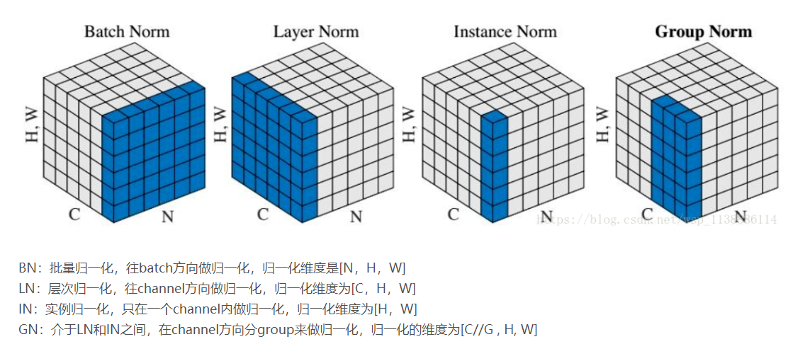

# Normalization




## Introduction

归一化层，目前主要有这几个方法

- Batch Normalization（2015年）
- Layer Normalization（2016年）
- Instance Normalization（2017年）
- Group Normalization（2018年）
- Switchable Normalization（2018年）

将输入的图像shape记为[N, C, H, W]，这几个方法主要的区别就是在

- batchNorm是在batch上，对NHW做归一化，对小batchsize效果不好
- layerNorm在通道方向上，对CHW归一化，主要对RNN作用明显
- instanceNorm在图像像素上，对HW做归一化，用在风格化迁移
- GroupNorm将channel分组，然后再做归一化
- SwitchableNorm是将BN、LN、IN结合，赋予权重，让网络自己去学习归一化层应该使用什么方法。

## Explanation

### Batch Normalization


```python
x = np.array([[[[1,2,3],
				   [4,5,6]],
				  [[7,8,9],
				   [10,11,12]]],
				   [[[1,2,3],
				   [4,5,6]],
				  [[7,8,9],
                   [10,11,12]]]]);
# print(x.shape) # (2, 2, 2, 3)
b = np.mean(x, axis=(0, 2, 3), keepdims=True)
print(b,b.shape)

[[[[3.5]]

  [[9.5]]]] 
(1, 2, 1, 1)
```

- 在batch方向上，即对同一mini-batch内的某一通道的所有数据，求得均值与方差

- 使用极小值 $\epsilon$ 保证不会出现分母为0的情况
- 加入缩放和平移变量$\gamma$和$\beta$,归一化后的值，$y=\gamma x+\beta$
  - 保证每一次数据经过归一化后还保留原有学习来的特征，同时又能完成归一化操作，加速训练 
  - 这两个参数是可学习的参数

#### Pros & Cons

- 对batchsize的大小比较敏感，由于每次计算均值和方差是在一个batch上，所以如果batchsize太小，则计算的均值、方差不足以代表整个数据分布；
- BN实际使用时需要计算并且保存某一层神经网络batch的均值和方差等统计信息，
  - 对一个固定深度的前向神经网络（DNN，CNN）使用BN，很方便；
  - 但对于RNN来说，sequence的长度是不一致的，换句话说RNN的深度不是固定的，不同的time-step需要保存不同的statics特征，可能存在一个特殊sequence比其他sequence长很多，这样training时，计算很麻烦。
- BN 比较适用的场景是：每个 mini-batch 比较大，数据分布比较接近。在进行训练之前，要做好充分的 shuffle. 否则效果会差很多
- 不适用于动态的网络结构和RNN网络

#### Notes


### Layer Normalization


```python
x = np.array([[[[1,2,3],
				   [4,5,6]],
				  [[7,8,9],
				   [10,11,12]]],
				   [[[1,2,3],
				   [4,5,6]],
				  [[7,8,9],
                   [10,11,12]]]]);
# print(x.shape) # (2, 2, 2, 3)
b = np.mean(x, axis=(1, 2, 3), keepdims=True)
print(b,b.shape)

[[[[6.5]]]

 [[[6.5]]]] 
(2, 1, 1, 1)
```

- 在Channel方向上，对同一输入样本的所有channel内的数据，求得均值和方差
- 其中 $i$ 枚举了该层所有的输入神经元。对应到标准公式中，四大参数$\mu,\sigma,g,b$为标量（BN中是向量），所有输入共享一个规范化变换。
- LN 针对单个训练样本进行，不依赖于其他数据，因此可以避免 BN 中受 mini-batch 数据分布影响的问题，可以用于 小mini-batch场景、动态网络场景和 RNN，特别是自然语言处理领域。此外，LN 不需要保存 mini-batch 的均值和方差，节省了额外的存储空间。
- 但是，BN 的转换是针对单个神经元可训练的——不同神经元的输入经过再平移和再缩放后分布在不同的区间，而 LN 对于一整层的神经元训练得到同一个转换——所有的输入都在同一个区间范围内。
- **如果不同输入特征不属于相似的类别（比如颜色和大小），那么 LN 的处理可能会降低模型的表达能力。**

#### Pros & Cons

- LN中同层神经元输入拥有相同的均值和方差，同Batch内的不同的输入样本有不同的均值和方差
- BN中则针对不同神经元输入计算均值和方差，同一个batch中的输入拥有相同的均值和方差
- 所以，LN不依赖于batch的大小和输入sequence的深度，因此可以用于batchsize为1和RNN中对边长的输入sequence的normalize操作
- LN用于RNN效果比较明显，但是在CNN上，不如BN

### Instance Normalization


```python
x = np.array([[[[1,2,3],
				   [4,5,6]],
				  [[7,8,9],
				   [10,11,12]]],
				   [[[1,2,3],
				   [4,5,6]],
				  [[7,8,9],
                   [10,11,12]]]]);
# print(x.shape) # (2, 2, 2, 3)
b = np.mean(x, axis=(2, 3), keepdims=True)
print(b,b.shape)

[[[[3.5]]
  [[9.5]]]

 [[[3.5]]
  [[9.5]]]] 
(2, 2, 1, 1)
```

- 对每个输入样本的每个Channel内的所有数据，分别求得均值和方差

#### Pros & Cons

- BN注重对每个batch进行归一化，保证数据分布一致，因为判别模型中结果取决于数据整体分布
- 但是图像风格化中，生成结果主要依赖于某个图像实例，所以对整个batch归一化不适合图像风格化中，因而对HW做归一化。可以加速模型收敛，并且保持每个图像实例之间的独立

### Group Normalization

```python
# Python code of Group Norm based on TensorFlow.

def GroupNorm(x, gamma, beta, G, eps=1e-5):
# x: input features with shape [N,C,H,W]
# gamma, beta: scale and offset, with shape [1,C,1,1]
# G: number of groups for GN
    N, C, H, W = x.shape
    x = tf.reshape(x, [N, G, C // G, H, W])
    mean, var = tf.nn.moments(x, [2, 3, 4], keep dims=True)
    x = (x - mean) / tf.sqrt(var + eps)
    x = tf.reshape(x, [N, C, H, W])
    return x * gamma + beta
```

- 针对BN对小batch_size效果差的问题，将channel方向分成group，并对每个group内做归一化，算$(C//G)*H*W$的均值，这样与batchsize无关，不受其约束
- 相当于将**Layer Norm**的基础上，把channel方向上分为多组并分别归一化，可以说是介于**Layer Norm**和 **Instance Norm**之间

#### Switchable Normalization

本篇论文作者认为，
1. 归一化虽然提高模型泛化能力，然而归一化层的操作是人工设计的。在实际应用中，解决不同的问题原则上需要设计不同的归一化操作，并没有一个通用的归一化方法能够解决所有应用问题；
2. 第二，一个深度神经网络往往包含几十个归一化层，通常这些归一化层都使用同样的归一化操作，因为手工为每一个归一化层设计操作需要进行大量的实验。

因此作者提出自适配归一化方法——Switchable Normalization（SN）来解决上述问题。与强化学习不同，SN使用可微分学习，为一个深度网络中的每一个归一化层确定合适的归一化操作。

[深度剖析 | 可微分学习的自适配归一化](https://zhuanlan.zhihu.com/p/39296570?utm_source=wechat_session&utm_medium=social&utm_oi=70591319113728)

### Weight Normalization

- BN 和 LN 均将规范化应用于输入的特征数据 $X$ ，而 WN 则另辟蹊径，将规范化应用于线性变换函数的权重 $w$，这就是 WN 名称的来源。
- WN 提出的方案是，**将权重向量 $w$ 分解为向量方向 $\hat {v}$ 和向量模$g$两部分**：

$$
w = g \cdot \hat{v} = g \cdot \frac {v}{||v||}
$$

$$
f_w(WN(x)) = w \cdot WN(x) = g \cdot \frac {v}{||v||} \cdot x = v \cdot g \cdot \frac {x}{||v||}= f_v(g \cdot \frac {x}{||v||})
$$

#### Pros & Cons

- BN 和 LN 是用输入的特征数据的方差对输入数据进行 scale，而 WN 则是用 神经元的权重的欧氏范式对输入数据进行 scale。
- **虽然在原始方法中分别进行的是特征数据规范化和参数的规范化，但本质上都实现了对数据的规范化，只是用于 scale 的参数来源不同。**
- 另外，我们看到这里的规范化只是对数据进行了 scale，而没有进行 shift，因为我们简单地令$\mu = 0$但事实上，这里留下了与 BN 或者 LN 相结合的余地——那就是利用 BN 或者 LN 的方法来计算输入数据的均值 $\mu$。
- WN 的规范化不直接使用输入数据的统计量，因此避免了 BN 过于依赖 mini-batch 的不足，以及 LN 每层唯一转换器的限制，同时也可以用于动态网络结构。
- 通过对weight进行normalization，可以保证在梯度回传的时候，如果梯度越noisy（梯度越大），v的norm就越大，那么g/||v||就越小，从而就会抑制梯度。做到了梯度的自稳定（self-stabilize）。

### Cosine Normalization

$$
f_w(x) = cos\theta = \frac {w \cdot x}{||w|| \cdot ||x||}
$$

其中，$\theta$ 是$w$和$x$的夹角

- 对输入数据$x$的变换已经做过了，横着来是 LN，纵着来是 BN。

- 对模型参数$w$ 的变换也已经做过了，就是 WN。

- 而Cosine Norm盯上了计算方式——点积

  - 向量点积是无界（unbounded）的
  - 向量点积是衡量两个向量相似度的方法之一。
  - 夹角余弦也是其中之一，而且关键的是，夹角余弦是有确定界的啊，[-1, 1] 的取值范围

- 不过，回过头来看，CN 与 WN 还是很相似的。我们看到上式中，分子还是$w$和$x$的内积，而分母则可以看做用$w$和$x$二者的模之积进行规范化。对比一下 WN 的公式：

$$
f_w(WN(x))) = f_v(g\cdot \frac {x}{||v||})
$$

- 一定程度上可以理解为，WN 用 权重的模$||v||$对输入向量进行 scale，而 CN 在此基础上用输入向量的模$||x||$ 对输入向量进行了进一步的 scale

#### Pros & Cons

- CN 通过用余弦计算代替内积计算实现了规范化，但成也萧何败萧何。原始的内积计算，其几何意义是 输入向量在权重向量上的投影，既包含 二者的夹角信息，也包含 两个向量的scale信息。去掉scale信息，可能导致表达能力的下降，因此也引起了一些争议和讨论。具体效果如何，可能需要在特定的场景下深入实验。

## Why Normalization work


## Reference

[BatchNormalization、LayerNormalization、InstanceNorm、GroupNorm、SwitchableNorm总结](https://blog.csdn.net/liuxiao214/article/details/81037416)

[详解深度学习中的Normalization，BN/LN/WN](https://zhuanlan.zhihu.com/p/33173246) {>>讲的很到位<<}

<https://blog.csdn.net/wsp_1138886114/article/details/81535272>

[加速网络收敛——BN、LN、WN与selu](http://skyhigh233.com/blog/2017/07/21/norm/)

[switchablenorms](https://github.com/switchablenorms/Switchable-Normalization)

[深度剖析 | 可微分学习的自适配归一化](https://zhuanlan.zhihu.com/p/39296570?utm_source=wechat_session&utm_medium=social&utm_oi=70591319113728)

