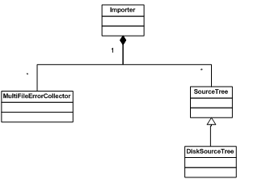

# Protocol Buffers

> 协议缓冲区(`Protocol Buffers`)是谷歌的语言无关的、平台无关的、可扩展的序列化结构化数据的机制，相较于`XML`，`Protobuf`更小、更快、更简单。一旦定义了数据结构化的方式，就可以使用`Protobuf`编译器生成的源代码轻松地在各种数据流之间和平台之间，使用各种语言编写和读取结构化数据。

## Hello World!
-   程序由Writer和Reader组成
    -   Writer 负责将一些结构化的数据写入一个磁盘文件
    -   Reader 则负责从该磁盘文件中读取结构化数据并打印到屏幕上

-   `helloworld.proto`  命名规则：`MessageName.proto`

```protobuf
package lm; 
message helloworld 
{ 
   required int32     id = 1;  
   required string    str = 2;   
   optional int32     opt = 3;  //optional field 
}
```

-   在上例中，package名字叫做 lm，定义了一个消息 helloworld
-   该消息有三个成员，类型为 int32 的 id，另一个为类型为 string 的成员 str
-   opt 是一个可选的成员，即消息中可以不包含该成员

### 编译

写好 proto 文件之后就可以用 Protobuf 编译器将该文件编译成目标语言了。本例中我们将使用 C++。

`protoc -I=$SRC_DIR --cpp_out=$DST_DIR $SRC_DIR/filename.proto`

=> `helloworld.pb.h` ，生成类的头文件

=> `helloworld.pb.cc` ，类的实现

在生成的头文件中，定义了一个 C++ 类 helloworld，后面的 Writer 和 Reader 将使用这个类来对消息进行操作。诸如对消息的成员进行赋值，将消息序列化等相应的方法。
### 编写Writer和Reader
使用 Protobuf，Writer 的工作很简单，需要处理的结构化数据由`.proto`文件描述，经过上一节中的编译过程后，该数据化结构对应了一个 C++ 的类，并定义在 `lm.helloworld.pb.h` 中。对于本例，类名为 `lm::helloworld`。Writer 需要 include 该头文件，然后便可以使用该类。

现在，在 Writer 代码中，将要存入磁盘的结构化数据由一个 `lm::helloworld` 类的对象表示，它提供了一系列的 get/set 函数用来修改和读取结构化数据中的数据成员，或者叫 field。

当我们需要将该结构化数据保存到磁盘上时，类 lm::helloworld 已经提供相应的方法来把一个复杂的数据变成一个字节序列，我们可以将这个字节序列写入磁盘。对于想要读取这个数据的程序来说，也只需要使用类 `lm::helloworld` 的相应反序列化方法来将这个字节序列重新转换回结构化数据。

```c++
// writer.cc
#include "helloworld.pb.h"    
#include <fstream>    
#include <iostream>    
using namespace std;    
    
int main(void)     
{     
    
    lm::helloworld msg1;     
    msg1.set_id(101);     
    msg1.set_str("hello");     
    fstream output("./write_log", ios::out | ios::trunc | ios::binary);     
    
    if (!msg1.SerializeToOstream(&output)) {     
        cerr << "Failed to write msg." << endl;     
        return -1;     
    }            
    return 0;     
}  

```

Msg1 是一个 `helloworld `类的对象，`set_id() `用来设置 id 的值。`SerializeToOstream `将对象序列化后写入一个 fstream 流。

```c++
// reader.cc
#include "helloworld.pb.h"    
#include <fstream>    
#include <iostream>    
using namespace std;    
    
void ListMsg(const lm::helloworld & msg) {      
    cout << msg.id() << endl;     
    cout << msg.str() << endl;     
}     
    
int main(int argc, char* argv[]) {     
    
    lm::helloworld msg1;     
    
    {     
        fstream input("./write_log", ios::in | ios::binary);     
        if (!msg1.ParseFromIstream(&input)) {     
            cerr << "Failed to parse address book." << endl;     
            return -1;     
        }           
    }     
    ListMsg(msg1);  
    fstream out("./reader_log",ios::out);   
    if(out.is_open())  
    {  
        out << msg1.id()<<endl;     
        out << msg1.str()<<endl;  
        out.close();  
    }  
} 

```

同样，Reader 声明类 helloworld 的对象 msg1，然后利用 ParseFromIstream 从一个 fstream 流中读取信息并反序列化。此后，ListMsg 中采用 get 方法读取消息的内部信息，并进行打印输出操作。

```shell
$ cd protobuf  
$ g++  helloworld.pb.cc writer.cc -o writer  `pkg-config --cflags --libs protobuf` -lpthread  
$ g++  helloworld.pb.cc reader.cc -o reader  `pkg-config --cflags --libs protobuf` -lpthread  
$ ./writer  
$ ./reader 
$ 101
$ hello 
```

### Con&Pro
-   优点：简单，快
-   缺点：功能简单，不能表述复杂概念，通用性差
    -   由于文本并不适合用来描述数据结构，所以 Protobuf 也不适合用来对基于文本的标记文档（如 HTML）建模。另外，由于 XML 具有某种程度上的自解释性，它可以被人直接读取编辑，在这一点上 Protobuf 以二进制的方式存储，除非你有 .proto 定义，否则你没法直接读出 Protobuf 的任何内容

## 高级用法

### 嵌套message

```protobuf
syntax = "proto2";

package tutorial;

message Person {
  required string name = 1;
  required int32 id = 2;
  optional string email = 3;

  enum PhoneType {
    MOBILE = 0;
    HOME = 1;
    WORK = 2;
  }

  message PhoneNumber {
    required string number = 1;
    optional PhoneType type = 2 [default = HOME];
  }

  repeated PhoneNumber phones = 4;
}

message AddressBook {
  repeated Person people = 1;
}
```

-   数据类型包括`bool`、`int32`、`float`、`double`、`string`，还可以定义枚举类型`enum`
-   在 Person 中，定义了嵌套消息 PhoneNumber，并用来定义 Person 消息中的 phones 域，这就可以实现复杂的数据结构
-   每个字段都需要下列修饰符之一进行修饰
    -   `required` 必须提供初始化值，否则视为未初始化并导致解析方法返回false。除此以外，与`optional`一样。
    -   `optional` 可以设置也可以不设置。如果没有设置就会使用默认值。默认值可以自己指定，如果不指定就会使用系统默认值。（0、空字符串、false），并且在writer中可以通过`has_()`进行判断
    -   `repeated` 该字段可以重复任意次数(包括0次)，重复值的顺序将保留在协议缓冲区中，可以看作动态大小的数组。

#### Writer

```protobuf
#include <iostream>
#include <fstream>
#include <string>
#include "addressbook.pb.h"
using namespace std;

// This function fills in a Person message based on user input.
void PromptForAddress(tutorial::Person* person) {
  cout << "Enter person ID number: ";
  int id;
  cin >> id;
  person->set_id(id);
  cin.ignore(256, '\n');

  cout << "Enter name: ";
  getline(cin, *person->mutable_name());

  cout << "Enter email address (blank for none): ";
  string email;
  getline(cin, email);
  if (!email.empty()) {
    person->set_email(email);
  }

  while (true) {
    cout << "Enter a phone number (or leave blank to finish): ";
    string number;
    getline(cin, number);
    if (number.empty()) {
      break;
    }

    tutorial::Person::PhoneNumber* phone_number = person->add_phones();
    phone_number->set_number(number);

    cout << "Is this a mobile, home, or work phone? ";
    string type;
    getline(cin, type);
    if (type == "mobile") {
      phone_number->set_type(tutorial::Person::MOBILE);
    } else if (type == "home") {
      phone_number->set_type(tutorial::Person::HOME);
    } else if (type == "work") {
      phone_number->set_type(tutorial::Person::WORK);
    } else {
      cout << "Unknown phone type.  Using default." << endl;
    }
  }
}

// Main function:  Reads the entire address book from a file,
//   adds one person based on user input, then writes it back out to the same
//   file.
int main(int argc, char* argv[]) {
  // Verify that the version of the library that we linked against is
  // compatible with the version of the headers we compiled against.
  GOOGLE_PROTOBUF_VERIFY_VERSION;

  if (argc != 2) {
    cerr << "Usage:  " << argv[0] << " ADDRESS_BOOK_FILE" << endl;
    return -1;
  }

  tutorial::AddressBook address_book;

  {
    // Read the existing address book.
    fstream input(argv[1], ios::in | ios::binary);
    if (!input) {
      cout << argv[1] << ": File not found.  Creating a new file." << endl;
    } else if (!address_book.ParseFromIstream(&input)) {
      cerr << "Failed to parse address book." << endl;
      return -1;
    }
  }

  // Add an address.
  PromptForAddress(address_book.add_people());

  {
    // Write the new address book back to disk.
    fstream output(argv[1], ios::out | ios::trunc | ios::binary);
    if (!address_book.SerializeToOstream(&output)) {
      cerr << "Failed to write address book." << endl;
      return -1;
    }
  }

  // Optional:  Delete all global objects allocated by libprotobuf.
  google::protobuf::ShutdownProtobufLibrary();

  return 0;
}
```

#### Reader

```protobuf
#include <iostream>
#include <fstream>
#include <string>
#include "addressbook.pb.h"
using namespace std;

// Iterates though all people in the AddressBook and prints info about them.
void ListPeople(const tutorial::AddressBook& address_book) {
  for (int i = 0; i < address_book.people_size(); i++) {
    const tutorial::Person& person = address_book.people(i);

    cout << "Person ID: " << person.id() << endl;
    cout << "  Name: " << person.name() << endl;
    if (person.has_email()) {
      cout << "  E-mail address: " << person.email() << endl;
    }

    for (int j = 0; j < person.phones_size(); j++) {
      const tutorial::Person::PhoneNumber& phone_number = person.phones(j);

      switch (phone_number.type()) {
        case tutorial::Person::MOBILE:
          cout << "  Mobile phone #: ";
          break;
        case tutorial::Person::HOME:
          cout << "  Home phone #: ";
          break;
        case tutorial::Person::WORK:
          cout << "  Work phone #: ";
          break;
      }
      cout << phone_number.number() << endl;
    }
  }
}

// Main function:  Reads the entire address book from a file and prints all
//   the information inside.
int main(int argc, char* argv[]) {
  // Verify that the version of the library that we linked against is
  // compatible with the version of the headers we compiled against.
  GOOGLE_PROTOBUF_VERIFY_VERSION;

  if (argc != 2) {
    cerr << "Usage:  " << argv[0] << " ADDRESS_BOOK_FILE" << endl;
    return -1;
  }

  tutorial::AddressBook address_book;

  {
    // Read the existing address book.
    fstream input(argv[1], ios::in | ios::binary);
    if (!address_book.ParseFromIstream(&input)) {
      cerr << "Failed to parse address book." << endl;
      return -1;
    }
  }

  ListPeople(address_book);

  // Optional:  Delete all global objects allocated by libprotobuf.
  google::protobuf::ShutdownProtobufLibrary();

  return 0;
}
```

#### Run

```shell
$ protoc -I=./ --cpp_out=./ ./addressbook.proto 
$ g++ addressbook.pb.cc reader.cc -o reader  `pkg-config --cflags --libs protobuf` -lpthread  
$ g++ addressbook.pb.cc writer.cc -o writer  `pkg-config --cflags --libs protobuf` -lpthread  
$ ./writer addressbook
addressbook: File not found.  Creating a new file.
Enter person ID number: 123456  
Enter name: XiaoXu
Enter email address (blank for none): LooperXX@outlook.com
Enter a phone number (or leave blank to finish): 77777777777
Is this a mobile, home, or work phone? mobile
Enter a phone number (or leave blank to finish): 

$ ./reader addressbook
Person ID: 123456
  Name: XiaoXu
  E-mail address: LooperXX@outlook.com
  Mobile phone #: 77777777777
```

### Import

> 在一个 .proto 文件中，还可以用 Import 关键字引入在其他 .proto 文件中定义的消息，这可以称做 Import Message，或者 Dependency Message。
例中 ,common.info_header定义在common.header包内。
```protobuf
import common.header; 
 
message youMsg{ 
 required common.info_header header = 1; 
 required string youPrivateData = 2; 
}
```

### 动态编译

在某些情况下，人们无法预先知道 `.proto` 文件，他们需要动态处理一些未知的 `.proto` 文件。比如一个通用的消息转发中间件，它不可能预知需要处理怎样的消息。这需要动态编译 `.proto` 文件，并使用其中的 `Message`。

Protobuf 提供了 `google::protobuf::compiler` 包来完成动态编译的功能。主要的类叫做 `importer`，定义在 `importer.h` 中。使用 `Importer` 非常简单，下图展示了与 `Import` 和其它几个重要的类的关系。



Import 类对象中包含三个主要的对象，分别为处理错误的 `MultiFileErrorCollector` 类，定义 `.proto` 文件源目录的 `SourceTree` 类。

```c++
google::protobuf::compiler::MultiFileErrorCollector errorCollector；
google::protobuf::compiler::DiskSourceTree sourceTree; 
 
google::protobuf::compiler::Importer importer(&sourceTree, &errorCollector); 
sourceTree.MapPath("", protosrc); 
 
importer.import("lm.helloworld.proto");
```

首先构造一个 importer 对象。构造函数需要两个入口参数，一个是 `sourceTree` 对象，该对象指定了存放 `.proto` 文件的源目录。第二个参数是一个 `error collector` 对象，该对象有一个 `AddError` 方法，用来处理解析 `.proto` 文件时遇到的语法错误。之后，需要动态编译一个 `.proto` 文件时，只需调用 `importer` 对象的 `import `方法。非常简单。

如何使用动态编译后的 `Message` 呢？`Package google::protobuf::compiler` 中提供了以下几个类，用来表示一个 `.proto` 文件中定义的 `message`，以及 `Message` 中的 `field`，如图所示。


类 `FileDescriptor` 表示一个编译后的 `.proto` 文件；类 `Descriptor` 对应该文件中的一个 `Message`；类 `FieldDescriptor` 描述一个 `Message` 中的一个具体 `Field`。

比如编译完 `lm.helloworld.proto` 之后，可以通过如下代码得到 `lm.helloworld.id `的定义：

```c++
const protobuf::Descriptor *desc = 
   importer_.pool()->FindMessageTypeByName(“lm.helloworld”); 
const protobuf::FieldDescriptor* field = 
   desc->pool()->FindFileByName (“id”);
```

通过 `Descriptor`，`FieldDescriptor` 的各种方法和属性，应用程序可以获得各种关于 `Message` 定义的信息。比如通过 `field->name()` 得到` field` 的名字。这样，就可以使用一个动态定义的消息了。